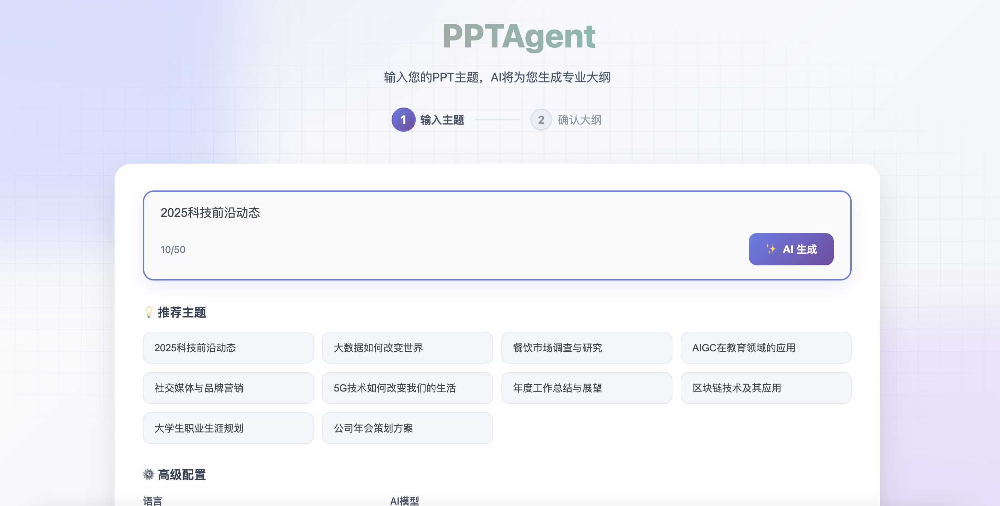
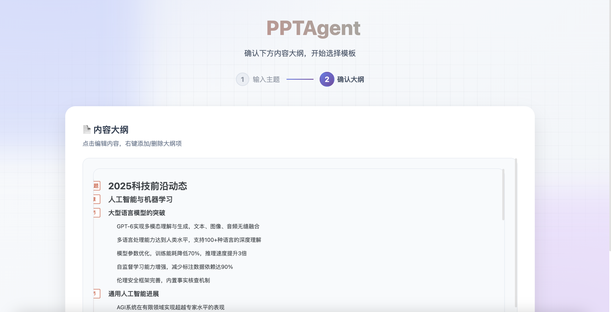
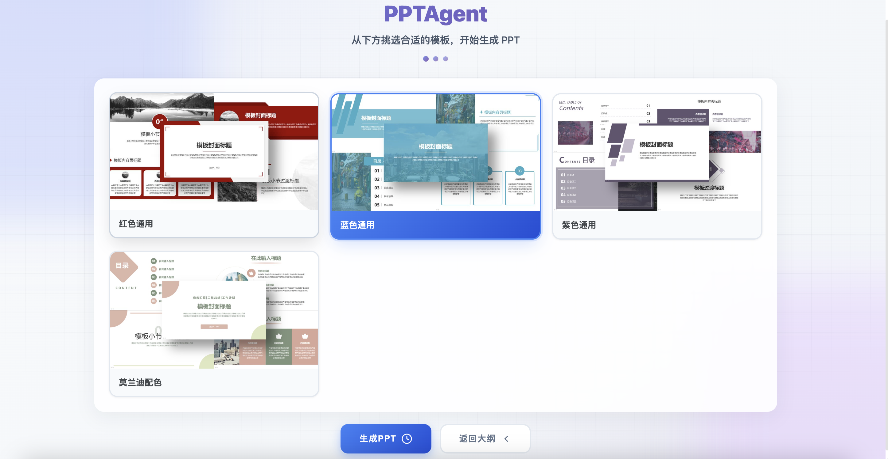
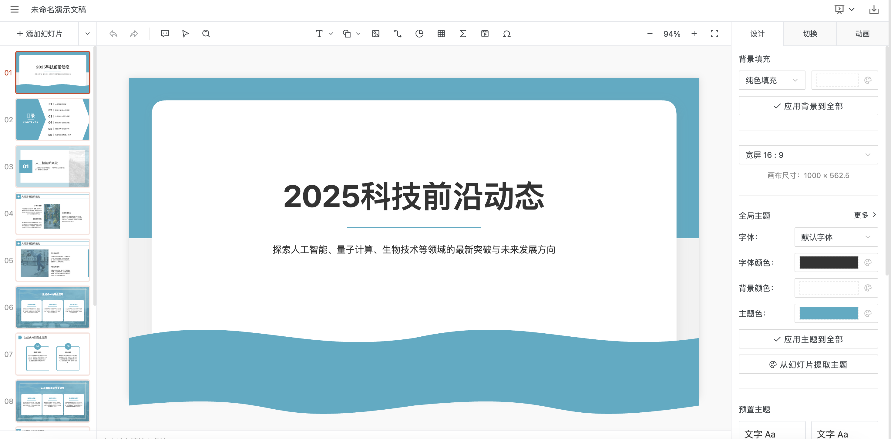

# TrainPPTAgent
TrainPPTAgent 是一个利用AI技术，根据用户输入的主题自动生成演示文稿（PPT）的智能工具。项目采用前后端分离架构，前端负责用户交互、大纲编辑和模板选择，后端则通过大语言模型（LLM）生成PPT的大纲和内容。
PPT的Agent采用强化学习GRPO进行训练，更符合自己的目标。

## 功能特性

- **AI生成大纲**： 用户只需输入一个主题，即可快速生成一份结构完整、逻辑清晰的PPT大纲。
- **内容逐页生成**： 采用流式传输技术，实现PPT内容的逐页生成与展示，提升用户体验。
- **模板选择**： 提供丰富的PPT模板，用户可以根据需求选择合适的模板进行内容填充。
- **前后端分离**： 前端使用 Vue.js 和 Vite，后端使用 Python，架构清晰，易于维护和扩展。

## 技术栈

- **前端**: Vue.js, Vite, TypeScript
- **后端**: Python, Flask/FastAPI, A2A, ADK, MCP搜索
- **AI模型**: 集成了能够生成PPT大纲和内容的语言模型

## Todo
开源强化学习训练Agent计划

## 界面示意图
大纲生成


模版选择

PPT开始逐页生成


## 项目结构

```
TrainPPTAgent/
├───backend/        # 后端代码
│   ├───main_api/   # 核心API服务
│   ├───slide_agent/ # AI Agent相关逻辑
│   └───...
├───frontend/       # 前端代码
│   ├───src/
│   │   ├───views/  # 页面组件 (大纲、PPT编辑等)
│   │   ├───services/ # API请求服务
│   │   └───...
│   └───vite.config.ts # 前端配置文件
└───doc/            # 项目文档
    ├───API_*.md    # API接口文档
    └───...
```

## 快速开始

### 后端服务

1.  **进入后端目录**:
    ```bash
    cd backend
    ```

2.  **安装依赖**:
    ```bash
    pip install -r backend/requirements.txt
    ```

3.  **启动API服务**:
    ```bash
    cd main_api
    python main.py
    ```
    后端服务默认运行在 `http://127.0.0.1:6800`。
4. ** 启动大纲生成 **：
    ```bash
    cd backend/simpleOutline
    cp env_template .env
    python main_api.py
    ```
    大纲服务默认运行在 `http://127.0.0.1:10001`。
5. **启动生成PPT内容**:
    ```bash
    cd backend/slide_agent
    cp env_template .env
    python main_api.py
    ```
    后端服务默认运行在 `http://127.0.0.1:10011`。

### 前端开发

1.  **进入前端目录**:
    ```bash
    cd frontend
    ```

2.  **安装依赖**:
    ```bash
    npm install
    ```

3.  **启动开发服务器**:
    ```bash
    npm run dev
    ```
    前端应用将在 `http://127.0.0.1:5173` 上可用。

    **注意**: 前端通过Vite的代理与后端API (`http://127.0.0.1:6800`)进行通信，相关配置请查看 `frontend/vite.config.ts`。

## AI生成流程

1.  **用户输入**: 用户在前端界面输入PPT主题。
2.  **生成大纲**: 前端调用后端 `/api/tools/aippt_outline` 接口，后端AI Agent根据主题生成Markdown格式的大纲。
3.  **生成内容**: 用户确认大纲后，前端调用 `/api/tools/aippt` 接口，后端根据大纲，结合模板结构，逐页生成详细的PPT内容。
4.  **渲染展示**: 前端接收到生成的页面数据后，实时渲染并展示PPT。

# 前端引用项目
https://github.com/pipipi-pikachu/PPTist

# 有任何问题联系我

