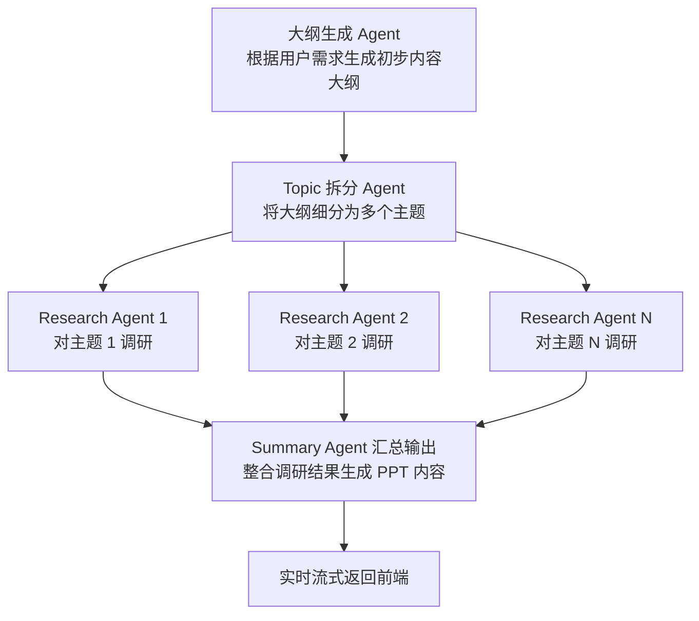

# 🧠 Multi-Agent 自动生成 PPT 内容

本项目基于多智能体（Multi-Agent）协作架构，实现从内容大纲出发，自动完成主题拆解、信息调研与汇总生成 PPT 内容的流程。

---

## 🔧 核心功能模块

| Agent 名称                | 功能描述                    |
| ----------------------- | ----------------------- |
| `split_topic_agent`     | 将输入的大纲内容拆解为多个独立研究主题     |
| `parallel_search_agent` | 并行调研每个主题，调用检索与信息提取工具    |
| `summary_writer_agent`  | 汇总所有研究结果，生成结构化 PPT 文本内容 |

---

## 🚀 快速开始

---

### 1. 修改 Agent 使用的模型

编辑模型配置文件以自定义每个 Agent 所调用的模型（如 GPT-4、Claude、Gemini 等）：

```python
# 配置模型的路径
backend/slide_agent/slide_agent/config.py
```

---

### 2. 启动本地测试

直接运行多智能体流程测试：

```bash
python main.py
```

---

### 3. 启动后端 API 服务（供前端调用）

提供标准 API 接口（支持 SSE 流式返回），供前端请求：

```bash
python main_api.py
```

## 注意需要修改tools.py中的搜索引擎
slide_agent/sub_agents/research_topic/tools.py

---

## 📁 项目结构简要说明

```text
.
├── README.md                    # 使用说明文档
├── __init__.py                 # 包初始化文件
├── a2a_client.py               # 示例客户端，用于测试向 Agent 发送请求
├── adk_agent_executor.py       # 基于 ADK 的 Agent 调度执行器
├── api.log                     # 接口运行日志文件
├── env_example                 # 环境变量模板文件（用于创建 .env）
├── main.py                     # 本地测试入口，运行完整 Agent 流程
├── main_api.py                 # 提供 HTTP/SSE API 的主程序（供前端调用）
├── pyproject.toml              # Python 项目配置文件（依赖与构建）
└── slide_agent/                # 多 Agent 核心逻辑目录
    ├── __init__.py
    ├── agent.py                # 核心 Agent 管理逻辑（注册与调度）
    ├── agent_utils.py          # Agent 辅助工具函数（如日志、格式转换等）
    ├── config.py               # Agent 配置文件（模型参数、Agent 路由等）
    ├── create_model.py         # 创建和初始化模型实例
    └── sub_agents/             # 各子任务的智能体模块
        ├── __init__.py
        ├── research_topic/     # 研究任务 Agent：对主题进行调研并提取信息
        │   ├── agent.py        # Research Agent 主体
        │   ├── prompt.py       # Research Agent 使用的提示词模板
        │   ├── tools.py        # 调研用工具函数（如搜索、摘要等）
        │   └── mcpserver/
        │       ├── research_tool.py  # MCP 工具包装，用于调研时调用，暂时未使用
        ├── split_topic/        # 拆分任务 Agent：将大纲拆分为多个主题
        │   ├── agent.py
        │   └── prompt.py
        └── summary_writer/     # 汇总任务 Agent：汇总多个研究结果生成PPT内容
            ├── agent.py
            └── prompt.py

```


## 📊 并发的多Agent的协作流程


## a2a_client.py 客户端测试
输出结果:
```
/Users/admin/miniforge3/envs/multiagent/bin/python3.12 /Users/admin/git/MultiAgentPPT/backend/slide_agent/a2a_client.py 
发送message信息: {'message': {'role': 'user', 'parts': [{'type': 'text', 'text': '# 电动汽车发展概述\n    - 电动汽车的定义和类型（BEV、PHEV、HEV）\n    - 电动汽车发展简史：从早期尝试到现代复兴\n    - 电动汽车在全球汽车市场的地位和作用\n\n    # 电动汽车发展的驱动因素\n    - 环境保护：减少尾气排放，应对气候变化\n    - 能源安全：降低对石油的依赖，利用多样化能源\n    - 技术进步：电池技术、电机技术、充电设施的进步\n    - 政策支持：政府补贴、税收优惠、排放法规\n\n    # 电动汽车的技术挑战\n    - 电池技术：能量密度、续航里程、充电速度、安全性、寿命、成本\n    - 充电基础设施：充电桩数量、分布、充电标准、充电效率\n    - 电网负荷：大规模充电对电网的冲击、智能充电管理\n    - 车辆成本：相对于传统燃油车的竞争力\n\n    # 电动汽车的市场前景\n    - 不同国家和地区的市场发展情况\n    - 主要电动汽车制造商及其产品\n    - 消费者接受度：购买意愿、使用习惯、顾虑因素\n    - 未来发展趋势预测：市场规模、技术方向、商业模式\n\n    # 电动汽车的社会影响\n    - 对传统汽车产业的影响\n    - 对能源产业的影响\n    - 对城市交通和环境的影响\n    - 对就业和社会结构的影响\n\n    # 结论\n    - 电动汽车发展机遇与挑战并存\n    - 未来需要关注的重点领域\n    - 对个人、企业和政府的建议'}], 'messageId': '712d7956dddf488891df56c4804a3c3f'}}
输出chunk:  {'id': '0caef9d1-d72d-48bf-853e-9e197595ecf3', 'jsonrpc': '2.0', 'result': {'contextId': '4c4f93c2-5ebb-48e9-ab03-33ae1d16b38a', 'final': False, 'kind': 'status-update', 'metadata': None, 'status': {'message': None, 'state': 'submitted', 'timestamp': None}, 'taskId': '24138672-2677-402a-8854-5d97655588ad'}}
输出chunk:  {'id': '0caef9d1-d72d-48bf-853e-9e197595ecf3', 'jsonrpc': '2.0', 'result': {'contextId': '4c4f93c2-5ebb-48e9-ab03-33ae1d16b38a', 'final': False, 'kind': 'status-update', 'metadata': None, 'status': {'message': None, 'state': 'working', 'timestamp': None}, 'taskId': '24138672-2677-402a-8854-5d97655588ad'}}
输出chunk:  {'id': '0caef9d1-d72d-48bf-853e-9e197595ecf3', 'jsonrpc': '2.0', 'result': {'contextId': '4c4f93c2-5ebb-48e9-ab03-33ae1d16b38a', 'final': False, 'kind': 'status-update', 'metadata': None, 'status': {'message': {'contextId': '4c4f93c2-5ebb-48e9-ab03-33ae1d16b38a', 'kind': 'message', 'messageId': '9da02693-10a2-4549-87ac-6c538e71e462', 'metadata': None, 'parts': [{'kind': 'text', 'metadata': None, 'text': '```'}], 'referenceTaskIds': None, 'role': 'agent', 'taskId': '24138672-2677-402a-8854-5d97655588ad'}, 'state': 'working', 'timestamp': None}, 'taskId': '24138672-2677-402a-8854-5d97655588ad'}}
输出chunk:  {'id': '0caef9d1-d72d-48bf-853e-9e197595ecf3', 'jsonrpc': '2.0', 'result': {'contextId': '4c4f93c2-5ebb-48e9-ab03-33ae1d16b38a', 'final': False, 'kind': 'status-update', 'metadata': None, 'status': {'message': {'contextId': '4c4f93c2-5ebb-48e9-ab03-33ae1d16b38a', 'kind': 'message', 'messageId': '651c7eb8-cc89-400f-8601-1b70944d17d8', 'metadata': None, 'parts': [{'kind': 'text', 'metadata': None, 'text': 'json\n{'}], 'referenceTaskIds': None, 'role': 'agent', 'taskId': '24138672-2677-402a-8854-5d97655588ad'}, 'state': 'working', 'timestamp': None}, 'taskId': '24138672-2677-402a-8854-5d97655588ad'}}
输出chunk:  {'id': '0caef9d1-d72d-48bf-853e-9e197595ecf3', 'jsonrpc': '2.0', 'result': {'contextId': '4c4f93c2-5ebb-48e9-ab03-33ae1d16b38a', 'final': False, 'kind': 'status-update', 'metadata': None, 'status': {'message': {'contextId': '4c4f93c2-5ebb-48e9-ab03-33ae1d16b38a', 'kind': 'message', 'messageId': '34d2761e-4333-4d62-99ea-c39c4e61a7bd', 'metadata': None, 'parts': [{'kind': 'text', 'metadata': None, 'text': '\n    "topics": [\n        {\n            "id": 1'}], 'referenceTaskIds': None, 'role': 'agent', 'taskId': '24138672-2677-402a-8854-5d97655588ad'}, 'state': 'working', 'timestamp': None}, 'taskId': '24138672-2677-402a-8854-5d97655588ad'}}
输出chunk:  {'id': '0caef9d1-d72d-48bf-853e-9e197595ecf3', 'jsonrpc': '2.0', 'result': {'contextId': '4c4f93c2-5ebb-48e9-ab03-33ae1d16b38a', 'final': False, 'kind': 'status-update', 'metadata': None, 'status': {'message': {'contextId': '4c4f93c2-5ebb-48e9-ab03-33ae1d16b38a', 'kind': 'message', 'messageId': 'e0369863-fd91-4a43-9401-2821fe694af9', 'metadata': None, 'parts': [{'kind': 'text', 'metadata': None, 'text': ',\n            "title": "电动汽车的定义、类型和发展历'}], 'referenceTaskIds': None, 'role': 'agent', 'taskId': '24138672-2677-402a-8854-5d97655588ad'}, 'state': 'working', 'timestamp': None}, 'taskId': '24138672-2677-402a-8854-5d97655588ad'}}
输出chunk:  {'id': '0caef9d1-d72d-48bf-853e-9e197595ecf3', 'jsonrpc': '2.0', 'result': {'contextId': '4c4f93c2-5ebb-48e9-ab03-33ae1d16b38a', 'final': False, 'kind': 'status-update', 'metadata': None, 'status': {'message': {'contextId': '4c4f93c2-5ebb-48e9-ab03-33ae1d16b38a', 'kind': 'message', 'messageId': '91229d4c-6852-48b6-b022-845b9d8bed8e', 'metadata': None, 'parts': [{'kind': 'text', 'metadata': None, 'text': '程",\n            "description": "介绍电动汽车的基本概念，包括不同类型（BEV、PHEV、HEV）的区分，以及电动'}], 'referenceTaskIds': None, 'role': 'agent', 'taskId': '24138672-2677-402a-8854-5d97655588ad'}, 'state': 'working', 'timestamp': None}, 'taskId': '24138672-2677-402a-8854-5d97655588ad'}}
输出chunk:  {'id': '0caef9d1-d72d-48bf-853e-9e197595ecf3', 'jsonrpc': '2.0', 'result': {'contextId': '4c4f93c2-5ebb-48e9-ab03-33ae1d16b38a', 'final': False, 'kind': 'status-update', 'metadata': None, 'status': {'message': {'contextId': '4c4f93c2-5ebb-48e9-ab03-33ae1d16b38a', 'kind': 'message', 'messageId': '72815e50-ee7f-4a39-b30a-2f194f05dbc0', 'metadata': None, 'parts': [{'kind': 'text', 'metadata': None, 'text': '汽车从早期尝试到现代复兴的发展历史。",\n            "keywords": ["电动汽车", "BEV", "PHEV", "HEV", "'}], 'referenceTaskIds': None, 'role': 'agent', 'taskId': '24138672-2677-402a-8854-5d97655588ad'}, 'state': 'working', 'timestamp': None}, 'taskId': '24138672-2677-402a-8854-5d97655588ad'}}
输出chunk:  {'id': '0caef9d1-d72d-48bf-853e-9e197595ecf3', 'jsonrpc': '2.0', 'result': {'contextId': '4c4f93c2-5ebb-48e9-ab03-33ae1d16b38a', 'final': False, 'kind': 'status-update', 'metadata': None, 'status': {'message': {'contextId': '4c4f93c2-5ebb-48e9-ab03-33ae1d16b38a', 'kind': 'message', 'messageId': 'f8d13646-5d75-45c7-bfaf-a0f1b71d7615', 'metadata': None, 'parts': [{'kind': 'text', 'metadata': None, 'text': '发展史", "汽车市场"],\n            "research_focus": "电动汽车的定义分类和发展阶段，及其在全球汽车市场中的地位演变。"\n        },\n        {\n            "id": 2,\n            "title'}], 'referenceTaskIds': None, 'role': 'agent', 'taskId': '24138672-2677-402a-8854-5d97655588ad'}, 'state': 'working', 'timestamp': None}, 'taskId': '24138672-2677-402a-8854-5d97655588ad'}}
输出chunk:  {'id': '0caef9d1-d72d-48bf-853e-9e197595ecf3', 'jsonrpc': '2.0', 'result': {'contextId': '4c4f93c2-5ebb-48e9-ab03-33ae1d16b38a', 'final': False, 'kind': 'status-update', 'metadata': None, 'status': {'message': {'contextId': '4c4f93c2-5ebb-48e9-ab03-33ae1d16b38a', 'kind': 'message', 'messageId': 'dc17b280-081f-4573-aab2-2da683b2cfbc', 'metadata': None, 'parts': [{'kind': 'text', 'metadata': None, 'text': '": "电动汽车发展的驱动因素分析",\n            "description": "探讨推动电动汽车发展的关键因素，包括环境保护、能源安全、技术进步和政策支持等方面。",\n            "keywords": ["环境保护", "能源安全", "技术进步'}], 'referenceTaskIds': None, 'role': 'agent', 'taskId': '24138672-2677-402a-8854-5d97655588ad'}, 'state': 'working', 'timestamp': None}, 'taskId': '24138672-2677-402a-8854-5d97655588ad'}}
输出chunk:  {'id': '0caef9d1-d72d-48bf-853e-9e197595ecf3', 'jsonrpc': '2.0', 'result': {'contextId': '4c4f93c2-5ebb-48e9-ab03-33ae1d16b38a', 'final': False, 'kind': 'status-update', 'metadata': None, 'status': {'message': {'contextId': '4c4f93c2-5ebb-48e9-ab03-33ae1d16b38a', 'kind': 'message', 'messageId': '40c742bd-9d6b-4eb4-928d-3b1cae3b06c1', 'metadata': None, 'parts': [{'kind': 'text', 'metadata': None, 'text': '", "政策支持", "气候变化", "尾气排放"],\n            "research_focus": "分析环境、能源、技术和政策如何共同促进电动汽车的普及。"\n        },\n        {\n            "id": 3,\n            "title": "电动汽车的技术瓶颈与挑战",'}], 'referenceTaskIds': None, 'role': 'agent', 'taskId': '24138672-2677-402a-8854-5d97655588ad'}, 'state': 'working', 'timestamp': None}, 'taskId': '24138672-2677-402a-8854-5d97655588ad'}}
输出chunk:  {'id': '0caef9d1-d72d-48bf-853e-9e197595ecf3', 'jsonrpc': '2.0', 'result': {'contextId': '4c4f93c2-5ebb-48e9-ab03-33ae1d16b38a', 'final': False, 'kind': 'status-update', 'metadata': None, 'status': {'message': {'contextId': '4c4f93c2-5ebb-48e9-ab03-33ae1d16b38a', 'kind': 'message', 'messageId': 'fecbadfb-5d06-4354-b491-f0719c3b91aa', 'metadata': None, 'parts': [{'kind': 'text', 'metadata': None, 'text': '\n            "description": "深入研究电动汽车当前面临的主要技术挑战，如电池技术、充电基础设施和电网负荷等问题。",\n            "keywords": ["电池技术", "充电基础设施", "电网负荷", "能量密度", "续航里程", "充电速度", "车辆'}], 'referenceTaskIds': None, 'role': 'agent', 'taskId': '24138672-2677-402a-8854-5d97655588ad'}, 'state': 'working', 'timestamp': None}, 'taskId': '24138672-2677-402a-8854-5d97655588ad'}}
输出chunk:  {'id': '0caef9d1-d72d-48bf-853e-9e197595ecf3', 'jsonrpc': '2.0', 'result': {'contextId': '4c4f93c2-5ebb-48e9-ab03-33ae1d16b38a', 'final': False, 'kind': 'status-update', 'metadata': None, 'status': {'message': {'contextId': '4c4f93c2-5ebb-48e9-ab03-33ae1d16b38a', 'kind': 'message', 'messageId': 'cad64946-3ea9-4b6e-a00e-458f25b79051', 'metadata': None, 'parts': [{'kind': 'text', 'metadata': None, 'text': '成本"],\n            "research_focus": "识别和评估限制电动汽车进一步发展的技术障碍。"\n        },\n        {\n            "id": 4,\n            "title": "电动汽车的市场前景与趋势预测",\n            "description": "分析电动汽车在不同国家和地区的市场发展情况，'}], 'referenceTaskIds': None, 'role': 'agent', 'taskId': '24138672-2677-402a-8854-5d97655588ad'}, 'state': 'working', 'timestamp': None}, 'taskId': '24138672-2677-402a-8854-5d97655588ad'}}
输出chunk:  {'id': '0caef9d1-d72d-48bf-853e-9e197595ecf3', 'jsonrpc': '2.0', 'result': {'contextId': '4c4f93c2-5ebb-48e9-ab03-33ae1d16b38a', 'final': False, 'kind': 'status-update', 'metadata': None, 'status': {'message': {'contextId': '4c4f93c2-5ebb-48e9-ab03-33ae1d16b38a', 'kind': 'message', 'messageId': '623abbb7-dc03-4563-9eb3-72e44179a384', 'metadata': None, 'parts': [{'kind': 'text', 'metadata': None, 'text': '介绍主要制造商及其产品，并对未来市场规模、技术方向和商业模式进行预测。",\n            "keywords": ["市场前景", "市场规模", "技术方向", "商业模式", "消费者接受度", "制造商"],\n            "research_focus": "预测电动汽车市场的未来增长和'}], 'referenceTaskIds': None, 'role': 'agent', 'taskId': '24138672-2677-402a-8854-5d97655588ad'}, 'state': 'working', 'timestamp': None}, 'taskId': '24138672-2677-402a-8854-5d97655588ad'}}
输出chunk:  {'id': '0caef9d1-d72d-48bf-853e-9e197595ecf3', 'jsonrpc': '2.0', 'result': {'contextId': '4c4f93c2-5ebb-48e9-ab03-33ae1d16b38a', 'final': False, 'kind': 'status-update', 'metadata': None, 'status': {'message': {'contextId': '4c4f93c2-5ebb-48e9-ab03-33ae1d16b38a', 'kind': 'message', 'messageId': 'a8e70210-998a-441f-9cef-a63517343f39', 'metadata': None, 'parts': [{'kind': 'text', 'metadata': None, 'text': '演变，以及影响市场发展的主要因素。"\n        },\n        {\n            "id": 5,\n            "title": "电动汽车的社会和产业影响",\n            "description": "评估电动汽车发展对传统汽车产业、能源产业、城市交通、环境以及就业和社会结构产生的'}], 'referenceTaskIds': None, 'role': 'agent', 'taskId': '24138672-2677-402a-8854-5d97655588ad'}, 'state': 'working', 'timestamp': None}, 'taskId': '24138672-2677-402a-8854-5d97655588ad'}}
输出chunk:  {'id': '0caef9d1-d72d-48bf-853e-9e197595ecf3', 'jsonrpc': '2.0', 'result': {'contextId': '4c4f93c2-5ebb-48e9-ab03-33ae1d16b38a', 'final': False, 'kind': 'status-update', 'metadata': None, 'status': {'message': {'contextId': '4c4f93c2-5ebb-48e9-ab03-33ae1d16b38a', 'kind': 'message', 'messageId': 'ea2ea955-c3e4-48de-9531-39bfa352107e', 'metadata': None, 'parts': [{'kind': 'text', 'metadata': None, 'text': '广泛影响。",\n            "keywords": ["社会影响", "产业影响", "传统汽车产业", "能源产业", "城市交通", "就业", "社会结构"],\n            "research_focus": "分析电动汽车对社会各方面产生的变革性影响。"\n        },\n         {\n            "'}], 'referenceTaskIds': None, 'role': 'agent', 'taskId': '24138672-2677-402a-8854-5d97655588ad'}, 'state': 'working', 'timestamp': None}, 'taskId': '24138672-2677-402a-8854-5d97655588ad'}}
输出chunk:  {'id': '0caef9d1-d72d-48bf-853e-9e197595ecf3', 'jsonrpc': '2.0', 'result': {'contextId': '4c4f93c2-5ebb-48e9-ab03-33ae1d16b38a', 'final': False, 'kind': 'status-update', 'metadata': None, 'status': {'message': {'contextId': '4c4f93c2-5ebb-48e9-ab03-33ae1d16b38a', 'kind': 'message', 'messageId': '9b7c4601-686d-41a6-9882-d26c732ccd8c', 'metadata': None, 'parts': [{'kind': 'text', 'metadata': None, 'text': 'id": 6,\n            "title": "电动汽车发展：机遇、挑战与未来方向",\n            "description": "总结电动汽车发展所面临的机遇与挑战，并提出未来需要重点关注的领域，以及对个人、企业和政府的建议。",\n            "keywords": ["机遇", "'}], 'referenceTaskIds': None, 'role': 'agent', 'taskId': '24138672-2677-402a-8854-5d97655588ad'}, 'state': 'working', 'timestamp': None}, 'taskId': '24138672-2677-402a-8854-5d97655588ad'}}
输出chunk:  {'id': '0caef9d1-d72d-48bf-853e-9e197595ecf3', 'jsonrpc': '2.0', 'result': {'contextId': '4c4f93c2-5ebb-48e9-ab03-33ae1d16b38a', 'final': False, 'kind': 'status-update', 'metadata': None, 'status': {'message': {'contextId': '4c4f93c2-5ebb-48e9-ab03-33ae1d16b38a', 'kind': 'message', 'messageId': 'c867226c-70ce-40fd-a764-d95c89eb4542', 'metadata': None, 'parts': [{'kind': 'text', 'metadata': None, 'text': '挑战", "未来发展", "政策建议", "企业战略", "个人选择"],\n            "research_focus": "综合分析电动汽车发展的整体态势，并为未来发展提供战略性指导。"\n        }\n    ]\n}\n```'}], 'referenceTaskIds': None, 'role': 'agent', 'taskId': '24138672-2677-402a-8854-5d97655588ad'}, 'state': 'working', 'timestamp': None}, 'taskId': '24138672-2677-402a-8854-5d97655588ad'}}
输出chunk:  {'id': '0caef9d1-d72d-48bf-853e-9e197595ecf3', 'jsonrpc': '2.0', 'result': {'append': None, 'artifact': {'artifactId': '093a81e4-04a4-43ce-8d27-9a56c751d52a', 'description': None, 'metadata': None, 'name': None, 'parts': [{'kind': 'text', 'metadata': None, 'text': '```json\n{\n    "topics": [\n        {\n            "id": 1,\n            "title": "电动汽车的定义、类型和发展历程",\n            "description": "介绍电动汽车的基本概念，包括不同类型（BEV、PHEV、HEV）的区分，以及电动汽车从早期尝试到现代复兴的发展历史。",\n            "keywords": ["电动汽车", "BEV", "PHEV", "HEV", "发展史", "汽车市场"],\n            "research_focus": "电动汽车的定义分类和发展阶段，及其在全球汽车市场中的地位演变。"\n        },\n        {\n            "id": 2,\n            "title": "电动汽车发展的驱动因素分析",\n            "description": "探讨推动电动汽车发展的关键因素，包括环境保护、能源安全、技术进步和政策支持等方面。",\n            "keywords": ["环境保护", "能源安全", "技术进步", "政策支持", "气候变化", "尾气排放"],\n            "research_focus": "分析环境、能源、技术和政策如何共同促进电动汽车的普及。"\n        },\n        {\n            "id": 3,\n            "title": "电动汽车的技术瓶颈与挑战",\n            "description": "深入研究电动汽车当前面临的主要技术挑战，如电池技术、充电基础设施和电网负荷等问题。",\n            "keywords": ["电池技术", "充电基础设施", "电网负荷", "能量密度", "续航里程", "充电速度", "车辆成本"],\n            "research_focus": "识别和评估限制电动汽车进一步发展的技术障碍。"\n        },\n        {\n            "id": 4,\n            "title": "电动汽车的市场前景与趋势预测",\n            "description": "分析电动汽车在不同国家和地区的市场发展情况，介绍主要制造商及其产品，并对未来市场规模、技术方向和商业模式进行预测。",\n            "keywords": ["市场前景", "市场规模", "技术方向", "商业模式", "消费者接受度", "制造商"],\n            "research_focus": "预测电动汽车市场的未来增长和演变，以及影响市场发展的主要因素。"\n        },\n        {\n            "id": 5,\n            "title": "电动汽车的社会和产业影响",\n            "description": "评估电动汽车发展对传统汽车产业、能源产业、城市交通、环境以及就业和社会结构产生的广泛影响。",\n            "keywords": ["社会影响", "产业影响", "传统汽车产业", "能源产业", "城市交通", "就业", "社会结构"],\n            "research_focus": "分析电动汽车对社会各方面产生的变革性影响。"\n        },\n         {\n            "id": 6,\n            "title": "电动汽车发展：机遇、挑战与未来方向",\n            "description": "总结电动汽车发展所面临的机遇与挑战，并提出未来需要重点关注的领域，以及对个人、企业和政府的建议。",\n            "keywords": ["机遇", "挑战", "未来发展", "政策建议", "企业战略", "个人选择"],\n            "research_focus": "综合分析电动汽车发展的整体态势，并为未来发展提供战略性指导。"\n        }\n    ]\n}\n```'}]}, 'contextId': '4c4f93c2-5ebb-48e9-ab03-33ae1d16b38a', 'kind': 'artifact-update', 'lastChunk': None, 'metadata': None, 'taskId': '24138672-2677-402a-8854-5d97655588ad'}}
输出chunk:  {'id': '0caef9d1-d72d-48bf-853e-9e197595ecf3', 'jsonrpc': '2.0', 'result': {'contextId': '4c4f93c2-5ebb-48e9-ab03-33ae1d16b38a', 'final': False, 'kind': 'status-update', 'metadata': None, 'status': {'message': {'contextId': '4c4f93c2-5ebb-48e9-ab03-33ae1d16b38a', 'kind': 'message', 'messageId': 'fcab8951-8eba-42ef-b6ec-922e212fc234', 'metadata': None, 'parts': [{'kind': 'text', 'metadata': None, 'text': '```json\n{\n    "topics": [\n        {\n            "id": 1,\n            "title": "电动汽车的定义、类型和发展历程",\n            "description": "介绍电动汽车的基本概念，包括不同类型（BEV、PHEV、HEV）的区分，以及电动汽车从早期尝试到现代复兴的发展历史。",\n            "keywords": ["电动汽车", "BEV", "PHEV", "HEV", "发展史", "汽车市场"],\n            "research_focus": "电动汽车的定义分类和发展阶段，及其在全球汽车市场中的地位演变。"\n        },\n        {\n            "id": 2,\n            "title": "电动汽车发展的驱动因素分析",\n            "description": "探讨推动电动汽车发展的关键因素，包括环境保护、能源安全、技术进步和政策支持等方面。",\n            "keywords": ["环境保护", "能源安全", "技术进步", "政策支持", "气候变化", "尾气排放"],\n            "research_focus": "分析环境、能源、技术和政策如何共同促进电动汽车的普及。"\n        },\n        {\n            "id": 3,\n            "title": "电动汽车的技术瓶颈与挑战",\n            "description": "深入研究电动汽车当前面临的主要技术挑战，如电池技术、充电基础设施和电网负荷等问题。",\n            "keywords": ["电池技术", "充电基础设施", "电网负荷", "能量密度", "续航里程", "充电速度", "车辆成本"],\n            "research_focus": "识别和评估限制电动汽车进一步发展的技术障碍。"\n        },\n        {\n            "id": 4,\n            "title": "电动汽车的市场前景与趋势预测",\n            "description": "分析电动汽车在不同国家和地区的市场发展情况，介绍主要制造商及其产品，并对未来市场规模、技术方向和商业模式进行预测。",\n            "keywords": ["市场前景", "市场规模", "技术方向", "商业模式", "消费者接受度", "制造商"],\n            "research_focus": "预测电动汽车市场的未来增长和演变，以及影响市场发展的主要因素。"\n        },\n        {\n            "id": 5,\n            "title": "电动汽车的社会和产业影响",\n            "description": "评估电动汽车发展对传统汽车产业、能源产业、城市交通、环境以及就业和社会结构产生的广泛影响。",\n            "keywords": ["社会影响", "产业影响", "传统汽车产业", "能源产业", "城市交通", "就业", "社会结构"],\n            "research_focus": "分析电动汽车对社会各方面产生的变革性影响。"\n        },\n         {\n            "id": 6,\n            "title": "电动汽车发展：机遇、挑战与未来方向",\n            "description": "总结电动汽车发展所面临的机遇与挑战，并提出未来需要重点关注的领域，以及对个人、企业和政府的建议。",\n            "keywords": ["机遇", "挑战", "未来发展", "政策建议", "企业战略", "个人选择"],\n            "research_focus": "综合分析电动汽车发展的整体态势，并为未来发展提供战略性指导。"\n        }\n    ]\n}\n```'}], 'referenceTaskIds': None, 'role': 'agent', 'taskId': '24138672-2677-402a-8854-5d97655588ad'}, 'state': 'working', 'timestamp': None}, 'taskId': '24138672-2677-402a-8854-5d97655588ad'}}
输出chunk:  {'id': '0caef9d1-d72d-48bf-853e-9e197595ecf3', 'jsonrpc': '2.0', 'result': {'contextId': '4c4f93c2-5ebb-48e9-ab03-33ae1d16b38a', 'final': False, 'kind': 'status-update', 'metadata': None, 'status': {'message': {'contextId': '4c4f93c2-5ebb-48e9-ab03-33ae1d16b38a', 'kind': 'message', 'messageId': 'aa2bdbd0-6c42-4836-bf36-569e8417dcd2', 'metadata': None, 'parts': [{'kind': 'text', 'metadata': None, 'text': '好的'}], 'referenceTaskIds': None, 'role': 'agent', 'taskId': '24138672-2677-402a-8854-5d97655588ad'}, 'state': 'working', 'timestamp': None}, 'taskId': '24138672-2677-402a-8854-5d97655588ad'}}
输出chunk:  {'id': '0caef9d1-d72d-48bf-853e-9e197595ecf3', 'jsonrpc': '2.0', 'result': {'contextId': '4c4f93c2-5ebb-48e9-ab03-33ae1d16b38a', 'final': False, 'kind': 'status-update', 'metadata': None, 'status': {'message': {'contextId': '4c4f93c2-5ebb-48e9-ab03-33ae1d16b38a', 'kind': 'message', 'messageId': 'd248acce-28aa-4388-aea1-e7e319469d63', 'metadata': None, 'parts': [{'kind': 'text', 'metadata': None, 'text': '，我将围绕电动汽车发展的驱动因素进行研究，并按照指定格式输出'}], 'referenceTaskIds': None, 'role': 'agent', 'taskId': '24138672-2677-402a-8854-5d97655588ad'}, 'state': 'working', 'timestamp': None}, 'taskId': '24138672-2677-402a-8854-5d97655588ad'}}
输出chunk:  {'id': '0caef9d1-d72d-48bf-853e-9e197595ecf3', 'jsonrpc': '2.0', 'result': {'contextId': '4c4f93c2-5ebb-48e9-ab03-33ae1d16b38a', 'final': False, 'kind': 'status-update', 'metadata': None, 'status': {'message': {'contextId': '4c4f93c2-5ebb-48e9-ab03-33ae1d16b38a', 'kind': 'message', 'messageId': '43c12d0b-ef04-4eca-aabf-8186bb3de4e9', 'metadata': None, 'parts': [{'kind': 'text', 'metadata': None, 'text': '结果。\n\n#### 1. 研究主题与子问题拆解\n\n本'}], 'referenceTaskIds': None, 'role': 'agent', 'taskId': '24138672-2677-402a-8854-5d97655588ad'}, 'state': 'working', 'timestamp': None}, 'taskId': '24138672-2677-402a-8854-5d97655588ad'}}
输出chunk:  {'id': '0caef9d1-d72d-48bf-853e-9e197595ecf3', 'jsonrpc': '2.0', 'result': {'contextId': '4c4f93c2-5ebb-48e9-ab03-33ae1d16b38a', 'final': False, 'kind': 'status-update', 'metadata': None, 'status': {'message': {'contextId': '4c4f93c2-5ebb-48e9-ab03-33ae1d16b38a', 'kind': 'message', 'messageId': '0e7695c3-0ab1-46a4-b1c1-03d1ade3c1bb', 'metadata': None, 'parts': [{'kind': 'text', 'metadata': None, 'text': '研究旨在探讨推动电动汽车发展的关键因素，我将从以下几个方面进行分析：\n\n*   **环境保护**：电动汽车对减少尾气排放、'}], 'referenceTaskIds': None, 'role': 'agent', 'taskId': '24138672-2677-402a-8854-5d97655588ad'}, 'state': 'working', 'timestamp': None}, 'taskId': '24138672-2677-402a-8854-5d97655588ad'}}
输出chunk:  {'id': '0caef9d1-d72d-48bf-853e-9e197595ecf3', 'jsonrpc': '2.0', 'result': {'contextId': '4c4f93c2-5ebb-48e9-ab03-33ae1d16b38a', 'final': False, 'kind': 'status-update', 'metadata': None, 'status': {'message': {'contextId': '4c4f93c2-5ebb-48e9-ab03-33ae1d16b38a', 'kind': 'message', 'messageId': '3930fe1c-dcfc-4d68-8760-ac5ef7fc265e', 'metadata': None, 'parts': [{'kind': 'text', 'metadata': None, 'text': '改善空气质量的影响。\n*   **能源安全**：电动汽车对降低对石油依赖、提高能源自给率的作用。\n*   **技术进步**'}], 'referenceTaskIds': None, 'role': 'agent', 'taskId': '24138672-2677-402a-8854-5d97655588ad'}, 'state': 'working', 'timestamp': None}, 'taskId': '24138672-2677-402a-8854-5d97655588ad'}}
输出chunk:  {'id': '0caef9d1-d72d-48bf-853e-9e197595ecf3', 'jsonrpc': '2.0', 'result': {'contextId': '4c4f93c2-5ebb-48e9-ab03-33ae1d16b38a', 'final': False, 'kind': 'status-update', 'metadata': None, 'status': {'message': {'contextId': '4c4f93c2-5ebb-48e9-ab03-33ae1d16b38a', 'kind': 'message', 'messageId': '83d7281c-edfc-4e4d-98c9-5fd8438cd2c8', 'metadata': None, 'parts': [{'kind': 'text', 'metadata': None, 'text': 'Okay, I will'}], 'referenceTaskIds': None, 'role': 'agent', 'taskId': '24138672-2677-402a-8854-5d97655588ad'}, 'state': 'working', 'timestamp': None}, 'taskId': '24138672-2677-402a-8854-5d97655588ad'}}
输出chunk:  {'id': '0caef9d1-d72d-48bf-853e-9e197595ecf3', 'jsonrpc': '2.0', 'result': {'contextId': '4c4f93c2-5ebb-48e9-ab03-33ae1d16b38a', 'final': False, 'kind': 'status-update', 'metadata': None, 'status': {'message': {'contextId': '4c4f93c2-5ebb-48e9-ab03-33ae1d16b38a', 'kind': 'message', 'messageId': '2d870b2b-85be-4178-b4c1-22dc8e00752d', 'metadata': None, 'parts': [{'kind': 'text', 'metadata': None, 'text': '：电池技术、充电基础设施等技术进步对电动汽车发展的影响。\n*   **政策支持**：政府补贴、税收优惠等政策对电动汽车推广的促进作用。\n\n#### 2. 研究方法\n\n我'}], 'referenceTaskIds': None, 'role': 'agent', 'taskId': '24138672-2677-402a-8854-5d97655588ad'}, 'state': 'working', 'timestamp': None}, 'taskId': '24138672-2677-402a-8854-5d97655588ad'}}
输出chunk:  {'id': '0caef9d1-d72d-48bf-853e-9e197595ecf3', 'jsonrpc': '2.0', 'result': {'contextId': '4c4f93c2-5ebb-48e9-ab03-33ae1d16b38a', 'final': False, 'kind': 'status-update', 'metadata': None, 'status': {'message': {'contextId': '4c4f93c2-5ebb-48e9-ab03-33ae1d16b38a', 'kind': 'message', 'messageId': '84c23f44-5adf-4d5c-916d-b4097d287b4b', 'metadata': None, 'parts': [{'kind': 'text', 'metadata': None, 'text': '好的'}], 'referenceTaskIds': None, 'role': 'agent', 'taskId': '24138672-2677-402a-8854-5d97655588ad'}, 'state': 'working', 'timestamp': None}, 'taskId': '24138672-2677-402a-8854-5d97655588ad'}}
输出chunk:  {'id': '0caef9d1-d72d-48bf-853e-9e197595ecf3', 'jsonrpc': '2.0', 'result': {'contextId': '4c4f93c2-5ebb-48e9-ab03-33ae1d16b38a', 'final': False, 'kind': 'status-update', 'metadata': None, 'status': {'message': {'contextId': '4c4f93c2-5ebb-48e9-ab03-33ae1d16b38a', 'kind': 'message', 'messageId': 'eb942a2e-d2ca-484d-8f53-ebf1a9beb80f', 'metadata': None, 'parts': [{'kind': 'text', 'metadata': None, 'text': " research the social and industrial impacts of electric vehicles (EVs). Here's my"}], 'referenceTaskIds': None, 'role': 'agent', 'taskId': '24138672-2677-402a-8854-5d97655588ad'}, 'state': 'working', 'timestamp': None}, 'taskId': '24138672-2677-402a-8854-5d97655588ad'}}
输出chunk:  {'id': '0caef9d1-d72d-48bf-853e-9e197595ecf3', 'jsonrpc': '2.0', 'result': {'contextId': '4c4f93c2-5ebb-48e9-ab03-33ae1d16b38a', 'final': False, 'kind': 'status-update', 'metadata': None, 'status': {'message': {'contextId': '4c4f93c2-5ebb-48e9-ab03-33ae1d16b38a', 'kind': 'message', 'messageId': '7540b6ed-cb70-49b2-9411-10cfa8277c0a', 'metadata': None, 'parts': [{'kind': 'text', 'metadata': None, 'text': '，我将围绕“电动汽车发展：机遇、挑战与未来方向”这一'}], 'referenceTaskIds': None, 'role': 'agent', 'taskId': '24138672-2677-402a-8854-5d97655588ad'}, 'state': 'working', 'timestamp': None}, 'taskId': '24138672-2677-402a-8854-5d97655588ad'}}
输出chunk:  {'id': '0caef9d1-d72d-48bf-853e-9e197595ecf3', 'jsonrpc': '2.0', 'result': {'contextId': '4c4f93c2-5ebb-48e9-ab03-33ae1d16b38a', 'final': False, 'kind': 'status-update', 'metadata': None, 'status': {'message': {'contextId': '4c4f93c2-5ebb-48e9-ab03-33ae1d16b38a', 'kind': 'message', 'messageId': '0cf8318c-6d7c-4ea1-8b45-57a0e8cdc980', 'metadata': None, 'parts': [{'kind': 'text', 'metadata': None, 'text': ' plan:\n\n#### 1. Research Theme and Sub-problem Breakdown\n\nThe'}], 'referenceTaskIds': None, 'role': 'agent', 'taskId': '24138672-2677-402a-8854-5d97655588ad'}, 'state': 'working', 'timestamp': None}, 'taskId': '24138672-2677-402a-8854-5d97655588ad'}}
输出chunk:  {'id': '0caef9d1-d72d-48bf-853e-9e197595ecf3', 'jsonrpc': '2.0', 'result': {'contextId': '4c4f93c2-5ebb-48e9-ab03-33ae1d16b38a', 'final': False, 'kind': 'status-update', 'metadata': None, 'status': {'message': {'contextId': '4c4f93c2-5ebb-48e9-ab03-33ae1d16b38a', 'kind': 'message', 'messageId': '24123d21-db05-48d8-82c4-4ba82440c1ad', 'metadata': None, 'parts': [{'kind': 'text', 'metadata': None, 'text': '主题展开研究。\n\n#### 1. 研究主题与子问题拆解\n\n我'}], 'referenceTaskIds': None, 'role': 'agent', 'taskId': '24138672-2677-402a-8854-5d97655588ad'}, 'state': 'working', 'timestamp': None}, 'taskId': '24138672-2677-402a-8854-5d97655588ad'}}
输出chunk:  {'id': '0caef9d1-d72d-48bf-853e-9e197595ecf3', 'jsonrpc': '2.0', 'result': {'contextId': '4c4f93c2-5ebb-48e9-ab03-33ae1d16b38a', 'final': False, 'kind': 'status-update', 'metadata': None, 'status': {'message': {'contextId': '4c4f93c2-5ebb-48e9-ab03-33ae1d16b38a', 'kind': 'message', 'messageId': 'b2fbecbc-de3b-452f-a286-5771497705de', 'metadata': None, 'parts': [{'kind': 'text', 'metadata': None, 'text': '好的'}], 'referenceTaskIds': None, 'role': 'agent', 'taskId': '24138672-2677-402a-8854-5d97655588ad'}, 'state': 'working', 'timestamp': None}, 'taskId': '24138672-2677-402a-8854-5d97655588ad'}}
输出chunk:  {'id': '0caef9d1-d72d-48bf-853e-9e197595ecf3', 'jsonrpc': '2.0', 'result': {'contextId': '4c4f93c2-5ebb-48e9-ab03-33ae1d16b38a', 'final': False, 'kind': 'status-update', 'metadata': None, 'status': {'message': {'contextId': '4c4f93c2-5ebb-48e9-ab03-33ae1d16b38a', 'kind': 'message', 'messageId': 'a4393bad-c2b3-4329-9136-b71993dfb395', 'metadata': None, 'parts': [{'kind': 'text', 'metadata': None, 'text': ' central theme is to evaluate the broad impact of EV development on various sectors including the traditional automotive industry, energy sector, urban transportation, environment, employment, and social structures'}], 'referenceTaskIds': None, 'role': 'agent', 'taskId': '24138672-2677-402a-8854-5d97655588ad'}, 'state': 'working', 'timestamp': None}, 'taskId': '24138672-2677-402a-8854-5d97655588ad'}}
输出chunk:  {'id': '0caef9d1-d72d-48bf-853e-9e197595ecf3', 'jsonrpc': '2.0', 'result': {'contextId': '4c4f93c2-5ebb-48e9-ab03-33ae1d16b38a', 'final': False, 'kind': 'status-update', 'metadata': None, 'status': {'message': {'contextId': '4c4f93c2-5ebb-48e9-ab03-33ae1d16b38a', 'kind': 'message', 'messageId': '3e351744-6996-46b8-8bd6-16bd5a063916', 'metadata': None, 'parts': [{'kind': 'text', 'metadata': None, 'text': '，我将按照指示，研究电动汽车的技术瓶颈与挑战。\n\n####'}], 'referenceTaskIds': None, 'role': 'agent', 'taskId': '24138672-2677-402a-8854-5d97655588ad'}, 'state': 'working', 'timestamp': None}, 'taskId': '24138672-2677-402a-8854-5d97655588ad'}}
输出chunk:  {'id': '0caef9d1-d72d-48bf-853e-9e197595ecf3', 'jsonrpc': '2.0', 'result': {'contextId': '4c4f93c2-5ebb-48e9-ab03-33ae1d16b38a', 'final': False, 'kind': 'status-update', 'metadata': None, 'status': {'message': {'contextId': '4c4f93c2-5ebb-48e9-ab03-33ae1d16b38a', 'kind': 'message', 'messageId': '4c231d3f-1396-4cde-8def-58272dafdf89', 'metadata': None, 'parts': [{'kind': 'text', 'metadata': None, 'text': "将使用以下关键词进行文档检索：'环境保护', '能源安全', '技术进步', '政策支持', '气候变化', '尾气排放'。初步检索每组关键词对应的10篇文档，以确保信息覆盖的"}], 'referenceTaskIds': None, 'role': 'agent', 'taskId': '24138672-2677-402a-8854-5d97655588ad'}, 'state': 'working', 'timestamp': None}, 'taskId': '24138672-2677-402a-8854-5d97655588ad'}}
输出chunk:  {'id': '0caef9d1-d72d-48bf-853e-9e197595ecf3', 'jsonrpc': '2.0', 'result': {'contextId': '4c4f93c2-5ebb-48e9-ab03-33ae1d16b38a', 'final': False, 'kind': 'status-update', 'metadata': None, 'status': {'message': {'contextId': '4c4f93c2-5ebb-48e9-ab03-33ae1d16b38a', 'kind': 'message', 'messageId': '7567dcb8-9560-4ed6-8485-d9ba84fbb1b1', 'metadata': None, 'parts': [{'kind': 'text', 'metadata': None, 'text': ' 1. 研究主题与子问题拆解\n\n本研究旨在深入了解电动汽车'}], 'referenceTaskIds': None, 'role': 'agent', 'taskId': '24138672-2677-402a-8854-5d97655588ad'}, 'state': 'working', 'timestamp': None}, 'taskId': '24138672-2677-402a-8854-5d97655588ad'}}
输出chunk:  {'id': '0caef9d1-d72d-48bf-853e-9e197595ecf3', 'jsonrpc': '2.0', 'result': {'contextId': '4c4f93c2-5ebb-48e9-ab03-33ae1d16b38a', 'final': False, 'kind': 'status-update', 'metadata': None, 'status': {'message': {'contextId': '4c4f93c2-5ebb-48e9-ab03-33ae1d16b38a', 'kind': 'message', 'messageId': 'c1eb1fba-0249-4453-a3c9-0cce615f5883', 'metadata': None, 'parts': [{'kind': 'text', 'metadata': None, 'text': '将从以下几个方面入手，对电动汽车的发展进行分析：\n\n*   **机遇：** 电动汽车发展有哪些机遇？例如：政策支持、市场需求'}], 'referenceTaskIds': None, 'role': 'agent', 'taskId': '24138672-2677-402a-8854-5d97655588ad'}, 'state': 'working', 'timestamp': None}, 'taskId': '24138672-2677-402a-8854-5d97655588ad'}}
输出chunk:  {'id': '0caef9d1-d72d-48bf-853e-9e197595ecf3', 'jsonrpc': '2.0', 'result': {'contextId': '4c4f93c2-5ebb-48e9-ab03-33ae1d16b38a', 'final': False, 'kind': 'status-update', 'metadata': None, 'status': {'message': {'contextId': '4c4f93c2-5ebb-48e9-ab03-33ae1d16b38a', 'kind': 'message', 'messageId': '2b24d758-5a7f-4ac4-adc9-e49c7299b1fc', 'metadata': None, 'parts': [{'kind': 'text', 'metadata': None, 'text': '. I will break this down into the following sub-problems:\n\n*   Impact on the Traditional Automotive Industry: How are traditional car manufacturers adapting or being disrupted'}], 'referenceTaskIds': None, 'role': 'agent', 'taskId': '24138672-2677-402a-8854-5d97655588ad'}, 'state': 'working', 'timestamp': None}, 'taskId': '24138672-2677-402a-8854-5d97655588ad'}}
输出chunk:  {'id': '0caef9d1-d72d-48bf-853e-9e197595ecf3', 'jsonrpc': '2.0', 'result': {'contextId': '4c4f93c2-5ebb-48e9-ab03-33ae1d16b38a', 'final': False, 'kind': 'status-update', 'metadata': None, 'status': {'message': {'contextId': '4c4f93c2-5ebb-48e9-ab03-33ae1d16b38a', 'kind': 'message', 'messageId': 'ad423613-e349-4572-85b7-d8b19fde264c', 'metadata': None, 'parts': [{'kind': 'text', 'metadata': None, 'text': '好的'}], 'referenceTaskIds': None, 'role': 'agent', 'taskId': '24138672-2677-402a-8854-5d97655588ad'}, 'state': 'working', 'timestamp': None}, 'taskId': '24138672-2677-402a-8854-5d97655588ad'}}
输出chunk:  {'id': '0caef9d1-d72d-48bf-853e-9e197595ecf3', 'jsonrpc': '2.0', 'result': {'contextId': '4c4f93c2-5ebb-48e9-ab03-33ae1d16b38a', 'final': False, 'kind': 'status-update', 'metadata': None, 'status': {'message': {'contextId': '4c4f93c2-5ebb-48e9-ab03-33ae1d16b38a', 'kind': 'message', 'messageId': '2553c3dc-400b-4a61-89f9-fd5eed0d9399', 'metadata': None, 'parts': [{'kind': 'text', 'metadata': None, 'text': '目前面临的主要技术挑战，包括电池技术、充电基础设施和电网负荷等方面。为了更系统地研究这些挑战，我将问题拆解为'}], 'referenceTaskIds': None, 'role': 'agent', 'taskId': '24138672-2677-402a-8854-5d97655588ad'}, 'state': 'working', 'timestamp': None}, 'taskId': '24138672-2677-402a-8854-5d97655588ad'}}
输出chunk:  {'id': '0caef9d1-d72d-48bf-853e-9e197595ecf3', 'jsonrpc': '2.0', 'result': {'contextId': '4c4f93c2-5ebb-48e9-ab03-33ae1d16b38a', 'final': False, 'kind': 'status-update', 'metadata': None, 'status': {'message': {'contextId': '4c4f93c2-5ebb-48e9-ab03-33ae1d16b38a', 'kind': 'message', 'messageId': 'e2c11bb9-9be8-40f3-96a4-1e0911f7ebc6', 'metadata': None, 'parts': [{'kind': 'text', 'metadata': None, 'text': '，我将围绕“电动汽车的市场前景与趋势预测”这一主题展开'}], 'referenceTaskIds': None, 'role': 'agent', 'taskId': '24138672-2677-402a-8854-5d97655588ad'}, 'state': 'working', 'timestamp': None}, 'taskId': '24138672-2677-402a-8854-5d97655588ad'}}
输出chunk:  {'id': '0caef9d1-d72d-48bf-853e-9e197595ecf3', 'jsonrpc': '2.0', 'result': {'contextId': '4c4f93c2-5ebb-48e9-ab03-33ae1d16b38a', 'final': False, 'kind': 'status-update', 'metadata': None, 'status': {'message': {'contextId': '4c4f93c2-5ebb-48e9-ab03-33ae1d16b38a', 'kind': 'message', 'messageId': 'b8d51bb7-626b-44d0-add5-be4e8d4dcac3', 'metadata': None, 'parts': [{'kind': 'text', 'metadata': None, 'text': '、技术进步等方面。\n*   **挑战：** 电动汽车发展面临哪些挑战？例如：技术瓶颈、基础设施不足、成本高等方面'}], 'referenceTaskIds': None, 'role': 'agent', 'taskId': '24138672-2677-402a-8854-5d97655588ad'}, 'state': 'working', 'timestamp': None}, 'taskId': '24138672-2677-402a-8854-5d97655588ad'}}
输出chunk:  {'id': '0caef9d1-d72d-48bf-853e-9e197595ecf3', 'jsonrpc': '2.0', 'result': {'contextId': '4c4f93c2-5ebb-48e9-ab03-33ae1d16b38a', 'final': False, 'kind': 'status-update', 'metadata': None, 'status': {'message': {'contextId': '4c4f93c2-5ebb-48e9-ab03-33ae1d16b38a', 'kind': 'message', 'messageId': '6d3986dd-91cc-40e0-a78d-0712e02fe231', 'metadata': None, 'parts': [{'kind': 'text', 'metadata': None, 'text': '研究。\n\n#### 1. 研究主题与子问题拆解\n\n我'}], 'referenceTaskIds': None, 'role': 'agent', 'taskId': '24138672-2677-402a-8854-5d97655588ad'}, 'state': 'working', 'timestamp': None}, 'taskId': '24138672-2677-402a-8854-5d97655588ad'}}
输出chunk:  {'id': '0caef9d1-d72d-48bf-853e-9e197595ecf3', 'jsonrpc': '2.0', 'result': {'contextId': '4c4f93c2-5ebb-48e9-ab03-33ae1d16b38a', 'final': False, 'kind': 'status-update', 'metadata': None, 'status': {'message': {'contextId': '4c4f93c2-5ebb-48e9-ab03-33ae1d16b38a', 'kind': 'message', 'messageId': '7e2a0931-30be-451d-9d53-fb98de35cd40', 'metadata': None, 'parts': [{'kind': 'text', 'metadata': None, 'text': '以下几个子问题：\n\n*   电池技术：\n    *   能量密度与续航里程的限制。\n    *   充电速度的瓶颈'}], 'referenceTaskIds': None, 'role': 'agent', 'taskId': '24138672-2677-402a-8854-5d97655588ad'}, 'state': 'working', 'timestamp': None}, 'taskId': '24138672-2677-402a-8854-5d97655588ad'}}
输出chunk:  {'id': '0caef9d1-d72d-48bf-853e-9e197595ecf3', 'jsonrpc': '2.0', 'result': {'contextId': '4c4f93c2-5ebb-48e9-ab03-33ae1d16b38a', 'final': False, 'kind': 'status-update', 'metadata': None, 'status': {'message': {'contextId': '4c4f93c2-5ebb-48e9-ab03-33ae1d16b38a', 'kind': 'message', 'messageId': '58b19503-8a8f-45ba-95fc-e1b101959edc', 'metadata': None, 'parts': [{'kind': 'text', 'metadata': None, 'text': '?\n*   Impact on the Energy Sector: How is the demand for electricity changing, and what are the implications for energy production and distribution?\n*   Impact on Urban Transportation: How are EVs changing urban mobility, congestion, and infrastructure'}], 'referenceTaskIds': None, 'role': 'agent', 'taskId': '24138672-2677-402a-8854-5d97655588ad'}, 'state': 'working', 'timestamp': None}, 'taskId': '24138672-2677-402a-8854-5d97655588ad'}}
输出chunk:  {'id': '0caef9d1-d72d-48bf-853e-9e197595ecf3', 'jsonrpc': '2.0', 'result': {'contextId': '4c4f93c2-5ebb-48e9-ab03-33ae1d16b38a', 'final': False, 'kind': 'status-update', 'metadata': None, 'status': {'message': {'contextId': '4c4f93c2-5ebb-48e9-ab03-33ae1d16b38a', 'kind': 'message', 'messageId': '0be270fb-4aa2-4f9d-b483-5bfea2be3546', 'metadata': None, 'parts': [{'kind': 'text', 'metadata': None, 'text': '全面性。然后，我会评估这些资料的有效性，并进行迭代深入探索。\n\n#### 3. 结构化研究发现\n\n首先进行初步检索。\n'}], 'referenceTaskIds': None, 'role': 'agent', 'taskId': '24138672-2677-402a-8854-5d97655588ad'}, 'state': 'working', 'timestamp': None}, 'taskId': '24138672-2677-402a-8854-5d97655588ad'}}
输出chunk:  {'id': '0caef9d1-d72d-48bf-853e-9e197595ecf3', 'jsonrpc': '2.0', 'result': {'contextId': '4c4f93c2-5ebb-48e9-ab03-33ae1d16b38a', 'final': False, 'kind': 'status-update', 'metadata': None, 'status': {'message': {'contextId': '4c4f93c2-5ebb-48e9-ab03-33ae1d16b38a', 'kind': 'message', 'messageId': '9d2b1cc4-6210-43c3-9f53-3c1254674069', 'metadata': None, 'parts': [{'kind': 'text', 'metadata': None, 'text': '好的'}], 'referenceTaskIds': None, 'role': 'agent', 'taskId': '24138672-2677-402a-8854-5d97655588ad'}, 'state': 'working', 'timestamp': None}, 'taskId': '24138672-2677-402a-8854-5d97655588ad'}}
输出chunk:  {'id': '0caef9d1-d72d-48bf-853e-9e197595ecf3', 'jsonrpc': '2.0', 'result': {'contextId': '4c4f93c2-5ebb-48e9-ab03-33ae1d16b38a', 'final': False, 'kind': 'status-update', 'metadata': None, 'status': {'message': {'contextId': '4c4f93c2-5ebb-48e9-ab03-33ae1d16b38a', 'kind': 'message', 'messageId': '03c3d2df-1294-43f7-b24b-2f6b1b5beaa4', 'metadata': None, 'parts': [{'kind': 'text', 'metadata': None, 'text': '将研究电动汽车在不同国家和地区的市场发展情况，介绍主要制造商及其产品，并对未来市场规模、技术方向和商业模式进行预测。'}], 'referenceTaskIds': None, 'role': 'agent', 'taskId': '24138672-2677-402a-8854-5d97655588ad'}, 'state': 'working', 'timestamp': None}, 'taskId': '24138672-2677-402a-8854-5d97655588ad'}}
输出chunk:  {'id': '0caef9d1-d72d-48bf-853e-9e197595ecf3', 'jsonrpc': '2.0', 'result': {'contextId': '4c4f93c2-5ebb-48e9-ab03-33ae1d16b38a', 'final': False, 'kind': 'status-update', 'metadata': None, 'status': {'message': {'contextId': '4c4f93c2-5ebb-48e9-ab03-33ae1d16b38a', 'kind': 'message', 'messageId': 'c506d02e-2c04-41f3-959e-a683993843fa', 'metadata': None, 'parts': [{'kind': 'text', 'metadata': None, 'text': '。\n*   **未来发展方向：** 电动汽车未来发展需要重点关注哪些领域？例如：电池技术、充电设施、智能化等方面。\n*   **对个人、企业和政府的建议：** 针对电动'}], 'referenceTaskIds': None, 'role': 'agent', 'taskId': '24138672-2677-402a-8854-5d97655588ad'}, 'state': 'working', 'timestamp': None}, 'taskId': '24138672-2677-402a-8854-5d97655588ad'}}
输出chunk:  {'id': '0caef9d1-d72d-48bf-853e-9e197595ecf3', 'jsonrpc': '2.0', 'result': {'contextId': '4c4f93c2-5ebb-48e9-ab03-33ae1d16b38a', 'final': False, 'kind': 'status-update', 'metadata': None, 'status': {'message': {'contextId': '4c4f93c2-5ebb-48e9-ab03-33ae1d16b38a', 'kind': 'message', 'messageId': '9d04b470-22ac-4c2f-b221-489276a3b526', 'metadata': None, 'parts': [{'kind': 'text', 'metadata': None, 'text': '。\n    *   电池成本问题。\n    *   电池安全性与寿命。\n*   充电基础设施：\n    *   充电桩的数量与分布。\n    *   充电标准的统一性问题。\n    *   充电'}], 'referenceTaskIds': None, 'role': 'agent', 'taskId': '24138672-2677-402a-8854-5d97655588ad'}, 'state': 'working', 'timestamp': None}, 'taskId': '24138672-2677-402a-8854-5d97655588ad'}}
输出chunk:  {'id': '0caef9d1-d72d-48bf-853e-9e197595ecf3', 'jsonrpc': '2.0', 'result': {'contextId': '4c4f93c2-5ebb-48e9-ab03-33ae1d16b38a', 'final': False, 'kind': 'status-update', 'metadata': None, 'status': {'message': {'contextId': '4c4f93c2-5ebb-48e9-ab03-33ae1d16b38a', 'kind': 'message', 'messageId': '7259e74a-b915-45b0-9c02-6756b4956848', 'metadata': None, 'parts': [{'kind': 'text', 'metadata': None, 'text': '汽车的发展，对个人、企业和政府分别有哪些建议？\n\n#### 2. 研究方法\n\n我将使用 `DocumentSearch` 工具，围绕上述子问题，检索相关文档资料。初步检索的文档数量不少于10篇'}], 'referenceTaskIds': None, 'role': 'agent', 'taskId': '24138672-2677-402a-8854-5d97655588ad'}, 'state': 'working', 'timestamp': None}, 'taskId': '24138672-2677-402a-8854-5d97655588ad'}}
输出chunk:  {'id': '0caef9d1-d72d-48bf-853e-9e197595ecf3', 'jsonrpc': '2.0', 'result': {'contextId': '4c4f93c2-5ebb-48e9-ab03-33ae1d16b38a', 'final': False, 'kind': 'status-update', 'metadata': None, 'status': {'message': {'contextId': '4c4f93c2-5ebb-48e9-ab03-33ae1d16b38a', 'kind': 'message', 'messageId': 'd3bed274-7b42-4142-8874-8f32b910a17e', 'metadata': None, 'parts': [{'kind': 'text', 'metadata': None, 'text': '为了更好地组织研究，我将把这个问题拆解为以下几个子问题：\n\n*   **市场现状与区域差异**：当前电动汽车在全球'}], 'referenceTaskIds': None, 'role': 'agent', 'taskId': '24138672-2677-402a-8854-5d97655588ad'}, 'state': 'working', 'timestamp': None}, 'taskId': '24138672-2677-402a-8854-5d97655588ad'}}
输出chunk:  {'id': '0caef9d1-d72d-48bf-853e-9e197595ecf3', 'jsonrpc': '2.0', 'result': {'contextId': '4c4f93c2-5ebb-48e9-ab03-33ae1d16b38a', 'final': False, 'kind': 'status-update', 'metadata': None, 'status': {'message': {'contextId': '4c4f93c2-5ebb-48e9-ab03-33ae1d16b38a', 'kind': 'message', 'messageId': 'b4cd3de2-069e-48d5-a91e-a0aa6a1a157d', 'metadata': None, 'parts': [{'kind': 'text', 'metadata': None, 'text': ' needs?\n*   Environmental Impact: What are the benefits and drawbacks of EVs compared to traditional vehicles in terms of emissions and resource use?\n*   Impact on Employment: What new jobs are being created, and what jobs are being displaced'}], 'referenceTaskIds': None, 'role': 'agent', 'taskId': '24138672-2677-402a-8854-5d97655588ad'}, 'state': 'working', 'timestamp': None}, 'taskId': '24138672-2677-402a-8854-5d97655588ad'}}
输出chunk:  {'id': '0caef9d1-d72d-48bf-853e-9e197595ecf3', 'jsonrpc': '2.0', 'result': {'contextId': '4c4f93c2-5ebb-48e9-ab03-33ae1d16b38a', 'final': False, 'kind': 'status-update', 'metadata': None, 'status': {'message': {'contextId': '4c4f93c2-5ebb-48e9-ab03-33ae1d16b38a', 'kind': 'message', 'messageId': '7ada8dc5-55ca-492a-a335-51f057a54562', 'metadata': None, 'parts': [{'kind': 'text', 'metadata': None, 'text': '，我将按照指示，针对“电动汽车的定义、类型和发展'}], 'referenceTaskIds': None, 'role': 'agent', 'taskId': '24138672-2677-402a-8854-5d97655588ad'}, 'state': 'working', 'timestamp': None}, 'taskId': '24138672-2677-402a-8854-5d97655588ad'}}
输出chunk:  {'id': '0caef9d1-d72d-48bf-853e-9e197595ecf3', 'jsonrpc': '2.0', 'result': {'contextId': '4c4f93c2-5ebb-48e9-ab03-33ae1d16b38a', 'final': False, 'kind': 'status-update', 'metadata': None, 'status': {'message': {'contextId': '4c4f93c2-5ebb-48e9-ab03-33ae1d16b38a', 'kind': 'message', 'messageId': '702e8deb-84c9-4f2c-887d-d4050ae30fd7', 'metadata': None, 'parts': [{'kind': 'text', 'metadata': None, 'text': '设施的维护与升级。\n*   电网负荷：\n    *   大规模电动汽车充电对电网的冲击。\n    *   智能电网与V2G（Vehicle-to-Grid）技术的应用'}], 'referenceTaskIds': None, 'role': 'agent', 'taskId': '24138672-2677-402a-8854-5d97655588ad'}, 'state': 'working', 'timestamp': None}, 'taskId': '24138672-2677-402a-8854-5d97655588ad'}}
输出chunk:  {'id': '0caef9d1-d72d-48bf-853e-9e197595ecf3', 'jsonrpc': '2.0', 'result': {'contextId': '4c4f93c2-5ebb-48e9-ab03-33ae1d16b38a', 'final': False, 'kind': 'status-update', 'metadata': None, 'status': {'message': {'contextId': '4c4f93c2-5ebb-48e9-ab03-33ae1d16b38a', 'kind': 'message', 'messageId': 'fa8fb31c-bfb6-4eb9-9fb2-2ad75be5e8ea', 'metadata': None, 'parts': [{'kind': 'text', 'metadata': None, 'text': '历程”这一主题展开研究。\n\n#### 1. 研究主题与子问题'}], 'referenceTaskIds': None, 'role': 'agent', 'taskId': '24138672-2677-402a-8854-5d97655588ad'}, 'state': 'working', 'timestamp': None}, 'taskId': '24138672-2677-402a-8854-5d97655588ad'}}
输出chunk:  {'id': '0caef9d1-d72d-48bf-853e-9e197595ecf3', 'jsonrpc': '2.0', 'result': {'append': None, 'artifact': {'artifactId': '093a81e4-04a4-43ce-8d27-9a56c751d52a', 'description': None, 'metadata': None, 'name': None, 'parts': [{'kind': 'text', 'metadata': None, 'text': "好的，我将围绕电动汽车发展的驱动因素进行研究，并按照指定格式输出结果。\n\n#### 1. 研究主题与子问题拆解\n\n本研究旨在探讨推动电动汽车发展的关键因素，我将从以下几个方面进行分析：\n\n*   **环境保护**：电动汽车对减少尾气排放、改善空气质量的影响。\n*   **能源安全**：电动汽车对降低对石油依赖、提高能源自给率的作用。\n*   **技术进步**：电池技术、充电基础设施等技术进步对电动汽车发展的影响。\n*   **政策支持**：政府补贴、税收优惠等政策对电动汽车推广的促进作用。\n\n#### 2. 研究方法\n\n我将使用以下关键词进行文档检索：'环境保护', '能源安全', '技术进步', '政策支持', '气候变化', '尾气排放'。初步检索每组关键词对应的10篇文档，以确保信息覆盖的全面性。然后，我会评估这些资料的有效性，并进行迭代深入探索。\n\n#### 3. 结构化研究发现\n\n首先进行初步检索。\n"}]}, 'contextId': '4c4f93c2-5ebb-48e9-ab03-33ae1d16b38a', 'kind': 'artifact-update', 'lastChunk': None, 'metadata': None, 'taskId': '24138672-2677-402a-8854-5d97655588ad'}}
输出chunk:  {'id': '0caef9d1-d72d-48bf-853e-9e197595ecf3', 'jsonrpc': '2.0', 'result': {'contextId': '4c4f93c2-5ebb-48e9-ab03-33ae1d16b38a', 'final': False, 'kind': 'status-update', 'metadata': None, 'status': {'message': {'contextId': '4c4f93c2-5ebb-48e9-ab03-33ae1d16b38a', 'kind': 'message', 'messageId': 'ca0fb227-1bd2-4e5f-bbdd-2cdb7bc6835d', 'metadata': None, 'parts': [{'kind': 'text', 'metadata': None, 'text': "好的，我将围绕电动汽车发展的驱动因素进行研究，并按照指定格式输出结果。\n\n#### 1. 研究主题与子问题拆解\n\n本研究旨在探讨推动电动汽车发展的关键因素，我将从以下几个方面进行分析：\n\n*   **环境保护**：电动汽车对减少尾气排放、改善空气质量的影响。\n*   **能源安全**：电动汽车对降低对石油依赖、提高能源自给率的作用。\n*   **技术进步**：电池技术、充电基础设施等技术进步对电动汽车发展的影响。\n*   **政策支持**：政府补贴、税收优惠等政策对电动汽车推广的促进作用。\n\n#### 2. 研究方法\n\n我将使用以下关键词进行文档检索：'环境保护', '能源安全', '技术进步', '政策支持', '气候变化', '尾气排放'。初步检索每组关键词对应的10篇文档，以确保信息覆盖的全面性。然后，我会评估这些资料的有效性，并进行迭代深入探索。\n\n#### 3. 结构化研究发现\n\n首先进行初步检索。\n"}], 'referenceTaskIds': None, 'role': 'agent', 'taskId': '24138672-2677-402a-8854-5d97655588ad'}, 'state': 'working', 'timestamp': None}, 'taskId': '24138672-2677-402a-8854-5d97655588ad'}}
输出chunk:  {'id': '0caef9d1-d72d-48bf-853e-9e197595ecf3', 'jsonrpc': '2.0', 'result': {'contextId': '4c4f93c2-5ebb-48e9-ab03-33ae1d16b38a', 'final': False, 'kind': 'status-update', 'metadata': None, 'status': {'message': {'contextId': '4c4f93c2-5ebb-48e9-ab03-33ae1d16b38a', 'kind': 'message', 'messageId': 'a9f199cd-3a5a-4a25-9f24-f667f29efa1d', 'metadata': None, 'parts': [{'data': {'type': 'function_call', 'id': 'adk-73271cb0-c7d7-46d1-a2d9-19b4fc220ab9', 'name': 'DocumentSearch', 'args': {'keyword': '环境保护', 'number': 10}}, 'kind': 'data', 'metadata': None}, {'data': {'type': 'function_call', 'id': 'adk-e294e9ea-795e-4891-8c2f-ce5c06b8e42f', 'name': 'DocumentSearch', 'args': {'number': 10, 'keyword': '能源安全'}}, 'kind': 'data', 'metadata': None}, {'data': {'type': 'function_call', 'id': 'adk-d30df33a-06da-4d9a-8e37-bcf6e80b35fa', 'name': 'DocumentSearch', 'args': {'keyword': '技术进步', 'number': 10}}, 'kind': 'data', 'metadata': None}, {'data': {'type': 'function_call', 'id': 'adk-05d44975-ed4a-4725-929e-69d1b6120255', 'name': 'DocumentSearch', 'args': {'keyword': '政策支持', 'number': 10}}, 'kind': 'data', 'metadata': None}, {'data': {'type': 'function_call', 'id': 'adk-f51437d5-2174-4f66-a71f-00852b273e5a', 'name': 'DocumentSearch', 'args': {'keyword': '气候变化', 'number': 10}}, 'kind': 'data', 'metadata': None}, {'data': {'type': 'function_call', 'id': 'adk-68c84730-31fe-42ae-920e-11d4b1728bbe', 'name': 'DocumentSearch', 'args': {'keyword': '尾气排放', 'number': 10}}, 'kind': 'data', 'metadata': None}], 'referenceTaskIds': None, 'role': 'agent', 'taskId': '24138672-2677-402a-8854-5d97655588ad'}, 'state': 'working', 'timestamp': None}, 'taskId': '24138672-2677-402a-8854-5d97655588ad'}}
输出chunk:  {'id': '0caef9d1-d72d-48bf-853e-9e197595ecf3', 'jsonrpc': '2.0', 'result': {'contextId': '4c4f93c2-5ebb-48e9-ab03-33ae1d16b38a', 'final': False, 'kind': 'status-update', 'metadata': None, 'status': {'message': {'contextId': '4c4f93c2-5ebb-48e9-ab03-33ae1d16b38a', 'kind': 'message', 'messageId': 'ca10b42a-3329-4c73-a73c-c40a685fb9cc', 'metadata': None, 'parts': [{'data': {'type': 'function_response', 'id': 'adk-73271cb0-c7d7-46d1-a2d9-19b4fc220ab9', 'name': 'DocumentSearch', 'response': {'result': '# 文档id:0\n \n## 📰 近期电动车新闻精选\n\n1. **美国参议院确认：** 共和党无法通过预算调整废除 USPS 运营的 7,200 辆 EV，USPS 投资约 10\u202f亿美元，目标到 2028 年增至 66,000 辆([reuters.com][1], [reuters.com][2])。\n\n2. **民调转向冷却：** AP-NORC 调查显示，美国民主党对 EV 税收抵免支持率从 2022 年的 70% 降至 58%，独立选民从 49% 降至 28%([apnews.com][3])。\n\n3. **消费意愿下降：** Shell 调查发现欧洲有 41% 驾驶者计划购买 EV（↓7%，年降），美国为 31%（↓3%），费用和基础设施仍是主要障碍([reuters.com][4])。\n\n4. **销售预期下调：** BloombergNEF 将 2030 年 U.S. EV 占比预期从 48% 下调至 27%，IEA 全球预测也从 42\u202fM 降至 39\u202fM，但预计 2025 年全球 EV 销量将达 22\u202fM([axios.com][5])。\n\n5. **美国制造占比提升：** Cars.com 指出 2025 年美国本土制造排名前十的车型中，EV 占多数（前 4 名为 Tesla），但政策不确定和价格上升带来挑战([marketwatch.com][6])。\n\n6. **车主担忧故障率：** 英国调查指出，11%的 EV 车主两年内遇无法行驶问题，比汽油车略高。EV 拖车率 40.6%，远超汽油车的 29.6%([thesun.ie][7])。\n\n7. **欧盟市场增速放缓：** 欧洲首季度 EV 销量涨 28%，占英国市场 20.4%，但宽松排放目标可能削弱长期发展([ft.com][8])。\n\n8. **中国主导全球 EV：** 2025 年中国 EV 年销量超过 1100 万，占全球销量一半以上；BYD 超越 Tesla，份额分别为 16% vs 14%([theaustralian.com.au][9])。\n\n9. **印度 EV 渗透上升：** 2025 年 5 月 EV 在印度乘用车中的占比达到 4.1%，较去年同期 2.6% 明显提升。\n\n10. **加拿大补贴断档：** 加拿大因联邦 EV 补贴资金枯竭，Ford 加拿大 CEO 表示 2025 初 EV 销售“像石头一样暴跌”([finance.yahoo.com][10])。\n\n11. **英国充电网络不足：** 英国承诺投资 £1.4\u202fB 发展充电网，但厂家批评政策执行滞后，家庭用户获取充电设施仍有难度。\n\n12. **印度城市充电扩张：** 印度 Nashik 正建设 10 个 EV 充电站，提升城市充电基础设施，目标覆盖更多电动两/四轮车([timesofindia.indiatimes.com][11])。\n\n---\n\n## 📊 核心统计数据汇总\n\n| 指标           | 数值                                     | 时间        | 来源                  |\n| ------------ | -------------------------------------- | --------- | ------------------- |\n| 全球 EV 总量     | 约 4,000 万辆                             | 2023 年底   | IEA ([iea.org][12]) |\n| 2023 年 EV 销量 | \\~1,400 万辆（同比 +35%）                    | 2023 全年   | IEA                 |\n| EV 占全球新车销售   | 18%（2023），22%（2024）                    | IEA/OWID  |                     |\n| 中国新能源汽车产销    | 2024 年产销约 1,158 万辆，出口 128.4 万辆（产+40%）  | 年度        | Zhihu               |\n| 中国新能源汽车保有量   | 3,140 万辆（纯电 2,209 万）                   | 2024 年末   | 中商/公安部              |\n| 中国 EV 渗透率    | 新注册 41.8%，整体 8.9%                      | 2024 年末   | 同上                  |\n| 中国 EV 产量突破   | 2024 产销量破 1,000 万辆，2018→2022→2024 加速扩张 | CCTV      |                     |\n| 中国月销量领军车     | 吉利“星愿”（38,715辆），比亚迪“海鸥”（31,105辆）等      | 2025 5 月  | Modiauto            |\n\n---\n\n## 🔍 解读趋势与洞见\n\n* **全球 EV 市场依旧高增长**：2023–24连续两年销量激增，2025年有望达 22\u202fM 辆。\n* **中国市场当属领头羊**：年销量超过 1100 万辆、保有量达 3140 万，产销规模全球最多。\n* **欧美遇瓶颈**：欧洲和美国增长放缓，政策不确定与基础设施不足成为主因。\n* **消费者态度分化**：支持率下滑、消费意愿疲软（特别是独立选民与欧洲用户），加上可靠性担忧增加。\n* **政策与补贴成关键**：加拿大全额补贴用尽导致销售骤降；美欧税收激励与排放法规对行业影响重大。\n* **基础设施短板显现**：英国和印度等国还在充电网络建设，而美欧对法规放松颇有争议。\n\n\n\n# 文档id:1\n 研究称在 20 年里，电池每年平均退化约 1.8%，意味着续航每年减少不到 2%。虽然算不上理想，但远不至于影响正常使用。如果期间没有重大故障，20 年后仍能保有 64% 的原始续航能力。这项分析基于超过 1 万辆电动车的数据样本。\n\n当然，电动车电池并非完全不会出问题，但从统计上看，故障率极低。一项研究指出，过去十年内生产的电动车电池故障率不到 0.5%。\n\n需要注意的是，电池衰退的速度并不均衡，也受地域环境影响。最明显的衰减发生在最初几年，随后趋于平缓，在电池接近使用寿命末期时再次加剧。炎热气候也会加速退化，因此尽量让电动车停在阴凉处，尤其是充电时。\n\n当前的电动车配备了先进的冷却与加热系统来维持电池温度，但“保持低温优于高温”依然适用。这也涉及到直流快充问题 —— 相较于一级或二级慢充，快充确实会稍微加速电池退化。\n\n对镍锰钴与镍钴锰电池（IT之家注：三元锂电池）来说，维持电量在 20% 到 80% 之间，有助于延长使用寿命；而对于磷酸铁锂电池，这一限制通常不适用。但研究表明，频繁充满磷酸铁锂电池也可能导致寿命缩短。\n\n即使严格按照这些建议操作，也无法避免电池随时间自然衰退的现实。就像长时间未启动的汽油车也会出现软管老化、油泵损坏一样，电池也会在静置中缓慢失去部分容量。\n\n# 文档id:2\n IEA发布了“2025年全球电动汽车展望报告”。全球电动汽车销量持续创纪录，中国及其他新兴经济体表现突出。2024年全球电动汽车销量突破1700万辆，市场份额超过20%。亚洲和拉丁美洲新兴市场成为新增长中心，2024年销量激增60%，达到近60万辆——相当于五年前欧洲市场规模。\n\n中国和欧洲引领预期增长，新兴经济同步激增\n\n2025年全球电动汽车销量预计突破2000万辆，占全球汽车总销量1/4以上。在当前政策环境下，尽管前景存在不确定性，2030年电动汽车占比仍将超过40%。贸易与产业政策演变的不确定性、经济前景下行风险及油价下跌可能影响电动汽车普及率，但同样波及整体汽车市场。\n\n全球电动汽车贸易增长，制造商瞄准新市场\n\n中国保持全球电动汽车制造中心地位，产量占全球70%以上。2024年全球电动汽车贸易增长20%，进口量现已占全球销量近1/5。随着中国车企在巴西、墨西哥和东南亚取得进展，出口市场日趋多元化。\n\n竞争加剧与电池降价提升可购性，但进展不均\n\n2024年全球电池电动车均价下降，但与传统车的价差在许多市场依然存在。中国电动车型在新兴市场普遍低于均价，强化了产业竞争力。关键矿物价格走低和电池厂商竞争加剧推动2024年全球电池组价格下降，但降幅差异显著。\n\n提升充电网络覆盖、容量与整合是普及关键\n\n过去两年公共充电桩数量翻倍以匹配销量增长。充电容量是衡量公共网络完善度的重要指标。政府推动互操作性、标准化、智能充电及车网融合的政策有助于加速电动化转型。\n\n电动卡车经济性改善，长途运输亦具潜力\n\n2024年全球电动卡车销量增长近80%，占总销量近2%。在中国特定场景下，重型电动卡车全生命周期成本已低于柴油车型。强制卡车司机休息时间政策可有效降低途中充电的机会成本。\n\n# 文档id:3\n \n一些可能用到的电动汽车的图片\n2025年4月，全球纯电动车销量同比增长38%.\nhttps://n.sinaimg.cn/spider20250610/598/w955h443/20250610/d5d4-b0eb5848953ded18fbc44aefb452923d.png\n\n2025年4月，电动汽车中国同比增速51%\nhttps://n.sinaimg.cn/spider20250610/663/w855h608/20250610/27b7-9119b6ad6f21a0fdd477e8736232bad2.png\n\n美国2025年4月销量9.54万辆，同比下降4%\nhttps://n.sinaimg.cn/spider20250610/560/w981h379/20250610/f372-46624c7063942fbca5f6f8a933128f9c.png\n\n特斯拉2025年4月销量8.48万辆，同比下降17%\nhttps://n.sinaimg.cn/spider20250610/473/w868h405/20250610/d80c-d608870a0938449e561f725bc00c169a.png\n\n电动汽车卡通图片\nhttps://n.sinaimg.cn/spider20250621/120/w1440h1080/20250621/f8d9-7d234d7b43fda7ec916d01fb81555bae.jpg\n\n\n\n'}}, 'kind': 'data', 'metadata': None}, {'data': {'type': 'function_response', 'id': 'adk-e294e9ea-795e-4891-8c2f-ce5c06b8e42f', 'name': 'DocumentSearch', 'response': {'result': '# 文档id:0\n \n## 📰 近期电动车新闻精选\n\n1. **美国参议院确认：** 共和党无法通过预算调整废除 USPS 运营的 7,200 辆 EV，USPS 投资约 10\u202f亿美元，目标到 2028 年增至 66,000 辆([reuters.com][1], [reuters.com][2])。\n\n2. **民调转向冷却：** AP-NORC 调查显示，美国民主党对 EV 税收抵免支持率从 2022 年的 70% 降至 58%，独立选民从 49% 降至 28%([apnews.com][3])。\n\n3. **消费意愿下降：** Shell 调查发现欧洲有 41% 驾驶者计划购买 EV（↓7%，年降），美国为 31%（↓3%），费用和基础设施仍是主要障碍([reuters.com][4])。\n\n4. **销售预期下调：** BloombergNEF 将 2030 年 U.S. EV 占比预期从 48% 下调至 27%，IEA 全球预测也从 42\u202fM 降至 39\u202fM，但预计 2025 年全球 EV 销量将达 22\u202fM([axios.com][5])。\n\n5. **美国制造占比提升：** Cars.com 指出 2025 年美国本土制造排名前十的车型中，EV 占多数（前 4 名为 Tesla），但政策不确定和价格上升带来挑战([marketwatch.com][6])。\n\n6. **车主担忧故障率：** 英国调查指出，11%的 EV 车主两年内遇无法行驶问题，比汽油车略高。EV 拖车率 40.6%，远超汽油车的 29.6%([thesun.ie][7])。\n\n7. **欧盟市场增速放缓：** 欧洲首季度 EV 销量涨 28%，占英国市场 20.4%，但宽松排放目标可能削弱长期发展([ft.com][8])。\n\n8. **中国主导全球 EV：** 2025 年中国 EV 年销量超过 1100 万，占全球销量一半以上；BYD 超越 Tesla，份额分别为 16% vs 14%([theaustralian.com.au][9])。\n\n9. **印度 EV 渗透上升：** 2025 年 5 月 EV 在印度乘用车中的占比达到 4.1%，较去年同期 2.6% 明显提升。\n\n10. **加拿大补贴断档：** 加拿大因联邦 EV 补贴资金枯竭，Ford 加拿大 CEO 表示 2025 初 EV 销售“像石头一样暴跌”([finance.yahoo.com][10])。\n\n11. **英国充电网络不足：** 英国承诺投资 £1.4\u202fB 发展充电网，但厂家批评政策执行滞后，家庭用户获取充电设施仍有难度。\n\n12. **印度城市充电扩张：** 印度 Nashik 正建设 10 个 EV 充电站，提升城市充电基础设施，目标覆盖更多电动两/四轮车([timesofindia.indiatimes.com][11])。\n\n---\n\n## 📊 核心统计数据汇总\n\n| 指标           | 数值                                     | 时间        | 来源                  |\n| ------------ | -------------------------------------- | --------- | ------------------- |\n| 全球 EV 总量     | 约 4,000 万辆                             | 2023 年底   | IEA ([iea.org][12]) |\n| 2023 年 EV 销量 | \\~1,400 万辆（同比 +35%）                    | 2023 全年   | IEA                 |\n| EV 占全球新车销售   | 18%（2023），22%（2024）                    | IEA/OWID  |                     |\n| 中国新能源汽车产销    | 2024 年产销约 1,158 万辆，出口 128.4 万辆（产+40%）  | 年度        | Zhihu               |\n| 中国新能源汽车保有量   | 3,140 万辆（纯电 2,209 万）                   | 2024 年末   | 中商/公安部              |\n| 中国 EV 渗透率    | 新注册 41.8%，整体 8.9%                      | 2024 年末   | 同上                  |\n| 中国 EV 产量突破   | 2024 产销量破 1,000 万辆，2018→2022→2024 加速扩张 | CCTV      |                     |\n| 中国月销量领军车     | 吉利“星愿”（38,715辆），比亚迪“海鸥”（31,105辆）等      | 2025 5 月  | Modiauto            |\n\n---\n\n## 🔍 解读趋势与洞见\n\n* **全球 EV 市场依旧高增长**：2023–24连续两年销量激增，2025年有望达 22\u202fM 辆。\n* **中国市场当属领头羊**：年销量超过 1100 万辆、保有量达 3140 万，产销规模全球最多。\n* **欧美遇瓶颈**：欧洲和美国增长放缓，政策不确定与基础设施不足成为主因。\n* **消费者态度分化**：支持率下滑、消费意愿疲软（特别是独立选民与欧洲用户），加上可靠性担忧增加。\n* **政策与补贴成关键**：加拿大全额补贴用尽导致销售骤降；美欧税收激励与排放法规对行业影响重大。\n* **基础设施短板显现**：英国和印度等国还在充电网络建设，而美欧对法规放松颇有争议。\n\n\n\n# 文档id:1\n 研究称在 20 年里，电池每年平均退化约 1.8%，意味着续航每年减少不到 2%。虽然算不上理想，但远不至于影响正常使用。如果期间没有重大故障，20 年后仍能保有 64% 的原始续航能力。这项分析基于超过 1 万辆电动车的数据样本。\n\n当然，电动车电池并非完全不会出问题，但从统计上看，故障率极低。一项研究指出，过去十年内生产的电动车电池故障率不到 0.5%。\n\n需要注意的是，电池衰退的速度并不均衡，也受地域环境影响。最明显的衰减发生在最初几年，随后趋于平缓，在电池接近使用寿命末期时再次加剧。炎热气候也会加速退化，因此尽量让电动车停在阴凉处，尤其是充电时。\n\n当前的电动车配备了先进的冷却与加热系统来维持电池温度，但“保持低温优于高温”依然适用。这也涉及到直流快充问题 —— 相较于一级或二级慢充，快充确实会稍微加速电池退化。\n\n对镍锰钴与镍钴锰电池（IT之家注：三元锂电池）来说，维持电量在 20% 到 80% 之间，有助于延长使用寿命；而对于磷酸铁锂电池，这一限制通常不适用。但研究表明，频繁充满磷酸铁锂电池也可能导致寿命缩短。\n\n即使严格按照这些建议操作，也无法避免电池随时间自然衰退的现实。就像长时间未启动的汽油车也会出现软管老化、油泵损坏一样，电池也会在静置中缓慢失去部分容量。\n\n# 文档id:2\n IEA发布了“2025年全球电动汽车展望报告”。全球电动汽车销量持续创纪录，中国及其他新兴经济体表现突出。2024年全球电动汽车销量突破1700万辆，市场份额超过20%。亚洲和拉丁美洲新兴市场成为新增长中心，2024年销量激增60%，达到近60万辆——相当于五年前欧洲市场规模。\n\n中国和欧洲引领预期增长，新兴经济同步激增\n\n2025年全球电动汽车销量预计突破2000万辆，占全球汽车总销量1/4以上。在当前政策环境下，尽管前景存在不确定性，2030年电动汽车占比仍将超过40%。贸易与产业政策演变的不确定性、经济前景下行风险及油价下跌可能影响电动汽车普及率，但同样波及整体汽车市场。\n\n全球电动汽车贸易增长，制造商瞄准新市场\n\n中国保持全球电动汽车制造中心地位，产量占全球70%以上。2024年全球电动汽车贸易增长20%，进口量现已占全球销量近1/5。随着中国车企在巴西、墨西哥和东南亚取得进展，出口市场日趋多元化。\n\n竞争加剧与电池降价提升可购性，但进展不均\n\n2024年全球电池电动车均价下降，但与传统车的价差在许多市场依然存在。中国电动车型在新兴市场普遍低于均价，强化了产业竞争力。关键矿物价格走低和电池厂商竞争加剧推动2024年全球电池组价格下降，但降幅差异显著。\n\n提升充电网络覆盖、容量与整合是普及关键\n\n过去两年公共充电桩数量翻倍以匹配销量增长。充电容量是衡量公共网络完善度的重要指标。政府推动互操作性、标准化、智能充电及车网融合的政策有助于加速电动化转型。\n\n电动卡车经济性改善，长途运输亦具潜力\n\n2024年全球电动卡车销量增长近80%，占总销量近2%。在中国特定场景下，重型电动卡车全生命周期成本已低于柴油车型。强制卡车司机休息时间政策可有效降低途中充电的机会成本。\n\n# 文档id:3\n \n一些可能用到的电动汽车的图片\n2025年4月，全球纯电动车销量同比增长38%.\nhttps://n.sinaimg.cn/spider20250610/598/w955h443/20250610/d5d4-b0eb5848953ded18fbc44aefb452923d.png\n\n2025年4月，电动汽车中国同比增速51%\nhttps://n.sinaimg.cn/spider20250610/663/w855h608/20250610/27b7-9119b6ad6f21a0fdd477e8736232bad2.png\n\n美国2025年4月销量9.54万辆，同比下降4%\nhttps://n.sinaimg.cn/spider20250610/560/w981h379/20250610/f372-46624c7063942fbca5f6f8a933128f9c.png\n\n特斯拉2025年4月销量8.48万辆，同比下降17%\nhttps://n.sinaimg.cn/spider20250610/473/w868h405/20250610/d80c-d608870a0938449e561f725bc00c169a.png\n\n电动汽车卡通图片\nhttps://n.sinaimg.cn/spider20250621/120/w1440h1080/20250621/f8d9-7d234d7b43fda7ec916d01fb81555bae.jpg\n\n\n\n'}}, 'kind': 'data', 'metadata': None}, {'data': {'type': 'function_response', 'id': 'adk-d30df33a-06da-4d9a-8e37-bcf6e80b35fa', 'name': 'DocumentSearch', 'response': {'result': '# 文档id:0\n \n## 📰 近期电动车新闻精选\n\n1. **美国参议院确认：** 共和党无法通过预算调整废除 USPS 运营的 7,200 辆 EV，USPS 投资约 10\u202f亿美元，目标到 2028 年增至 66,000 辆([reuters.com][1], [reuters.com][2])。\n\n2. **民调转向冷却：** AP-NORC 调查显示，美国民主党对 EV 税收抵免支持率从 2022 年的 70% 降至 58%，独立选民从 49% 降至 28%([apnews.com][3])。\n\n3. **消费意愿下降：** Shell 调查发现欧洲有 41% 驾驶者计划购买 EV（↓7%，年降），美国为 31%（↓3%），费用和基础设施仍是主要障碍([reuters.com][4])。\n\n4. **销售预期下调：** BloombergNEF 将 2030 年 U.S. EV 占比预期从 48% 下调至 27%，IEA 全球预测也从 42\u202fM 降至 39\u202fM，但预计 2025 年全球 EV 销量将达 22\u202fM([axios.com][5])。\n\n5. **美国制造占比提升：** Cars.com 指出 2025 年美国本土制造排名前十的车型中，EV 占多数（前 4 名为 Tesla），但政策不确定和价格上升带来挑战([marketwatch.com][6])。\n\n6. **车主担忧故障率：** 英国调查指出，11%的 EV 车主两年内遇无法行驶问题，比汽油车略高。EV 拖车率 40.6%，远超汽油车的 29.6%([thesun.ie][7])。\n\n7. **欧盟市场增速放缓：** 欧洲首季度 EV 销量涨 28%，占英国市场 20.4%，但宽松排放目标可能削弱长期发展([ft.com][8])。\n\n8. **中国主导全球 EV：** 2025 年中国 EV 年销量超过 1100 万，占全球销量一半以上；BYD 超越 Tesla，份额分别为 16% vs 14%([theaustralian.com.au][9])。\n\n9. **印度 EV 渗透上升：** 2025 年 5 月 EV 在印度乘用车中的占比达到 4.1%，较去年同期 2.6% 明显提升。\n\n10. **加拿大补贴断档：** 加拿大因联邦 EV 补贴资金枯竭，Ford 加拿大 CEO 表示 2025 初 EV 销售“像石头一样暴跌”([finance.yahoo.com][10])。\n\n11. **英国充电网络不足：** 英国承诺投资 £1.4\u202fB 发展充电网，但厂家批评政策执行滞后，家庭用户获取充电设施仍有难度。\n\n12. **印度城市充电扩张：** 印度 Nashik 正建设 10 个 EV 充电站，提升城市充电基础设施，目标覆盖更多电动两/四轮车([timesofindia.indiatimes.com][11])。\n\n---\n\n## 📊 核心统计数据汇总\n\n| 指标           | 数值                                     | 时间        | 来源                  |\n| ------------ | -------------------------------------- | --------- | ------------------- |\n| 全球 EV 总量     | 约 4,000 万辆                             | 2023 年底   | IEA ([iea.org][12]) |\n| 2023 年 EV 销量 | \\~1,400 万辆（同比 +35%）                    | 2023 全年   | IEA                 |\n| EV 占全球新车销售   | 18%（2023），22%（2024）                    | IEA/OWID  |                     |\n| 中国新能源汽车产销    | 2024 年产销约 1,158 万辆，出口 128.4 万辆（产+40%）  | 年度        | Zhihu               |\n| 中国新能源汽车保有量   | 3,140 万辆（纯电 2,209 万）                   | 2024 年末   | 中商/公安部              |\n| 中国 EV 渗透率    | 新注册 41.8%，整体 8.9%                      | 2024 年末   | 同上                  |\n| 中国 EV 产量突破   | 2024 产销量破 1,000 万辆，2018→2022→2024 加速扩张 | CCTV      |                     |\n| 中国月销量领军车     | 吉利“星愿”（38,715辆），比亚迪“海鸥”（31,105辆）等      | 2025 5 月  | Modiauto            |\n\n---\n\n## 🔍 解读趋势与洞见\n\n* **全球 EV 市场依旧高增长**：2023–24连续两年销量激增，2025年有望达 22\u202fM 辆。\n* **中国市场当属领头羊**：年销量超过 1100 万辆、保有量达 3140 万，产销规模全球最多。\n* **欧美遇瓶颈**：欧洲和美国增长放缓，政策不确定与基础设施不足成为主因。\n* **消费者态度分化**：支持率下滑、消费意愿疲软（特别是独立选民与欧洲用户），加上可靠性担忧增加。\n* **政策与补贴成关键**：加拿大全额补贴用尽导致销售骤降；美欧税收激励与排放法规对行业影响重大。\n* **基础设施短板显现**：英国和印度等国还在充电网络建设，而美欧对法规放松颇有争议。\n\n\n\n# 文档id:1\n 研究称在 20 年里，电池每年平均退化约 1.8%，意味着续航每年减少不到 2%。虽然算不上理想，但远不至于影响正常使用。如果期间没有重大故障，20 年后仍能保有 64% 的原始续航能力。这项分析基于超过 1 万辆电动车的数据样本。\n\n当然，电动车电池并非完全不会出问题，但从统计上看，故障率极低。一项研究指出，过去十年内生产的电动车电池故障率不到 0.5%。\n\n需要注意的是，电池衰退的速度并不均衡，也受地域环境影响。最明显的衰减发生在最初几年，随后趋于平缓，在电池接近使用寿命末期时再次加剧。炎热气候也会加速退化，因此尽量让电动车停在阴凉处，尤其是充电时。\n\n当前的电动车配备了先进的冷却与加热系统来维持电池温度，但“保持低温优于高温”依然适用。这也涉及到直流快充问题 —— 相较于一级或二级慢充，快充确实会稍微加速电池退化。\n\n对镍锰钴与镍钴锰电池（IT之家注：三元锂电池）来说，维持电量在 20% 到 80% 之间，有助于延长使用寿命；而对于磷酸铁锂电池，这一限制通常不适用。但研究表明，频繁充满磷酸铁锂电池也可能导致寿命缩短。\n\n即使严格按照这些建议操作，也无法避免电池随时间自然衰退的现实。就像长时间未启动的汽油车也会出现软管老化、油泵损坏一样，电池也会在静置中缓慢失去部分容量。\n\n# 文档id:2\n IEA发布了“2025年全球电动汽车展望报告”。全球电动汽车销量持续创纪录，中国及其他新兴经济体表现突出。2024年全球电动汽车销量突破1700万辆，市场份额超过20%。亚洲和拉丁美洲新兴市场成为新增长中心，2024年销量激增60%，达到近60万辆——相当于五年前欧洲市场规模。\n\n中国和欧洲引领预期增长，新兴经济同步激增\n\n2025年全球电动汽车销量预计突破2000万辆，占全球汽车总销量1/4以上。在当前政策环境下，尽管前景存在不确定性，2030年电动汽车占比仍将超过40%。贸易与产业政策演变的不确定性、经济前景下行风险及油价下跌可能影响电动汽车普及率，但同样波及整体汽车市场。\n\n全球电动汽车贸易增长，制造商瞄准新市场\n\n中国保持全球电动汽车制造中心地位，产量占全球70%以上。2024年全球电动汽车贸易增长20%，进口量现已占全球销量近1/5。随着中国车企在巴西、墨西哥和东南亚取得进展，出口市场日趋多元化。\n\n竞争加剧与电池降价提升可购性，但进展不均\n\n2024年全球电池电动车均价下降，但与传统车的价差在许多市场依然存在。中国电动车型在新兴市场普遍低于均价，强化了产业竞争力。关键矿物价格走低和电池厂商竞争加剧推动2024年全球电池组价格下降，但降幅差异显著。\n\n提升充电网络覆盖、容量与整合是普及关键\n\n过去两年公共充电桩数量翻倍以匹配销量增长。充电容量是衡量公共网络完善度的重要指标。政府推动互操作性、标准化、智能充电及车网融合的政策有助于加速电动化转型。\n\n电动卡车经济性改善，长途运输亦具潜力\n\n2024年全球电动卡车销量增长近80%，占总销量近2%。在中国特定场景下，重型电动卡车全生命周期成本已低于柴油车型。强制卡车司机休息时间政策可有效降低途中充电的机会成本。\n\n# 文档id:3\n \n一些可能用到的电动汽车的图片\n2025年4月，全球纯电动车销量同比增长38%.\nhttps://n.sinaimg.cn/spider20250610/598/w955h443/20250610/d5d4-b0eb5848953ded18fbc44aefb452923d.png\n\n2025年4月，电动汽车中国同比增速51%\nhttps://n.sinaimg.cn/spider20250610/663/w855h608/20250610/27b7-9119b6ad6f21a0fdd477e8736232bad2.png\n\n美国2025年4月销量9.54万辆，同比下降4%\nhttps://n.sinaimg.cn/spider20250610/560/w981h379/20250610/f372-46624c7063942fbca5f6f8a933128f9c.png\n\n特斯拉2025年4月销量8.48万辆，同比下降17%\nhttps://n.sinaimg.cn/spider20250610/473/w868h405/20250610/d80c-d608870a0938449e561f725bc00c169a.png\n\n电动汽车卡通图片\nhttps://n.sinaimg.cn/spider20250621/120/w1440h1080/20250621/f8d9-7d234d7b43fda7ec916d01fb81555bae.jpg\n\n\n\n'}}, 'kind': 'data', 'metadata': None}, {'data': {'type': 'function_response', 'id': 'adk-05d44975-ed4a-4725-929e-69d1b6120255', 'name': 'DocumentSearch', 'response': {'result': '# 文档id:0\n \n## 📰 近期电动车新闻精选\n\n1. **美国参议院确认：** 共和党无法通过预算调整废除 USPS 运营的 7,200 辆 EV，USPS 投资约 10\u202f亿美元，目标到 2028 年增至 66,000 辆([reuters.com][1], [reuters.com][2])。\n\n2. **民调转向冷却：** AP-NORC 调查显示，美国民主党对 EV 税收抵免支持率从 2022 年的 70% 降至 58%，独立选民从 49% 降至 28%([apnews.com][3])。\n\n3. **消费意愿下降：** Shell 调查发现欧洲有 41% 驾驶者计划购买 EV（↓7%，年降），美国为 31%（↓3%），费用和基础设施仍是主要障碍([reuters.com][4])。\n\n4. **销售预期下调：** BloombergNEF 将 2030 年 U.S. EV 占比预期从 48% 下调至 27%，IEA 全球预测也从 42\u202fM 降至 39\u202fM，但预计 2025 年全球 EV 销量将达 22\u202fM([axios.com][5])。\n\n5. **美国制造占比提升：** Cars.com 指出 2025 年美国本土制造排名前十的车型中，EV 占多数（前 4 名为 Tesla），但政策不确定和价格上升带来挑战([marketwatch.com][6])。\n\n6. **车主担忧故障率：** 英国调查指出，11%的 EV 车主两年内遇无法行驶问题，比汽油车略高。EV 拖车率 40.6%，远超汽油车的 29.6%([thesun.ie][7])。\n\n7. **欧盟市场增速放缓：** 欧洲首季度 EV 销量涨 28%，占英国市场 20.4%，但宽松排放目标可能削弱长期发展([ft.com][8])。\n\n8. **中国主导全球 EV：** 2025 年中国 EV 年销量超过 1100 万，占全球销量一半以上；BYD 超越 Tesla，份额分别为 16% vs 14%([theaustralian.com.au][9])。\n\n9. **印度 EV 渗透上升：** 2025 年 5 月 EV 在印度乘用车中的占比达到 4.1%，较去年同期 2.6% 明显提升。\n\n10. **加拿大补贴断档：** 加拿大因联邦 EV 补贴资金枯竭，Ford 加拿大 CEO 表示 2025 初 EV 销售“像石头一样暴跌”([finance.yahoo.com][10])。\n\n11. **英国充电网络不足：** 英国承诺投资 £1.4\u202fB 发展充电网，但厂家批评政策执行滞后，家庭用户获取充电设施仍有难度。\n\n12. **印度城市充电扩张：** 印度 Nashik 正建设 10 个 EV 充电站，提升城市充电基础设施，目标覆盖更多电动两/四轮车([timesofindia.indiatimes.com][11])。\n\n---\n\n## 📊 核心统计数据汇总\n\n| 指标           | 数值                                     | 时间        | 来源                  |\n| ------------ | -------------------------------------- | --------- | ------------------- |\n| 全球 EV 总量     | 约 4,000 万辆                             | 2023 年底   | IEA ([iea.org][12]) |\n| 2023 年 EV 销量 | \\~1,400 万辆（同比 +35%）                    | 2023 全年   | IEA                 |\n| EV 占全球新车销售   | 18%（2023），22%（2024）                    | IEA/OWID  |                     |\n| 中国新能源汽车产销    | 2024 年产销约 1,158 万辆，出口 128.4 万辆（产+40%）  | 年度        | Zhihu               |\n| 中国新能源汽车保有量   | 3,140 万辆（纯电 2,209 万）                   | 2024 年末   | 中商/公安部              |\n| 中国 EV 渗透率    | 新注册 41.8%，整体 8.9%                      | 2024 年末   | 同上                  |\n| 中国 EV 产量突破   | 2024 产销量破 1,000 万辆，2018→2022→2024 加速扩张 | CCTV      |                     |\n| 中国月销量领军车     | 吉利“星愿”（38,715辆），比亚迪“海鸥”（31,105辆）等      | 2025 5 月  | Modiauto            |\n\n---\n\n## 🔍 解读趋势与洞见\n\n* **全球 EV 市场依旧高增长**：2023–24连续两年销量激增，2025年有望达 22\u202fM 辆。\n* **中国市场当属领头羊**：年销量超过 1100 万辆、保有量达 3140 万，产销规模全球最多。\n* **欧美遇瓶颈**：欧洲和美国增长放缓，政策不确定与基础设施不足成为主因。\n* **消费者态度分化**：支持率下滑、消费意愿疲软（特别是独立选民与欧洲用户），加上可靠性担忧增加。\n* **政策与补贴成关键**：加拿大全额补贴用尽导致销售骤降；美欧税收激励与排放法规对行业影响重大。\n* **基础设施短板显现**：英国和印度等国还在充电网络建设，而美欧对法规放松颇有争议。\n\n\n\n# 文档id:1\n 研究称在 20 年里，电池每年平均退化约 1.8%，意味着续航每年减少不到 2%。虽然算不上理想，但远不至于影响正常使用。如果期间没有重大故障，20 年后仍能保有 64% 的原始续航能力。这项分析基于超过 1 万辆电动车的数据样本。\n\n当然，电动车电池并非完全不会出问题，但从统计上看，故障率极低。一项研究指出，过去十年内生产的电动车电池故障率不到 0.5%。\n\n需要注意的是，电池衰退的速度并不均衡，也受地域环境影响。最明显的衰减发生在最初几年，随后趋于平缓，在电池接近使用寿命末期时再次加剧。炎热气候也会加速退化，因此尽量让电动车停在阴凉处，尤其是充电时。\n\n当前的电动车配备了先进的冷却与加热系统来维持电池温度，但“保持低温优于高温”依然适用。这也涉及到直流快充问题 —— 相较于一级或二级慢充，快充确实会稍微加速电池退化。\n\n对镍锰钴与镍钴锰电池（IT之家注：三元锂电池）来说，维持电量在 20% 到 80% 之间，有助于延长使用寿命；而对于磷酸铁锂电池，这一限制通常不适用。但研究表明，频繁充满磷酸铁锂电池也可能导致寿命缩短。\n\n即使严格按照这些建议操作，也无法避免电池随时间自然衰退的现实。就像长时间未启动的汽油车也会出现软管老化、油泵损坏一样，电池也会在静置中缓慢失去部分容量。\n\n# 文档id:2\n IEA发布了“2025年全球电动汽车展望报告”。全球电动汽车销量持续创纪录，中国及其他新兴经济体表现突出。2024年全球电动汽车销量突破1700万辆，市场份额超过20%。亚洲和拉丁美洲新兴市场成为新增长中心，2024年销量激增60%，达到近60万辆——相当于五年前欧洲市场规模。\n\n中国和欧洲引领预期增长，新兴经济同步激增\n\n2025年全球电动汽车销量预计突破2000万辆，占全球汽车总销量1/4以上。在当前政策环境下，尽管前景存在不确定性，2030年电动汽车占比仍将超过40%。贸易与产业政策演变的不确定性、经济前景下行风险及油价下跌可能影响电动汽车普及率，但同样波及整体汽车市场。\n\n全球电动汽车贸易增长，制造商瞄准新市场\n\n中国保持全球电动汽车制造中心地位，产量占全球70%以上。2024年全球电动汽车贸易增长20%，进口量现已占全球销量近1/5。随着中国车企在巴西、墨西哥和东南亚取得进展，出口市场日趋多元化。\n\n竞争加剧与电池降价提升可购性，但进展不均\n\n2024年全球电池电动车均价下降，但与传统车的价差在许多市场依然存在。中国电动车型在新兴市场普遍低于均价，强化了产业竞争力。关键矿物价格走低和电池厂商竞争加剧推动2024年全球电池组价格下降，但降幅差异显著。\n\n提升充电网络覆盖、容量与整合是普及关键\n\n过去两年公共充电桩数量翻倍以匹配销量增长。充电容量是衡量公共网络完善度的重要指标。政府推动互操作性、标准化、智能充电及车网融合的政策有助于加速电动化转型。\n\n电动卡车经济性改善，长途运输亦具潜力\n\n2024年全球电动卡车销量增长近80%，占总销量近2%。在中国特定场景下，重型电动卡车全生命周期成本已低于柴油车型。强制卡车司机休息时间政策可有效降低途中充电的机会成本。\n\n# 文档id:3\n \n一些可能用到的电动汽车的图片\n2025年4月，全球纯电动车销量同比增长38%.\nhttps://n.sinaimg.cn/spider20250610/598/w955h443/20250610/d5d4-b0eb5848953ded18fbc44aefb452923d.png\n\n2025年4月，电动汽车中国同比增速51%\nhttps://n.sinaimg.cn/spider20250610/663/w855h608/20250610/27b7-9119b6ad6f21a0fdd477e8736232bad2.png\n\n美国2025年4月销量9.54万辆，同比下降4%\nhttps://n.sinaimg.cn/spider20250610/560/w981h379/20250610/f372-46624c7063942fbca5f6f8a933128f9c.png\n\n特斯拉2025年4月销量8.48万辆，同比下降17%\nhttps://n.sinaimg.cn/spider20250610/473/w868h405/20250610/d80c-d608870a0938449e561f725bc00c169a.png\n\n电动汽车卡通图片\nhttps://n.sinaimg.cn/spider20250621/120/w1440h1080/20250621/f8d9-7d234d7b43fda7ec916d01fb81555bae.jpg\n\n\n\n'}}, 'kind': 'data', 'metadata': None}, {'data': {'type': 'function_response', 'id': 'adk-f51437d5-2174-4f66-a71f-00852b273e5a', 'name': 'DocumentSearch', 'response': {'result': '# 文档id:0\n \n## 📰 近期电动车新闻精选\n\n1. **美国参议院确认：** 共和党无法通过预算调整废除 USPS 运营的 7,200 辆 EV，USPS 投资约 10\u202f亿美元，目标到 2028 年增至 66,000 辆([reuters.com][1], [reuters.com][2])。\n\n2. **民调转向冷却：** AP-NORC 调查显示，美国民主党对 EV 税收抵免支持率从 2022 年的 70% 降至 58%，独立选民从 49% 降至 28%([apnews.com][3])。\n\n3. **消费意愿下降：** Shell 调查发现欧洲有 41% 驾驶者计划购买 EV（↓7%，年降），美国为 31%（↓3%），费用和基础设施仍是主要障碍([reuters.com][4])。\n\n4. **销售预期下调：** BloombergNEF 将 2030 年 U.S. EV 占比预期从 48% 下调至 27%，IEA 全球预测也从 42\u202fM 降至 39\u202fM，但预计 2025 年全球 EV 销量将达 22\u202fM([axios.com][5])。\n\n5. **美国制造占比提升：** Cars.com 指出 2025 年美国本土制造排名前十的车型中，EV 占多数（前 4 名为 Tesla），但政策不确定和价格上升带来挑战([marketwatch.com][6])。\n\n6. **车主担忧故障率：** 英国调查指出，11%的 EV 车主两年内遇无法行驶问题，比汽油车略高。EV 拖车率 40.6%，远超汽油车的 29.6%([thesun.ie][7])。\n\n7. **欧盟市场增速放缓：** 欧洲首季度 EV 销量涨 28%，占英国市场 20.4%，但宽松排放目标可能削弱长期发展([ft.com][8])。\n\n8. **中国主导全球 EV：** 2025 年中国 EV 年销量超过 1100 万，占全球销量一半以上；BYD 超越 Tesla，份额分别为 16% vs 14%([theaustralian.com.au][9])。\n\n9. **印度 EV 渗透上升：** 2025 年 5 月 EV 在印度乘用车中的占比达到 4.1%，较去年同期 2.6% 明显提升。\n\n10. **加拿大补贴断档：** 加拿大因联邦 EV 补贴资金枯竭，Ford 加拿大 CEO 表示 2025 初 EV 销售“像石头一样暴跌”([finance.yahoo.com][10])。\n\n11. **英国充电网络不足：** 英国承诺投资 £1.4\u202fB 发展充电网，但厂家批评政策执行滞后，家庭用户获取充电设施仍有难度。\n\n12. **印度城市充电扩张：** 印度 Nashik 正建设 10 个 EV 充电站，提升城市充电基础设施，目标覆盖更多电动两/四轮车([timesofindia.indiatimes.com][11])。\n\n---\n\n## 📊 核心统计数据汇总\n\n| 指标           | 数值                                     | 时间        | 来源                  |\n| ------------ | -------------------------------------- | --------- | ------------------- |\n| 全球 EV 总量     | 约 4,000 万辆                             | 2023 年底   | IEA ([iea.org][12]) |\n| 2023 年 EV 销量 | \\~1,400 万辆（同比 +35%）                    | 2023 全年   | IEA                 |\n| EV 占全球新车销售   | 18%（2023），22%（2024）                    | IEA/OWID  |                     |\n| 中国新能源汽车产销    | 2024 年产销约 1,158 万辆，出口 128.4 万辆（产+40%）  | 年度        | Zhihu               |\n| 中国新能源汽车保有量   | 3,140 万辆（纯电 2,209 万）                   | 2024 年末   | 中商/公安部              |\n| 中国 EV 渗透率    | 新注册 41.8%，整体 8.9%                      | 2024 年末   | 同上                  |\n| 中国 EV 产量突破   | 2024 产销量破 1,000 万辆，2018→2022→2024 加速扩张 | CCTV      |                     |\n| 中国月销量领军车     | 吉利“星愿”（38,715辆），比亚迪“海鸥”（31,105辆）等      | 2025 5 月  | Modiauto            |\n\n---\n\n## 🔍 解读趋势与洞见\n\n* **全球 EV 市场依旧高增长**：2023–24连续两年销量激增，2025年有望达 22\u202fM 辆。\n* **中国市场当属领头羊**：年销量超过 1100 万辆、保有量达 3140 万，产销规模全球最多。\n* **欧美遇瓶颈**：欧洲和美国增长放缓，政策不确定与基础设施不足成为主因。\n* **消费者态度分化**：支持率下滑、消费意愿疲软（特别是独立选民与欧洲用户），加上可靠性担忧增加。\n* **政策与补贴成关键**：加拿大全额补贴用尽导致销售骤降；美欧税收激励与排放法规对行业影响重大。\n* **基础设施短板显现**：英国和印度等国还在充电网络建设，而美欧对法规放松颇有争议。\n\n\n\n# 文档id:1\n 研究称在 20 年里，电池每年平均退化约 1.8%，意味着续航每年减少不到 2%。虽然算不上理想，但远不至于影响正常使用。如果期间没有重大故障，20 年后仍能保有 64% 的原始续航能力。这项分析基于超过 1 万辆电动车的数据样本。\n\n当然，电动车电池并非完全不会出问题，但从统计上看，故障率极低。一项研究指出，过去十年内生产的电动车电池故障率不到 0.5%。\n\n需要注意的是，电池衰退的速度并不均衡，也受地域环境影响。最明显的衰减发生在最初几年，随后趋于平缓，在电池接近使用寿命末期时再次加剧。炎热气候也会加速退化，因此尽量让电动车停在阴凉处，尤其是充电时。\n\n当前的电动车配备了先进的冷却与加热系统来维持电池温度，但“保持低温优于高温”依然适用。这也涉及到直流快充问题 —— 相较于一级或二级慢充，快充确实会稍微加速电池退化。\n\n对镍锰钴与镍钴锰电池（IT之家注：三元锂电池）来说，维持电量在 20% 到 80% 之间，有助于延长使用寿命；而对于磷酸铁锂电池，这一限制通常不适用。但研究表明，频繁充满磷酸铁锂电池也可能导致寿命缩短。\n\n即使严格按照这些建议操作，也无法避免电池随时间自然衰退的现实。就像长时间未启动的汽油车也会出现软管老化、油泵损坏一样，电池也会在静置中缓慢失去部分容量。\n\n# 文档id:2\n IEA发布了“2025年全球电动汽车展望报告”。全球电动汽车销量持续创纪录，中国及其他新兴经济体表现突出。2024年全球电动汽车销量突破1700万辆，市场份额超过20%。亚洲和拉丁美洲新兴市场成为新增长中心，2024年销量激增60%，达到近60万辆——相当于五年前欧洲市场规模。\n\n中国和欧洲引领预期增长，新兴经济同步激增\n\n2025年全球电动汽车销量预计突破2000万辆，占全球汽车总销量1/4以上。在当前政策环境下，尽管前景存在不确定性，2030年电动汽车占比仍将超过40%。贸易与产业政策演变的不确定性、经济前景下行风险及油价下跌可能影响电动汽车普及率，但同样波及整体汽车市场。\n\n全球电动汽车贸易增长，制造商瞄准新市场\n\n中国保持全球电动汽车制造中心地位，产量占全球70%以上。2024年全球电动汽车贸易增长20%，进口量现已占全球销量近1/5。随着中国车企在巴西、墨西哥和东南亚取得进展，出口市场日趋多元化。\n\n竞争加剧与电池降价提升可购性，但进展不均\n\n2024年全球电池电动车均价下降，但与传统车的价差在许多市场依然存在。中国电动车型在新兴市场普遍低于均价，强化了产业竞争力。关键矿物价格走低和电池厂商竞争加剧推动2024年全球电池组价格下降，但降幅差异显著。\n\n提升充电网络覆盖、容量与整合是普及关键\n\n过去两年公共充电桩数量翻倍以匹配销量增长。充电容量是衡量公共网络完善度的重要指标。政府推动互操作性、标准化、智能充电及车网融合的政策有助于加速电动化转型。\n\n电动卡车经济性改善，长途运输亦具潜力\n\n2024年全球电动卡车销量增长近80%，占总销量近2%。在中国特定场景下，重型电动卡车全生命周期成本已低于柴油车型。强制卡车司机休息时间政策可有效降低途中充电的机会成本。\n\n# 文档id:3\n \n一些可能用到的电动汽车的图片\n2025年4月，全球纯电动车销量同比增长38%.\nhttps://n.sinaimg.cn/spider20250610/598/w955h443/20250610/d5d4-b0eb5848953ded18fbc44aefb452923d.png\n\n2025年4月，电动汽车中国同比增速51%\nhttps://n.sinaimg.cn/spider20250610/663/w855h608/20250610/27b7-9119b6ad6f21a0fdd477e8736232bad2.png\n\n美国2025年4月销量9.54万辆，同比下降4%\nhttps://n.sinaimg.cn/spider20250610/560/w981h379/20250610/f372-46624c7063942fbca5f6f8a933128f9c.png\n\n特斯拉2025年4月销量8.48万辆，同比下降17%\nhttps://n.sinaimg.cn/spider20250610/473/w868h405/20250610/d80c-d608870a0938449e561f725bc00c169a.png\n\n电动汽车卡通图片\nhttps://n.sinaimg.cn/spider20250621/120/w1440h1080/20250621/f8d9-7d234d7b43fda7ec916d01fb81555bae.jpg\n\n\n\n'}}, 'kind': 'data', 'metadata': None}, {'data': {'type': 'function_response', 'id': 'adk-68c84730-31fe-42ae-920e-11d4b1728bbe', 'name': 'DocumentSearch', 'response': {'result': '# 文档id:0\n \n## 📰 近期电动车新闻精选\n\n1. **美国参议院确认：** 共和党无法通过预算调整废除 USPS 运营的 7,200 辆 EV，USPS 投资约 10\u202f亿美元，目标到 2028 年增至 66,000 辆([reuters.com][1], [reuters.com][2])。\n\n2. **民调转向冷却：** AP-NORC 调查显示，美国民主党对 EV 税收抵免支持率从 2022 年的 70% 降至 58%，独立选民从 49% 降至 28%([apnews.com][3])。\n\n3. **消费意愿下降：** Shell 调查发现欧洲有 41% 驾驶者计划购买 EV（↓7%，年降），美国为 31%（↓3%），费用和基础设施仍是主要障碍([reuters.com][4])。\n\n4. **销售预期下调：** BloombergNEF 将 2030 年 U.S. EV 占比预期从 48% 下调至 27%，IEA 全球预测也从 42\u202fM 降至 39\u202fM，但预计 2025 年全球 EV 销量将达 22\u202fM([axios.com][5])。\n\n5. **美国制造占比提升：** Cars.com 指出 2025 年美国本土制造排名前十的车型中，EV 占多数（前 4 名为 Tesla），但政策不确定和价格上升带来挑战([marketwatch.com][6])。\n\n6. **车主担忧故障率：** 英国调查指出，11%的 EV 车主两年内遇无法行驶问题，比汽油车略高。EV 拖车率 40.6%，远超汽油车的 29.6%([thesun.ie][7])。\n\n7. **欧盟市场增速放缓：** 欧洲首季度 EV 销量涨 28%，占英国市场 20.4%，但宽松排放目标可能削弱长期发展([ft.com][8])。\n\n8. **中国主导全球 EV：** 2025 年中国 EV 年销量超过 1100 万，占全球销量一半以上；BYD 超越 Tesla，份额分别为 16% vs 14%([theaustralian.com.au][9])。\n\n9. **印度 EV 渗透上升：** 2025 年 5 月 EV 在印度乘用车中的占比达到 4.1%，较去年同期 2.6% 明显提升。\n\n10. **加拿大补贴断档：** 加拿大因联邦 EV 补贴资金枯竭，Ford 加拿大 CEO 表示 2025 初 EV 销售“像石头一样暴跌”([finance.yahoo.com][10])。\n\n11. **英国充电网络不足：** 英国承诺投资 £1.4\u202fB 发展充电网，但厂家批评政策执行滞后，家庭用户获取充电设施仍有难度。\n\n12. **印度城市充电扩张：** 印度 Nashik 正建设 10 个 EV 充电站，提升城市充电基础设施，目标覆盖更多电动两/四轮车([timesofindia.indiatimes.com][11])。\n\n---\n\n## 📊 核心统计数据汇总\n\n| 指标           | 数值                                     | 时间        | 来源                  |\n| ------------ | -------------------------------------- | --------- | ------------------- |\n| 全球 EV 总量     | 约 4,000 万辆                             | 2023 年底   | IEA ([iea.org][12]) |\n| 2023 年 EV 销量 | \\~1,400 万辆（同比 +35%）                    | 2023 全年   | IEA                 |\n| EV 占全球新车销售   | 18%（2023），22%（2024）                    | IEA/OWID  |                     |\n| 中国新能源汽车产销    | 2024 年产销约 1,158 万辆，出口 128.4 万辆（产+40%）  | 年度        | Zhihu               |\n| 中国新能源汽车保有量   | 3,140 万辆（纯电 2,209 万）                   | 2024 年末   | 中商/公安部              |\n| 中国 EV 渗透率    | 新注册 41.8%，整体 8.9%                      | 2024 年末   | 同上                  |\n| 中国 EV 产量突破   | 2024 产销量破 1,000 万辆，2018→2022→2024 加速扩张 | CCTV      |                     |\n| 中国月销量领军车     | 吉利“星愿”（38,715辆），比亚迪“海鸥”（31,105辆）等      | 2025 5 月  | Modiauto            |\n\n---\n\n## 🔍 解读趋势与洞见\n\n* **全球 EV 市场依旧高增长**：2023–24连续两年销量激增，2025年有望达 22\u202fM 辆。\n* **中国市场当属领头羊**：年销量超过 1100 万辆、保有量达 3140 万，产销规模全球最多。\n* **欧美遇瓶颈**：欧洲和美国增长放缓，政策不确定与基础设施不足成为主因。\n* **消费者态度分化**：支持率下滑、消费意愿疲软（特别是独立选民与欧洲用户），加上可靠性担忧增加。\n* **政策与补贴成关键**：加拿大全额补贴用尽导致销售骤降；美欧税收激励与排放法规对行业影响重大。\n* **基础设施短板显现**：英国和印度等国还在充电网络建设，而美欧对法规放松颇有争议。\n\n\n\n# 文档id:1\n 研究称在 20 年里，电池每年平均退化约 1.8%，意味着续航每年减少不到 2%。虽然算不上理想，但远不至于影响正常使用。如果期间没有重大故障，20 年后仍能保有 64% 的原始续航能力。这项分析基于超过 1 万辆电动车的数据样本。\n\n当然，电动车电池并非完全不会出问题，但从统计上看，故障率极低。一项研究指出，过去十年内生产的电动车电池故障率不到 0.5%。\n\n需要注意的是，电池衰退的速度并不均衡，也受地域环境影响。最明显的衰减发生在最初几年，随后趋于平缓，在电池接近使用寿命末期时再次加剧。炎热气候也会加速退化，因此尽量让电动车停在阴凉处，尤其是充电时。\n\n当前的电动车配备了先进的冷却与加热系统来维持电池温度，但“保持低温优于高温”依然适用。这也涉及到直流快充问题 —— 相较于一级或二级慢充，快充确实会稍微加速电池退化。\n\n对镍锰钴与镍钴锰电池（IT之家注：三元锂电池）来说，维持电量在 20% 到 80% 之间，有助于延长使用寿命；而对于磷酸铁锂电池，这一限制通常不适用。但研究表明，频繁充满磷酸铁锂电池也可能导致寿命缩短。\n\n即使严格按照这些建议操作，也无法避免电池随时间自然衰退的现实。就像长时间未启动的汽油车也会出现软管老化、油泵损坏一样，电池也会在静置中缓慢失去部分容量。\n\n# 文档id:2\n IEA发布了“2025年全球电动汽车展望报告”。全球电动汽车销量持续创纪录，中国及其他新兴经济体表现突出。2024年全球电动汽车销量突破1700万辆，市场份额超过20%。亚洲和拉丁美洲新兴市场成为新增长中心，2024年销量激增60%，达到近60万辆——相当于五年前欧洲市场规模。\n\n中国和欧洲引领预期增长，新兴经济同步激增\n\n2025年全球电动汽车销量预计突破2000万辆，占全球汽车总销量1/4以上。在当前政策环境下，尽管前景存在不确定性，2030年电动汽车占比仍将超过40%。贸易与产业政策演变的不确定性、经济前景下行风险及油价下跌可能影响电动汽车普及率，但同样波及整体汽车市场。\n\n全球电动汽车贸易增长，制造商瞄准新市场\n\n中国保持全球电动汽车制造中心地位，产量占全球70%以上。2024年全球电动汽车贸易增长20%，进口量现已占全球销量近1/5。随着中国车企在巴西、墨西哥和东南亚取得进展，出口市场日趋多元化。\n\n竞争加剧与电池降价提升可购性，但进展不均\n\n2024年全球电池电动车均价下降，但与传统车的价差在许多市场依然存在。中国电动车型在新兴市场普遍低于均价，强化了产业竞争力。关键矿物价格走低和电池厂商竞争加剧推动2024年全球电池组价格下降，但降幅差异显著。\n\n提升充电网络覆盖、容量与整合是普及关键\n\n过去两年公共充电桩数量翻倍以匹配销量增长。充电容量是衡量公共网络完善度的重要指标。政府推动互操作性、标准化、智能充电及车网融合的政策有助于加速电动化转型。\n\n电动卡车经济性改善，长途运输亦具潜力\n\n2024年全球电动卡车销量增长近80%，占总销量近2%。在中国特定场景下，重型电动卡车全生命周期成本已低于柴油车型。强制卡车司机休息时间政策可有效降低途中充电的机会成本。\n\n# 文档id:3\n \n一些可能用到的电动汽车的图片\n2025年4月，全球纯电动车销量同比增长38%.\nhttps://n.sinaimg.cn/spider20250610/598/w955h443/20250610/d5d4-b0eb5848953ded18fbc44aefb452923d.png\n\n2025年4月，电动汽车中国同比增速51%\nhttps://n.sinaimg.cn/spider20250610/663/w855h608/20250610/27b7-9119b6ad6f21a0fdd477e8736232bad2.png\n\n美国2025年4月销量9.54万辆，同比下降4%\nhttps://n.sinaimg.cn/spider20250610/560/w981h379/20250610/f372-46624c7063942fbca5f6f8a933128f9c.png\n\n特斯拉2025年4月销量8.48万辆，同比下降17%\nhttps://n.sinaimg.cn/spider20250610/473/w868h405/20250610/d80c-d608870a0938449e561f725bc00c169a.png\n\n电动汽车卡通图片\nhttps://n.sinaimg.cn/spider20250621/120/w1440h1080/20250621/f8d9-7d234d7b43fda7ec916d01fb81555bae.jpg\n\n\n\n'}}, 'kind': 'data', 'metadata': None}], 'referenceTaskIds': None, 'role': 'agent', 'taskId': '24138672-2677-402a-8854-5d97655588ad'}, 'state': 'working', 'timestamp': None}, 'taskId': '24138672-2677-402a-8854-5d97655588ad'}}
输出chunk:  {'id': '0caef9d1-d72d-48bf-853e-9e197595ecf3', 'jsonrpc': '2.0', 'result': {'contextId': '4c4f93c2-5ebb-48e9-ab03-33ae1d16b38a', 'final': False, 'kind': 'status-update', 'metadata': None, 'status': {'message': {'contextId': '4c4f93c2-5ebb-48e9-ab03-33ae1d16b38a', 'kind': 'message', 'messageId': 'fa3a20ad-084b-46aa-aa37-33d47e2823f1', 'metadata': None, 'parts': [{'kind': 'text', 'metadata': None, 'text': '拆解\n\n我将围绕以下几个子问题展开研究：\n\n*   **定义：** 什么是电动汽车？\n*   **类型：** 电'}], 'referenceTaskIds': None, 'role': 'agent', 'taskId': '24138672-2677-402a-8854-5d97655588ad'}, 'state': 'working', 'timestamp': None}, 'taskId': '24138672-2677-402a-8854-5d97655588ad'}}
输出chunk:  {'id': '0caef9d1-d72d-48bf-853e-9e197595ecf3', 'jsonrpc': '2.0', 'result': {'contextId': '4c4f93c2-5ebb-48e9-ab03-33ae1d16b38a', 'final': False, 'kind': 'status-update', 'metadata': None, 'status': {'message': {'contextId': '4c4f93c2-5ebb-48e9-ab03-33ae1d16b38a', 'kind': 'message', 'messageId': '2071e1de-f9ca-44a4-9346-7cd44623b5ae', 'metadata': None, 'parts': [{'kind': 'text', 'metadata': None, 'text': '主要市场的渗透率和增长情况如何？不同国家和地区之间存在哪些差异？\n*   **主要制造商与产品**：目前市场上有哪些主要的电动汽车制造商？它们的产品有哪些特点和优势？\n*   **市场'}], 'referenceTaskIds': None, 'role': 'agent', 'taskId': '24138672-2677-402a-8854-5d97655588ad'}, 'state': 'working', 'timestamp': None}, 'taskId': '24138672-2677-402a-8854-5d97655588ad'}}
输出chunk:  {'id': '0caef9d1-d72d-48bf-853e-9e197595ecf3', 'jsonrpc': '2.0', 'result': {'contextId': '4c4f93c2-5ebb-48e9-ab03-33ae1d16b38a', 'final': False, 'kind': 'status-update', 'metadata': None, 'status': {'message': {'contextId': '4c4f93c2-5ebb-48e9-ab03-33ae1d16b38a', 'kind': 'message', 'messageId': '70716fcc-0705-41a3-bfd2-9931f6a2e6d5', 'metadata': None, 'parts': [{'kind': 'text', 'metadata': None, 'text': '，以确保覆盖全面。\n\n**初步检索关键词：**\n\n*   电动汽车 机遇\n*   电动汽车 挑战\n*   电动汽车 未来发展\n*   电动汽车 政策建议\n*   电动汽车 企业战略\n*   电动汽车 个人选择\n\n#### 3. 结构化研究发现'}], 'referenceTaskIds': None, 'role': 'agent', 'taskId': '24138672-2677-402a-8854-5d97655588ad'}, 'state': 'working', 'timestamp': None}, 'taskId': '24138672-2677-402a-8854-5d97655588ad'}}
输出chunk:  {'id': '0caef9d1-d72d-48bf-853e-9e197595ecf3', 'jsonrpc': '2.0', 'result': {'contextId': '4c4f93c2-5ebb-48e9-ab03-33ae1d16b38a', 'final': False, 'kind': 'status-update', 'metadata': None, 'status': {'message': {'contextId': '4c4f93c2-5ebb-48e9-ab03-33ae1d16b38a', 'kind': 'message', 'messageId': '5965691e-d1cf-471a-b64c-3ec14bc9af45', 'metadata': None, 'parts': [{'kind': 'text', 'metadata': None, 'text': '?\n*   Societal Impact: How are EVs affecting social equity, access to transportation, and overall quality of life?\n\n#### 2. Research Method\n\nI will use the `DocumentSearch` tool to gather information related to each of these sub-problems. Initially, I will retrieve at least 10'}], 'referenceTaskIds': None, 'role': 'agent', 'taskId': '24138672-2677-402a-8854-5d97655588ad'}, 'state': 'working', 'timestamp': None}, 'taskId': '24138672-2677-402a-8854-5d97655588ad'}}
输出chunk:  {'id': '0caef9d1-d72d-48bf-853e-9e197595ecf3', 'jsonrpc': '2.0', 'result': {'contextId': '4c4f93c2-5ebb-48e9-ab03-33ae1d16b38a', 'final': False, 'kind': 'status-update', 'metadata': None, 'status': {'message': {'contextId': '4c4f93c2-5ebb-48e9-ab03-33ae1d16b38a', 'kind': 'message', 'messageId': 'db35b3df-f307-4197-9fab-9fe87e2c5e05', 'metadata': None, 'parts': [{'kind': 'text', 'metadata': None, 'text': '动汽车有哪些主要类型（BEV、PHEV、HEV），它们之间有什么区别？\n*   **发展历程：** 电动汽车经历了'}], 'referenceTaskIds': None, 'role': 'agent', 'taskId': '24138672-2677-402a-8854-5d97655588ad'}, 'state': 'working', 'timestamp': None}, 'taskId': '24138672-2677-402a-8854-5d97655588ad'}}
输出chunk:  {'id': '0caef9d1-d72d-48bf-853e-9e197595ecf3', 'jsonrpc': '2.0', 'result': {'contextId': '4c4f93c2-5ebb-48e9-ab03-33ae1d16b38a', 'final': False, 'kind': 'status-update', 'metadata': None, 'status': {'message': {'contextId': '4c4f93c2-5ebb-48e9-ab03-33ae1d16b38a', 'kind': 'message', 'messageId': '73341fce-777b-4d80-82ce-95e3182286f4', 'metadata': None, 'parts': [{'kind': 'text', 'metadata': None, 'text': '。\n*   其他技术挑战：\n    *   电动汽车的整车成本。\n    *   电动汽车的回收与再利用。\n\n#### 2. 研究方法\n\n我将使用 `DocumentSearch` 工具，围绕上述子问题进行资料检索。首先，我会使用宽泛的关键词进行'}], 'referenceTaskIds': None, 'role': 'agent', 'taskId': '24138672-2677-402a-8854-5d97655588ad'}, 'state': 'working', 'timestamp': None}, 'taskId': '24138672-2677-402a-8854-5d97655588ad'}}
输出chunk:  {'id': '0caef9d1-d72d-48bf-853e-9e197595ecf3', 'jsonrpc': '2.0', 'result': {'contextId': '4c4f93c2-5ebb-48e9-ab03-33ae1d16b38a', 'final': False, 'kind': 'status-update', 'metadata': None, 'status': {'message': {'contextId': '4c4f93c2-5ebb-48e9-ab03-33ae1d16b38a', 'kind': 'message', 'messageId': '8519a557-2b2c-4faf-844d-88cf2021fb48', 'metadata': None, 'parts': [{'kind': 'text', 'metadata': None, 'text': '\n\n'}], 'referenceTaskIds': None, 'role': 'agent', 'taskId': '24138672-2677-402a-8854-5d97655588ad'}, 'state': 'working', 'timestamp': None}, 'taskId': '24138672-2677-402a-8854-5d97655588ad'}}
输出chunk:  {'id': '0caef9d1-d72d-48bf-853e-9e197595ecf3', 'jsonrpc': '2.0', 'result': {'contextId': '4c4f93c2-5ebb-48e9-ab03-33ae1d16b38a', 'final': False, 'kind': 'status-update', 'metadata': None, 'status': {'message': {'contextId': '4c4f93c2-5ebb-48e9-ab03-33ae1d16b38a', 'kind': 'message', 'messageId': 'bf2c3237-d589-44ae-b7e6-0ed59e5ef2a2', 'metadata': None, 'parts': [{'kind': 'text', 'metadata': None, 'text': '哪些发展阶段？\n*   **市场地位：** 电动汽车在全球汽车市场中的地位如何演变？\n\n#### 2. 研究方法\n\n我将使用 `DocumentSearch` 工具，针对以上子问题提取关键词进行文档'}], 'referenceTaskIds': None, 'role': 'agent', 'taskId': '24138672-2677-402a-8854-5d97655588ad'}, 'state': 'working', 'timestamp': None}, 'taskId': '24138672-2677-402a-8854-5d97655588ad'}}
输出chunk:  {'id': '0caef9d1-d72d-48bf-853e-9e197595ecf3', 'jsonrpc': '2.0', 'result': {'append': None, 'artifact': {'artifactId': '093a81e4-04a4-43ce-8d27-9a56c751d52a', 'description': None, 'metadata': None, 'name': None, 'parts': [{'kind': 'text', 'metadata': None, 'text': '好的，我将围绕“电动汽车发展：机遇、挑战与未来方向”这一主题展开研究。\n\n#### 1. 研究主题与子问题拆解\n\n我将从以下几个方面入手，对电动汽车的发展进行分析：\n\n*   **机遇：** 电动汽车发展有哪些机遇？例如：政策支持、市场需求、技术进步等方面。\n*   **挑战：** 电动汽车发展面临哪些挑战？例如：技术瓶颈、基础设施不足、成本高等方面。\n*   **未来发展方向：** 电动汽车未来发展需要重点关注哪些领域？例如：电池技术、充电设施、智能化等方面。\n*   **对个人、企业和政府的建议：** 针对电动汽车的发展，对个人、企业和政府分别有哪些建议？\n\n#### 2. 研究方法\n\n我将使用 `DocumentSearch` 工具，围绕上述子问题，检索相关文档资料。初步检索的文档数量不少于10篇，以确保覆盖全面。\n\n**初步检索关键词：**\n\n*   电动汽车 机遇\n*   电动汽车 挑战\n*   电动汽车 未来发展\n*   电动汽车 政策建议\n*   电动汽车 企业战略\n*   电动汽车 个人选择\n\n#### 3. 结构化研究发现\n\n'}]}, 'contextId': '4c4f93c2-5ebb-48e9-ab03-33ae1d16b38a', 'kind': 'artifact-update', 'lastChunk': None, 'metadata': None, 'taskId': '24138672-2677-402a-8854-5d97655588ad'}}
输出chunk:  {'id': '0caef9d1-d72d-48bf-853e-9e197595ecf3', 'jsonrpc': '2.0', 'result': {'contextId': '4c4f93c2-5ebb-48e9-ab03-33ae1d16b38a', 'final': False, 'kind': 'status-update', 'metadata': None, 'status': {'message': {'contextId': '4c4f93c2-5ebb-48e9-ab03-33ae1d16b38a', 'kind': 'message', 'messageId': '61d31a49-2f8f-4506-8021-54afe0a51cfb', 'metadata': None, 'parts': [{'kind': 'text', 'metadata': None, 'text': '好的，我将围绕“电动汽车发展：机遇、挑战与未来方向”这一主题展开研究。\n\n#### 1. 研究主题与子问题拆解\n\n我将从以下几个方面入手，对电动汽车的发展进行分析：\n\n*   **机遇：** 电动汽车发展有哪些机遇？例如：政策支持、市场需求、技术进步等方面。\n*   **挑战：** 电动汽车发展面临哪些挑战？例如：技术瓶颈、基础设施不足、成本高等方面。\n*   **未来发展方向：** 电动汽车未来发展需要重点关注哪些领域？例如：电池技术、充电设施、智能化等方面。\n*   **对个人、企业和政府的建议：** 针对电动汽车的发展，对个人、企业和政府分别有哪些建议？\n\n#### 2. 研究方法\n\n我将使用 `DocumentSearch` 工具，围绕上述子问题，检索相关文档资料。初步检索的文档数量不少于10篇，以确保覆盖全面。\n\n**初步检索关键词：**\n\n*   电动汽车 机遇\n*   电动汽车 挑战\n*   电动汽车 未来发展\n*   电动汽车 政策建议\n*   电动汽车 企业战略\n*   电动汽车 个人选择\n\n#### 3. 结构化研究发现\n\n'}], 'referenceTaskIds': None, 'role': 'agent', 'taskId': '24138672-2677-402a-8854-5d97655588ad'}, 'state': 'working', 'timestamp': None}, 'taskId': '24138672-2677-402a-8854-5d97655588ad'}}
输出chunk:  {'id': '0caef9d1-d72d-48bf-853e-9e197595ecf3', 'jsonrpc': '2.0', 'result': {'contextId': '4c4f93c2-5ebb-48e9-ab03-33ae1d16b38a', 'final': False, 'kind': 'status-update', 'metadata': None, 'status': {'message': {'contextId': '4c4f93c2-5ebb-48e9-ab03-33ae1d16b38a', 'kind': 'message', 'messageId': 'bb22ba33-aab4-4c42-8613-d6c9ade3f799', 'metadata': None, 'parts': [{'data': {'type': 'function_call', 'id': 'adk-ec930fc3-df13-48cc-9d3a-7baa7f4d1f18', 'name': 'DocumentSearch', 'args': {'number': 3, 'keyword': '电动汽车 机遇'}}, 'kind': 'data', 'metadata': None}, {'data': {'type': 'function_call', 'id': 'adk-e165421f-4580-46da-b26b-63ea46b647f5', 'name': 'DocumentSearch', 'args': {'keyword': '电动汽车 挑战', 'number': 3}}, 'kind': 'data', 'metadata': None}, {'data': {'type': 'function_call', 'id': 'adk-70a2dc64-15bd-496c-88ea-6a57dee882b7', 'name': 'DocumentSearch', 'args': {'number': 3, 'keyword': '电动汽车 未来发展'}}, 'kind': 'data', 'metadata': None}, {'data': {'type': 'function_call', 'id': 'adk-3a62cce3-dcc7-42f5-8450-1110ff3322e7', 'name': 'DocumentSearch', 'args': {'keyword': '电动汽车 政策建议', 'number': 2}}, 'kind': 'data', 'metadata': None}], 'referenceTaskIds': None, 'role': 'agent', 'taskId': '24138672-2677-402a-8854-5d97655588ad'}, 'state': 'working', 'timestamp': None}, 'taskId': '24138672-2677-402a-8854-5d97655588ad'}}
输出chunk:  {'id': '0caef9d1-d72d-48bf-853e-9e197595ecf3', 'jsonrpc': '2.0', 'result': {'contextId': '4c4f93c2-5ebb-48e9-ab03-33ae1d16b38a', 'final': False, 'kind': 'status-update', 'metadata': None, 'status': {'message': {'contextId': '4c4f93c2-5ebb-48e9-ab03-33ae1d16b38a', 'kind': 'message', 'messageId': 'f669e5de-942c-4872-aa46-7dfb4f09e449', 'metadata': None, 'parts': [{'data': {'type': 'function_response', 'id': 'adk-ec930fc3-df13-48cc-9d3a-7baa7f4d1f18', 'name': 'DocumentSearch', 'response': {'result': '# 文档id:0\n \n## 📰 近期电动车新闻精选\n\n1. **美国参议院确认：** 共和党无法通过预算调整废除 USPS 运营的 7,200 辆 EV，USPS 投资约 10\u202f亿美元，目标到 2028 年增至 66,000 辆([reuters.com][1], [reuters.com][2])。\n\n2. **民调转向冷却：** AP-NORC 调查显示，美国民主党对 EV 税收抵免支持率从 2022 年的 70% 降至 58%，独立选民从 49% 降至 28%([apnews.com][3])。\n\n3. **消费意愿下降：** Shell 调查发现欧洲有 41% 驾驶者计划购买 EV（↓7%，年降），美国为 31%（↓3%），费用和基础设施仍是主要障碍([reuters.com][4])。\n\n4. **销售预期下调：** BloombergNEF 将 2030 年 U.S. EV 占比预期从 48% 下调至 27%，IEA 全球预测也从 42\u202fM 降至 39\u202fM，但预计 2025 年全球 EV 销量将达 22\u202fM([axios.com][5])。\n\n5. **美国制造占比提升：** Cars.com 指出 2025 年美国本土制造排名前十的车型中，EV 占多数（前 4 名为 Tesla），但政策不确定和价格上升带来挑战([marketwatch.com][6])。\n\n6. **车主担忧故障率：** 英国调查指出，11%的 EV 车主两年内遇无法行驶问题，比汽油车略高。EV 拖车率 40.6%，远超汽油车的 29.6%([thesun.ie][7])。\n\n7. **欧盟市场增速放缓：** 欧洲首季度 EV 销量涨 28%，占英国市场 20.4%，但宽松排放目标可能削弱长期发展([ft.com][8])。\n\n8. **中国主导全球 EV：** 2025 年中国 EV 年销量超过 1100 万，占全球销量一半以上；BYD 超越 Tesla，份额分别为 16% vs 14%([theaustralian.com.au][9])。\n\n9. **印度 EV 渗透上升：** 2025 年 5 月 EV 在印度乘用车中的占比达到 4.1%，较去年同期 2.6% 明显提升。\n\n10. **加拿大补贴断档：** 加拿大因联邦 EV 补贴资金枯竭，Ford 加拿大 CEO 表示 2025 初 EV 销售“像石头一样暴跌”([finance.yahoo.com][10])。\n\n11. **英国充电网络不足：** 英国承诺投资 £1.4\u202fB 发展充电网，但厂家批评政策执行滞后，家庭用户获取充电设施仍有难度。\n\n12. **印度城市充电扩张：** 印度 Nashik 正建设 10 个 EV 充电站，提升城市充电基础设施，目标覆盖更多电动两/四轮车([timesofindia.indiatimes.com][11])。\n\n---\n\n## 📊 核心统计数据汇总\n\n| 指标           | 数值                                     | 时间        | 来源                  |\n| ------------ | -------------------------------------- | --------- | ------------------- |\n| 全球 EV 总量     | 约 4,000 万辆                             | 2023 年底   | IEA ([iea.org][12]) |\n| 2023 年 EV 销量 | \\~1,400 万辆（同比 +35%）                    | 2023 全年   | IEA                 |\n| EV 占全球新车销售   | 18%（2023），22%（2024）                    | IEA/OWID  |                     |\n| 中国新能源汽车产销    | 2024 年产销约 1,158 万辆，出口 128.4 万辆（产+40%）  | 年度        | Zhihu               |\n| 中国新能源汽车保有量   | 3,140 万辆（纯电 2,209 万）                   | 2024 年末   | 中商/公安部              |\n| 中国 EV 渗透率    | 新注册 41.8%，整体 8.9%                      | 2024 年末   | 同上                  |\n| 中国 EV 产量突破   | 2024 产销量破 1,000 万辆，2018→2022→2024 加速扩张 | CCTV      |                     |\n| 中国月销量领军车     | 吉利“星愿”（38,715辆），比亚迪“海鸥”（31,105辆）等      | 2025 5 月  | Modiauto            |\n\n---\n\n## 🔍 解读趋势与洞见\n\n* **全球 EV 市场依旧高增长**：2023–24连续两年销量激增，2025年有望达 22\u202fM 辆。\n* **中国市场当属领头羊**：年销量超过 1100 万辆、保有量达 3140 万，产销规模全球最多。\n* **欧美遇瓶颈**：欧洲和美国增长放缓，政策不确定与基础设施不足成为主因。\n* **消费者态度分化**：支持率下滑、消费意愿疲软（特别是独立选民与欧洲用户），加上可靠性担忧增加。\n* **政策与补贴成关键**：加拿大全额补贴用尽导致销售骤降；美欧税收激励与排放法规对行业影响重大。\n* **基础设施短板显现**：英国和印度等国还在充电网络建设，而美欧对法规放松颇有争议。\n\n\n\n# 文档id:1\n 研究称在 20 年里，电池每年平均退化约 1.8%，意味着续航每年减少不到 2%。虽然算不上理想，但远不至于影响正常使用。如果期间没有重大故障，20 年后仍能保有 64% 的原始续航能力。这项分析基于超过 1 万辆电动车的数据样本。\n\n当然，电动车电池并非完全不会出问题，但从统计上看，故障率极低。一项研究指出，过去十年内生产的电动车电池故障率不到 0.5%。\n\n需要注意的是，电池衰退的速度并不均衡，也受地域环境影响。最明显的衰减发生在最初几年，随后趋于平缓，在电池接近使用寿命末期时再次加剧。炎热气候也会加速退化，因此尽量让电动车停在阴凉处，尤其是充电时。\n\n当前的电动车配备了先进的冷却与加热系统来维持电池温度，但“保持低温优于高温”依然适用。这也涉及到直流快充问题 —— 相较于一级或二级慢充，快充确实会稍微加速电池退化。\n\n对镍锰钴与镍钴锰电池（IT之家注：三元锂电池）来说，维持电量在 20% 到 80% 之间，有助于延长使用寿命；而对于磷酸铁锂电池，这一限制通常不适用。但研究表明，频繁充满磷酸铁锂电池也可能导致寿命缩短。\n\n即使严格按照这些建议操作，也无法避免电池随时间自然衰退的现实。就像长时间未启动的汽油车也会出现软管老化、油泵损坏一样，电池也会在静置中缓慢失去部分容量。\n\n# 文档id:2\n IEA发布了“2025年全球电动汽车展望报告”。全球电动汽车销量持续创纪录，中国及其他新兴经济体表现突出。2024年全球电动汽车销量突破1700万辆，市场份额超过20%。亚洲和拉丁美洲新兴市场成为新增长中心，2024年销量激增60%，达到近60万辆——相当于五年前欧洲市场规模。\n\n中国和欧洲引领预期增长，新兴经济同步激增\n\n2025年全球电动汽车销量预计突破2000万辆，占全球汽车总销量1/4以上。在当前政策环境下，尽管前景存在不确定性，2030年电动汽车占比仍将超过40%。贸易与产业政策演变的不确定性、经济前景下行风险及油价下跌可能影响电动汽车普及率，但同样波及整体汽车市场。\n\n全球电动汽车贸易增长，制造商瞄准新市场\n\n中国保持全球电动汽车制造中心地位，产量占全球70%以上。2024年全球电动汽车贸易增长20%，进口量现已占全球销量近1/5。随着中国车企在巴西、墨西哥和东南亚取得进展，出口市场日趋多元化。\n\n竞争加剧与电池降价提升可购性，但进展不均\n\n2024年全球电池电动车均价下降，但与传统车的价差在许多市场依然存在。中国电动车型在新兴市场普遍低于均价，强化了产业竞争力。关键矿物价格走低和电池厂商竞争加剧推动2024年全球电池组价格下降，但降幅差异显著。\n\n提升充电网络覆盖、容量与整合是普及关键\n\n过去两年公共充电桩数量翻倍以匹配销量增长。充电容量是衡量公共网络完善度的重要指标。政府推动互操作性、标准化、智能充电及车网融合的政策有助于加速电动化转型。\n\n电动卡车经济性改善，长途运输亦具潜力\n\n2024年全球电动卡车销量增长近80%，占总销量近2%。在中国特定场景下，重型电动卡车全生命周期成本已低于柴油车型。强制卡车司机休息时间政策可有效降低途中充电的机会成本。\n\n# 文档id:3\n \n一些可能用到的电动汽车的图片\n2025年4月，全球纯电动车销量同比增长38%.\nhttps://n.sinaimg.cn/spider20250610/598/w955h443/20250610/d5d4-b0eb5848953ded18fbc44aefb452923d.png\n\n2025年4月，电动汽车中国同比增速51%\nhttps://n.sinaimg.cn/spider20250610/663/w855h608/20250610/27b7-9119b6ad6f21a0fdd477e8736232bad2.png\n\n美国2025年4月销量9.54万辆，同比下降4%\nhttps://n.sinaimg.cn/spider20250610/560/w981h379/20250610/f372-46624c7063942fbca5f6f8a933128f9c.png\n\n特斯拉2025年4月销量8.48万辆，同比下降17%\nhttps://n.sinaimg.cn/spider20250610/473/w868h405/20250610/d80c-d608870a0938449e561f725bc00c169a.png\n\n电动汽车卡通图片\nhttps://n.sinaimg.cn/spider20250621/120/w1440h1080/20250621/f8d9-7d234d7b43fda7ec916d01fb81555bae.jpg\n\n\n\n'}}, 'kind': 'data', 'metadata': None}, {'data': {'type': 'function_response', 'id': 'adk-e165421f-4580-46da-b26b-63ea46b647f5', 'name': 'DocumentSearch', 'response': {'result': '# 文档id:0\n \n## 📰 近期电动车新闻精选\n\n1. **美国参议院确认：** 共和党无法通过预算调整废除 USPS 运营的 7,200 辆 EV，USPS 投资约 10\u202f亿美元，目标到 2028 年增至 66,000 辆([reuters.com][1], [reuters.com][2])。\n\n2. **民调转向冷却：** AP-NORC 调查显示，美国民主党对 EV 税收抵免支持率从 2022 年的 70% 降至 58%，独立选民从 49% 降至 28%([apnews.com][3])。\n\n3. **消费意愿下降：** Shell 调查发现欧洲有 41% 驾驶者计划购买 EV（↓7%，年降），美国为 31%（↓3%），费用和基础设施仍是主要障碍([reuters.com][4])。\n\n4. **销售预期下调：** BloombergNEF 将 2030 年 U.S. EV 占比预期从 48% 下调至 27%，IEA 全球预测也从 42\u202fM 降至 39\u202fM，但预计 2025 年全球 EV 销量将达 22\u202fM([axios.com][5])。\n\n5. **美国制造占比提升：** Cars.com 指出 2025 年美国本土制造排名前十的车型中，EV 占多数（前 4 名为 Tesla），但政策不确定和价格上升带来挑战([marketwatch.com][6])。\n\n6. **车主担忧故障率：** 英国调查指出，11%的 EV 车主两年内遇无法行驶问题，比汽油车略高。EV 拖车率 40.6%，远超汽油车的 29.6%([thesun.ie][7])。\n\n7. **欧盟市场增速放缓：** 欧洲首季度 EV 销量涨 28%，占英国市场 20.4%，但宽松排放目标可能削弱长期发展([ft.com][8])。\n\n8. **中国主导全球 EV：** 2025 年中国 EV 年销量超过 1100 万，占全球销量一半以上；BYD 超越 Tesla，份额分别为 16% vs 14%([theaustralian.com.au][9])。\n\n9. **印度 EV 渗透上升：** 2025 年 5 月 EV 在印度乘用车中的占比达到 4.1%，较去年同期 2.6% 明显提升。\n\n10. **加拿大补贴断档：** 加拿大因联邦 EV 补贴资金枯竭，Ford 加拿大 CEO 表示 2025 初 EV 销售“像石头一样暴跌”([finance.yahoo.com][10])。\n\n11. **英国充电网络不足：** 英国承诺投资 £1.4\u202fB 发展充电网，但厂家批评政策执行滞后，家庭用户获取充电设施仍有难度。\n\n12. **印度城市充电扩张：** 印度 Nashik 正建设 10 个 EV 充电站，提升城市充电基础设施，目标覆盖更多电动两/四轮车([timesofindia.indiatimes.com][11])。\n\n---\n\n## 📊 核心统计数据汇总\n\n| 指标           | 数值                                     | 时间        | 来源                  |\n| ------------ | -------------------------------------- | --------- | ------------------- |\n| 全球 EV 总量     | 约 4,000 万辆                             | 2023 年底   | IEA ([iea.org][12]) |\n| 2023 年 EV 销量 | \\~1,400 万辆（同比 +35%）                    | 2023 全年   | IEA                 |\n| EV 占全球新车销售   | 18%（2023），22%（2024）                    | IEA/OWID  |                     |\n| 中国新能源汽车产销    | 2024 年产销约 1,158 万辆，出口 128.4 万辆（产+40%）  | 年度        | Zhihu               |\n| 中国新能源汽车保有量   | 3,140 万辆（纯电 2,209 万）                   | 2024 年末   | 中商/公安部              |\n| 中国 EV 渗透率    | 新注册 41.8%，整体 8.9%                      | 2024 年末   | 同上                  |\n| 中国 EV 产量突破   | 2024 产销量破 1,000 万辆，2018→2022→2024 加速扩张 | CCTV      |                     |\n| 中国月销量领军车     | 吉利“星愿”（38,715辆），比亚迪“海鸥”（31,105辆）等      | 2025 5 月  | Modiauto            |\n\n---\n\n## 🔍 解读趋势与洞见\n\n* **全球 EV 市场依旧高增长**：2023–24连续两年销量激增，2025年有望达 22\u202fM 辆。\n* **中国市场当属领头羊**：年销量超过 1100 万辆、保有量达 3140 万，产销规模全球最多。\n* **欧美遇瓶颈**：欧洲和美国增长放缓，政策不确定与基础设施不足成为主因。\n* **消费者态度分化**：支持率下滑、消费意愿疲软（特别是独立选民与欧洲用户），加上可靠性担忧增加。\n* **政策与补贴成关键**：加拿大全额补贴用尽导致销售骤降；美欧税收激励与排放法规对行业影响重大。\n* **基础设施短板显现**：英国和印度等国还在充电网络建设，而美欧对法规放松颇有争议。\n\n\n\n# 文档id:1\n 研究称在 20 年里，电池每年平均退化约 1.8%，意味着续航每年减少不到 2%。虽然算不上理想，但远不至于影响正常使用。如果期间没有重大故障，20 年后仍能保有 64% 的原始续航能力。这项分析基于超过 1 万辆电动车的数据样本。\n\n当然，电动车电池并非完全不会出问题，但从统计上看，故障率极低。一项研究指出，过去十年内生产的电动车电池故障率不到 0.5%。\n\n需要注意的是，电池衰退的速度并不均衡，也受地域环境影响。最明显的衰减发生在最初几年，随后趋于平缓，在电池接近使用寿命末期时再次加剧。炎热气候也会加速退化，因此尽量让电动车停在阴凉处，尤其是充电时。\n\n当前的电动车配备了先进的冷却与加热系统来维持电池温度，但“保持低温优于高温”依然适用。这也涉及到直流快充问题 —— 相较于一级或二级慢充，快充确实会稍微加速电池退化。\n\n对镍锰钴与镍钴锰电池（IT之家注：三元锂电池）来说，维持电量在 20% 到 80% 之间，有助于延长使用寿命；而对于磷酸铁锂电池，这一限制通常不适用。但研究表明，频繁充满磷酸铁锂电池也可能导致寿命缩短。\n\n即使严格按照这些建议操作，也无法避免电池随时间自然衰退的现实。就像长时间未启动的汽油车也会出现软管老化、油泵损坏一样，电池也会在静置中缓慢失去部分容量。\n\n# 文档id:2\n IEA发布了“2025年全球电动汽车展望报告”。全球电动汽车销量持续创纪录，中国及其他新兴经济体表现突出。2024年全球电动汽车销量突破1700万辆，市场份额超过20%。亚洲和拉丁美洲新兴市场成为新增长中心，2024年销量激增60%，达到近60万辆——相当于五年前欧洲市场规模。\n\n中国和欧洲引领预期增长，新兴经济同步激增\n\n2025年全球电动汽车销量预计突破2000万辆，占全球汽车总销量1/4以上。在当前政策环境下，尽管前景存在不确定性，2030年电动汽车占比仍将超过40%。贸易与产业政策演变的不确定性、经济前景下行风险及油价下跌可能影响电动汽车普及率，但同样波及整体汽车市场。\n\n全球电动汽车贸易增长，制造商瞄准新市场\n\n中国保持全球电动汽车制造中心地位，产量占全球70%以上。2024年全球电动汽车贸易增长20%，进口量现已占全球销量近1/5。随着中国车企在巴西、墨西哥和东南亚取得进展，出口市场日趋多元化。\n\n竞争加剧与电池降价提升可购性，但进展不均\n\n2024年全球电池电动车均价下降，但与传统车的价差在许多市场依然存在。中国电动车型在新兴市场普遍低于均价，强化了产业竞争力。关键矿物价格走低和电池厂商竞争加剧推动2024年全球电池组价格下降，但降幅差异显著。\n\n提升充电网络覆盖、容量与整合是普及关键\n\n过去两年公共充电桩数量翻倍以匹配销量增长。充电容量是衡量公共网络完善度的重要指标。政府推动互操作性、标准化、智能充电及车网融合的政策有助于加速电动化转型。\n\n电动卡车经济性改善，长途运输亦具潜力\n\n2024年全球电动卡车销量增长近80%，占总销量近2%。在中国特定场景下，重型电动卡车全生命周期成本已低于柴油车型。强制卡车司机休息时间政策可有效降低途中充电的机会成本。\n\n# 文档id:3\n \n一些可能用到的电动汽车的图片\n2025年4月，全球纯电动车销量同比增长38%.\nhttps://n.sinaimg.cn/spider20250610/598/w955h443/20250610/d5d4-b0eb5848953ded18fbc44aefb452923d.png\n\n2025年4月，电动汽车中国同比增速51%\nhttps://n.sinaimg.cn/spider20250610/663/w855h608/20250610/27b7-9119b6ad6f21a0fdd477e8736232bad2.png\n\n美国2025年4月销量9.54万辆，同比下降4%\nhttps://n.sinaimg.cn/spider20250610/560/w981h379/20250610/f372-46624c7063942fbca5f6f8a933128f9c.png\n\n特斯拉2025年4月销量8.48万辆，同比下降17%\nhttps://n.sinaimg.cn/spider20250610/473/w868h405/20250610/d80c-d608870a0938449e561f725bc00c169a.png\n\n电动汽车卡通图片\nhttps://n.sinaimg.cn/spider20250621/120/w1440h1080/20250621/f8d9-7d234d7b43fda7ec916d01fb81555bae.jpg\n\n\n\n'}}, 'kind': 'data', 'metadata': None}, {'data': {'type': 'function_response', 'id': 'adk-70a2dc64-15bd-496c-88ea-6a57dee882b7', 'name': 'DocumentSearch', 'response': {'result': '# 文档id:0\n \n## 📰 近期电动车新闻精选\n\n1. **美国参议院确认：** 共和党无法通过预算调整废除 USPS 运营的 7,200 辆 EV，USPS 投资约 10\u202f亿美元，目标到 2028 年增至 66,000 辆([reuters.com][1], [reuters.com][2])。\n\n2. **民调转向冷却：** AP-NORC 调查显示，美国民主党对 EV 税收抵免支持率从 2022 年的 70% 降至 58%，独立选民从 49% 降至 28%([apnews.com][3])。\n\n3. **消费意愿下降：** Shell 调查发现欧洲有 41% 驾驶者计划购买 EV（↓7%，年降），美国为 31%（↓3%），费用和基础设施仍是主要障碍([reuters.com][4])。\n\n4. **销售预期下调：** BloombergNEF 将 2030 年 U.S. EV 占比预期从 48% 下调至 27%，IEA 全球预测也从 42\u202fM 降至 39\u202fM，但预计 2025 年全球 EV 销量将达 22\u202fM([axios.com][5])。\n\n5. **美国制造占比提升：** Cars.com 指出 2025 年美国本土制造排名前十的车型中，EV 占多数（前 4 名为 Tesla），但政策不确定和价格上升带来挑战([marketwatch.com][6])。\n\n6. **车主担忧故障率：** 英国调查指出，11%的 EV 车主两年内遇无法行驶问题，比汽油车略高。EV 拖车率 40.6%，远超汽油车的 29.6%([thesun.ie][7])。\n\n7. **欧盟市场增速放缓：** 欧洲首季度 EV 销量涨 28%，占英国市场 20.4%，但宽松排放目标可能削弱长期发展([ft.com][8])。\n\n8. **中国主导全球 EV：** 2025 年中国 EV 年销量超过 1100 万，占全球销量一半以上；BYD 超越 Tesla，份额分别为 16% vs 14%([theaustralian.com.au][9])。\n\n9. **印度 EV 渗透上升：** 2025 年 5 月 EV 在印度乘用车中的占比达到 4.1%，较去年同期 2.6% 明显提升。\n\n10. **加拿大补贴断档：** 加拿大因联邦 EV 补贴资金枯竭，Ford 加拿大 CEO 表示 2025 初 EV 销售“像石头一样暴跌”([finance.yahoo.com][10])。\n\n11. **英国充电网络不足：** 英国承诺投资 £1.4\u202fB 发展充电网，但厂家批评政策执行滞后，家庭用户获取充电设施仍有难度。\n\n12. **印度城市充电扩张：** 印度 Nashik 正建设 10 个 EV 充电站，提升城市充电基础设施，目标覆盖更多电动两/四轮车([timesofindia.indiatimes.com][11])。\n\n---\n\n## 📊 核心统计数据汇总\n\n| 指标           | 数值                                     | 时间        | 来源                  |\n| ------------ | -------------------------------------- | --------- | ------------------- |\n| 全球 EV 总量     | 约 4,000 万辆                             | 2023 年底   | IEA ([iea.org][12]) |\n| 2023 年 EV 销量 | \\~1,400 万辆（同比 +35%）                    | 2023 全年   | IEA                 |\n| EV 占全球新车销售   | 18%（2023），22%（2024）                    | IEA/OWID  |                     |\n| 中国新能源汽车产销    | 2024 年产销约 1,158 万辆，出口 128.4 万辆（产+40%）  | 年度        | Zhihu               |\n| 中国新能源汽车保有量   | 3,140 万辆（纯电 2,209 万）                   | 2024 年末   | 中商/公安部              |\n| 中国 EV 渗透率    | 新注册 41.8%，整体 8.9%                      | 2024 年末   | 同上                  |\n| 中国 EV 产量突破   | 2024 产销量破 1,000 万辆，2018→2022→2024 加速扩张 | CCTV      |                     |\n| 中国月销量领军车     | 吉利“星愿”（38,715辆），比亚迪“海鸥”（31,105辆）等      | 2025 5 月  | Modiauto            |\n\n---\n\n## 🔍 解读趋势与洞见\n\n* **全球 EV 市场依旧高增长**：2023–24连续两年销量激增，2025年有望达 22\u202fM 辆。\n* **中国市场当属领头羊**：年销量超过 1100 万辆、保有量达 3140 万，产销规模全球最多。\n* **欧美遇瓶颈**：欧洲和美国增长放缓，政策不确定与基础设施不足成为主因。\n* **消费者态度分化**：支持率下滑、消费意愿疲软（特别是独立选民与欧洲用户），加上可靠性担忧增加。\n* **政策与补贴成关键**：加拿大全额补贴用尽导致销售骤降；美欧税收激励与排放法规对行业影响重大。\n* **基础设施短板显现**：英国和印度等国还在充电网络建设，而美欧对法规放松颇有争议。\n\n\n\n# 文档id:1\n 研究称在 20 年里，电池每年平均退化约 1.8%，意味着续航每年减少不到 2%。虽然算不上理想，但远不至于影响正常使用。如果期间没有重大故障，20 年后仍能保有 64% 的原始续航能力。这项分析基于超过 1 万辆电动车的数据样本。\n\n当然，电动车电池并非完全不会出问题，但从统计上看，故障率极低。一项研究指出，过去十年内生产的电动车电池故障率不到 0.5%。\n\n需要注意的是，电池衰退的速度并不均衡，也受地域环境影响。最明显的衰减发生在最初几年，随后趋于平缓，在电池接近使用寿命末期时再次加剧。炎热气候也会加速退化，因此尽量让电动车停在阴凉处，尤其是充电时。\n\n当前的电动车配备了先进的冷却与加热系统来维持电池温度，但“保持低温优于高温”依然适用。这也涉及到直流快充问题 —— 相较于一级或二级慢充，快充确实会稍微加速电池退化。\n\n对镍锰钴与镍钴锰电池（IT之家注：三元锂电池）来说，维持电量在 20% 到 80% 之间，有助于延长使用寿命；而对于磷酸铁锂电池，这一限制通常不适用。但研究表明，频繁充满磷酸铁锂电池也可能导致寿命缩短。\n\n即使严格按照这些建议操作，也无法避免电池随时间自然衰退的现实。就像长时间未启动的汽油车也会出现软管老化、油泵损坏一样，电池也会在静置中缓慢失去部分容量。\n\n# 文档id:2\n IEA发布了“2025年全球电动汽车展望报告”。全球电动汽车销量持续创纪录，中国及其他新兴经济体表现突出。2024年全球电动汽车销量突破1700万辆，市场份额超过20%。亚洲和拉丁美洲新兴市场成为新增长中心，2024年销量激增60%，达到近60万辆——相当于五年前欧洲市场规模。\n\n中国和欧洲引领预期增长，新兴经济同步激增\n\n2025年全球电动汽车销量预计突破2000万辆，占全球汽车总销量1/4以上。在当前政策环境下，尽管前景存在不确定性，2030年电动汽车占比仍将超过40%。贸易与产业政策演变的不确定性、经济前景下行风险及油价下跌可能影响电动汽车普及率，但同样波及整体汽车市场。\n\n全球电动汽车贸易增长，制造商瞄准新市场\n\n中国保持全球电动汽车制造中心地位，产量占全球70%以上。2024年全球电动汽车贸易增长20%，进口量现已占全球销量近1/5。随着中国车企在巴西、墨西哥和东南亚取得进展，出口市场日趋多元化。\n\n竞争加剧与电池降价提升可购性，但进展不均\n\n2024年全球电池电动车均价下降，但与传统车的价差在许多市场依然存在。中国电动车型在新兴市场普遍低于均价，强化了产业竞争力。关键矿物价格走低和电池厂商竞争加剧推动2024年全球电池组价格下降，但降幅差异显著。\n\n提升充电网络覆盖、容量与整合是普及关键\n\n过去两年公共充电桩数量翻倍以匹配销量增长。充电容量是衡量公共网络完善度的重要指标。政府推动互操作性、标准化、智能充电及车网融合的政策有助于加速电动化转型。\n\n电动卡车经济性改善，长途运输亦具潜力\n\n2024年全球电动卡车销量增长近80%，占总销量近2%。在中国特定场景下，重型电动卡车全生命周期成本已低于柴油车型。强制卡车司机休息时间政策可有效降低途中充电的机会成本。\n\n# 文档id:3\n \n一些可能用到的电动汽车的图片\n2025年4月，全球纯电动车销量同比增长38%.\nhttps://n.sinaimg.cn/spider20250610/598/w955h443/20250610/d5d4-b0eb5848953ded18fbc44aefb452923d.png\n\n2025年4月，电动汽车中国同比增速51%\nhttps://n.sinaimg.cn/spider20250610/663/w855h608/20250610/27b7-9119b6ad6f21a0fdd477e8736232bad2.png\n\n美国2025年4月销量9.54万辆，同比下降4%\nhttps://n.sinaimg.cn/spider20250610/560/w981h379/20250610/f372-46624c7063942fbca5f6f8a933128f9c.png\n\n特斯拉2025年4月销量8.48万辆，同比下降17%\nhttps://n.sinaimg.cn/spider20250610/473/w868h405/20250610/d80c-d608870a0938449e561f725bc00c169a.png\n\n电动汽车卡通图片\nhttps://n.sinaimg.cn/spider20250621/120/w1440h1080/20250621/f8d9-7d234d7b43fda7ec916d01fb81555bae.jpg\n\n\n\n'}}, 'kind': 'data', 'metadata': None}, {'data': {'type': 'function_response', 'id': 'adk-3a62cce3-dcc7-42f5-8450-1110ff3322e7', 'name': 'DocumentSearch', 'response': {'result': '# 文档id:0\n \n## 📰 近期电动车新闻精选\n\n1. **美国参议院确认：** 共和党无法通过预算调整废除 USPS 运营的 7,200 辆 EV，USPS 投资约 10\u202f亿美元，目标到 2028 年增至 66,000 辆([reuters.com][1], [reuters.com][2])。\n\n2. **民调转向冷却：** AP-NORC 调查显示，美国民主党对 EV 税收抵免支持率从 2022 年的 70% 降至 58%，独立选民从 49% 降至 28%([apnews.com][3])。\n\n3. **消费意愿下降：** Shell 调查发现欧洲有 41% 驾驶者计划购买 EV（↓7%，年降），美国为 31%（↓3%），费用和基础设施仍是主要障碍([reuters.com][4])。\n\n4. **销售预期下调：** BloombergNEF 将 2030 年 U.S. EV 占比预期从 48% 下调至 27%，IEA 全球预测也从 42\u202fM 降至 39\u202fM，但预计 2025 年全球 EV 销量将达 22\u202fM([axios.com][5])。\n\n5. **美国制造占比提升：** Cars.com 指出 2025 年美国本土制造排名前十的车型中，EV 占多数（前 4 名为 Tesla），但政策不确定和价格上升带来挑战([marketwatch.com][6])。\n\n6. **车主担忧故障率：** 英国调查指出，11%的 EV 车主两年内遇无法行驶问题，比汽油车略高。EV 拖车率 40.6%，远超汽油车的 29.6%([thesun.ie][7])。\n\n7. **欧盟市场增速放缓：** 欧洲首季度 EV 销量涨 28%，占英国市场 20.4%，但宽松排放目标可能削弱长期发展([ft.com][8])。\n\n8. **中国主导全球 EV：** 2025 年中国 EV 年销量超过 1100 万，占全球销量一半以上；BYD 超越 Tesla，份额分别为 16% vs 14%([theaustralian.com.au][9])。\n\n9. **印度 EV 渗透上升：** 2025 年 5 月 EV 在印度乘用车中的占比达到 4.1%，较去年同期 2.6% 明显提升。\n\n10. **加拿大补贴断档：** 加拿大因联邦 EV 补贴资金枯竭，Ford 加拿大 CEO 表示 2025 初 EV 销售“像石头一样暴跌”([finance.yahoo.com][10])。\n\n11. **英国充电网络不足：** 英国承诺投资 £1.4\u202fB 发展充电网，但厂家批评政策执行滞后，家庭用户获取充电设施仍有难度。\n\n12. **印度城市充电扩张：** 印度 Nashik 正建设 10 个 EV 充电站，提升城市充电基础设施，目标覆盖更多电动两/四轮车([timesofindia.indiatimes.com][11])。\n\n---\n\n## 📊 核心统计数据汇总\n\n| 指标           | 数值                                     | 时间        | 来源                  |\n| ------------ | -------------------------------------- | --------- | ------------------- |\n| 全球 EV 总量     | 约 4,000 万辆                             | 2023 年底   | IEA ([iea.org][12]) |\n| 2023 年 EV 销量 | \\~1,400 万辆（同比 +35%）                    | 2023 全年   | IEA                 |\n| EV 占全球新车销售   | 18%（2023），22%（2024）                    | IEA/OWID  |                     |\n| 中国新能源汽车产销    | 2024 年产销约 1,158 万辆，出口 128.4 万辆（产+40%）  | 年度        | Zhihu               |\n| 中国新能源汽车保有量   | 3,140 万辆（纯电 2,209 万）                   | 2024 年末   | 中商/公安部              |\n| 中国 EV 渗透率    | 新注册 41.8%，整体 8.9%                      | 2024 年末   | 同上                  |\n| 中国 EV 产量突破   | 2024 产销量破 1,000 万辆，2018→2022→2024 加速扩张 | CCTV      |                     |\n| 中国月销量领军车     | 吉利“星愿”（38,715辆），比亚迪“海鸥”（31,105辆）等      | 2025 5 月  | Modiauto            |\n\n---\n\n## 🔍 解读趋势与洞见\n\n* **全球 EV 市场依旧高增长**：2023–24连续两年销量激增，2025年有望达 22\u202fM 辆。\n* **中国市场当属领头羊**：年销量超过 1100 万辆、保有量达 3140 万，产销规模全球最多。\n* **欧美遇瓶颈**：欧洲和美国增长放缓，政策不确定与基础设施不足成为主因。\n* **消费者态度分化**：支持率下滑、消费意愿疲软（特别是独立选民与欧洲用户），加上可靠性担忧增加。\n* **政策与补贴成关键**：加拿大全额补贴用尽导致销售骤降；美欧税收激励与排放法规对行业影响重大。\n* **基础设施短板显现**：英国和印度等国还在充电网络建设，而美欧对法规放松颇有争议。\n\n\n\n# 文档id:1\n 研究称在 20 年里，电池每年平均退化约 1.8%，意味着续航每年减少不到 2%。虽然算不上理想，但远不至于影响正常使用。如果期间没有重大故障，20 年后仍能保有 64% 的原始续航能力。这项分析基于超过 1 万辆电动车的数据样本。\n\n当然，电动车电池并非完全不会出问题，但从统计上看，故障率极低。一项研究指出，过去十年内生产的电动车电池故障率不到 0.5%。\n\n需要注意的是，电池衰退的速度并不均衡，也受地域环境影响。最明显的衰减发生在最初几年，随后趋于平缓，在电池接近使用寿命末期时再次加剧。炎热气候也会加速退化，因此尽量让电动车停在阴凉处，尤其是充电时。\n\n当前的电动车配备了先进的冷却与加热系统来维持电池温度，但“保持低温优于高温”依然适用。这也涉及到直流快充问题 —— 相较于一级或二级慢充，快充确实会稍微加速电池退化。\n\n对镍锰钴与镍钴锰电池（IT之家注：三元锂电池）来说，维持电量在 20% 到 80% 之间，有助于延长使用寿命；而对于磷酸铁锂电池，这一限制通常不适用。但研究表明，频繁充满磷酸铁锂电池也可能导致寿命缩短。\n\n即使严格按照这些建议操作，也无法避免电池随时间自然衰退的现实。就像长时间未启动的汽油车也会出现软管老化、油泵损坏一样，电池也会在静置中缓慢失去部分容量。\n\n# 文档id:2\n IEA发布了“2025年全球电动汽车展望报告”。全球电动汽车销量持续创纪录，中国及其他新兴经济体表现突出。2024年全球电动汽车销量突破1700万辆，市场份额超过20%。亚洲和拉丁美洲新兴市场成为新增长中心，2024年销量激增60%，达到近60万辆——相当于五年前欧洲市场规模。\n\n中国和欧洲引领预期增长，新兴经济同步激增\n\n2025年全球电动汽车销量预计突破2000万辆，占全球汽车总销量1/4以上。在当前政策环境下，尽管前景存在不确定性，2030年电动汽车占比仍将超过40%。贸易与产业政策演变的不确定性、经济前景下行风险及油价下跌可能影响电动汽车普及率，但同样波及整体汽车市场。\n\n全球电动汽车贸易增长，制造商瞄准新市场\n\n中国保持全球电动汽车制造中心地位，产量占全球70%以上。2024年全球电动汽车贸易增长20%，进口量现已占全球销量近1/5。随着中国车企在巴西、墨西哥和东南亚取得进展，出口市场日趋多元化。\n\n竞争加剧与电池降价提升可购性，但进展不均\n\n2024年全球电池电动车均价下降，但与传统车的价差在许多市场依然存在。中国电动车型在新兴市场普遍低于均价，强化了产业竞争力。关键矿物价格走低和电池厂商竞争加剧推动2024年全球电池组价格下降，但降幅差异显著。\n\n提升充电网络覆盖、容量与整合是普及关键\n\n过去两年公共充电桩数量翻倍以匹配销量增长。充电容量是衡量公共网络完善度的重要指标。政府推动互操作性、标准化、智能充电及车网融合的政策有助于加速电动化转型。\n\n电动卡车经济性改善，长途运输亦具潜力\n\n2024年全球电动卡车销量增长近80%，占总销量近2%。在中国特定场景下，重型电动卡车全生命周期成本已低于柴油车型。强制卡车司机休息时间政策可有效降低途中充电的机会成本。\n\n# 文档id:3\n \n一些可能用到的电动汽车的图片\n2025年4月，全球纯电动车销量同比增长38%.\nhttps://n.sinaimg.cn/spider20250610/598/w955h443/20250610/d5d4-b0eb5848953ded18fbc44aefb452923d.png\n\n2025年4月，电动汽车中国同比增速51%\nhttps://n.sinaimg.cn/spider20250610/663/w855h608/20250610/27b7-9119b6ad6f21a0fdd477e8736232bad2.png\n\n美国2025年4月销量9.54万辆，同比下降4%\nhttps://n.sinaimg.cn/spider20250610/560/w981h379/20250610/f372-46624c7063942fbca5f6f8a933128f9c.png\n\n特斯拉2025年4月销量8.48万辆，同比下降17%\nhttps://n.sinaimg.cn/spider20250610/473/w868h405/20250610/d80c-d608870a0938449e561f725bc00c169a.png\n\n电动汽车卡通图片\nhttps://n.sinaimg.cn/spider20250621/120/w1440h1080/20250621/f8d9-7d234d7b43fda7ec916d01fb81555bae.jpg\n\n\n\n'}}, 'kind': 'data', 'metadata': None}], 'referenceTaskIds': None, 'role': 'agent', 'taskId': '24138672-2677-402a-8854-5d97655588ad'}, 'state': 'working', 'timestamp': None}, 'taskId': '24138672-2677-402a-8854-5d97655588ad'}}
输出chunk:  {'id': '0caef9d1-d72d-48bf-853e-9e197595ecf3', 'jsonrpc': '2.0', 'result': {'contextId': '4c4f93c2-5ebb-48e9-ab03-33ae1d16b38a', 'final': False, 'kind': 'status-update', 'metadata': None, 'status': {'message': {'contextId': '4c4f93c2-5ebb-48e9-ab03-33ae1d16b38a', 'kind': 'message', 'messageId': '5c1ebdd8-0fc5-42d1-a17d-d7d7c1ff044d', 'metadata': None, 'parts': [{'kind': 'text', 'metadata': None, 'text': '初步搜索，然后根据初步结果调整关键词，进行更精确的搜索。\n\n初步检索关键词包括：`电池技术`、`充电基础设施`、`电网负荷`、`能量密度`、`续航里程`、`充电速度`、`车辆成本`。初步检索的文档数量不少'}], 'referenceTaskIds': None, 'role': 'agent', 'taskId': '24138672-2677-402a-8854-5d97655588ad'}, 'state': 'working', 'timestamp': None}, 'taskId': '24138672-2677-402a-8854-5d97655588ad'}}
输出chunk:  {'id': '0caef9d1-d72d-48bf-853e-9e197595ecf3', 'jsonrpc': '2.0', 'result': {'contextId': '4c4f93c2-5ebb-48e9-ab03-33ae1d16b38a', 'final': False, 'kind': 'status-update', 'metadata': None, 'status': {'message': {'contextId': '4c4f93c2-5ebb-48e9-ab03-33ae1d16b38a', 'kind': 'message', 'messageId': 'a4ea3bca-fead-4dea-b6b9-43ff15935337', 'metadata': None, 'parts': [{'kind': 'text', 'metadata': None, 'text': ' documents for the main topic and then refine my searches based on the initial findings. I will look for data, reports, articles, and studies that provide evidence for the impacts mentioned above. I will also search for relevant images or diagrams that can help illustrate these impacts.\n\n#### 3. Structured Research Findings\n\nI will organize my'}], 'referenceTaskIds': None, 'role': 'agent', 'taskId': '24138672-2677-402a-8854-5d97655588ad'}, 'state': 'working', 'timestamp': None}, 'taskId': '24138672-2677-402a-8854-5d97655588ad'}}
输出chunk:  {'id': '0caef9d1-d72d-48bf-853e-9e197595ecf3', 'jsonrpc': '2.0', 'result': {'contextId': '4c4f93c2-5ebb-48e9-ab03-33ae1d16b38a', 'final': False, 'kind': 'status-update', 'metadata': None, 'status': {'message': {'contextId': '4c4f93c2-5ebb-48e9-ab03-33ae1d16b38a', 'kind': 'message', 'messageId': 'fe38a787-be29-49ad-875f-21b46f90da2a', 'metadata': None, 'parts': [{'kind': 'text', 'metadata': None, 'text': '规模预测**：未来几年电动汽车的市场规模将如何变化？有哪些机构或报告给出了相关预测？\n*   **技术发展趋势**：电动汽车的技术发展方向是什么？例如，电池技术、充电技术、自动驾驶技术'}], 'referenceTaskIds': None, 'role': 'agent', 'taskId': '24138672-2677-402a-8854-5d97655588ad'}, 'state': 'working', 'timestamp': None}, 'taskId': '24138672-2677-402a-8854-5d97655588ad'}}
输出chunk:  {'id': '0caef9d1-d72d-48bf-853e-9e197595ecf3', 'jsonrpc': '2.0', 'result': {'contextId': '4c4f93c2-5ebb-48e9-ab03-33ae1d16b38a', 'final': False, 'kind': 'status-update', 'metadata': None, 'status': {'message': {'contextId': '4c4f93c2-5ebb-48e9-ab03-33ae1d16b38a', 'kind': 'message', 'messageId': 'de1bdbf1-529b-4d2f-953f-8e5885cf84bc', 'metadata': None, 'parts': [{'kind': 'text', 'metadata': None, 'text': '于10篇，以确保覆盖全面。\n\n#### 3. 结构化研究发现\n\n'}], 'referenceTaskIds': None, 'role': 'agent', 'taskId': '24138672-2677-402a-8854-5d97655588ad'}, 'state': 'working', 'timestamp': None}, 'taskId': '24138672-2677-402a-8854-5d97655588ad'}}
输出chunk:  {'id': '0caef9d1-d72d-48bf-853e-9e197595ecf3', 'jsonrpc': '2.0', 'result': {'contextId': '4c4f93c2-5ebb-48e9-ab03-33ae1d16b38a', 'final': False, 'kind': 'status-update', 'metadata': None, 'status': {'message': {'contextId': '4c4f93c2-5ebb-48e9-ab03-33ae1d16b38a', 'kind': 'message', 'messageId': '35c1b0d2-9618-4df5-853f-6f0ed8267917', 'metadata': None, 'parts': [{'kind': 'text', 'metadata': None, 'text': '检索。初步检索数量不少于10篇，并根据检索结果评估资料的有效性，必要时进行补充检索。同时，我将关注是否有图像或辅助信息可以帮助理解。\n\n**初步检索关键词：**'}], 'referenceTaskIds': None, 'role': 'agent', 'taskId': '24138672-2677-402a-8854-5d97655588ad'}, 'state': 'working', 'timestamp': None}, 'taskId': '24138672-2677-402a-8854-5d97655588ad'}}
输出chunk:  {'id': '0caef9d1-d72d-48bf-853e-9e197595ecf3', 'jsonrpc': '2.0', 'result': {'contextId': '4c4f93c2-5ebb-48e9-ab03-33ae1d16b38a', 'final': False, 'kind': 'status-update', 'metadata': None, 'status': {'message': {'contextId': '4c4f93c2-5ebb-48e9-ab03-33ae1d16b38a', 'kind': 'message', 'messageId': '63d3a563-2bed-4632-96d3-2c6405676859', 'metadata': None, 'parts': [{'kind': 'text', 'metadata': None, 'text': '等方面。\n*   **商业模式创新**：在电动汽车领域，有哪些新的商业模式正在涌现？例如，电池租赁、充电服务、出行服务等。\n*   **影响因素分析**：有哪些因素会影响电动汽车市场的发展？例如，政策法规、消费者接受度、基础设施'}], 'referenceTaskIds': None, 'role': 'agent', 'taskId': '24138672-2677-402a-8854-5d97655588ad'}, 'state': 'working', 'timestamp': None}, 'taskId': '24138672-2677-402a-8854-5d97655588ad'}}
输出chunk:  {'id': '0caef9d1-d72d-48bf-853e-9e197595ecf3', 'jsonrpc': '2.0', 'result': {'contextId': '4c4f93c2-5ebb-48e9-ab03-33ae1d16b38a', 'final': False, 'kind': 'status-update', 'metadata': None, 'status': {'message': {'contextId': '4c4f93c2-5ebb-48e9-ab03-33ae1d16b38a', 'kind': 'message', 'messageId': '05b4514f-d7a1-48a9-8f10-c3b5dcfcf466', 'metadata': None, 'parts': [{'kind': 'text', 'metadata': None, 'text': ' findings using lists, tables, and, if available, images to present a clear and structured overview of the social and industrial impacts of EVs.\n\n#### 4. Summary and Conclusion\n\nI will summarize the core findings and highlight any remaining questions or areas that require further exploration. I will also suggest potential visualizations to enhance understanding.\n\nLet'}], 'referenceTaskIds': None, 'role': 'agent', 'taskId': '24138672-2677-402a-8854-5d97655588ad'}, 'state': 'working', 'timestamp': None}, 'taskId': '24138672-2677-402a-8854-5d97655588ad'}}
输出chunk:  {'id': '0caef9d1-d72d-48bf-853e-9e197595ecf3', 'jsonrpc': '2.0', 'result': {'contextId': '4c4f93c2-5ebb-48e9-ab03-33ae1d16b38a', 'final': False, 'kind': 'status-update', 'metadata': None, 'status': {'message': {'contextId': '4c4f93c2-5ebb-48e9-ab03-33ae1d16b38a', 'kind': 'message', 'messageId': '524cdd7d-61da-4e59-be40-45957a482631', 'metadata': None, 'parts': [{'kind': 'text', 'metadata': None, 'text': '\n\n*   电动汽车 定义\n*   电动汽车 类型 BEV PHEV HEV\n*   电动汽车 发展史\n*   电动汽车 市场 发展\n\n'}], 'referenceTaskIds': None, 'role': 'agent', 'taskId': '24138672-2677-402a-8854-5d97655588ad'}, 'state': 'working', 'timestamp': None}, 'taskId': '24138672-2677-402a-8854-5d97655588ad'}}
输出chunk:  {'id': '0caef9d1-d72d-48bf-853e-9e197595ecf3', 'jsonrpc': '2.0', 'result': {'append': None, 'artifact': {'artifactId': '093a81e4-04a4-43ce-8d27-9a56c751d52a', 'description': None, 'metadata': None, 'name': None, 'parts': [{'kind': 'text', 'metadata': None, 'text': '好的，我将按照指示，研究电动汽车的技术瓶颈与挑战。\n\n#### 1. 研究主题与子问题拆解\n\n本研究旨在深入了解电动汽车目前面临的主要技术挑战，包括电池技术、充电基础设施和电网负荷等方面。为了更系统地研究这些挑战，我将问题拆解为以下几个子问题：\n\n*   电池技术：\n    *   能量密度与续航里程的限制。\n    *   充电速度的瓶颈。\n    *   电池成本问题。\n    *   电池安全性与寿命。\n*   充电基础设施：\n    *   充电桩的数量与分布。\n    *   充电标准的统一性问题。\n    *   充电设施的维护与升级。\n*   电网负荷：\n    *   大规模电动汽车充电对电网的冲击。\n    *   智能电网与V2G（Vehicle-to-Grid）技术的应用。\n*   其他技术挑战：\n    *   电动汽车的整车成本。\n    *   电动汽车的回收与再利用。\n\n#### 2. 研究方法\n\n我将使用 `DocumentSearch` 工具，围绕上述子问题进行资料检索。首先，我会使用宽泛的关键词进行初步搜索，然后根据初步结果调整关键词，进行更精确的搜索。\n\n初步检索关键词包括：`电池技术`、`充电基础设施`、`电网负荷`、`能量密度`、`续航里程`、`充电速度`、`车辆成本`。初步检索的文档数量不少于10篇，以确保覆盖全面。\n\n#### 3. 结构化研究发现\n\n'}]}, 'contextId': '4c4f93c2-5ebb-48e9-ab03-33ae1d16b38a', 'kind': 'artifact-update', 'lastChunk': None, 'metadata': None, 'taskId': '24138672-2677-402a-8854-5d97655588ad'}}
输出chunk:  {'id': '0caef9d1-d72d-48bf-853e-9e197595ecf3', 'jsonrpc': '2.0', 'result': {'contextId': '4c4f93c2-5ebb-48e9-ab03-33ae1d16b38a', 'final': False, 'kind': 'status-update', 'metadata': None, 'status': {'message': {'contextId': '4c4f93c2-5ebb-48e9-ab03-33ae1d16b38a', 'kind': 'message', 'messageId': '9b9b36c9-17ad-4edf-9dce-826b3b33851a', 'metadata': None, 'parts': [{'kind': 'text', 'metadata': None, 'text': '好的，我将按照指示，研究电动汽车的技术瓶颈与挑战。\n\n#### 1. 研究主题与子问题拆解\n\n本研究旨在深入了解电动汽车目前面临的主要技术挑战，包括电池技术、充电基础设施和电网负荷等方面。为了更系统地研究这些挑战，我将问题拆解为以下几个子问题：\n\n*   电池技术：\n    *   能量密度与续航里程的限制。\n    *   充电速度的瓶颈。\n    *   电池成本问题。\n    *   电池安全性与寿命。\n*   充电基础设施：\n    *   充电桩的数量与分布。\n    *   充电标准的统一性问题。\n    *   充电设施的维护与升级。\n*   电网负荷：\n    *   大规模电动汽车充电对电网的冲击。\n    *   智能电网与V2G（Vehicle-to-Grid）技术的应用。\n*   其他技术挑战：\n    *   电动汽车的整车成本。\n    *   电动汽车的回收与再利用。\n\n#### 2. 研究方法\n\n我将使用 `DocumentSearch` 工具，围绕上述子问题进行资料检索。首先，我会使用宽泛的关键词进行初步搜索，然后根据初步结果调整关键词，进行更精确的搜索。\n\n初步检索关键词包括：`电池技术`、`充电基础设施`、`电网负荷`、`能量密度`、`续航里程`、`充电速度`、`车辆成本`。初步检索的文档数量不少于10篇，以确保覆盖全面。\n\n#### 3. 结构化研究发现\n\n'}], 'referenceTaskIds': None, 'role': 'agent', 'taskId': '24138672-2677-402a-8854-5d97655588ad'}, 'state': 'working', 'timestamp': None}, 'taskId': '24138672-2677-402a-8854-5d97655588ad'}}
输出chunk:  {'id': '0caef9d1-d72d-48bf-853e-9e197595ecf3', 'jsonrpc': '2.0', 'result': {'contextId': '4c4f93c2-5ebb-48e9-ab03-33ae1d16b38a', 'final': False, 'kind': 'status-update', 'metadata': None, 'status': {'message': {'contextId': '4c4f93c2-5ebb-48e9-ab03-33ae1d16b38a', 'kind': 'message', 'messageId': '2de3cfa9-00dc-4c1a-b1f8-cfa2ed12f60c', 'metadata': None, 'parts': [{'data': {'type': 'function_call', 'id': 'adk-d50e9e34-69bb-42d1-b497-dbdf302daee7', 'name': 'DocumentSearch', 'args': {'keyword': '电池技术 能量密度 续航里程', 'number': 3}}, 'kind': 'data', 'metadata': None}, {'data': {'type': 'function_call', 'id': 'adk-b1798164-e8e3-4262-aef2-7c50f46ded66', 'name': 'DocumentSearch', 'args': {'number': 3, 'keyword': '充电基础设施 充电桩 数量 分布'}}, 'kind': 'data', 'metadata': None}, {'data': {'type': 'function_call', 'id': 'adk-87c89395-ecf7-4b02-a613-37ec38000b55', 'name': 'DocumentSearch', 'args': {'keyword': '电网负荷 电动汽车 冲击', 'number': 3}}, 'kind': 'data', 'metadata': None}, {'data': {'type': 'function_call', 'id': 'adk-89b8e411-6b3c-41d3-b2e4-1b8cf5085ba1', 'name': 'DocumentSearch', 'args': {'number': 3, 'keyword': '电动汽车 电池成本 安全性'}}, 'kind': 'data', 'metadata': None}], 'referenceTaskIds': None, 'role': 'agent', 'taskId': '24138672-2677-402a-8854-5d97655588ad'}, 'state': 'working', 'timestamp': None}, 'taskId': '24138672-2677-402a-8854-5d97655588ad'}}
输出chunk:  {'id': '0caef9d1-d72d-48bf-853e-9e197595ecf3', 'jsonrpc': '2.0', 'result': {'contextId': '4c4f93c2-5ebb-48e9-ab03-33ae1d16b38a', 'final': False, 'kind': 'status-update', 'metadata': None, 'status': {'message': {'contextId': '4c4f93c2-5ebb-48e9-ab03-33ae1d16b38a', 'kind': 'message', 'messageId': '1628dd8d-7941-4092-bd48-c435c0c1ec33', 'metadata': None, 'parts': [{'data': {'type': 'function_response', 'id': 'adk-d50e9e34-69bb-42d1-b497-dbdf302daee7', 'name': 'DocumentSearch', 'response': {'result': '# 文档id:0\n \n## 📰 近期电动车新闻精选\n\n1. **美国参议院确认：** 共和党无法通过预算调整废除 USPS 运营的 7,200 辆 EV，USPS 投资约 10\u202f亿美元，目标到 2028 年增至 66,000 辆([reuters.com][1], [reuters.com][2])。\n\n2. **民调转向冷却：** AP-NORC 调查显示，美国民主党对 EV 税收抵免支持率从 2022 年的 70% 降至 58%，独立选民从 49% 降至 28%([apnews.com][3])。\n\n3. **消费意愿下降：** Shell 调查发现欧洲有 41% 驾驶者计划购买 EV（↓7%，年降），美国为 31%（↓3%），费用和基础设施仍是主要障碍([reuters.com][4])。\n\n4. **销售预期下调：** BloombergNEF 将 2030 年 U.S. EV 占比预期从 48% 下调至 27%，IEA 全球预测也从 42\u202fM 降至 39\u202fM，但预计 2025 年全球 EV 销量将达 22\u202fM([axios.com][5])。\n\n5. **美国制造占比提升：** Cars.com 指出 2025 年美国本土制造排名前十的车型中，EV 占多数（前 4 名为 Tesla），但政策不确定和价格上升带来挑战([marketwatch.com][6])。\n\n6. **车主担忧故障率：** 英国调查指出，11%的 EV 车主两年内遇无法行驶问题，比汽油车略高。EV 拖车率 40.6%，远超汽油车的 29.6%([thesun.ie][7])。\n\n7. **欧盟市场增速放缓：** 欧洲首季度 EV 销量涨 28%，占英国市场 20.4%，但宽松排放目标可能削弱长期发展([ft.com][8])。\n\n8. **中国主导全球 EV：** 2025 年中国 EV 年销量超过 1100 万，占全球销量一半以上；BYD 超越 Tesla，份额分别为 16% vs 14%([theaustralian.com.au][9])。\n\n9. **印度 EV 渗透上升：** 2025 年 5 月 EV 在印度乘用车中的占比达到 4.1%，较去年同期 2.6% 明显提升。\n\n10. **加拿大补贴断档：** 加拿大因联邦 EV 补贴资金枯竭，Ford 加拿大 CEO 表示 2025 初 EV 销售“像石头一样暴跌”([finance.yahoo.com][10])。\n\n11. **英国充电网络不足：** 英国承诺投资 £1.4\u202fB 发展充电网，但厂家批评政策执行滞后，家庭用户获取充电设施仍有难度。\n\n12. **印度城市充电扩张：** 印度 Nashik 正建设 10 个 EV 充电站，提升城市充电基础设施，目标覆盖更多电动两/四轮车([timesofindia.indiatimes.com][11])。\n\n---\n\n## 📊 核心统计数据汇总\n\n| 指标           | 数值                                     | 时间        | 来源                  |\n| ------------ | -------------------------------------- | --------- | ------------------- |\n| 全球 EV 总量     | 约 4,000 万辆                             | 2023 年底   | IEA ([iea.org][12]) |\n| 2023 年 EV 销量 | \\~1,400 万辆（同比 +35%）                    | 2023 全年   | IEA                 |\n| EV 占全球新车销售   | 18%（2023），22%（2024）                    | IEA/OWID  |                     |\n| 中国新能源汽车产销    | 2024 年产销约 1,158 万辆，出口 128.4 万辆（产+40%）  | 年度        | Zhihu               |\n| 中国新能源汽车保有量   | 3,140 万辆（纯电 2,209 万）                   | 2024 年末   | 中商/公安部              |\n| 中国 EV 渗透率    | 新注册 41.8%，整体 8.9%                      | 2024 年末   | 同上                  |\n| 中国 EV 产量突破   | 2024 产销量破 1,000 万辆，2018→2022→2024 加速扩张 | CCTV      |                     |\n| 中国月销量领军车     | 吉利“星愿”（38,715辆），比亚迪“海鸥”（31,105辆）等      | 2025 5 月  | Modiauto            |\n\n---\n\n## 🔍 解读趋势与洞见\n\n* **全球 EV 市场依旧高增长**：2023–24连续两年销量激增，2025年有望达 22\u202fM 辆。\n* **中国市场当属领头羊**：年销量超过 1100 万辆、保有量达 3140 万，产销规模全球最多。\n* **欧美遇瓶颈**：欧洲和美国增长放缓，政策不确定与基础设施不足成为主因。\n* **消费者态度分化**：支持率下滑、消费意愿疲软（特别是独立选民与欧洲用户），加上可靠性担忧增加。\n* **政策与补贴成关键**：加拿大全额补贴用尽导致销售骤降；美欧税收激励与排放法规对行业影响重大。\n* **基础设施短板显现**：英国和印度等国还在充电网络建设，而美欧对法规放松颇有争议。\n\n\n\n# 文档id:1\n 研究称在 20 年里，电池每年平均退化约 1.8%，意味着续航每年减少不到 2%。虽然算不上理想，但远不至于影响正常使用。如果期间没有重大故障，20 年后仍能保有 64% 的原始续航能力。这项分析基于超过 1 万辆电动车的数据样本。\n\n当然，电动车电池并非完全不会出问题，但从统计上看，故障率极低。一项研究指出，过去十年内生产的电动车电池故障率不到 0.5%。\n\n需要注意的是，电池衰退的速度并不均衡，也受地域环境影响。最明显的衰减发生在最初几年，随后趋于平缓，在电池接近使用寿命末期时再次加剧。炎热气候也会加速退化，因此尽量让电动车停在阴凉处，尤其是充电时。\n\n当前的电动车配备了先进的冷却与加热系统来维持电池温度，但“保持低温优于高温”依然适用。这也涉及到直流快充问题 —— 相较于一级或二级慢充，快充确实会稍微加速电池退化。\n\n对镍锰钴与镍钴锰电池（IT之家注：三元锂电池）来说，维持电量在 20% 到 80% 之间，有助于延长使用寿命；而对于磷酸铁锂电池，这一限制通常不适用。但研究表明，频繁充满磷酸铁锂电池也可能导致寿命缩短。\n\n即使严格按照这些建议操作，也无法避免电池随时间自然衰退的现实。就像长时间未启动的汽油车也会出现软管老化、油泵损坏一样，电池也会在静置中缓慢失去部分容量。\n\n# 文档id:2\n IEA发布了“2025年全球电动汽车展望报告”。全球电动汽车销量持续创纪录，中国及其他新兴经济体表现突出。2024年全球电动汽车销量突破1700万辆，市场份额超过20%。亚洲和拉丁美洲新兴市场成为新增长中心，2024年销量激增60%，达到近60万辆——相当于五年前欧洲市场规模。\n\n中国和欧洲引领预期增长，新兴经济同步激增\n\n2025年全球电动汽车销量预计突破2000万辆，占全球汽车总销量1/4以上。在当前政策环境下，尽管前景存在不确定性，2030年电动汽车占比仍将超过40%。贸易与产业政策演变的不确定性、经济前景下行风险及油价下跌可能影响电动汽车普及率，但同样波及整体汽车市场。\n\n全球电动汽车贸易增长，制造商瞄准新市场\n\n中国保持全球电动汽车制造中心地位，产量占全球70%以上。2024年全球电动汽车贸易增长20%，进口量现已占全球销量近1/5。随着中国车企在巴西、墨西哥和东南亚取得进展，出口市场日趋多元化。\n\n竞争加剧与电池降价提升可购性，但进展不均\n\n2024年全球电池电动车均价下降，但与传统车的价差在许多市场依然存在。中国电动车型在新兴市场普遍低于均价，强化了产业竞争力。关键矿物价格走低和电池厂商竞争加剧推动2024年全球电池组价格下降，但降幅差异显著。\n\n提升充电网络覆盖、容量与整合是普及关键\n\n过去两年公共充电桩数量翻倍以匹配销量增长。充电容量是衡量公共网络完善度的重要指标。政府推动互操作性、标准化、智能充电及车网融合的政策有助于加速电动化转型。\n\n电动卡车经济性改善，长途运输亦具潜力\n\n2024年全球电动卡车销量增长近80%，占总销量近2%。在中国特定场景下，重型电动卡车全生命周期成本已低于柴油车型。强制卡车司机休息时间政策可有效降低途中充电的机会成本。\n\n# 文档id:3\n \n一些可能用到的电动汽车的图片\n2025年4月，全球纯电动车销量同比增长38%.\nhttps://n.sinaimg.cn/spider20250610/598/w955h443/20250610/d5d4-b0eb5848953ded18fbc44aefb452923d.png\n\n2025年4月，电动汽车中国同比增速51%\nhttps://n.sinaimg.cn/spider20250610/663/w855h608/20250610/27b7-9119b6ad6f21a0fdd477e8736232bad2.png\n\n美国2025年4月销量9.54万辆，同比下降4%\nhttps://n.sinaimg.cn/spider20250610/560/w981h379/20250610/f372-46624c7063942fbca5f6f8a933128f9c.png\n\n特斯拉2025年4月销量8.48万辆，同比下降17%\nhttps://n.sinaimg.cn/spider20250610/473/w868h405/20250610/d80c-d608870a0938449e561f725bc00c169a.png\n\n电动汽车卡通图片\nhttps://n.sinaimg.cn/spider20250621/120/w1440h1080/20250621/f8d9-7d234d7b43fda7ec916d01fb81555bae.jpg\n\n\n\n'}}, 'kind': 'data', 'metadata': None}, {'data': {'type': 'function_response', 'id': 'adk-b1798164-e8e3-4262-aef2-7c50f46ded66', 'name': 'DocumentSearch', 'response': {'result': '# 文档id:0\n \n## 📰 近期电动车新闻精选\n\n1. **美国参议院确认：** 共和党无法通过预算调整废除 USPS 运营的 7,200 辆 EV，USPS 投资约 10\u202f亿美元，目标到 2028 年增至 66,000 辆([reuters.com][1], [reuters.com][2])。\n\n2. **民调转向冷却：** AP-NORC 调查显示，美国民主党对 EV 税收抵免支持率从 2022 年的 70% 降至 58%，独立选民从 49% 降至 28%([apnews.com][3])。\n\n3. **消费意愿下降：** Shell 调查发现欧洲有 41% 驾驶者计划购买 EV（↓7%，年降），美国为 31%（↓3%），费用和基础设施仍是主要障碍([reuters.com][4])。\n\n4. **销售预期下调：** BloombergNEF 将 2030 年 U.S. EV 占比预期从 48% 下调至 27%，IEA 全球预测也从 42\u202fM 降至 39\u202fM，但预计 2025 年全球 EV 销量将达 22\u202fM([axios.com][5])。\n\n5. **美国制造占比提升：** Cars.com 指出 2025 年美国本土制造排名前十的车型中，EV 占多数（前 4 名为 Tesla），但政策不确定和价格上升带来挑战([marketwatch.com][6])。\n\n6. **车主担忧故障率：** 英国调查指出，11%的 EV 车主两年内遇无法行驶问题，比汽油车略高。EV 拖车率 40.6%，远超汽油车的 29.6%([thesun.ie][7])。\n\n7. **欧盟市场增速放缓：** 欧洲首季度 EV 销量涨 28%，占英国市场 20.4%，但宽松排放目标可能削弱长期发展([ft.com][8])。\n\n8. **中国主导全球 EV：** 2025 年中国 EV 年销量超过 1100 万，占全球销量一半以上；BYD 超越 Tesla，份额分别为 16% vs 14%([theaustralian.com.au][9])。\n\n9. **印度 EV 渗透上升：** 2025 年 5 月 EV 在印度乘用车中的占比达到 4.1%，较去年同期 2.6% 明显提升。\n\n10. **加拿大补贴断档：** 加拿大因联邦 EV 补贴资金枯竭，Ford 加拿大 CEO 表示 2025 初 EV 销售“像石头一样暴跌”([finance.yahoo.com][10])。\n\n11. **英国充电网络不足：** 英国承诺投资 £1.4\u202fB 发展充电网，但厂家批评政策执行滞后，家庭用户获取充电设施仍有难度。\n\n12. **印度城市充电扩张：** 印度 Nashik 正建设 10 个 EV 充电站，提升城市充电基础设施，目标覆盖更多电动两/四轮车([timesofindia.indiatimes.com][11])。\n\n---\n\n## 📊 核心统计数据汇总\n\n| 指标           | 数值                                     | 时间        | 来源                  |\n| ------------ | -------------------------------------- | --------- | ------------------- |\n| 全球 EV 总量     | 约 4,000 万辆                             | 2023 年底   | IEA ([iea.org][12]) |\n| 2023 年 EV 销量 | \\~1,400 万辆（同比 +35%）                    | 2023 全年   | IEA                 |\n| EV 占全球新车销售   | 18%（2023），22%（2024）                    | IEA/OWID  |                     |\n| 中国新能源汽车产销    | 2024 年产销约 1,158 万辆，出口 128.4 万辆（产+40%）  | 年度        | Zhihu               |\n| 中国新能源汽车保有量   | 3,140 万辆（纯电 2,209 万）                   | 2024 年末   | 中商/公安部              |\n| 中国 EV 渗透率    | 新注册 41.8%，整体 8.9%                      | 2024 年末   | 同上                  |\n| 中国 EV 产量突破   | 2024 产销量破 1,000 万辆，2018→2022→2024 加速扩张 | CCTV      |                     |\n| 中国月销量领军车     | 吉利“星愿”（38,715辆），比亚迪“海鸥”（31,105辆）等      | 2025 5 月  | Modiauto            |\n\n---\n\n## 🔍 解读趋势与洞见\n\n* **全球 EV 市场依旧高增长**：2023–24连续两年销量激增，2025年有望达 22\u202fM 辆。\n* **中国市场当属领头羊**：年销量超过 1100 万辆、保有量达 3140 万，产销规模全球最多。\n* **欧美遇瓶颈**：欧洲和美国增长放缓，政策不确定与基础设施不足成为主因。\n* **消费者态度分化**：支持率下滑、消费意愿疲软（特别是独立选民与欧洲用户），加上可靠性担忧增加。\n* **政策与补贴成关键**：加拿大全额补贴用尽导致销售骤降；美欧税收激励与排放法规对行业影响重大。\n* **基础设施短板显现**：英国和印度等国还在充电网络建设，而美欧对法规放松颇有争议。\n\n\n\n# 文档id:1\n 研究称在 20 年里，电池每年平均退化约 1.8%，意味着续航每年减少不到 2%。虽然算不上理想，但远不至于影响正常使用。如果期间没有重大故障，20 年后仍能保有 64% 的原始续航能力。这项分析基于超过 1 万辆电动车的数据样本。\n\n当然，电动车电池并非完全不会出问题，但从统计上看，故障率极低。一项研究指出，过去十年内生产的电动车电池故障率不到 0.5%。\n\n需要注意的是，电池衰退的速度并不均衡，也受地域环境影响。最明显的衰减发生在最初几年，随后趋于平缓，在电池接近使用寿命末期时再次加剧。炎热气候也会加速退化，因此尽量让电动车停在阴凉处，尤其是充电时。\n\n当前的电动车配备了先进的冷却与加热系统来维持电池温度，但“保持低温优于高温”依然适用。这也涉及到直流快充问题 —— 相较于一级或二级慢充，快充确实会稍微加速电池退化。\n\n对镍锰钴与镍钴锰电池（IT之家注：三元锂电池）来说，维持电量在 20% 到 80% 之间，有助于延长使用寿命；而对于磷酸铁锂电池，这一限制通常不适用。但研究表明，频繁充满磷酸铁锂电池也可能导致寿命缩短。\n\n即使严格按照这些建议操作，也无法避免电池随时间自然衰退的现实。就像长时间未启动的汽油车也会出现软管老化、油泵损坏一样，电池也会在静置中缓慢失去部分容量。\n\n# 文档id:2\n IEA发布了“2025年全球电动汽车展望报告”。全球电动汽车销量持续创纪录，中国及其他新兴经济体表现突出。2024年全球电动汽车销量突破1700万辆，市场份额超过20%。亚洲和拉丁美洲新兴市场成为新增长中心，2024年销量激增60%，达到近60万辆——相当于五年前欧洲市场规模。\n\n中国和欧洲引领预期增长，新兴经济同步激增\n\n2025年全球电动汽车销量预计突破2000万辆，占全球汽车总销量1/4以上。在当前政策环境下，尽管前景存在不确定性，2030年电动汽车占比仍将超过40%。贸易与产业政策演变的不确定性、经济前景下行风险及油价下跌可能影响电动汽车普及率，但同样波及整体汽车市场。\n\n全球电动汽车贸易增长，制造商瞄准新市场\n\n中国保持全球电动汽车制造中心地位，产量占全球70%以上。2024年全球电动汽车贸易增长20%，进口量现已占全球销量近1/5。随着中国车企在巴西、墨西哥和东南亚取得进展，出口市场日趋多元化。\n\n竞争加剧与电池降价提升可购性，但进展不均\n\n2024年全球电池电动车均价下降，但与传统车的价差在许多市场依然存在。中国电动车型在新兴市场普遍低于均价，强化了产业竞争力。关键矿物价格走低和电池厂商竞争加剧推动2024年全球电池组价格下降，但降幅差异显著。\n\n提升充电网络覆盖、容量与整合是普及关键\n\n过去两年公共充电桩数量翻倍以匹配销量增长。充电容量是衡量公共网络完善度的重要指标。政府推动互操作性、标准化、智能充电及车网融合的政策有助于加速电动化转型。\n\n电动卡车经济性改善，长途运输亦具潜力\n\n2024年全球电动卡车销量增长近80%，占总销量近2%。在中国特定场景下，重型电动卡车全生命周期成本已低于柴油车型。强制卡车司机休息时间政策可有效降低途中充电的机会成本。\n\n# 文档id:3\n \n一些可能用到的电动汽车的图片\n2025年4月，全球纯电动车销量同比增长38%.\nhttps://n.sinaimg.cn/spider20250610/598/w955h443/20250610/d5d4-b0eb5848953ded18fbc44aefb452923d.png\n\n2025年4月，电动汽车中国同比增速51%\nhttps://n.sinaimg.cn/spider20250610/663/w855h608/20250610/27b7-9119b6ad6f21a0fdd477e8736232bad2.png\n\n美国2025年4月销量9.54万辆，同比下降4%\nhttps://n.sinaimg.cn/spider20250610/560/w981h379/20250610/f372-46624c7063942fbca5f6f8a933128f9c.png\n\n特斯拉2025年4月销量8.48万辆，同比下降17%\nhttps://n.sinaimg.cn/spider20250610/473/w868h405/20250610/d80c-d608870a0938449e561f725bc00c169a.png\n\n电动汽车卡通图片\nhttps://n.sinaimg.cn/spider20250621/120/w1440h1080/20250621/f8d9-7d234d7b43fda7ec916d01fb81555bae.jpg\n\n\n\n'}}, 'kind': 'data', 'metadata': None}, {'data': {'type': 'function_response', 'id': 'adk-87c89395-ecf7-4b02-a613-37ec38000b55', 'name': 'DocumentSearch', 'response': {'result': '# 文档id:0\n \n## 📰 近期电动车新闻精选\n\n1. **美国参议院确认：** 共和党无法通过预算调整废除 USPS 运营的 7,200 辆 EV，USPS 投资约 10\u202f亿美元，目标到 2028 年增至 66,000 辆([reuters.com][1], [reuters.com][2])。\n\n2. **民调转向冷却：** AP-NORC 调查显示，美国民主党对 EV 税收抵免支持率从 2022 年的 70% 降至 58%，独立选民从 49% 降至 28%([apnews.com][3])。\n\n3. **消费意愿下降：** Shell 调查发现欧洲有 41% 驾驶者计划购买 EV（↓7%，年降），美国为 31%（↓3%），费用和基础设施仍是主要障碍([reuters.com][4])。\n\n4. **销售预期下调：** BloombergNEF 将 2030 年 U.S. EV 占比预期从 48% 下调至 27%，IEA 全球预测也从 42\u202fM 降至 39\u202fM，但预计 2025 年全球 EV 销量将达 22\u202fM([axios.com][5])。\n\n5. **美国制造占比提升：** Cars.com 指出 2025 年美国本土制造排名前十的车型中，EV 占多数（前 4 名为 Tesla），但政策不确定和价格上升带来挑战([marketwatch.com][6])。\n\n6. **车主担忧故障率：** 英国调查指出，11%的 EV 车主两年内遇无法行驶问题，比汽油车略高。EV 拖车率 40.6%，远超汽油车的 29.6%([thesun.ie][7])。\n\n7. **欧盟市场增速放缓：** 欧洲首季度 EV 销量涨 28%，占英国市场 20.4%，但宽松排放目标可能削弱长期发展([ft.com][8])。\n\n8. **中国主导全球 EV：** 2025 年中国 EV 年销量超过 1100 万，占全球销量一半以上；BYD 超越 Tesla，份额分别为 16% vs 14%([theaustralian.com.au][9])。\n\n9. **印度 EV 渗透上升：** 2025 年 5 月 EV 在印度乘用车中的占比达到 4.1%，较去年同期 2.6% 明显提升。\n\n10. **加拿大补贴断档：** 加拿大因联邦 EV 补贴资金枯竭，Ford 加拿大 CEO 表示 2025 初 EV 销售“像石头一样暴跌”([finance.yahoo.com][10])。\n\n11. **英国充电网络不足：** 英国承诺投资 £1.4\u202fB 发展充电网，但厂家批评政策执行滞后，家庭用户获取充电设施仍有难度。\n\n12. **印度城市充电扩张：** 印度 Nashik 正建设 10 个 EV 充电站，提升城市充电基础设施，目标覆盖更多电动两/四轮车([timesofindia.indiatimes.com][11])。\n\n---\n\n## 📊 核心统计数据汇总\n\n| 指标           | 数值                                     | 时间        | 来源                  |\n| ------------ | -------------------------------------- | --------- | ------------------- |\n| 全球 EV 总量     | 约 4,000 万辆                             | 2023 年底   | IEA ([iea.org][12]) |\n| 2023 年 EV 销量 | \\~1,400 万辆（同比 +35%）                    | 2023 全年   | IEA                 |\n| EV 占全球新车销售   | 18%（2023），22%（2024）                    | IEA/OWID  |                     |\n| 中国新能源汽车产销    | 2024 年产销约 1,158 万辆，出口 128.4 万辆（产+40%）  | 年度        | Zhihu               |\n| 中国新能源汽车保有量   | 3,140 万辆（纯电 2,209 万）                   | 2024 年末   | 中商/公安部              |\n| 中国 EV 渗透率    | 新注册 41.8%，整体 8.9%                      | 2024 年末   | 同上                  |\n| 中国 EV 产量突破   | 2024 产销量破 1,000 万辆，2018→2022→2024 加速扩张 | CCTV      |                     |\n| 中国月销量领军车     | 吉利“星愿”（38,715辆），比亚迪“海鸥”（31,105辆）等      | 2025 5 月  | Modiauto            |\n\n---\n\n## 🔍 解读趋势与洞见\n\n* **全球 EV 市场依旧高增长**：2023–24连续两年销量激增，2025年有望达 22\u202fM 辆。\n* **中国市场当属领头羊**：年销量超过 1100 万辆、保有量达 3140 万，产销规模全球最多。\n* **欧美遇瓶颈**：欧洲和美国增长放缓，政策不确定与基础设施不足成为主因。\n* **消费者态度分化**：支持率下滑、消费意愿疲软（特别是独立选民与欧洲用户），加上可靠性担忧增加。\n* **政策与补贴成关键**：加拿大全额补贴用尽导致销售骤降；美欧税收激励与排放法规对行业影响重大。\n* **基础设施短板显现**：英国和印度等国还在充电网络建设，而美欧对法规放松颇有争议。\n\n\n\n# 文档id:1\n 研究称在 20 年里，电池每年平均退化约 1.8%，意味着续航每年减少不到 2%。虽然算不上理想，但远不至于影响正常使用。如果期间没有重大故障，20 年后仍能保有 64% 的原始续航能力。这项分析基于超过 1 万辆电动车的数据样本。\n\n当然，电动车电池并非完全不会出问题，但从统计上看，故障率极低。一项研究指出，过去十年内生产的电动车电池故障率不到 0.5%。\n\n需要注意的是，电池衰退的速度并不均衡，也受地域环境影响。最明显的衰减发生在最初几年，随后趋于平缓，在电池接近使用寿命末期时再次加剧。炎热气候也会加速退化，因此尽量让电动车停在阴凉处，尤其是充电时。\n\n当前的电动车配备了先进的冷却与加热系统来维持电池温度，但“保持低温优于高温”依然适用。这也涉及到直流快充问题 —— 相较于一级或二级慢充，快充确实会稍微加速电池退化。\n\n对镍锰钴与镍钴锰电池（IT之家注：三元锂电池）来说，维持电量在 20% 到 80% 之间，有助于延长使用寿命；而对于磷酸铁锂电池，这一限制通常不适用。但研究表明，频繁充满磷酸铁锂电池也可能导致寿命缩短。\n\n即使严格按照这些建议操作，也无法避免电池随时间自然衰退的现实。就像长时间未启动的汽油车也会出现软管老化、油泵损坏一样，电池也会在静置中缓慢失去部分容量。\n\n# 文档id:2\n IEA发布了“2025年全球电动汽车展望报告”。全球电动汽车销量持续创纪录，中国及其他新兴经济体表现突出。2024年全球电动汽车销量突破1700万辆，市场份额超过20%。亚洲和拉丁美洲新兴市场成为新增长中心，2024年销量激增60%，达到近60万辆——相当于五年前欧洲市场规模。\n\n中国和欧洲引领预期增长，新兴经济同步激增\n\n2025年全球电动汽车销量预计突破2000万辆，占全球汽车总销量1/4以上。在当前政策环境下，尽管前景存在不确定性，2030年电动汽车占比仍将超过40%。贸易与产业政策演变的不确定性、经济前景下行风险及油价下跌可能影响电动汽车普及率，但同样波及整体汽车市场。\n\n全球电动汽车贸易增长，制造商瞄准新市场\n\n中国保持全球电动汽车制造中心地位，产量占全球70%以上。2024年全球电动汽车贸易增长20%，进口量现已占全球销量近1/5。随着中国车企在巴西、墨西哥和东南亚取得进展，出口市场日趋多元化。\n\n竞争加剧与电池降价提升可购性，但进展不均\n\n2024年全球电池电动车均价下降，但与传统车的价差在许多市场依然存在。中国电动车型在新兴市场普遍低于均价，强化了产业竞争力。关键矿物价格走低和电池厂商竞争加剧推动2024年全球电池组价格下降，但降幅差异显著。\n\n提升充电网络覆盖、容量与整合是普及关键\n\n过去两年公共充电桩数量翻倍以匹配销量增长。充电容量是衡量公共网络完善度的重要指标。政府推动互操作性、标准化、智能充电及车网融合的政策有助于加速电动化转型。\n\n电动卡车经济性改善，长途运输亦具潜力\n\n2024年全球电动卡车销量增长近80%，占总销量近2%。在中国特定场景下，重型电动卡车全生命周期成本已低于柴油车型。强制卡车司机休息时间政策可有效降低途中充电的机会成本。\n\n# 文档id:3\n \n一些可能用到的电动汽车的图片\n2025年4月，全球纯电动车销量同比增长38%.\nhttps://n.sinaimg.cn/spider20250610/598/w955h443/20250610/d5d4-b0eb5848953ded18fbc44aefb452923d.png\n\n2025年4月，电动汽车中国同比增速51%\nhttps://n.sinaimg.cn/spider20250610/663/w855h608/20250610/27b7-9119b6ad6f21a0fdd477e8736232bad2.png\n\n美国2025年4月销量9.54万辆，同比下降4%\nhttps://n.sinaimg.cn/spider20250610/560/w981h379/20250610/f372-46624c7063942fbca5f6f8a933128f9c.png\n\n特斯拉2025年4月销量8.48万辆，同比下降17%\nhttps://n.sinaimg.cn/spider20250610/473/w868h405/20250610/d80c-d608870a0938449e561f725bc00c169a.png\n\n电动汽车卡通图片\nhttps://n.sinaimg.cn/spider20250621/120/w1440h1080/20250621/f8d9-7d234d7b43fda7ec916d01fb81555bae.jpg\n\n\n\n'}}, 'kind': 'data', 'metadata': None}, {'data': {'type': 'function_response', 'id': 'adk-89b8e411-6b3c-41d3-b2e4-1b8cf5085ba1', 'name': 'DocumentSearch', 'response': {'result': '# 文档id:0\n \n## 📰 近期电动车新闻精选\n\n1. **美国参议院确认：** 共和党无法通过预算调整废除 USPS 运营的 7,200 辆 EV，USPS 投资约 10\u202f亿美元，目标到 2028 年增至 66,000 辆([reuters.com][1], [reuters.com][2])。\n\n2. **民调转向冷却：** AP-NORC 调查显示，美国民主党对 EV 税收抵免支持率从 2022 年的 70% 降至 58%，独立选民从 49% 降至 28%([apnews.com][3])。\n\n3. **消费意愿下降：** Shell 调查发现欧洲有 41% 驾驶者计划购买 EV（↓7%，年降），美国为 31%（↓3%），费用和基础设施仍是主要障碍([reuters.com][4])。\n\n4. **销售预期下调：** BloombergNEF 将 2030 年 U.S. EV 占比预期从 48% 下调至 27%，IEA 全球预测也从 42\u202fM 降至 39\u202fM，但预计 2025 年全球 EV 销量将达 22\u202fM([axios.com][5])。\n\n5. **美国制造占比提升：** Cars.com 指出 2025 年美国本土制造排名前十的车型中，EV 占多数（前 4 名为 Tesla），但政策不确定和价格上升带来挑战([marketwatch.com][6])。\n\n6. **车主担忧故障率：** 英国调查指出，11%的 EV 车主两年内遇无法行驶问题，比汽油车略高。EV 拖车率 40.6%，远超汽油车的 29.6%([thesun.ie][7])。\n\n7. **欧盟市场增速放缓：** 欧洲首季度 EV 销量涨 28%，占英国市场 20.4%，但宽松排放目标可能削弱长期发展([ft.com][8])。\n\n8. **中国主导全球 EV：** 2025 年中国 EV 年销量超过 1100 万，占全球销量一半以上；BYD 超越 Tesla，份额分别为 16% vs 14%([theaustralian.com.au][9])。\n\n9. **印度 EV 渗透上升：** 2025 年 5 月 EV 在印度乘用车中的占比达到 4.1%，较去年同期 2.6% 明显提升。\n\n10. **加拿大补贴断档：** 加拿大因联邦 EV 补贴资金枯竭，Ford 加拿大 CEO 表示 2025 初 EV 销售“像石头一样暴跌”([finance.yahoo.com][10])。\n\n11. **英国充电网络不足：** 英国承诺投资 £1.4\u202fB 发展充电网，但厂家批评政策执行滞后，家庭用户获取充电设施仍有难度。\n\n12. **印度城市充电扩张：** 印度 Nashik 正建设 10 个 EV 充电站，提升城市充电基础设施，目标覆盖更多电动两/四轮车([timesofindia.indiatimes.com][11])。\n\n---\n\n## 📊 核心统计数据汇总\n\n| 指标           | 数值                                     | 时间        | 来源                  |\n| ------------ | -------------------------------------- | --------- | ------------------- |\n| 全球 EV 总量     | 约 4,000 万辆                             | 2023 年底   | IEA ([iea.org][12]) |\n| 2023 年 EV 销量 | \\~1,400 万辆（同比 +35%）                    | 2023 全年   | IEA                 |\n| EV 占全球新车销售   | 18%（2023），22%（2024）                    | IEA/OWID  |                     |\n| 中国新能源汽车产销    | 2024 年产销约 1,158 万辆，出口 128.4 万辆（产+40%）  | 年度        | Zhihu               |\n| 中国新能源汽车保有量   | 3,140 万辆（纯电 2,209 万）                   | 2024 年末   | 中商/公安部              |\n| 中国 EV 渗透率    | 新注册 41.8%，整体 8.9%                      | 2024 年末   | 同上                  |\n| 中国 EV 产量突破   | 2024 产销量破 1,000 万辆，2018→2022→2024 加速扩张 | CCTV      |                     |\n| 中国月销量领军车     | 吉利“星愿”（38,715辆），比亚迪“海鸥”（31,105辆）等      | 2025 5 月  | Modiauto            |\n\n---\n\n## 🔍 解读趋势与洞见\n\n* **全球 EV 市场依旧高增长**：2023–24连续两年销量激增，2025年有望达 22\u202fM 辆。\n* **中国市场当属领头羊**：年销量超过 1100 万辆、保有量达 3140 万，产销规模全球最多。\n* **欧美遇瓶颈**：欧洲和美国增长放缓，政策不确定与基础设施不足成为主因。\n* **消费者态度分化**：支持率下滑、消费意愿疲软（特别是独立选民与欧洲用户），加上可靠性担忧增加。\n* **政策与补贴成关键**：加拿大全额补贴用尽导致销售骤降；美欧税收激励与排放法规对行业影响重大。\n* **基础设施短板显现**：英国和印度等国还在充电网络建设，而美欧对法规放松颇有争议。\n\n\n\n# 文档id:1\n 研究称在 20 年里，电池每年平均退化约 1.8%，意味着续航每年减少不到 2%。虽然算不上理想，但远不至于影响正常使用。如果期间没有重大故障，20 年后仍能保有 64% 的原始续航能力。这项分析基于超过 1 万辆电动车的数据样本。\n\n当然，电动车电池并非完全不会出问题，但从统计上看，故障率极低。一项研究指出，过去十年内生产的电动车电池故障率不到 0.5%。\n\n需要注意的是，电池衰退的速度并不均衡，也受地域环境影响。最明显的衰减发生在最初几年，随后趋于平缓，在电池接近使用寿命末期时再次加剧。炎热气候也会加速退化，因此尽量让电动车停在阴凉处，尤其是充电时。\n\n当前的电动车配备了先进的冷却与加热系统来维持电池温度，但“保持低温优于高温”依然适用。这也涉及到直流快充问题 —— 相较于一级或二级慢充，快充确实会稍微加速电池退化。\n\n对镍锰钴与镍钴锰电池（IT之家注：三元锂电池）来说，维持电量在 20% 到 80% 之间，有助于延长使用寿命；而对于磷酸铁锂电池，这一限制通常不适用。但研究表明，频繁充满磷酸铁锂电池也可能导致寿命缩短。\n\n即使严格按照这些建议操作，也无法避免电池随时间自然衰退的现实。就像长时间未启动的汽油车也会出现软管老化、油泵损坏一样，电池也会在静置中缓慢失去部分容量。\n\n# 文档id:2\n IEA发布了“2025年全球电动汽车展望报告”。全球电动汽车销量持续创纪录，中国及其他新兴经济体表现突出。2024年全球电动汽车销量突破1700万辆，市场份额超过20%。亚洲和拉丁美洲新兴市场成为新增长中心，2024年销量激增60%，达到近60万辆——相当于五年前欧洲市场规模。\n\n中国和欧洲引领预期增长，新兴经济同步激增\n\n2025年全球电动汽车销量预计突破2000万辆，占全球汽车总销量1/4以上。在当前政策环境下，尽管前景存在不确定性，2030年电动汽车占比仍将超过40%。贸易与产业政策演变的不确定性、经济前景下行风险及油价下跌可能影响电动汽车普及率，但同样波及整体汽车市场。\n\n全球电动汽车贸易增长，制造商瞄准新市场\n\n中国保持全球电动汽车制造中心地位，产量占全球70%以上。2024年全球电动汽车贸易增长20%，进口量现已占全球销量近1/5。随着中国车企在巴西、墨西哥和东南亚取得进展，出口市场日趋多元化。\n\n竞争加剧与电池降价提升可购性，但进展不均\n\n2024年全球电池电动车均价下降，但与传统车的价差在许多市场依然存在。中国电动车型在新兴市场普遍低于均价，强化了产业竞争力。关键矿物价格走低和电池厂商竞争加剧推动2024年全球电池组价格下降，但降幅差异显著。\n\n提升充电网络覆盖、容量与整合是普及关键\n\n过去两年公共充电桩数量翻倍以匹配销量增长。充电容量是衡量公共网络完善度的重要指标。政府推动互操作性、标准化、智能充电及车网融合的政策有助于加速电动化转型。\n\n电动卡车经济性改善，长途运输亦具潜力\n\n2024年全球电动卡车销量增长近80%，占总销量近2%。在中国特定场景下，重型电动卡车全生命周期成本已低于柴油车型。强制卡车司机休息时间政策可有效降低途中充电的机会成本。\n\n# 文档id:3\n \n一些可能用到的电动汽车的图片\n2025年4月，全球纯电动车销量同比增长38%.\nhttps://n.sinaimg.cn/spider20250610/598/w955h443/20250610/d5d4-b0eb5848953ded18fbc44aefb452923d.png\n\n2025年4月，电动汽车中国同比增速51%\nhttps://n.sinaimg.cn/spider20250610/663/w855h608/20250610/27b7-9119b6ad6f21a0fdd477e8736232bad2.png\n\n美国2025年4月销量9.54万辆，同比下降4%\nhttps://n.sinaimg.cn/spider20250610/560/w981h379/20250610/f372-46624c7063942fbca5f6f8a933128f9c.png\n\n特斯拉2025年4月销量8.48万辆，同比下降17%\nhttps://n.sinaimg.cn/spider20250610/473/w868h405/20250610/d80c-d608870a0938449e561f725bc00c169a.png\n\n电动汽车卡通图片\nhttps://n.sinaimg.cn/spider20250621/120/w1440h1080/20250621/f8d9-7d234d7b43fda7ec916d01fb81555bae.jpg\n\n\n\n'}}, 'kind': 'data', 'metadata': None}], 'referenceTaskIds': None, 'role': 'agent', 'taskId': '24138672-2677-402a-8854-5d97655588ad'}, 'state': 'working', 'timestamp': None}, 'taskId': '24138672-2677-402a-8854-5d97655588ad'}}
输出chunk:  {'id': '0caef9d1-d72d-48bf-853e-9e197595ecf3', 'jsonrpc': '2.0', 'result': {'contextId': '4c4f93c2-5ebb-48e9-ab03-33ae1d16b38a', 'final': False, 'kind': 'status-update', 'metadata': None, 'status': {'message': {'contextId': '4c4f93c2-5ebb-48e9-ab03-33ae1d16b38a', 'kind': 'message', 'messageId': '7cda0449-f5cd-44bf-8904-f9359b61342b', 'metadata': None, 'parts': [{'kind': 'text', 'metadata': None, 'text': "'s begin with the initial document retrieval.\n\n"}], 'referenceTaskIds': None, 'role': 'agent', 'taskId': '24138672-2677-402a-8854-5d97655588ad'}, 'state': 'working', 'timestamp': None}, 'taskId': '24138672-2677-402a-8854-5d97655588ad'}}
输出chunk:  {'id': '0caef9d1-d72d-48bf-853e-9e197595ecf3', 'jsonrpc': '2.0', 'result': {'contextId': '4c4f93c2-5ebb-48e9-ab03-33ae1d16b38a', 'final': False, 'kind': 'status-update', 'metadata': None, 'status': {'message': {'contextId': '4c4f93c2-5ebb-48e9-ab03-33ae1d16b38a', 'kind': 'message', 'messageId': 'b2c97f55-dca8-4963-8632-63510ddad4cf', 'metadata': None, 'parts': [{'kind': 'text', 'metadata': None, 'text': '建设等。\n\n#### 2. 研究方法\n\n我将使用 `DocumentSearch` 工具，围绕上述子问题进行资料检索。初步检索的文档数量不少于10篇，以确保覆盖全面。我将关注不同国家和地区的市场报告、行业分析、技术发展趋势报告等。\n\n**'}], 'referenceTaskIds': None, 'role': 'agent', 'taskId': '24138672-2677-402a-8854-5d97655588ad'}, 'state': 'working', 'timestamp': None}, 'taskId': '24138672-2677-402a-8854-5d97655588ad'}}
输出chunk:  {'id': '0caef9d1-d72d-48bf-853e-9e197595ecf3', 'jsonrpc': '2.0', 'result': {'append': None, 'artifact': {'artifactId': '093a81e4-04a4-43ce-8d27-9a56c751d52a', 'description': None, 'metadata': None, 'name': None, 'parts': [{'kind': 'text', 'metadata': None, 'text': "Okay, I will research the social and industrial impacts of electric vehicles (EVs). Here's my plan:\n\n#### 1. Research Theme and Sub-problem Breakdown\n\nThe central theme is to evaluate the broad impact of EV development on various sectors including the traditional automotive industry, energy sector, urban transportation, environment, employment, and social structures. I will break this down into the following sub-problems:\n\n*   Impact on the Traditional Automotive Industry: How are traditional car manufacturers adapting or being disrupted?\n*   Impact on the Energy Sector: How is the demand for electricity changing, and what are the implications for energy production and distribution?\n*   Impact on Urban Transportation: How are EVs changing urban mobility, congestion, and infrastructure needs?\n*   Environmental Impact: What are the benefits and drawbacks of EVs compared to traditional vehicles in terms of emissions and resource use?\n*   Impact on Employment: What new jobs are being created, and what jobs are being displaced?\n*   Societal Impact: How are EVs affecting social equity, access to transportation, and overall quality of life?\n\n#### 2. Research Method\n\nI will use the `DocumentSearch` tool to gather information related to each of these sub-problems. Initially, I will retrieve at least 10 documents for the main topic and then refine my searches based on the initial findings. I will look for data, reports, articles, and studies that provide evidence for the impacts mentioned above. I will also search for relevant images or diagrams that can help illustrate these impacts.\n\n#### 3. Structured Research Findings\n\nI will organize my findings using lists, tables, and, if available, images to present a clear and structured overview of the social and industrial impacts of EVs.\n\n#### 4. Summary and Conclusion\n\nI will summarize the core findings and highlight any remaining questions or areas that require further exploration. I will also suggest potential visualizations to enhance understanding.\n\nLet's begin with the initial document retrieval.\n\n"}]}, 'contextId': '4c4f93c2-5ebb-48e9-ab03-33ae1d16b38a', 'kind': 'artifact-update', 'lastChunk': None, 'metadata': None, 'taskId': '24138672-2677-402a-8854-5d97655588ad'}}
输出chunk:  {'id': '0caef9d1-d72d-48bf-853e-9e197595ecf3', 'jsonrpc': '2.0', 'result': {'contextId': '4c4f93c2-5ebb-48e9-ab03-33ae1d16b38a', 'final': False, 'kind': 'status-update', 'metadata': None, 'status': {'message': {'contextId': '4c4f93c2-5ebb-48e9-ab03-33ae1d16b38a', 'kind': 'message', 'messageId': '27a2a46a-bee3-4e0b-8819-5b397409d271', 'metadata': None, 'parts': [{'kind': 'text', 'metadata': None, 'text': "Okay, I will research the social and industrial impacts of electric vehicles (EVs). Here's my plan:\n\n#### 1. Research Theme and Sub-problem Breakdown\n\nThe central theme is to evaluate the broad impact of EV development on various sectors including the traditional automotive industry, energy sector, urban transportation, environment, employment, and social structures. I will break this down into the following sub-problems:\n\n*   Impact on the Traditional Automotive Industry: How are traditional car manufacturers adapting or being disrupted?\n*   Impact on the Energy Sector: How is the demand for electricity changing, and what are the implications for energy production and distribution?\n*   Impact on Urban Transportation: How are EVs changing urban mobility, congestion, and infrastructure needs?\n*   Environmental Impact: What are the benefits and drawbacks of EVs compared to traditional vehicles in terms of emissions and resource use?\n*   Impact on Employment: What new jobs are being created, and what jobs are being displaced?\n*   Societal Impact: How are EVs affecting social equity, access to transportation, and overall quality of life?\n\n#### 2. Research Method\n\nI will use the `DocumentSearch` tool to gather information related to each of these sub-problems. Initially, I will retrieve at least 10 documents for the main topic and then refine my searches based on the initial findings. I will look for data, reports, articles, and studies that provide evidence for the impacts mentioned above. I will also search for relevant images or diagrams that can help illustrate these impacts.\n\n#### 3. Structured Research Findings\n\nI will organize my findings using lists, tables, and, if available, images to present a clear and structured overview of the social and industrial impacts of EVs.\n\n#### 4. Summary and Conclusion\n\nI will summarize the core findings and highlight any remaining questions or areas that require further exploration. I will also suggest potential visualizations to enhance understanding.\n\nLet's begin with the initial document retrieval.\n\n"}], 'referenceTaskIds': None, 'role': 'agent', 'taskId': '24138672-2677-402a-8854-5d97655588ad'}, 'state': 'working', 'timestamp': None}, 'taskId': '24138672-2677-402a-8854-5d97655588ad'}}
输出chunk:  {'id': '0caef9d1-d72d-48bf-853e-9e197595ecf3', 'jsonrpc': '2.0', 'result': {'contextId': '4c4f93c2-5ebb-48e9-ab03-33ae1d16b38a', 'final': False, 'kind': 'status-update', 'metadata': None, 'status': {'message': {'contextId': '4c4f93c2-5ebb-48e9-ab03-33ae1d16b38a', 'kind': 'message', 'messageId': '135c5d27-0a93-42b1-98fb-17c66664736f', 'metadata': None, 'parts': [{'data': {'type': 'function_call', 'id': 'adk-19570512-b64c-4cec-bcb7-ba7d8dc54fb5', 'name': 'DocumentSearch', 'args': {'keyword': '电动汽车 社会影响 产业影响', 'number': 10}}, 'kind': 'data', 'metadata': None}], 'referenceTaskIds': None, 'role': 'agent', 'taskId': '24138672-2677-402a-8854-5d97655588ad'}, 'state': 'working', 'timestamp': None}, 'taskId': '24138672-2677-402a-8854-5d97655588ad'}}
输出chunk:  {'id': '0caef9d1-d72d-48bf-853e-9e197595ecf3', 'jsonrpc': '2.0', 'result': {'contextId': '4c4f93c2-5ebb-48e9-ab03-33ae1d16b38a', 'final': False, 'kind': 'status-update', 'metadata': None, 'status': {'message': {'contextId': '4c4f93c2-5ebb-48e9-ab03-33ae1d16b38a', 'kind': 'message', 'messageId': 'e70c7382-f1e2-497f-b583-8e8dc9e1cc56', 'metadata': None, 'parts': [{'data': {'type': 'function_response', 'id': 'adk-19570512-b64c-4cec-bcb7-ba7d8dc54fb5', 'name': 'DocumentSearch', 'response': {'result': '# 文档id:0\n \n## 📰 近期电动车新闻精选\n\n1. **美国参议院确认：** 共和党无法通过预算调整废除 USPS 运营的 7,200 辆 EV，USPS 投资约 10\u202f亿美元，目标到 2028 年增至 66,000 辆([reuters.com][1], [reuters.com][2])。\n\n2. **民调转向冷却：** AP-NORC 调查显示，美国民主党对 EV 税收抵免支持率从 2022 年的 70% 降至 58%，独立选民从 49% 降至 28%([apnews.com][3])。\n\n3. **消费意愿下降：** Shell 调查发现欧洲有 41% 驾驶者计划购买 EV（↓7%，年降），美国为 31%（↓3%），费用和基础设施仍是主要障碍([reuters.com][4])。\n\n4. **销售预期下调：** BloombergNEF 将 2030 年 U.S. EV 占比预期从 48% 下调至 27%，IEA 全球预测也从 42\u202fM 降至 39\u202fM，但预计 2025 年全球 EV 销量将达 22\u202fM([axios.com][5])。\n\n5. **美国制造占比提升：** Cars.com 指出 2025 年美国本土制造排名前十的车型中，EV 占多数（前 4 名为 Tesla），但政策不确定和价格上升带来挑战([marketwatch.com][6])。\n\n6. **车主担忧故障率：** 英国调查指出，11%的 EV 车主两年内遇无法行驶问题，比汽油车略高。EV 拖车率 40.6%，远超汽油车的 29.6%([thesun.ie][7])。\n\n7. **欧盟市场增速放缓：** 欧洲首季度 EV 销量涨 28%，占英国市场 20.4%，但宽松排放目标可能削弱长期发展([ft.com][8])。\n\n8. **中国主导全球 EV：** 2025 年中国 EV 年销量超过 1100 万，占全球销量一半以上；BYD 超越 Tesla，份额分别为 16% vs 14%([theaustralian.com.au][9])。\n\n9. **印度 EV 渗透上升：** 2025 年 5 月 EV 在印度乘用车中的占比达到 4.1%，较去年同期 2.6% 明显提升。\n\n10. **加拿大补贴断档：** 加拿大因联邦 EV 补贴资金枯竭，Ford 加拿大 CEO 表示 2025 初 EV 销售“像石头一样暴跌”([finance.yahoo.com][10])。\n\n11. **英国充电网络不足：** 英国承诺投资 £1.4\u202fB 发展充电网，但厂家批评政策执行滞后，家庭用户获取充电设施仍有难度。\n\n12. **印度城市充电扩张：** 印度 Nashik 正建设 10 个 EV 充电站，提升城市充电基础设施，目标覆盖更多电动两/四轮车([timesofindia.indiatimes.com][11])。\n\n---\n\n## 📊 核心统计数据汇总\n\n| 指标           | 数值                                     | 时间        | 来源                  |\n| ------------ | -------------------------------------- | --------- | ------------------- |\n| 全球 EV 总量     | 约 4,000 万辆                             | 2023 年底   | IEA ([iea.org][12]) |\n| 2023 年 EV 销量 | \\~1,400 万辆（同比 +35%）                    | 2023 全年   | IEA                 |\n| EV 占全球新车销售   | 18%（2023），22%（2024）                    | IEA/OWID  |                     |\n| 中国新能源汽车产销    | 2024 年产销约 1,158 万辆，出口 128.4 万辆（产+40%）  | 年度        | Zhihu               |\n| 中国新能源汽车保有量   | 3,140 万辆（纯电 2,209 万）                   | 2024 年末   | 中商/公安部              |\n| 中国 EV 渗透率    | 新注册 41.8%，整体 8.9%                      | 2024 年末   | 同上                  |\n| 中国 EV 产量突破   | 2024 产销量破 1,000 万辆，2018→2022→2024 加速扩张 | CCTV      |                     |\n| 中国月销量领军车     | 吉利“星愿”（38,715辆），比亚迪“海鸥”（31,105辆）等      | 2025 5 月  | Modiauto            |\n\n---\n\n## 🔍 解读趋势与洞见\n\n* **全球 EV 市场依旧高增长**：2023–24连续两年销量激增，2025年有望达 22\u202fM 辆。\n* **中国市场当属领头羊**：年销量超过 1100 万辆、保有量达 3140 万，产销规模全球最多。\n* **欧美遇瓶颈**：欧洲和美国增长放缓，政策不确定与基础设施不足成为主因。\n* **消费者态度分化**：支持率下滑、消费意愿疲软（特别是独立选民与欧洲用户），加上可靠性担忧增加。\n* **政策与补贴成关键**：加拿大全额补贴用尽导致销售骤降；美欧税收激励与排放法规对行业影响重大。\n* **基础设施短板显现**：英国和印度等国还在充电网络建设，而美欧对法规放松颇有争议。\n\n\n\n# 文档id:1\n 研究称在 20 年里，电池每年平均退化约 1.8%，意味着续航每年减少不到 2%。虽然算不上理想，但远不至于影响正常使用。如果期间没有重大故障，20 年后仍能保有 64% 的原始续航能力。这项分析基于超过 1 万辆电动车的数据样本。\n\n当然，电动车电池并非完全不会出问题，但从统计上看，故障率极低。一项研究指出，过去十年内生产的电动车电池故障率不到 0.5%。\n\n需要注意的是，电池衰退的速度并不均衡，也受地域环境影响。最明显的衰减发生在最初几年，随后趋于平缓，在电池接近使用寿命末期时再次加剧。炎热气候也会加速退化，因此尽量让电动车停在阴凉处，尤其是充电时。\n\n当前的电动车配备了先进的冷却与加热系统来维持电池温度，但“保持低温优于高温”依然适用。这也涉及到直流快充问题 —— 相较于一级或二级慢充，快充确实会稍微加速电池退化。\n\n对镍锰钴与镍钴锰电池（IT之家注：三元锂电池）来说，维持电量在 20% 到 80% 之间，有助于延长使用寿命；而对于磷酸铁锂电池，这一限制通常不适用。但研究表明，频繁充满磷酸铁锂电池也可能导致寿命缩短。\n\n即使严格按照这些建议操作，也无法避免电池随时间自然衰退的现实。就像长时间未启动的汽油车也会出现软管老化、油泵损坏一样，电池也会在静置中缓慢失去部分容量。\n\n# 文档id:2\n IEA发布了“2025年全球电动汽车展望报告”。全球电动汽车销量持续创纪录，中国及其他新兴经济体表现突出。2024年全球电动汽车销量突破1700万辆，市场份额超过20%。亚洲和拉丁美洲新兴市场成为新增长中心，2024年销量激增60%，达到近60万辆——相当于五年前欧洲市场规模。\n\n中国和欧洲引领预期增长，新兴经济同步激增\n\n2025年全球电动汽车销量预计突破2000万辆，占全球汽车总销量1/4以上。在当前政策环境下，尽管前景存在不确定性，2030年电动汽车占比仍将超过40%。贸易与产业政策演变的不确定性、经济前景下行风险及油价下跌可能影响电动汽车普及率，但同样波及整体汽车市场。\n\n全球电动汽车贸易增长，制造商瞄准新市场\n\n中国保持全球电动汽车制造中心地位，产量占全球70%以上。2024年全球电动汽车贸易增长20%，进口量现已占全球销量近1/5。随着中国车企在巴西、墨西哥和东南亚取得进展，出口市场日趋多元化。\n\n竞争加剧与电池降价提升可购性，但进展不均\n\n2024年全球电池电动车均价下降，但与传统车的价差在许多市场依然存在。中国电动车型在新兴市场普遍低于均价，强化了产业竞争力。关键矿物价格走低和电池厂商竞争加剧推动2024年全球电池组价格下降，但降幅差异显著。\n\n提升充电网络覆盖、容量与整合是普及关键\n\n过去两年公共充电桩数量翻倍以匹配销量增长。充电容量是衡量公共网络完善度的重要指标。政府推动互操作性、标准化、智能充电及车网融合的政策有助于加速电动化转型。\n\n电动卡车经济性改善，长途运输亦具潜力\n\n2024年全球电动卡车销量增长近80%，占总销量近2%。在中国特定场景下，重型电动卡车全生命周期成本已低于柴油车型。强制卡车司机休息时间政策可有效降低途中充电的机会成本。\n\n# 文档id:3\n \n一些可能用到的电动汽车的图片\n2025年4月，全球纯电动车销量同比增长38%.\nhttps://n.sinaimg.cn/spider20250610/598/w955h443/20250610/d5d4-b0eb5848953ded18fbc44aefb452923d.png\n\n2025年4月，电动汽车中国同比增速51%\nhttps://n.sinaimg.cn/spider20250610/663/w855h608/20250610/27b7-9119b6ad6f21a0fdd477e8736232bad2.png\n\n美国2025年4月销量9.54万辆，同比下降4%\nhttps://n.sinaimg.cn/spider20250610/560/w981h379/20250610/f372-46624c7063942fbca5f6f8a933128f9c.png\n\n特斯拉2025年4月销量8.48万辆，同比下降17%\nhttps://n.sinaimg.cn/spider20250610/473/w868h405/20250610/d80c-d608870a0938449e561f725bc00c169a.png\n\n电动汽车卡通图片\nhttps://n.sinaimg.cn/spider20250621/120/w1440h1080/20250621/f8d9-7d234d7b43fda7ec916d01fb81555bae.jpg\n\n\n\n'}}, 'kind': 'data', 'metadata': None}], 'referenceTaskIds': None, 'role': 'agent', 'taskId': '24138672-2677-402a-8854-5d97655588ad'}, 'state': 'working', 'timestamp': None}, 'taskId': '24138672-2677-402a-8854-5d97655588ad'}}
输出chunk:  {'id': '0caef9d1-d72d-48bf-853e-9e197595ecf3', 'jsonrpc': '2.0', 'result': {'append': None, 'artifact': {'artifactId': '093a81e4-04a4-43ce-8d27-9a56c751d52a', 'description': None, 'metadata': None, 'name': None, 'parts': [{'kind': 'text', 'metadata': None, 'text': '好的，我将按照指示，针对“电动汽车的定义、类型和发展历程”这一主题展开研究。\n\n#### 1. 研究主题与子问题拆解\n\n我将围绕以下几个子问题展开研究：\n\n*   **定义：** 什么是电动汽车？\n*   **类型：** 电动汽车有哪些主要类型（BEV、PHEV、HEV），它们之间有什么区别？\n*   **发展历程：** 电动汽车经历了哪些发展阶段？\n*   **市场地位：** 电动汽车在全球汽车市场中的地位如何演变？\n\n#### 2. 研究方法\n\n我将使用 `DocumentSearch` 工具，针对以上子问题提取关键词进行文档检索。初步检索数量不少于10篇，并根据检索结果评估资料的有效性，必要时进行补充检索。同时，我将关注是否有图像或辅助信息可以帮助理解。\n\n**初步检索关键词：**\n\n*   电动汽车 定义\n*   电动汽车 类型 BEV PHEV HEV\n*   电动汽车 发展史\n*   电动汽车 市场 发展\n\n'}]}, 'contextId': '4c4f93c2-5ebb-48e9-ab03-33ae1d16b38a', 'kind': 'artifact-update', 'lastChunk': None, 'metadata': None, 'taskId': '24138672-2677-402a-8854-5d97655588ad'}}
输出chunk:  {'id': '0caef9d1-d72d-48bf-853e-9e197595ecf3', 'jsonrpc': '2.0', 'result': {'contextId': '4c4f93c2-5ebb-48e9-ab03-33ae1d16b38a', 'final': False, 'kind': 'status-update', 'metadata': None, 'status': {'message': {'contextId': '4c4f93c2-5ebb-48e9-ab03-33ae1d16b38a', 'kind': 'message', 'messageId': '159e9edf-a2f4-4f4a-b9df-03b18c550231', 'metadata': None, 'parts': [{'kind': 'text', 'metadata': None, 'text': '好的，我将按照指示，针对“电动汽车的定义、类型和发展历程”这一主题展开研究。\n\n#### 1. 研究主题与子问题拆解\n\n我将围绕以下几个子问题展开研究：\n\n*   **定义：** 什么是电动汽车？\n*   **类型：** 电动汽车有哪些主要类型（BEV、PHEV、HEV），它们之间有什么区别？\n*   **发展历程：** 电动汽车经历了哪些发展阶段？\n*   **市场地位：** 电动汽车在全球汽车市场中的地位如何演变？\n\n#### 2. 研究方法\n\n我将使用 `DocumentSearch` 工具，针对以上子问题提取关键词进行文档检索。初步检索数量不少于10篇，并根据检索结果评估资料的有效性，必要时进行补充检索。同时，我将关注是否有图像或辅助信息可以帮助理解。\n\n**初步检索关键词：**\n\n*   电动汽车 定义\n*   电动汽车 类型 BEV PHEV HEV\n*   电动汽车 发展史\n*   电动汽车 市场 发展\n\n'}], 'referenceTaskIds': None, 'role': 'agent', 'taskId': '24138672-2677-402a-8854-5d97655588ad'}, 'state': 'working', 'timestamp': None}, 'taskId': '24138672-2677-402a-8854-5d97655588ad'}}
输出chunk:  {'id': '0caef9d1-d72d-48bf-853e-9e197595ecf3', 'jsonrpc': '2.0', 'result': {'contextId': '4c4f93c2-5ebb-48e9-ab03-33ae1d16b38a', 'final': False, 'kind': 'status-update', 'metadata': None, 'status': {'message': {'contextId': '4c4f93c2-5ebb-48e9-ab03-33ae1d16b38a', 'kind': 'message', 'messageId': '3498f197-3bf6-431c-9d99-8fb784ffa83e', 'metadata': None, 'parts': [{'data': {'type': 'function_call', 'id': 'adk-2d3d1a2f-39a9-4527-b889-9aeed0bc9e32', 'name': 'DocumentSearch', 'args': {'number': 3, 'keyword': '电动汽车 定义'}}, 'kind': 'data', 'metadata': None}, {'data': {'type': 'function_call', 'id': 'adk-78502c83-4e5b-4dd5-8644-696e61bd72c5', 'name': 'DocumentSearch', 'args': {'keyword': '电动汽车 类型 BEV PHEV HEV', 'number': 3}}, 'kind': 'data', 'metadata': None}, {'data': {'type': 'function_call', 'id': 'adk-d71a76e0-590b-4eb8-93f2-ab5edf91b505', 'name': 'DocumentSearch', 'args': {'number': 2, 'keyword': '电动汽车 发展史'}}, 'kind': 'data', 'metadata': None}, {'data': {'type': 'function_call', 'id': 'adk-642c5c08-9f7e-4529-91ad-66338e9904da', 'name': 'DocumentSearch', 'args': {'keyword': '电动汽车 市场 发展', 'number': 2}}, 'kind': 'data', 'metadata': None}], 'referenceTaskIds': None, 'role': 'agent', 'taskId': '24138672-2677-402a-8854-5d97655588ad'}, 'state': 'working', 'timestamp': None}, 'taskId': '24138672-2677-402a-8854-5d97655588ad'}}
输出chunk:  {'id': '0caef9d1-d72d-48bf-853e-9e197595ecf3', 'jsonrpc': '2.0', 'result': {'contextId': '4c4f93c2-5ebb-48e9-ab03-33ae1d16b38a', 'final': False, 'kind': 'status-update', 'metadata': None, 'status': {'message': {'contextId': '4c4f93c2-5ebb-48e9-ab03-33ae1d16b38a', 'kind': 'message', 'messageId': '9d65c38d-d593-4b83-8db8-8275bad8d5cd', 'metadata': None, 'parts': [{'data': {'type': 'function_response', 'id': 'adk-2d3d1a2f-39a9-4527-b889-9aeed0bc9e32', 'name': 'DocumentSearch', 'response': {'result': '# 文档id:0\n \n## 📰 近期电动车新闻精选\n\n1. **美国参议院确认：** 共和党无法通过预算调整废除 USPS 运营的 7,200 辆 EV，USPS 投资约 10\u202f亿美元，目标到 2028 年增至 66,000 辆([reuters.com][1], [reuters.com][2])。\n\n2. **民调转向冷却：** AP-NORC 调查显示，美国民主党对 EV 税收抵免支持率从 2022 年的 70% 降至 58%，独立选民从 49% 降至 28%([apnews.com][3])。\n\n3. **消费意愿下降：** Shell 调查发现欧洲有 41% 驾驶者计划购买 EV（↓7%，年降），美国为 31%（↓3%），费用和基础设施仍是主要障碍([reuters.com][4])。\n\n4. **销售预期下调：** BloombergNEF 将 2030 年 U.S. EV 占比预期从 48% 下调至 27%，IEA 全球预测也从 42\u202fM 降至 39\u202fM，但预计 2025 年全球 EV 销量将达 22\u202fM([axios.com][5])。\n\n5. **美国制造占比提升：** Cars.com 指出 2025 年美国本土制造排名前十的车型中，EV 占多数（前 4 名为 Tesla），但政策不确定和价格上升带来挑战([marketwatch.com][6])。\n\n6. **车主担忧故障率：** 英国调查指出，11%的 EV 车主两年内遇无法行驶问题，比汽油车略高。EV 拖车率 40.6%，远超汽油车的 29.6%([thesun.ie][7])。\n\n7. **欧盟市场增速放缓：** 欧洲首季度 EV 销量涨 28%，占英国市场 20.4%，但宽松排放目标可能削弱长期发展([ft.com][8])。\n\n8. **中国主导全球 EV：** 2025 年中国 EV 年销量超过 1100 万，占全球销量一半以上；BYD 超越 Tesla，份额分别为 16% vs 14%([theaustralian.com.au][9])。\n\n9. **印度 EV 渗透上升：** 2025 年 5 月 EV 在印度乘用车中的占比达到 4.1%，较去年同期 2.6% 明显提升。\n\n10. **加拿大补贴断档：** 加拿大因联邦 EV 补贴资金枯竭，Ford 加拿大 CEO 表示 2025 初 EV 销售“像石头一样暴跌”([finance.yahoo.com][10])。\n\n11. **英国充电网络不足：** 英国承诺投资 £1.4\u202fB 发展充电网，但厂家批评政策执行滞后，家庭用户获取充电设施仍有难度。\n\n12. **印度城市充电扩张：** 印度 Nashik 正建设 10 个 EV 充电站，提升城市充电基础设施，目标覆盖更多电动两/四轮车([timesofindia.indiatimes.com][11])。\n\n---\n\n## 📊 核心统计数据汇总\n\n| 指标           | 数值                                     | 时间        | 来源                  |\n| ------------ | -------------------------------------- | --------- | ------------------- |\n| 全球 EV 总量     | 约 4,000 万辆                             | 2023 年底   | IEA ([iea.org][12]) |\n| 2023 年 EV 销量 | \\~1,400 万辆（同比 +35%）                    | 2023 全年   | IEA                 |\n| EV 占全球新车销售   | 18%（2023），22%（2024）                    | IEA/OWID  |                     |\n| 中国新能源汽车产销    | 2024 年产销约 1,158 万辆，出口 128.4 万辆（产+40%）  | 年度        | Zhihu               |\n| 中国新能源汽车保有量   | 3,140 万辆（纯电 2,209 万）                   | 2024 年末   | 中商/公安部              |\n| 中国 EV 渗透率    | 新注册 41.8%，整体 8.9%                      | 2024 年末   | 同上                  |\n| 中国 EV 产量突破   | 2024 产销量破 1,000 万辆，2018→2022→2024 加速扩张 | CCTV      |                     |\n| 中国月销量领军车     | 吉利“星愿”（38,715辆），比亚迪“海鸥”（31,105辆）等      | 2025 5 月  | Modiauto            |\n\n---\n\n## 🔍 解读趋势与洞见\n\n* **全球 EV 市场依旧高增长**：2023–24连续两年销量激增，2025年有望达 22\u202fM 辆。\n* **中国市场当属领头羊**：年销量超过 1100 万辆、保有量达 3140 万，产销规模全球最多。\n* **欧美遇瓶颈**：欧洲和美国增长放缓，政策不确定与基础设施不足成为主因。\n* **消费者态度分化**：支持率下滑、消费意愿疲软（特别是独立选民与欧洲用户），加上可靠性担忧增加。\n* **政策与补贴成关键**：加拿大全额补贴用尽导致销售骤降；美欧税收激励与排放法规对行业影响重大。\n* **基础设施短板显现**：英国和印度等国还在充电网络建设，而美欧对法规放松颇有争议。\n\n\n\n# 文档id:1\n 研究称在 20 年里，电池每年平均退化约 1.8%，意味着续航每年减少不到 2%。虽然算不上理想，但远不至于影响正常使用。如果期间没有重大故障，20 年后仍能保有 64% 的原始续航能力。这项分析基于超过 1 万辆电动车的数据样本。\n\n当然，电动车电池并非完全不会出问题，但从统计上看，故障率极低。一项研究指出，过去十年内生产的电动车电池故障率不到 0.5%。\n\n需要注意的是，电池衰退的速度并不均衡，也受地域环境影响。最明显的衰减发生在最初几年，随后趋于平缓，在电池接近使用寿命末期时再次加剧。炎热气候也会加速退化，因此尽量让电动车停在阴凉处，尤其是充电时。\n\n当前的电动车配备了先进的冷却与加热系统来维持电池温度，但“保持低温优于高温”依然适用。这也涉及到直流快充问题 —— 相较于一级或二级慢充，快充确实会稍微加速电池退化。\n\n对镍锰钴与镍钴锰电池（IT之家注：三元锂电池）来说，维持电量在 20% 到 80% 之间，有助于延长使用寿命；而对于磷酸铁锂电池，这一限制通常不适用。但研究表明，频繁充满磷酸铁锂电池也可能导致寿命缩短。\n\n即使严格按照这些建议操作，也无法避免电池随时间自然衰退的现实。就像长时间未启动的汽油车也会出现软管老化、油泵损坏一样，电池也会在静置中缓慢失去部分容量。\n\n# 文档id:2\n IEA发布了“2025年全球电动汽车展望报告”。全球电动汽车销量持续创纪录，中国及其他新兴经济体表现突出。2024年全球电动汽车销量突破1700万辆，市场份额超过20%。亚洲和拉丁美洲新兴市场成为新增长中心，2024年销量激增60%，达到近60万辆——相当于五年前欧洲市场规模。\n\n中国和欧洲引领预期增长，新兴经济同步激增\n\n2025年全球电动汽车销量预计突破2000万辆，占全球汽车总销量1/4以上。在当前政策环境下，尽管前景存在不确定性，2030年电动汽车占比仍将超过40%。贸易与产业政策演变的不确定性、经济前景下行风险及油价下跌可能影响电动汽车普及率，但同样波及整体汽车市场。\n\n全球电动汽车贸易增长，制造商瞄准新市场\n\n中国保持全球电动汽车制造中心地位，产量占全球70%以上。2024年全球电动汽车贸易增长20%，进口量现已占全球销量近1/5。随着中国车企在巴西、墨西哥和东南亚取得进展，出口市场日趋多元化。\n\n竞争加剧与电池降价提升可购性，但进展不均\n\n2024年全球电池电动车均价下降，但与传统车的价差在许多市场依然存在。中国电动车型在新兴市场普遍低于均价，强化了产业竞争力。关键矿物价格走低和电池厂商竞争加剧推动2024年全球电池组价格下降，但降幅差异显著。\n\n提升充电网络覆盖、容量与整合是普及关键\n\n过去两年公共充电桩数量翻倍以匹配销量增长。充电容量是衡量公共网络完善度的重要指标。政府推动互操作性、标准化、智能充电及车网融合的政策有助于加速电动化转型。\n\n电动卡车经济性改善，长途运输亦具潜力\n\n2024年全球电动卡车销量增长近80%，占总销量近2%。在中国特定场景下，重型电动卡车全生命周期成本已低于柴油车型。强制卡车司机休息时间政策可有效降低途中充电的机会成本。\n\n# 文档id:3\n \n一些可能用到的电动汽车的图片\n2025年4月，全球纯电动车销量同比增长38%.\nhttps://n.sinaimg.cn/spider20250610/598/w955h443/20250610/d5d4-b0eb5848953ded18fbc44aefb452923d.png\n\n2025年4月，电动汽车中国同比增速51%\nhttps://n.sinaimg.cn/spider20250610/663/w855h608/20250610/27b7-9119b6ad6f21a0fdd477e8736232bad2.png\n\n美国2025年4月销量9.54万辆，同比下降4%\nhttps://n.sinaimg.cn/spider20250610/560/w981h379/20250610/f372-46624c7063942fbca5f6f8a933128f9c.png\n\n特斯拉2025年4月销量8.48万辆，同比下降17%\nhttps://n.sinaimg.cn/spider20250610/473/w868h405/20250610/d80c-d608870a0938449e561f725bc00c169a.png\n\n电动汽车卡通图片\nhttps://n.sinaimg.cn/spider20250621/120/w1440h1080/20250621/f8d9-7d234d7b43fda7ec916d01fb81555bae.jpg\n\n\n\n'}}, 'kind': 'data', 'metadata': None}, {'data': {'type': 'function_response', 'id': 'adk-78502c83-4e5b-4dd5-8644-696e61bd72c5', 'name': 'DocumentSearch', 'response': {'result': '# 文档id:0\n \n## 📰 近期电动车新闻精选\n\n1. **美国参议院确认：** 共和党无法通过预算调整废除 USPS 运营的 7,200 辆 EV，USPS 投资约 10\u202f亿美元，目标到 2028 年增至 66,000 辆([reuters.com][1], [reuters.com][2])。\n\n2. **民调转向冷却：** AP-NORC 调查显示，美国民主党对 EV 税收抵免支持率从 2022 年的 70% 降至 58%，独立选民从 49% 降至 28%([apnews.com][3])。\n\n3. **消费意愿下降：** Shell 调查发现欧洲有 41% 驾驶者计划购买 EV（↓7%，年降），美国为 31%（↓3%），费用和基础设施仍是主要障碍([reuters.com][4])。\n\n4. **销售预期下调：** BloombergNEF 将 2030 年 U.S. EV 占比预期从 48% 下调至 27%，IEA 全球预测也从 42\u202fM 降至 39\u202fM，但预计 2025 年全球 EV 销量将达 22\u202fM([axios.com][5])。\n\n5. **美国制造占比提升：** Cars.com 指出 2025 年美国本土制造排名前十的车型中，EV 占多数（前 4 名为 Tesla），但政策不确定和价格上升带来挑战([marketwatch.com][6])。\n\n6. **车主担忧故障率：** 英国调查指出，11%的 EV 车主两年内遇无法行驶问题，比汽油车略高。EV 拖车率 40.6%，远超汽油车的 29.6%([thesun.ie][7])。\n\n7. **欧盟市场增速放缓：** 欧洲首季度 EV 销量涨 28%，占英国市场 20.4%，但宽松排放目标可能削弱长期发展([ft.com][8])。\n\n8. **中国主导全球 EV：** 2025 年中国 EV 年销量超过 1100 万，占全球销量一半以上；BYD 超越 Tesla，份额分别为 16% vs 14%([theaustralian.com.au][9])。\n\n9. **印度 EV 渗透上升：** 2025 年 5 月 EV 在印度乘用车中的占比达到 4.1%，较去年同期 2.6% 明显提升。\n\n10. **加拿大补贴断档：** 加拿大因联邦 EV 补贴资金枯竭，Ford 加拿大 CEO 表示 2025 初 EV 销售“像石头一样暴跌”([finance.yahoo.com][10])。\n\n11. **英国充电网络不足：** 英国承诺投资 £1.4\u202fB 发展充电网，但厂家批评政策执行滞后，家庭用户获取充电设施仍有难度。\n\n12. **印度城市充电扩张：** 印度 Nashik 正建设 10 个 EV 充电站，提升城市充电基础设施，目标覆盖更多电动两/四轮车([timesofindia.indiatimes.com][11])。\n\n---\n\n## 📊 核心统计数据汇总\n\n| 指标           | 数值                                     | 时间        | 来源                  |\n| ------------ | -------------------------------------- | --------- | ------------------- |\n| 全球 EV 总量     | 约 4,000 万辆                             | 2023 年底   | IEA ([iea.org][12]) |\n| 2023 年 EV 销量 | \\~1,400 万辆（同比 +35%）                    | 2023 全年   | IEA                 |\n| EV 占全球新车销售   | 18%（2023），22%（2024）                    | IEA/OWID  |                     |\n| 中国新能源汽车产销    | 2024 年产销约 1,158 万辆，出口 128.4 万辆（产+40%）  | 年度        | Zhihu               |\n| 中国新能源汽车保有量   | 3,140 万辆（纯电 2,209 万）                   | 2024 年末   | 中商/公安部              |\n| 中国 EV 渗透率    | 新注册 41.8%，整体 8.9%                      | 2024 年末   | 同上                  |\n| 中国 EV 产量突破   | 2024 产销量破 1,000 万辆，2018→2022→2024 加速扩张 | CCTV      |                     |\n| 中国月销量领军车     | 吉利“星愿”（38,715辆），比亚迪“海鸥”（31,105辆）等      | 2025 5 月  | Modiauto            |\n\n---\n\n## 🔍 解读趋势与洞见\n\n* **全球 EV 市场依旧高增长**：2023–24连续两年销量激增，2025年有望达 22\u202fM 辆。\n* **中国市场当属领头羊**：年销量超过 1100 万辆、保有量达 3140 万，产销规模全球最多。\n* **欧美遇瓶颈**：欧洲和美国增长放缓，政策不确定与基础设施不足成为主因。\n* **消费者态度分化**：支持率下滑、消费意愿疲软（特别是独立选民与欧洲用户），加上可靠性担忧增加。\n* **政策与补贴成关键**：加拿大全额补贴用尽导致销售骤降；美欧税收激励与排放法规对行业影响重大。\n* **基础设施短板显现**：英国和印度等国还在充电网络建设，而美欧对法规放松颇有争议。\n\n\n\n# 文档id:1\n 研究称在 20 年里，电池每年平均退化约 1.8%，意味着续航每年减少不到 2%。虽然算不上理想，但远不至于影响正常使用。如果期间没有重大故障，20 年后仍能保有 64% 的原始续航能力。这项分析基于超过 1 万辆电动车的数据样本。\n\n当然，电动车电池并非完全不会出问题，但从统计上看，故障率极低。一项研究指出，过去十年内生产的电动车电池故障率不到 0.5%。\n\n需要注意的是，电池衰退的速度并不均衡，也受地域环境影响。最明显的衰减发生在最初几年，随后趋于平缓，在电池接近使用寿命末期时再次加剧。炎热气候也会加速退化，因此尽量让电动车停在阴凉处，尤其是充电时。\n\n当前的电动车配备了先进的冷却与加热系统来维持电池温度，但“保持低温优于高温”依然适用。这也涉及到直流快充问题 —— 相较于一级或二级慢充，快充确实会稍微加速电池退化。\n\n对镍锰钴与镍钴锰电池（IT之家注：三元锂电池）来说，维持电量在 20% 到 80% 之间，有助于延长使用寿命；而对于磷酸铁锂电池，这一限制通常不适用。但研究表明，频繁充满磷酸铁锂电池也可能导致寿命缩短。\n\n即使严格按照这些建议操作，也无法避免电池随时间自然衰退的现实。就像长时间未启动的汽油车也会出现软管老化、油泵损坏一样，电池也会在静置中缓慢失去部分容量。\n\n# 文档id:2\n IEA发布了“2025年全球电动汽车展望报告”。全球电动汽车销量持续创纪录，中国及其他新兴经济体表现突出。2024年全球电动汽车销量突破1700万辆，市场份额超过20%。亚洲和拉丁美洲新兴市场成为新增长中心，2024年销量激增60%，达到近60万辆——相当于五年前欧洲市场规模。\n\n中国和欧洲引领预期增长，新兴经济同步激增\n\n2025年全球电动汽车销量预计突破2000万辆，占全球汽车总销量1/4以上。在当前政策环境下，尽管前景存在不确定性，2030年电动汽车占比仍将超过40%。贸易与产业政策演变的不确定性、经济前景下行风险及油价下跌可能影响电动汽车普及率，但同样波及整体汽车市场。\n\n全球电动汽车贸易增长，制造商瞄准新市场\n\n中国保持全球电动汽车制造中心地位，产量占全球70%以上。2024年全球电动汽车贸易增长20%，进口量现已占全球销量近1/5。随着中国车企在巴西、墨西哥和东南亚取得进展，出口市场日趋多元化。\n\n竞争加剧与电池降价提升可购性，但进展不均\n\n2024年全球电池电动车均价下降，但与传统车的价差在许多市场依然存在。中国电动车型在新兴市场普遍低于均价，强化了产业竞争力。关键矿物价格走低和电池厂商竞争加剧推动2024年全球电池组价格下降，但降幅差异显著。\n\n提升充电网络覆盖、容量与整合是普及关键\n\n过去两年公共充电桩数量翻倍以匹配销量增长。充电容量是衡量公共网络完善度的重要指标。政府推动互操作性、标准化、智能充电及车网融合的政策有助于加速电动化转型。\n\n电动卡车经济性改善，长途运输亦具潜力\n\n2024年全球电动卡车销量增长近80%，占总销量近2%。在中国特定场景下，重型电动卡车全生命周期成本已低于柴油车型。强制卡车司机休息时间政策可有效降低途中充电的机会成本。\n\n# 文档id:3\n \n一些可能用到的电动汽车的图片\n2025年4月，全球纯电动车销量同比增长38%.\nhttps://n.sinaimg.cn/spider20250610/598/w955h443/20250610/d5d4-b0eb5848953ded18fbc44aefb452923d.png\n\n2025年4月，电动汽车中国同比增速51%\nhttps://n.sinaimg.cn/spider20250610/663/w855h608/20250610/27b7-9119b6ad6f21a0fdd477e8736232bad2.png\n\n美国2025年4月销量9.54万辆，同比下降4%\nhttps://n.sinaimg.cn/spider20250610/560/w981h379/20250610/f372-46624c7063942fbca5f6f8a933128f9c.png\n\n特斯拉2025年4月销量8.48万辆，同比下降17%\nhttps://n.sinaimg.cn/spider20250610/473/w868h405/20250610/d80c-d608870a0938449e561f725bc00c169a.png\n\n电动汽车卡通图片\nhttps://n.sinaimg.cn/spider20250621/120/w1440h1080/20250621/f8d9-7d234d7b43fda7ec916d01fb81555bae.jpg\n\n\n\n'}}, 'kind': 'data', 'metadata': None}, {'data': {'type': 'function_response', 'id': 'adk-d71a76e0-590b-4eb8-93f2-ab5edf91b505', 'name': 'DocumentSearch', 'response': {'result': '# 文档id:0\n \n## 📰 近期电动车新闻精选\n\n1. **美国参议院确认：** 共和党无法通过预算调整废除 USPS 运营的 7,200 辆 EV，USPS 投资约 10\u202f亿美元，目标到 2028 年增至 66,000 辆([reuters.com][1], [reuters.com][2])。\n\n2. **民调转向冷却：** AP-NORC 调查显示，美国民主党对 EV 税收抵免支持率从 2022 年的 70% 降至 58%，独立选民从 49% 降至 28%([apnews.com][3])。\n\n3. **消费意愿下降：** Shell 调查发现欧洲有 41% 驾驶者计划购买 EV（↓7%，年降），美国为 31%（↓3%），费用和基础设施仍是主要障碍([reuters.com][4])。\n\n4. **销售预期下调：** BloombergNEF 将 2030 年 U.S. EV 占比预期从 48% 下调至 27%，IEA 全球预测也从 42\u202fM 降至 39\u202fM，但预计 2025 年全球 EV 销量将达 22\u202fM([axios.com][5])。\n\n5. **美国制造占比提升：** Cars.com 指出 2025 年美国本土制造排名前十的车型中，EV 占多数（前 4 名为 Tesla），但政策不确定和价格上升带来挑战([marketwatch.com][6])。\n\n6. **车主担忧故障率：** 英国调查指出，11%的 EV 车主两年内遇无法行驶问题，比汽油车略高。EV 拖车率 40.6%，远超汽油车的 29.6%([thesun.ie][7])。\n\n7. **欧盟市场增速放缓：** 欧洲首季度 EV 销量涨 28%，占英国市场 20.4%，但宽松排放目标可能削弱长期发展([ft.com][8])。\n\n8. **中国主导全球 EV：** 2025 年中国 EV 年销量超过 1100 万，占全球销量一半以上；BYD 超越 Tesla，份额分别为 16% vs 14%([theaustralian.com.au][9])。\n\n9. **印度 EV 渗透上升：** 2025 年 5 月 EV 在印度乘用车中的占比达到 4.1%，较去年同期 2.6% 明显提升。\n\n10. **加拿大补贴断档：** 加拿大因联邦 EV 补贴资金枯竭，Ford 加拿大 CEO 表示 2025 初 EV 销售“像石头一样暴跌”([finance.yahoo.com][10])。\n\n11. **英国充电网络不足：** 英国承诺投资 £1.4\u202fB 发展充电网，但厂家批评政策执行滞后，家庭用户获取充电设施仍有难度。\n\n12. **印度城市充电扩张：** 印度 Nashik 正建设 10 个 EV 充电站，提升城市充电基础设施，目标覆盖更多电动两/四轮车([timesofindia.indiatimes.com][11])。\n\n---\n\n## 📊 核心统计数据汇总\n\n| 指标           | 数值                                     | 时间        | 来源                  |\n| ------------ | -------------------------------------- | --------- | ------------------- |\n| 全球 EV 总量     | 约 4,000 万辆                             | 2023 年底   | IEA ([iea.org][12]) |\n| 2023 年 EV 销量 | \\~1,400 万辆（同比 +35%）                    | 2023 全年   | IEA                 |\n| EV 占全球新车销售   | 18%（2023），22%（2024）                    | IEA/OWID  |                     |\n| 中国新能源汽车产销    | 2024 年产销约 1,158 万辆，出口 128.4 万辆（产+40%）  | 年度        | Zhihu               |\n| 中国新能源汽车保有量   | 3,140 万辆（纯电 2,209 万）                   | 2024 年末   | 中商/公安部              |\n| 中国 EV 渗透率    | 新注册 41.8%，整体 8.9%                      | 2024 年末   | 同上                  |\n| 中国 EV 产量突破   | 2024 产销量破 1,000 万辆，2018→2022→2024 加速扩张 | CCTV      |                     |\n| 中国月销量领军车     | 吉利“星愿”（38,715辆），比亚迪“海鸥”（31,105辆）等      | 2025 5 月  | Modiauto            |\n\n---\n\n## 🔍 解读趋势与洞见\n\n* **全球 EV 市场依旧高增长**：2023–24连续两年销量激增，2025年有望达 22\u202fM 辆。\n* **中国市场当属领头羊**：年销量超过 1100 万辆、保有量达 3140 万，产销规模全球最多。\n* **欧美遇瓶颈**：欧洲和美国增长放缓，政策不确定与基础设施不足成为主因。\n* **消费者态度分化**：支持率下滑、消费意愿疲软（特别是独立选民与欧洲用户），加上可靠性担忧增加。\n* **政策与补贴成关键**：加拿大全额补贴用尽导致销售骤降；美欧税收激励与排放法规对行业影响重大。\n* **基础设施短板显现**：英国和印度等国还在充电网络建设，而美欧对法规放松颇有争议。\n\n\n\n# 文档id:1\n 研究称在 20 年里，电池每年平均退化约 1.8%，意味着续航每年减少不到 2%。虽然算不上理想，但远不至于影响正常使用。如果期间没有重大故障，20 年后仍能保有 64% 的原始续航能力。这项分析基于超过 1 万辆电动车的数据样本。\n\n当然，电动车电池并非完全不会出问题，但从统计上看，故障率极低。一项研究指出，过去十年内生产的电动车电池故障率不到 0.5%。\n\n需要注意的是，电池衰退的速度并不均衡，也受地域环境影响。最明显的衰减发生在最初几年，随后趋于平缓，在电池接近使用寿命末期时再次加剧。炎热气候也会加速退化，因此尽量让电动车停在阴凉处，尤其是充电时。\n\n当前的电动车配备了先进的冷却与加热系统来维持电池温度，但“保持低温优于高温”依然适用。这也涉及到直流快充问题 —— 相较于一级或二级慢充，快充确实会稍微加速电池退化。\n\n对镍锰钴与镍钴锰电池（IT之家注：三元锂电池）来说，维持电量在 20% 到 80% 之间，有助于延长使用寿命；而对于磷酸铁锂电池，这一限制通常不适用。但研究表明，频繁充满磷酸铁锂电池也可能导致寿命缩短。\n\n即使严格按照这些建议操作，也无法避免电池随时间自然衰退的现实。就像长时间未启动的汽油车也会出现软管老化、油泵损坏一样，电池也会在静置中缓慢失去部分容量。\n\n# 文档id:2\n IEA发布了“2025年全球电动汽车展望报告”。全球电动汽车销量持续创纪录，中国及其他新兴经济体表现突出。2024年全球电动汽车销量突破1700万辆，市场份额超过20%。亚洲和拉丁美洲新兴市场成为新增长中心，2024年销量激增60%，达到近60万辆——相当于五年前欧洲市场规模。\n\n中国和欧洲引领预期增长，新兴经济同步激增\n\n2025年全球电动汽车销量预计突破2000万辆，占全球汽车总销量1/4以上。在当前政策环境下，尽管前景存在不确定性，2030年电动汽车占比仍将超过40%。贸易与产业政策演变的不确定性、经济前景下行风险及油价下跌可能影响电动汽车普及率，但同样波及整体汽车市场。\n\n全球电动汽车贸易增长，制造商瞄准新市场\n\n中国保持全球电动汽车制造中心地位，产量占全球70%以上。2024年全球电动汽车贸易增长20%，进口量现已占全球销量近1/5。随着中国车企在巴西、墨西哥和东南亚取得进展，出口市场日趋多元化。\n\n竞争加剧与电池降价提升可购性，但进展不均\n\n2024年全球电池电动车均价下降，但与传统车的价差在许多市场依然存在。中国电动车型在新兴市场普遍低于均价，强化了产业竞争力。关键矿物价格走低和电池厂商竞争加剧推动2024年全球电池组价格下降，但降幅差异显著。\n\n提升充电网络覆盖、容量与整合是普及关键\n\n过去两年公共充电桩数量翻倍以匹配销量增长。充电容量是衡量公共网络完善度的重要指标。政府推动互操作性、标准化、智能充电及车网融合的政策有助于加速电动化转型。\n\n电动卡车经济性改善，长途运输亦具潜力\n\n2024年全球电动卡车销量增长近80%，占总销量近2%。在中国特定场景下，重型电动卡车全生命周期成本已低于柴油车型。强制卡车司机休息时间政策可有效降低途中充电的机会成本。\n\n# 文档id:3\n \n一些可能用到的电动汽车的图片\n2025年4月，全球纯电动车销量同比增长38%.\nhttps://n.sinaimg.cn/spider20250610/598/w955h443/20250610/d5d4-b0eb5848953ded18fbc44aefb452923d.png\n\n2025年4月，电动汽车中国同比增速51%\nhttps://n.sinaimg.cn/spider20250610/663/w855h608/20250610/27b7-9119b6ad6f21a0fdd477e8736232bad2.png\n\n美国2025年4月销量9.54万辆，同比下降4%\nhttps://n.sinaimg.cn/spider20250610/560/w981h379/20250610/f372-46624c7063942fbca5f6f8a933128f9c.png\n\n特斯拉2025年4月销量8.48万辆，同比下降17%\nhttps://n.sinaimg.cn/spider20250610/473/w868h405/20250610/d80c-d608870a0938449e561f725bc00c169a.png\n\n电动汽车卡通图片\nhttps://n.sinaimg.cn/spider20250621/120/w1440h1080/20250621/f8d9-7d234d7b43fda7ec916d01fb81555bae.jpg\n\n\n\n'}}, 'kind': 'data', 'metadata': None}, {'data': {'type': 'function_response', 'id': 'adk-642c5c08-9f7e-4529-91ad-66338e9904da', 'name': 'DocumentSearch', 'response': {'result': '# 文档id:0\n \n## 📰 近期电动车新闻精选\n\n1. **美国参议院确认：** 共和党无法通过预算调整废除 USPS 运营的 7,200 辆 EV，USPS 投资约 10\u202f亿美元，目标到 2028 年增至 66,000 辆([reuters.com][1], [reuters.com][2])。\n\n2. **民调转向冷却：** AP-NORC 调查显示，美国民主党对 EV 税收抵免支持率从 2022 年的 70% 降至 58%，独立选民从 49% 降至 28%([apnews.com][3])。\n\n3. **消费意愿下降：** Shell 调查发现欧洲有 41% 驾驶者计划购买 EV（↓7%，年降），美国为 31%（↓3%），费用和基础设施仍是主要障碍([reuters.com][4])。\n\n4. **销售预期下调：** BloombergNEF 将 2030 年 U.S. EV 占比预期从 48% 下调至 27%，IEA 全球预测也从 42\u202fM 降至 39\u202fM，但预计 2025 年全球 EV 销量将达 22\u202fM([axios.com][5])。\n\n5. **美国制造占比提升：** Cars.com 指出 2025 年美国本土制造排名前十的车型中，EV 占多数（前 4 名为 Tesla），但政策不确定和价格上升带来挑战([marketwatch.com][6])。\n\n6. **车主担忧故障率：** 英国调查指出，11%的 EV 车主两年内遇无法行驶问题，比汽油车略高。EV 拖车率 40.6%，远超汽油车的 29.6%([thesun.ie][7])。\n\n7. **欧盟市场增速放缓：** 欧洲首季度 EV 销量涨 28%，占英国市场 20.4%，但宽松排放目标可能削弱长期发展([ft.com][8])。\n\n8. **中国主导全球 EV：** 2025 年中国 EV 年销量超过 1100 万，占全球销量一半以上；BYD 超越 Tesla，份额分别为 16% vs 14%([theaustralian.com.au][9])。\n\n9. **印度 EV 渗透上升：** 2025 年 5 月 EV 在印度乘用车中的占比达到 4.1%，较去年同期 2.6% 明显提升。\n\n10. **加拿大补贴断档：** 加拿大因联邦 EV 补贴资金枯竭，Ford 加拿大 CEO 表示 2025 初 EV 销售“像石头一样暴跌”([finance.yahoo.com][10])。\n\n11. **英国充电网络不足：** 英国承诺投资 £1.4\u202fB 发展充电网，但厂家批评政策执行滞后，家庭用户获取充电设施仍有难度。\n\n12. **印度城市充电扩张：** 印度 Nashik 正建设 10 个 EV 充电站，提升城市充电基础设施，目标覆盖更多电动两/四轮车([timesofindia.indiatimes.com][11])。\n\n---\n\n## 📊 核心统计数据汇总\n\n| 指标           | 数值                                     | 时间        | 来源                  |\n| ------------ | -------------------------------------- | --------- | ------------------- |\n| 全球 EV 总量     | 约 4,000 万辆                             | 2023 年底   | IEA ([iea.org][12]) |\n| 2023 年 EV 销量 | \\~1,400 万辆（同比 +35%）                    | 2023 全年   | IEA                 |\n| EV 占全球新车销售   | 18%（2023），22%（2024）                    | IEA/OWID  |                     |\n| 中国新能源汽车产销    | 2024 年产销约 1,158 万辆，出口 128.4 万辆（产+40%）  | 年度        | Zhihu               |\n| 中国新能源汽车保有量   | 3,140 万辆（纯电 2,209 万）                   | 2024 年末   | 中商/公安部              |\n| 中国 EV 渗透率    | 新注册 41.8%，整体 8.9%                      | 2024 年末   | 同上                  |\n| 中国 EV 产量突破   | 2024 产销量破 1,000 万辆，2018→2022→2024 加速扩张 | CCTV      |                     |\n| 中国月销量领军车     | 吉利“星愿”（38,715辆），比亚迪“海鸥”（31,105辆）等      | 2025 5 月  | Modiauto            |\n\n---\n\n## 🔍 解读趋势与洞见\n\n* **全球 EV 市场依旧高增长**：2023–24连续两年销量激增，2025年有望达 22\u202fM 辆。\n* **中国市场当属领头羊**：年销量超过 1100 万辆、保有量达 3140 万，产销规模全球最多。\n* **欧美遇瓶颈**：欧洲和美国增长放缓，政策不确定与基础设施不足成为主因。\n* **消费者态度分化**：支持率下滑、消费意愿疲软（特别是独立选民与欧洲用户），加上可靠性担忧增加。\n* **政策与补贴成关键**：加拿大全额补贴用尽导致销售骤降；美欧税收激励与排放法规对行业影响重大。\n* **基础设施短板显现**：英国和印度等国还在充电网络建设，而美欧对法规放松颇有争议。\n\n\n\n# 文档id:1\n 研究称在 20 年里，电池每年平均退化约 1.8%，意味着续航每年减少不到 2%。虽然算不上理想，但远不至于影响正常使用。如果期间没有重大故障，20 年后仍能保有 64% 的原始续航能力。这项分析基于超过 1 万辆电动车的数据样本。\n\n当然，电动车电池并非完全不会出问题，但从统计上看，故障率极低。一项研究指出，过去十年内生产的电动车电池故障率不到 0.5%。\n\n需要注意的是，电池衰退的速度并不均衡，也受地域环境影响。最明显的衰减发生在最初几年，随后趋于平缓，在电池接近使用寿命末期时再次加剧。炎热气候也会加速退化，因此尽量让电动车停在阴凉处，尤其是充电时。\n\n当前的电动车配备了先进的冷却与加热系统来维持电池温度，但“保持低温优于高温”依然适用。这也涉及到直流快充问题 —— 相较于一级或二级慢充，快充确实会稍微加速电池退化。\n\n对镍锰钴与镍钴锰电池（IT之家注：三元锂电池）来说，维持电量在 20% 到 80% 之间，有助于延长使用寿命；而对于磷酸铁锂电池，这一限制通常不适用。但研究表明，频繁充满磷酸铁锂电池也可能导致寿命缩短。\n\n即使严格按照这些建议操作，也无法避免电池随时间自然衰退的现实。就像长时间未启动的汽油车也会出现软管老化、油泵损坏一样，电池也会在静置中缓慢失去部分容量。\n\n# 文档id:2\n IEA发布了“2025年全球电动汽车展望报告”。全球电动汽车销量持续创纪录，中国及其他新兴经济体表现突出。2024年全球电动汽车销量突破1700万辆，市场份额超过20%。亚洲和拉丁美洲新兴市场成为新增长中心，2024年销量激增60%，达到近60万辆——相当于五年前欧洲市场规模。\n\n中国和欧洲引领预期增长，新兴经济同步激增\n\n2025年全球电动汽车销量预计突破2000万辆，占全球汽车总销量1/4以上。在当前政策环境下，尽管前景存在不确定性，2030年电动汽车占比仍将超过40%。贸易与产业政策演变的不确定性、经济前景下行风险及油价下跌可能影响电动汽车普及率，但同样波及整体汽车市场。\n\n全球电动汽车贸易增长，制造商瞄准新市场\n\n中国保持全球电动汽车制造中心地位，产量占全球70%以上。2024年全球电动汽车贸易增长20%，进口量现已占全球销量近1/5。随着中国车企在巴西、墨西哥和东南亚取得进展，出口市场日趋多元化。\n\n竞争加剧与电池降价提升可购性，但进展不均\n\n2024年全球电池电动车均价下降，但与传统车的价差在许多市场依然存在。中国电动车型在新兴市场普遍低于均价，强化了产业竞争力。关键矿物价格走低和电池厂商竞争加剧推动2024年全球电池组价格下降，但降幅差异显著。\n\n提升充电网络覆盖、容量与整合是普及关键\n\n过去两年公共充电桩数量翻倍以匹配销量增长。充电容量是衡量公共网络完善度的重要指标。政府推动互操作性、标准化、智能充电及车网融合的政策有助于加速电动化转型。\n\n电动卡车经济性改善，长途运输亦具潜力\n\n2024年全球电动卡车销量增长近80%，占总销量近2%。在中国特定场景下，重型电动卡车全生命周期成本已低于柴油车型。强制卡车司机休息时间政策可有效降低途中充电的机会成本。\n\n# 文档id:3\n \n一些可能用到的电动汽车的图片\n2025年4月，全球纯电动车销量同比增长38%.\nhttps://n.sinaimg.cn/spider20250610/598/w955h443/20250610/d5d4-b0eb5848953ded18fbc44aefb452923d.png\n\n2025年4月，电动汽车中国同比增速51%\nhttps://n.sinaimg.cn/spider20250610/663/w855h608/20250610/27b7-9119b6ad6f21a0fdd477e8736232bad2.png\n\n美国2025年4月销量9.54万辆，同比下降4%\nhttps://n.sinaimg.cn/spider20250610/560/w981h379/20250610/f372-46624c7063942fbca5f6f8a933128f9c.png\n\n特斯拉2025年4月销量8.48万辆，同比下降17%\nhttps://n.sinaimg.cn/spider20250610/473/w868h405/20250610/d80c-d608870a0938449e561f725bc00c169a.png\n\n电动汽车卡通图片\nhttps://n.sinaimg.cn/spider20250621/120/w1440h1080/20250621/f8d9-7d234d7b43fda7ec916d01fb81555bae.jpg\n\n\n\n'}}, 'kind': 'data', 'metadata': None}], 'referenceTaskIds': None, 'role': 'agent', 'taskId': '24138672-2677-402a-8854-5d97655588ad'}, 'state': 'working', 'timestamp': None}, 'taskId': '24138672-2677-402a-8854-5d97655588ad'}}
输出chunk:  {'id': '0caef9d1-d72d-48bf-853e-9e197595ecf3', 'jsonrpc': '2.0', 'result': {'contextId': '4c4f93c2-5ebb-48e9-ab03-33ae1d16b38a', 'final': False, 'kind': 'status-update', 'metadata': None, 'status': {'message': {'contextId': '4c4f93c2-5ebb-48e9-ab03-33ae1d16b38a', 'kind': 'message', 'messageId': '46b3f6e4-aab6-4803-86b4-5816f2b5fd7f', 'metadata': None, 'parts': [{'kind': 'text', 'metadata': None, 'text': '初步检索关键词：**\n\n*   电动汽车 市场前景\n*   电动汽车 市场规模预测\n*   电动汽车 技术发展趋势\n*   电动汽车 商业模式\n*   电动汽车 消费者接受度\n*   电动汽车 主要制造商\n\n#### 3. 结构化研究发现\n\n'}], 'referenceTaskIds': None, 'role': 'agent', 'taskId': '24138672-2677-402a-8854-5d97655588ad'}, 'state': 'working', 'timestamp': None}, 'taskId': '24138672-2677-402a-8854-5d97655588ad'}}
输出chunk:  {'id': '0caef9d1-d72d-48bf-853e-9e197595ecf3', 'jsonrpc': '2.0', 'result': {'contextId': '4c4f93c2-5ebb-48e9-ab03-33ae1d16b38a', 'final': False, 'kind': 'status-update', 'metadata': None, 'status': {'message': {'contextId': '4c4f93c2-5ebb-48e9-ab03-33ae1d16b38a', 'kind': 'message', 'messageId': 'a1b09687-7764-4c3e-8927-82935bf3d68f', 'metadata': None, 'parts': [{'kind': 'text', 'metadata': None, 'text': '接下来，我将使用 `DocumentSearch` 工具进行初步的资料检索。\n\n'}], 'referenceTaskIds': None, 'role': 'agent', 'taskId': '24138672-2677-402a-8854-5d97655588ad'}, 'state': 'working', 'timestamp': None}, 'taskId': '24138672-2677-402a-8854-5d97655588ad'}}
输出chunk:  {'id': '0caef9d1-d72d-48bf-853e-9e197595ecf3', 'jsonrpc': '2.0', 'result': {'contextId': '4c4f93c2-5ebb-48e9-ab03-33ae1d16b38a', 'final': False, 'kind': 'status-update', 'metadata': None, 'status': {'message': {'contextId': '4c4f93c2-5ebb-48e9-ab03-33ae1d16b38a', 'kind': 'message', 'messageId': '9e3d326a-8ecb-4824-9570-e0449039ab77', 'metadata': None, 'parts': [{'kind': 'text', 'metadata': None, 'text': '基于'}], 'referenceTaskIds': None, 'role': 'agent', 'taskId': '24138672-2677-402a-8854-5d97655588ad'}, 'state': 'working', 'timestamp': None}, 'taskId': '24138672-2677-402a-8854-5d97655588ad'}}
输出chunk:  {'id': '0caef9d1-d72d-48bf-853e-9e197595ecf3', 'jsonrpc': '2.0', 'result': {'contextId': '4c4f93c2-5ebb-48e9-ab03-33ae1d16b38a', 'final': False, 'kind': 'status-update', 'metadata': None, 'status': {'message': {'contextId': '4c4f93c2-5ebb-48e9-ab03-33ae1d16b38a', 'kind': 'message', 'messageId': 'b388ec64-d1e3-4293-9355-706a9df8aecc', 'metadata': None, 'parts': [{'kind': 'text', 'metadata': None, 'text': '初步检索结果，我对电动汽车发展现状、机遇与挑战，以及未来发展方向'}], 'referenceTaskIds': None, 'role': 'agent', 'taskId': '24138672-2677-402a-8854-5d97655588ad'}, 'state': 'working', 'timestamp': None}, 'taskId': '24138672-2677-402a-8854-5d97655588ad'}}
输出chunk:  {'id': '0caef9d1-d72d-48bf-853e-9e197595ecf3', 'jsonrpc': '2.0', 'result': {'contextId': '4c4f93c2-5ebb-48e9-ab03-33ae1d16b38a', 'final': False, 'kind': 'status-update', 'metadata': None, 'status': {'message': {'contextId': '4c4f93c2-5ebb-48e9-ab03-33ae1d16b38a', 'kind': 'message', 'messageId': '3aa38339-22d3-422d-9b40-a5dd3b23ecd1', 'metadata': None, 'parts': [{'kind': 'text', 'metadata': None, 'text': '有了初步了解。下面我将对这些信息进行整理和结构化展示'}], 'referenceTaskIds': None, 'role': 'agent', 'taskId': '24138672-2677-402a-8854-5d97655588ad'}, 'state': 'working', 'timestamp': None}, 'taskId': '24138672-2677-402a-8854-5d97655588ad'}}
输出chunk:  {'id': '0caef9d1-d72d-48bf-853e-9e197595ecf3', 'jsonrpc': '2.0', 'result': {'contextId': '4c4f93c2-5ebb-48e9-ab03-33ae1d16b38a', 'final': False, 'kind': 'status-update', 'metadata': None, 'status': {'message': {'contextId': '4c4f93c2-5ebb-48e9-ab03-33ae1d16b38a', 'kind': 'message', 'messageId': '782f0119-1194-4e0f-afd7-afdaa53d4cb8', 'metadata': None, 'parts': [{'kind': 'text', 'metadata': None, 'text': '。\n\n### 电动汽车发展：机遇、挑战与未来方向\n\n#### 1. 电动汽车发展机遇\n\n*   **政策支持：** 各'}], 'referenceTaskIds': None, 'role': 'agent', 'taskId': '24138672-2677-402a-8854-5d97655588ad'}, 'state': 'working', 'timestamp': None}, 'taskId': '24138672-2677-402a-8854-5d97655588ad'}}
输出chunk:  {'id': '0caef9d1-d72d-48bf-853e-9e197595ecf3', 'jsonrpc': '2.0', 'result': {'append': None, 'artifact': {'artifactId': '093a81e4-04a4-43ce-8d27-9a56c751d52a', 'description': None, 'metadata': None, 'name': None, 'parts': [{'kind': 'text', 'metadata': None, 'text': '好的，我将围绕“电动汽车的市场前景与趋势预测”这一主题展开研究。\n\n#### 1. 研究主题与子问题拆解\n\n我将研究电动汽车在不同国家和地区的市场发展情况，介绍主要制造商及其产品，并对未来市场规模、技术方向和商业模式进行预测。为了更好地组织研究，我将把这个问题拆解为以下几个子问题：\n\n*   **市场现状与区域差异**：当前电动汽车在全球主要市场的渗透率和增长情况如何？不同国家和地区之间存在哪些差异？\n*   **主要制造商与产品**：目前市场上有哪些主要的电动汽车制造商？它们的产品有哪些特点和优势？\n*   **市场规模预测**：未来几年电动汽车的市场规模将如何变化？有哪些机构或报告给出了相关预测？\n*   **技术发展趋势**：电动汽车的技术发展方向是什么？例如，电池技术、充电技术、自动驾驶技术等方面。\n*   **商业模式创新**：在电动汽车领域，有哪些新的商业模式正在涌现？例如，电池租赁、充电服务、出行服务等。\n*   **影响因素分析**：有哪些因素会影响电动汽车市场的发展？例如，政策法规、消费者接受度、基础设施建设等。\n\n#### 2. 研究方法\n\n我将使用 `DocumentSearch` 工具，围绕上述子问题进行资料检索。初步检索的文档数量不少于10篇，以确保覆盖全面。我将关注不同国家和地区的市场报告、行业分析、技术发展趋势报告等。\n\n**初步检索关键词：**\n\n*   电动汽车 市场前景\n*   电动汽车 市场规模预测\n*   电动汽车 技术发展趋势\n*   电动汽车 商业模式\n*   电动汽车 消费者接受度\n*   电动汽车 主要制造商\n\n#### 3. 结构化研究发现\n\n接下来，我将使用 `DocumentSearch` 工具进行初步的资料检索。\n\n'}]}, 'contextId': '4c4f93c2-5ebb-48e9-ab03-33ae1d16b38a', 'kind': 'artifact-update', 'lastChunk': None, 'metadata': None, 'taskId': '24138672-2677-402a-8854-5d97655588ad'}}
输出chunk:  {'id': '0caef9d1-d72d-48bf-853e-9e197595ecf3', 'jsonrpc': '2.0', 'result': {'contextId': '4c4f93c2-5ebb-48e9-ab03-33ae1d16b38a', 'final': False, 'kind': 'status-update', 'metadata': None, 'status': {'message': {'contextId': '4c4f93c2-5ebb-48e9-ab03-33ae1d16b38a', 'kind': 'message', 'messageId': '6ce4ec61-7181-4d24-893a-13a1d6b77196', 'metadata': None, 'parts': [{'kind': 'text', 'metadata': None, 'text': '好的，我将围绕“电动汽车的市场前景与趋势预测”这一主题展开研究。\n\n#### 1. 研究主题与子问题拆解\n\n我将研究电动汽车在不同国家和地区的市场发展情况，介绍主要制造商及其产品，并对未来市场规模、技术方向和商业模式进行预测。为了更好地组织研究，我将把这个问题拆解为以下几个子问题：\n\n*   **市场现状与区域差异**：当前电动汽车在全球主要市场的渗透率和增长情况如何？不同国家和地区之间存在哪些差异？\n*   **主要制造商与产品**：目前市场上有哪些主要的电动汽车制造商？它们的产品有哪些特点和优势？\n*   **市场规模预测**：未来几年电动汽车的市场规模将如何变化？有哪些机构或报告给出了相关预测？\n*   **技术发展趋势**：电动汽车的技术发展方向是什么？例如，电池技术、充电技术、自动驾驶技术等方面。\n*   **商业模式创新**：在电动汽车领域，有哪些新的商业模式正在涌现？例如，电池租赁、充电服务、出行服务等。\n*   **影响因素分析**：有哪些因素会影响电动汽车市场的发展？例如，政策法规、消费者接受度、基础设施建设等。\n\n#### 2. 研究方法\n\n我将使用 `DocumentSearch` 工具，围绕上述子问题进行资料检索。初步检索的文档数量不少于10篇，以确保覆盖全面。我将关注不同国家和地区的市场报告、行业分析、技术发展趋势报告等。\n\n**初步检索关键词：**\n\n*   电动汽车 市场前景\n*   电动汽车 市场规模预测\n*   电动汽车 技术发展趋势\n*   电动汽车 商业模式\n*   电动汽车 消费者接受度\n*   电动汽车 主要制造商\n\n#### 3. 结构化研究发现\n\n接下来，我将使用 `DocumentSearch` 工具进行初步的资料检索。\n\n'}], 'referenceTaskIds': None, 'role': 'agent', 'taskId': '24138672-2677-402a-8854-5d97655588ad'}, 'state': 'working', 'timestamp': None}, 'taskId': '24138672-2677-402a-8854-5d97655588ad'}}
输出chunk:  {'id': '0caef9d1-d72d-48bf-853e-9e197595ecf3', 'jsonrpc': '2.0', 'result': {'contextId': '4c4f93c2-5ebb-48e9-ab03-33ae1d16b38a', 'final': False, 'kind': 'status-update', 'metadata': None, 'status': {'message': {'contextId': '4c4f93c2-5ebb-48e9-ab03-33ae1d16b38a', 'kind': 'message', 'messageId': '9d9a8376-6138-4c01-a5f4-c3e1989e7927', 'metadata': None, 'parts': [{'data': {'type': 'function_call', 'id': 'adk-02bff627-aadf-4c32-b3e1-1d7767ee27e9', 'name': 'DocumentSearch', 'args': {'keyword': '电动汽车 市场前景', 'number': 2}}, 'kind': 'data', 'metadata': None}, {'data': {'type': 'function_call', 'id': 'adk-21392bef-cc95-4102-a69c-1d2e419c9c28', 'name': 'DocumentSearch', 'args': {'keyword': '电动汽车 市场规模预测', 'number': 2}}, 'kind': 'data', 'metadata': None}, {'data': {'type': 'function_call', 'id': 'adk-73c4a836-e000-48ad-a1dc-d0d321b6ff68', 'name': 'DocumentSearch', 'args': {'number': 2, 'keyword': '电动汽车 技术发展趋势'}}, 'kind': 'data', 'metadata': None}, {'data': {'type': 'function_call', 'id': 'adk-3e38f4b2-a8a9-4189-83ac-4e7bae341bc0', 'name': 'DocumentSearch', 'args': {'number': 2, 'keyword': '电动汽车 商业模式'}}, 'kind': 'data', 'metadata': None}, {'data': {'type': 'function_call', 'id': 'adk-b8d5a6e5-4c87-4463-b7fe-fe3453ab1435', 'name': 'DocumentSearch', 'args': {'number': 2, 'keyword': '电动汽车 消费者接受度'}}, 'kind': 'data', 'metadata': None}, {'data': {'type': 'function_call', 'id': 'adk-3e9ebdc8-d887-4538-853f-ff6882d1c546', 'name': 'DocumentSearch', 'args': {'keyword': '电动汽车 主要制造商', 'number': 2}}, 'kind': 'data', 'metadata': None}], 'referenceTaskIds': None, 'role': 'agent', 'taskId': '24138672-2677-402a-8854-5d97655588ad'}, 'state': 'working', 'timestamp': None}, 'taskId': '24138672-2677-402a-8854-5d97655588ad'}}
输出chunk:  {'id': '0caef9d1-d72d-48bf-853e-9e197595ecf3', 'jsonrpc': '2.0', 'result': {'contextId': '4c4f93c2-5ebb-48e9-ab03-33ae1d16b38a', 'final': False, 'kind': 'status-update', 'metadata': None, 'status': {'message': {'contextId': '4c4f93c2-5ebb-48e9-ab03-33ae1d16b38a', 'kind': 'message', 'messageId': 'a680b656-e7a0-4a9d-ba18-10d8033b867e', 'metadata': None, 'parts': [{'data': {'type': 'function_response', 'id': 'adk-02bff627-aadf-4c32-b3e1-1d7767ee27e9', 'name': 'DocumentSearch', 'response': {'result': '# 文档id:0\n \n## 📰 近期电动车新闻精选\n\n1. **美国参议院确认：** 共和党无法通过预算调整废除 USPS 运营的 7,200 辆 EV，USPS 投资约 10\u202f亿美元，目标到 2028 年增至 66,000 辆([reuters.com][1], [reuters.com][2])。\n\n2. **民调转向冷却：** AP-NORC 调查显示，美国民主党对 EV 税收抵免支持率从 2022 年的 70% 降至 58%，独立选民从 49% 降至 28%([apnews.com][3])。\n\n3. **消费意愿下降：** Shell 调查发现欧洲有 41% 驾驶者计划购买 EV（↓7%，年降），美国为 31%（↓3%），费用和基础设施仍是主要障碍([reuters.com][4])。\n\n4. **销售预期下调：** BloombergNEF 将 2030 年 U.S. EV 占比预期从 48% 下调至 27%，IEA 全球预测也从 42\u202fM 降至 39\u202fM，但预计 2025 年全球 EV 销量将达 22\u202fM([axios.com][5])。\n\n5. **美国制造占比提升：** Cars.com 指出 2025 年美国本土制造排名前十的车型中，EV 占多数（前 4 名为 Tesla），但政策不确定和价格上升带来挑战([marketwatch.com][6])。\n\n6. **车主担忧故障率：** 英国调查指出，11%的 EV 车主两年内遇无法行驶问题，比汽油车略高。EV 拖车率 40.6%，远超汽油车的 29.6%([thesun.ie][7])。\n\n7. **欧盟市场增速放缓：** 欧洲首季度 EV 销量涨 28%，占英国市场 20.4%，但宽松排放目标可能削弱长期发展([ft.com][8])。\n\n8. **中国主导全球 EV：** 2025 年中国 EV 年销量超过 1100 万，占全球销量一半以上；BYD 超越 Tesla，份额分别为 16% vs 14%([theaustralian.com.au][9])。\n\n9. **印度 EV 渗透上升：** 2025 年 5 月 EV 在印度乘用车中的占比达到 4.1%，较去年同期 2.6% 明显提升。\n\n10. **加拿大补贴断档：** 加拿大因联邦 EV 补贴资金枯竭，Ford 加拿大 CEO 表示 2025 初 EV 销售“像石头一样暴跌”([finance.yahoo.com][10])。\n\n11. **英国充电网络不足：** 英国承诺投资 £1.4\u202fB 发展充电网，但厂家批评政策执行滞后，家庭用户获取充电设施仍有难度。\n\n12. **印度城市充电扩张：** 印度 Nashik 正建设 10 个 EV 充电站，提升城市充电基础设施，目标覆盖更多电动两/四轮车([timesofindia.indiatimes.com][11])。\n\n---\n\n## 📊 核心统计数据汇总\n\n| 指标           | 数值                                     | 时间        | 来源                  |\n| ------------ | -------------------------------------- | --------- | ------------------- |\n| 全球 EV 总量     | 约 4,000 万辆                             | 2023 年底   | IEA ([iea.org][12]) |\n| 2023 年 EV 销量 | \\~1,400 万辆（同比 +35%）                    | 2023 全年   | IEA                 |\n| EV 占全球新车销售   | 18%（2023），22%（2024）                    | IEA/OWID  |                     |\n| 中国新能源汽车产销    | 2024 年产销约 1,158 万辆，出口 128.4 万辆（产+40%）  | 年度        | Zhihu               |\n| 中国新能源汽车保有量   | 3,140 万辆（纯电 2,209 万）                   | 2024 年末   | 中商/公安部              |\n| 中国 EV 渗透率    | 新注册 41.8%，整体 8.9%                      | 2024 年末   | 同上                  |\n| 中国 EV 产量突破   | 2024 产销量破 1,000 万辆，2018→2022→2024 加速扩张 | CCTV      |                     |\n| 中国月销量领军车     | 吉利“星愿”（38,715辆），比亚迪“海鸥”（31,105辆）等      | 2025 5 月  | Modiauto            |\n\n---\n\n## 🔍 解读趋势与洞见\n\n* **全球 EV 市场依旧高增长**：2023–24连续两年销量激增，2025年有望达 22\u202fM 辆。\n* **中国市场当属领头羊**：年销量超过 1100 万辆、保有量达 3140 万，产销规模全球最多。\n* **欧美遇瓶颈**：欧洲和美国增长放缓，政策不确定与基础设施不足成为主因。\n* **消费者态度分化**：支持率下滑、消费意愿疲软（特别是独立选民与欧洲用户），加上可靠性担忧增加。\n* **政策与补贴成关键**：加拿大全额补贴用尽导致销售骤降；美欧税收激励与排放法规对行业影响重大。\n* **基础设施短板显现**：英国和印度等国还在充电网络建设，而美欧对法规放松颇有争议。\n\n\n\n# 文档id:1\n 研究称在 20 年里，电池每年平均退化约 1.8%，意味着续航每年减少不到 2%。虽然算不上理想，但远不至于影响正常使用。如果期间没有重大故障，20 年后仍能保有 64% 的原始续航能力。这项分析基于超过 1 万辆电动车的数据样本。\n\n当然，电动车电池并非完全不会出问题，但从统计上看，故障率极低。一项研究指出，过去十年内生产的电动车电池故障率不到 0.5%。\n\n需要注意的是，电池衰退的速度并不均衡，也受地域环境影响。最明显的衰减发生在最初几年，随后趋于平缓，在电池接近使用寿命末期时再次加剧。炎热气候也会加速退化，因此尽量让电动车停在阴凉处，尤其是充电时。\n\n当前的电动车配备了先进的冷却与加热系统来维持电池温度，但“保持低温优于高温”依然适用。这也涉及到直流快充问题 —— 相较于一级或二级慢充，快充确实会稍微加速电池退化。\n\n对镍锰钴与镍钴锰电池（IT之家注：三元锂电池）来说，维持电量在 20% 到 80% 之间，有助于延长使用寿命；而对于磷酸铁锂电池，这一限制通常不适用。但研究表明，频繁充满磷酸铁锂电池也可能导致寿命缩短。\n\n即使严格按照这些建议操作，也无法避免电池随时间自然衰退的现实。就像长时间未启动的汽油车也会出现软管老化、油泵损坏一样，电池也会在静置中缓慢失去部分容量。\n\n# 文档id:2\n IEA发布了“2025年全球电动汽车展望报告”。全球电动汽车销量持续创纪录，中国及其他新兴经济体表现突出。2024年全球电动汽车销量突破1700万辆，市场份额超过20%。亚洲和拉丁美洲新兴市场成为新增长中心，2024年销量激增60%，达到近60万辆——相当于五年前欧洲市场规模。\n\n中国和欧洲引领预期增长，新兴经济同步激增\n\n2025年全球电动汽车销量预计突破2000万辆，占全球汽车总销量1/4以上。在当前政策环境下，尽管前景存在不确定性，2030年电动汽车占比仍将超过40%。贸易与产业政策演变的不确定性、经济前景下行风险及油价下跌可能影响电动汽车普及率，但同样波及整体汽车市场。\n\n全球电动汽车贸易增长，制造商瞄准新市场\n\n中国保持全球电动汽车制造中心地位，产量占全球70%以上。2024年全球电动汽车贸易增长20%，进口量现已占全球销量近1/5。随着中国车企在巴西、墨西哥和东南亚取得进展，出口市场日趋多元化。\n\n竞争加剧与电池降价提升可购性，但进展不均\n\n2024年全球电池电动车均价下降，但与传统车的价差在许多市场依然存在。中国电动车型在新兴市场普遍低于均价，强化了产业竞争力。关键矿物价格走低和电池厂商竞争加剧推动2024年全球电池组价格下降，但降幅差异显著。\n\n提升充电网络覆盖、容量与整合是普及关键\n\n过去两年公共充电桩数量翻倍以匹配销量增长。充电容量是衡量公共网络完善度的重要指标。政府推动互操作性、标准化、智能充电及车网融合的政策有助于加速电动化转型。\n\n电动卡车经济性改善，长途运输亦具潜力\n\n2024年全球电动卡车销量增长近80%，占总销量近2%。在中国特定场景下，重型电动卡车全生命周期成本已低于柴油车型。强制卡车司机休息时间政策可有效降低途中充电的机会成本。\n\n# 文档id:3\n \n一些可能用到的电动汽车的图片\n2025年4月，全球纯电动车销量同比增长38%.\nhttps://n.sinaimg.cn/spider20250610/598/w955h443/20250610/d5d4-b0eb5848953ded18fbc44aefb452923d.png\n\n2025年4月，电动汽车中国同比增速51%\nhttps://n.sinaimg.cn/spider20250610/663/w855h608/20250610/27b7-9119b6ad6f21a0fdd477e8736232bad2.png\n\n美国2025年4月销量9.54万辆，同比下降4%\nhttps://n.sinaimg.cn/spider20250610/560/w981h379/20250610/f372-46624c7063942fbca5f6f8a933128f9c.png\n\n特斯拉2025年4月销量8.48万辆，同比下降17%\nhttps://n.sinaimg.cn/spider20250610/473/w868h405/20250610/d80c-d608870a0938449e561f725bc00c169a.png\n\n电动汽车卡通图片\nhttps://n.sinaimg.cn/spider20250621/120/w1440h1080/20250621/f8d9-7d234d7b43fda7ec916d01fb81555bae.jpg\n\n\n\n'}}, 'kind': 'data', 'metadata': None}, {'data': {'type': 'function_response', 'id': 'adk-21392bef-cc95-4102-a69c-1d2e419c9c28', 'name': 'DocumentSearch', 'response': {'result': '# 文档id:0\n \n## 📰 近期电动车新闻精选\n\n1. **美国参议院确认：** 共和党无法通过预算调整废除 USPS 运营的 7,200 辆 EV，USPS 投资约 10\u202f亿美元，目标到 2028 年增至 66,000 辆([reuters.com][1], [reuters.com][2])。\n\n2. **民调转向冷却：** AP-NORC 调查显示，美国民主党对 EV 税收抵免支持率从 2022 年的 70% 降至 58%，独立选民从 49% 降至 28%([apnews.com][3])。\n\n3. **消费意愿下降：** Shell 调查发现欧洲有 41% 驾驶者计划购买 EV（↓7%，年降），美国为 31%（↓3%），费用和基础设施仍是主要障碍([reuters.com][4])。\n\n4. **销售预期下调：** BloombergNEF 将 2030 年 U.S. EV 占比预期从 48% 下调至 27%，IEA 全球预测也从 42\u202fM 降至 39\u202fM，但预计 2025 年全球 EV 销量将达 22\u202fM([axios.com][5])。\n\n5. **美国制造占比提升：** Cars.com 指出 2025 年美国本土制造排名前十的车型中，EV 占多数（前 4 名为 Tesla），但政策不确定和价格上升带来挑战([marketwatch.com][6])。\n\n6. **车主担忧故障率：** 英国调查指出，11%的 EV 车主两年内遇无法行驶问题，比汽油车略高。EV 拖车率 40.6%，远超汽油车的 29.6%([thesun.ie][7])。\n\n7. **欧盟市场增速放缓：** 欧洲首季度 EV 销量涨 28%，占英国市场 20.4%，但宽松排放目标可能削弱长期发展([ft.com][8])。\n\n8. **中国主导全球 EV：** 2025 年中国 EV 年销量超过 1100 万，占全球销量一半以上；BYD 超越 Tesla，份额分别为 16% vs 14%([theaustralian.com.au][9])。\n\n9. **印度 EV 渗透上升：** 2025 年 5 月 EV 在印度乘用车中的占比达到 4.1%，较去年同期 2.6% 明显提升。\n\n10. **加拿大补贴断档：** 加拿大因联邦 EV 补贴资金枯竭，Ford 加拿大 CEO 表示 2025 初 EV 销售“像石头一样暴跌”([finance.yahoo.com][10])。\n\n11. **英国充电网络不足：** 英国承诺投资 £1.4\u202fB 发展充电网，但厂家批评政策执行滞后，家庭用户获取充电设施仍有难度。\n\n12. **印度城市充电扩张：** 印度 Nashik 正建设 10 个 EV 充电站，提升城市充电基础设施，目标覆盖更多电动两/四轮车([timesofindia.indiatimes.com][11])。\n\n---\n\n## 📊 核心统计数据汇总\n\n| 指标           | 数值                                     | 时间        | 来源                  |\n| ------------ | -------------------------------------- | --------- | ------------------- |\n| 全球 EV 总量     | 约 4,000 万辆                             | 2023 年底   | IEA ([iea.org][12]) |\n| 2023 年 EV 销量 | \\~1,400 万辆（同比 +35%）                    | 2023 全年   | IEA                 |\n| EV 占全球新车销售   | 18%（2023），22%（2024）                    | IEA/OWID  |                     |\n| 中国新能源汽车产销    | 2024 年产销约 1,158 万辆，出口 128.4 万辆（产+40%）  | 年度        | Zhihu               |\n| 中国新能源汽车保有量   | 3,140 万辆（纯电 2,209 万）                   | 2024 年末   | 中商/公安部              |\n| 中国 EV 渗透率    | 新注册 41.8%，整体 8.9%                      | 2024 年末   | 同上                  |\n| 中国 EV 产量突破   | 2024 产销量破 1,000 万辆，2018→2022→2024 加速扩张 | CCTV      |                     |\n| 中国月销量领军车     | 吉利“星愿”（38,715辆），比亚迪“海鸥”（31,105辆）等      | 2025 5 月  | Modiauto            |\n\n---\n\n## 🔍 解读趋势与洞见\n\n* **全球 EV 市场依旧高增长**：2023–24连续两年销量激增，2025年有望达 22\u202fM 辆。\n* **中国市场当属领头羊**：年销量超过 1100 万辆、保有量达 3140 万，产销规模全球最多。\n* **欧美遇瓶颈**：欧洲和美国增长放缓，政策不确定与基础设施不足成为主因。\n* **消费者态度分化**：支持率下滑、消费意愿疲软（特别是独立选民与欧洲用户），加上可靠性担忧增加。\n* **政策与补贴成关键**：加拿大全额补贴用尽导致销售骤降；美欧税收激励与排放法规对行业影响重大。\n* **基础设施短板显现**：英国和印度等国还在充电网络建设，而美欧对法规放松颇有争议。\n\n\n\n# 文档id:1\n 研究称在 20 年里，电池每年平均退化约 1.8%，意味着续航每年减少不到 2%。虽然算不上理想，但远不至于影响正常使用。如果期间没有重大故障，20 年后仍能保有 64% 的原始续航能力。这项分析基于超过 1 万辆电动车的数据样本。\n\n当然，电动车电池并非完全不会出问题，但从统计上看，故障率极低。一项研究指出，过去十年内生产的电动车电池故障率不到 0.5%。\n\n需要注意的是，电池衰退的速度并不均衡，也受地域环境影响。最明显的衰减发生在最初几年，随后趋于平缓，在电池接近使用寿命末期时再次加剧。炎热气候也会加速退化，因此尽量让电动车停在阴凉处，尤其是充电时。\n\n当前的电动车配备了先进的冷却与加热系统来维持电池温度，但“保持低温优于高温”依然适用。这也涉及到直流快充问题 —— 相较于一级或二级慢充，快充确实会稍微加速电池退化。\n\n对镍锰钴与镍钴锰电池（IT之家注：三元锂电池）来说，维持电量在 20% 到 80% 之间，有助于延长使用寿命；而对于磷酸铁锂电池，这一限制通常不适用。但研究表明，频繁充满磷酸铁锂电池也可能导致寿命缩短。\n\n即使严格按照这些建议操作，也无法避免电池随时间自然衰退的现实。就像长时间未启动的汽油车也会出现软管老化、油泵损坏一样，电池也会在静置中缓慢失去部分容量。\n\n# 文档id:2\n IEA发布了“2025年全球电动汽车展望报告”。全球电动汽车销量持续创纪录，中国及其他新兴经济体表现突出。2024年全球电动汽车销量突破1700万辆，市场份额超过20%。亚洲和拉丁美洲新兴市场成为新增长中心，2024年销量激增60%，达到近60万辆——相当于五年前欧洲市场规模。\n\n中国和欧洲引领预期增长，新兴经济同步激增\n\n2025年全球电动汽车销量预计突破2000万辆，占全球汽车总销量1/4以上。在当前政策环境下，尽管前景存在不确定性，2030年电动汽车占比仍将超过40%。贸易与产业政策演变的不确定性、经济前景下行风险及油价下跌可能影响电动汽车普及率，但同样波及整体汽车市场。\n\n全球电动汽车贸易增长，制造商瞄准新市场\n\n中国保持全球电动汽车制造中心地位，产量占全球70%以上。2024年全球电动汽车贸易增长20%，进口量现已占全球销量近1/5。随着中国车企在巴西、墨西哥和东南亚取得进展，出口市场日趋多元化。\n\n竞争加剧与电池降价提升可购性，但进展不均\n\n2024年全球电池电动车均价下降，但与传统车的价差在许多市场依然存在。中国电动车型在新兴市场普遍低于均价，强化了产业竞争力。关键矿物价格走低和电池厂商竞争加剧推动2024年全球电池组价格下降，但降幅差异显著。\n\n提升充电网络覆盖、容量与整合是普及关键\n\n过去两年公共充电桩数量翻倍以匹配销量增长。充电容量是衡量公共网络完善度的重要指标。政府推动互操作性、标准化、智能充电及车网融合的政策有助于加速电动化转型。\n\n电动卡车经济性改善，长途运输亦具潜力\n\n2024年全球电动卡车销量增长近80%，占总销量近2%。在中国特定场景下，重型电动卡车全生命周期成本已低于柴油车型。强制卡车司机休息时间政策可有效降低途中充电的机会成本。\n\n# 文档id:3\n \n一些可能用到的电动汽车的图片\n2025年4月，全球纯电动车销量同比增长38%.\nhttps://n.sinaimg.cn/spider20250610/598/w955h443/20250610/d5d4-b0eb5848953ded18fbc44aefb452923d.png\n\n2025年4月，电动汽车中国同比增速51%\nhttps://n.sinaimg.cn/spider20250610/663/w855h608/20250610/27b7-9119b6ad6f21a0fdd477e8736232bad2.png\n\n美国2025年4月销量9.54万辆，同比下降4%\nhttps://n.sinaimg.cn/spider20250610/560/w981h379/20250610/f372-46624c7063942fbca5f6f8a933128f9c.png\n\n特斯拉2025年4月销量8.48万辆，同比下降17%\nhttps://n.sinaimg.cn/spider20250610/473/w868h405/20250610/d80c-d608870a0938449e561f725bc00c169a.png\n\n电动汽车卡通图片\nhttps://n.sinaimg.cn/spider20250621/120/w1440h1080/20250621/f8d9-7d234d7b43fda7ec916d01fb81555bae.jpg\n\n\n\n'}}, 'kind': 'data', 'metadata': None}, {'data': {'type': 'function_response', 'id': 'adk-73c4a836-e000-48ad-a1dc-d0d321b6ff68', 'name': 'DocumentSearch', 'response': {'result': '# 文档id:0\n \n## 📰 近期电动车新闻精选\n\n1. **美国参议院确认：** 共和党无法通过预算调整废除 USPS 运营的 7,200 辆 EV，USPS 投资约 10\u202f亿美元，目标到 2028 年增至 66,000 辆([reuters.com][1], [reuters.com][2])。\n\n2. **民调转向冷却：** AP-NORC 调查显示，美国民主党对 EV 税收抵免支持率从 2022 年的 70% 降至 58%，独立选民从 49% 降至 28%([apnews.com][3])。\n\n3. **消费意愿下降：** Shell 调查发现欧洲有 41% 驾驶者计划购买 EV（↓7%，年降），美国为 31%（↓3%），费用和基础设施仍是主要障碍([reuters.com][4])。\n\n4. **销售预期下调：** BloombergNEF 将 2030 年 U.S. EV 占比预期从 48% 下调至 27%，IEA 全球预测也从 42\u202fM 降至 39\u202fM，但预计 2025 年全球 EV 销量将达 22\u202fM([axios.com][5])。\n\n5. **美国制造占比提升：** Cars.com 指出 2025 年美国本土制造排名前十的车型中，EV 占多数（前 4 名为 Tesla），但政策不确定和价格上升带来挑战([marketwatch.com][6])。\n\n6. **车主担忧故障率：** 英国调查指出，11%的 EV 车主两年内遇无法行驶问题，比汽油车略高。EV 拖车率 40.6%，远超汽油车的 29.6%([thesun.ie][7])。\n\n7. **欧盟市场增速放缓：** 欧洲首季度 EV 销量涨 28%，占英国市场 20.4%，但宽松排放目标可能削弱长期发展([ft.com][8])。\n\n8. **中国主导全球 EV：** 2025 年中国 EV 年销量超过 1100 万，占全球销量一半以上；BYD 超越 Tesla，份额分别为 16% vs 14%([theaustralian.com.au][9])。\n\n9. **印度 EV 渗透上升：** 2025 年 5 月 EV 在印度乘用车中的占比达到 4.1%，较去年同期 2.6% 明显提升。\n\n10. **加拿大补贴断档：** 加拿大因联邦 EV 补贴资金枯竭，Ford 加拿大 CEO 表示 2025 初 EV 销售“像石头一样暴跌”([finance.yahoo.com][10])。\n\n11. **英国充电网络不足：** 英国承诺投资 £1.4\u202fB 发展充电网，但厂家批评政策执行滞后，家庭用户获取充电设施仍有难度。\n\n12. **印度城市充电扩张：** 印度 Nashik 正建设 10 个 EV 充电站，提升城市充电基础设施，目标覆盖更多电动两/四轮车([timesofindia.indiatimes.com][11])。\n\n---\n\n## 📊 核心统计数据汇总\n\n| 指标           | 数值                                     | 时间        | 来源                  |\n| ------------ | -------------------------------------- | --------- | ------------------- |\n| 全球 EV 总量     | 约 4,000 万辆                             | 2023 年底   | IEA ([iea.org][12]) |\n| 2023 年 EV 销量 | \\~1,400 万辆（同比 +35%）                    | 2023 全年   | IEA                 |\n| EV 占全球新车销售   | 18%（2023），22%（2024）                    | IEA/OWID  |                     |\n| 中国新能源汽车产销    | 2024 年产销约 1,158 万辆，出口 128.4 万辆（产+40%）  | 年度        | Zhihu               |\n| 中国新能源汽车保有量   | 3,140 万辆（纯电 2,209 万）                   | 2024 年末   | 中商/公安部              |\n| 中国 EV 渗透率    | 新注册 41.8%，整体 8.9%                      | 2024 年末   | 同上                  |\n| 中国 EV 产量突破   | 2024 产销量破 1,000 万辆，2018→2022→2024 加速扩张 | CCTV      |                     |\n| 中国月销量领军车     | 吉利“星愿”（38,715辆），比亚迪“海鸥”（31,105辆）等      | 2025 5 月  | Modiauto            |\n\n---\n\n## 🔍 解读趋势与洞见\n\n* **全球 EV 市场依旧高增长**：2023–24连续两年销量激增，2025年有望达 22\u202fM 辆。\n* **中国市场当属领头羊**：年销量超过 1100 万辆、保有量达 3140 万，产销规模全球最多。\n* **欧美遇瓶颈**：欧洲和美国增长放缓，政策不确定与基础设施不足成为主因。\n* **消费者态度分化**：支持率下滑、消费意愿疲软（特别是独立选民与欧洲用户），加上可靠性担忧增加。\n* **政策与补贴成关键**：加拿大全额补贴用尽导致销售骤降；美欧税收激励与排放法规对行业影响重大。\n* **基础设施短板显现**：英国和印度等国还在充电网络建设，而美欧对法规放松颇有争议。\n\n\n\n# 文档id:1\n 研究称在 20 年里，电池每年平均退化约 1.8%，意味着续航每年减少不到 2%。虽然算不上理想，但远不至于影响正常使用。如果期间没有重大故障，20 年后仍能保有 64% 的原始续航能力。这项分析基于超过 1 万辆电动车的数据样本。\n\n当然，电动车电池并非完全不会出问题，但从统计上看，故障率极低。一项研究指出，过去十年内生产的电动车电池故障率不到 0.5%。\n\n需要注意的是，电池衰退的速度并不均衡，也受地域环境影响。最明显的衰减发生在最初几年，随后趋于平缓，在电池接近使用寿命末期时再次加剧。炎热气候也会加速退化，因此尽量让电动车停在阴凉处，尤其是充电时。\n\n当前的电动车配备了先进的冷却与加热系统来维持电池温度，但“保持低温优于高温”依然适用。这也涉及到直流快充问题 —— 相较于一级或二级慢充，快充确实会稍微加速电池退化。\n\n对镍锰钴与镍钴锰电池（IT之家注：三元锂电池）来说，维持电量在 20% 到 80% 之间，有助于延长使用寿命；而对于磷酸铁锂电池，这一限制通常不适用。但研究表明，频繁充满磷酸铁锂电池也可能导致寿命缩短。\n\n即使严格按照这些建议操作，也无法避免电池随时间自然衰退的现实。就像长时间未启动的汽油车也会出现软管老化、油泵损坏一样，电池也会在静置中缓慢失去部分容量。\n\n# 文档id:2\n IEA发布了“2025年全球电动汽车展望报告”。全球电动汽车销量持续创纪录，中国及其他新兴经济体表现突出。2024年全球电动汽车销量突破1700万辆，市场份额超过20%。亚洲和拉丁美洲新兴市场成为新增长中心，2024年销量激增60%，达到近60万辆——相当于五年前欧洲市场规模。\n\n中国和欧洲引领预期增长，新兴经济同步激增\n\n2025年全球电动汽车销量预计突破2000万辆，占全球汽车总销量1/4以上。在当前政策环境下，尽管前景存在不确定性，2030年电动汽车占比仍将超过40%。贸易与产业政策演变的不确定性、经济前景下行风险及油价下跌可能影响电动汽车普及率，但同样波及整体汽车市场。\n\n全球电动汽车贸易增长，制造商瞄准新市场\n\n中国保持全球电动汽车制造中心地位，产量占全球70%以上。2024年全球电动汽车贸易增长20%，进口量现已占全球销量近1/5。随着中国车企在巴西、墨西哥和东南亚取得进展，出口市场日趋多元化。\n\n竞争加剧与电池降价提升可购性，但进展不均\n\n2024年全球电池电动车均价下降，但与传统车的价差在许多市场依然存在。中国电动车型在新兴市场普遍低于均价，强化了产业竞争力。关键矿物价格走低和电池厂商竞争加剧推动2024年全球电池组价格下降，但降幅差异显著。\n\n提升充电网络覆盖、容量与整合是普及关键\n\n过去两年公共充电桩数量翻倍以匹配销量增长。充电容量是衡量公共网络完善度的重要指标。政府推动互操作性、标准化、智能充电及车网融合的政策有助于加速电动化转型。\n\n电动卡车经济性改善，长途运输亦具潜力\n\n2024年全球电动卡车销量增长近80%，占总销量近2%。在中国特定场景下，重型电动卡车全生命周期成本已低于柴油车型。强制卡车司机休息时间政策可有效降低途中充电的机会成本。\n\n# 文档id:3\n \n一些可能用到的电动汽车的图片\n2025年4月，全球纯电动车销量同比增长38%.\nhttps://n.sinaimg.cn/spider20250610/598/w955h443/20250610/d5d4-b0eb5848953ded18fbc44aefb452923d.png\n\n2025年4月，电动汽车中国同比增速51%\nhttps://n.sinaimg.cn/spider20250610/663/w855h608/20250610/27b7-9119b6ad6f21a0fdd477e8736232bad2.png\n\n美国2025年4月销量9.54万辆，同比下降4%\nhttps://n.sinaimg.cn/spider20250610/560/w981h379/20250610/f372-46624c7063942fbca5f6f8a933128f9c.png\n\n特斯拉2025年4月销量8.48万辆，同比下降17%\nhttps://n.sinaimg.cn/spider20250610/473/w868h405/20250610/d80c-d608870a0938449e561f725bc00c169a.png\n\n电动汽车卡通图片\nhttps://n.sinaimg.cn/spider20250621/120/w1440h1080/20250621/f8d9-7d234d7b43fda7ec916d01fb81555bae.jpg\n\n\n\n'}}, 'kind': 'data', 'metadata': None}, {'data': {'type': 'function_response', 'id': 'adk-3e38f4b2-a8a9-4189-83ac-4e7bae341bc0', 'name': 'DocumentSearch', 'response': {'result': '# 文档id:0\n \n## 📰 近期电动车新闻精选\n\n1. **美国参议院确认：** 共和党无法通过预算调整废除 USPS 运营的 7,200 辆 EV，USPS 投资约 10\u202f亿美元，目标到 2028 年增至 66,000 辆([reuters.com][1], [reuters.com][2])。\n\n2. **民调转向冷却：** AP-NORC 调查显示，美国民主党对 EV 税收抵免支持率从 2022 年的 70% 降至 58%，独立选民从 49% 降至 28%([apnews.com][3])。\n\n3. **消费意愿下降：** Shell 调查发现欧洲有 41% 驾驶者计划购买 EV（↓7%，年降），美国为 31%（↓3%），费用和基础设施仍是主要障碍([reuters.com][4])。\n\n4. **销售预期下调：** BloombergNEF 将 2030 年 U.S. EV 占比预期从 48% 下调至 27%，IEA 全球预测也从 42\u202fM 降至 39\u202fM，但预计 2025 年全球 EV 销量将达 22\u202fM([axios.com][5])。\n\n5. **美国制造占比提升：** Cars.com 指出 2025 年美国本土制造排名前十的车型中，EV 占多数（前 4 名为 Tesla），但政策不确定和价格上升带来挑战([marketwatch.com][6])。\n\n6. **车主担忧故障率：** 英国调查指出，11%的 EV 车主两年内遇无法行驶问题，比汽油车略高。EV 拖车率 40.6%，远超汽油车的 29.6%([thesun.ie][7])。\n\n7. **欧盟市场增速放缓：** 欧洲首季度 EV 销量涨 28%，占英国市场 20.4%，但宽松排放目标可能削弱长期发展([ft.com][8])。\n\n8. **中国主导全球 EV：** 2025 年中国 EV 年销量超过 1100 万，占全球销量一半以上；BYD 超越 Tesla，份额分别为 16% vs 14%([theaustralian.com.au][9])。\n\n9. **印度 EV 渗透上升：** 2025 年 5 月 EV 在印度乘用车中的占比达到 4.1%，较去年同期 2.6% 明显提升。\n\n10. **加拿大补贴断档：** 加拿大因联邦 EV 补贴资金枯竭，Ford 加拿大 CEO 表示 2025 初 EV 销售“像石头一样暴跌”([finance.yahoo.com][10])。\n\n11. **英国充电网络不足：** 英国承诺投资 £1.4\u202fB 发展充电网，但厂家批评政策执行滞后，家庭用户获取充电设施仍有难度。\n\n12. **印度城市充电扩张：** 印度 Nashik 正建设 10 个 EV 充电站，提升城市充电基础设施，目标覆盖更多电动两/四轮车([timesofindia.indiatimes.com][11])。\n\n---\n\n## 📊 核心统计数据汇总\n\n| 指标           | 数值                                     | 时间        | 来源                  |\n| ------------ | -------------------------------------- | --------- | ------------------- |\n| 全球 EV 总量     | 约 4,000 万辆                             | 2023 年底   | IEA ([iea.org][12]) |\n| 2023 年 EV 销量 | \\~1,400 万辆（同比 +35%）                    | 2023 全年   | IEA                 |\n| EV 占全球新车销售   | 18%（2023），22%（2024）                    | IEA/OWID  |                     |\n| 中国新能源汽车产销    | 2024 年产销约 1,158 万辆，出口 128.4 万辆（产+40%）  | 年度        | Zhihu               |\n| 中国新能源汽车保有量   | 3,140 万辆（纯电 2,209 万）                   | 2024 年末   | 中商/公安部              |\n| 中国 EV 渗透率    | 新注册 41.8%，整体 8.9%                      | 2024 年末   | 同上                  |\n| 中国 EV 产量突破   | 2024 产销量破 1,000 万辆，2018→2022→2024 加速扩张 | CCTV      |                     |\n| 中国月销量领军车     | 吉利“星愿”（38,715辆），比亚迪“海鸥”（31,105辆）等      | 2025 5 月  | Modiauto            |\n\n---\n\n## 🔍 解读趋势与洞见\n\n* **全球 EV 市场依旧高增长**：2023–24连续两年销量激增，2025年有望达 22\u202fM 辆。\n* **中国市场当属领头羊**：年销量超过 1100 万辆、保有量达 3140 万，产销规模全球最多。\n* **欧美遇瓶颈**：欧洲和美国增长放缓，政策不确定与基础设施不足成为主因。\n* **消费者态度分化**：支持率下滑、消费意愿疲软（特别是独立选民与欧洲用户），加上可靠性担忧增加。\n* **政策与补贴成关键**：加拿大全额补贴用尽导致销售骤降；美欧税收激励与排放法规对行业影响重大。\n* **基础设施短板显现**：英国和印度等国还在充电网络建设，而美欧对法规放松颇有争议。\n\n\n\n# 文档id:1\n 研究称在 20 年里，电池每年平均退化约 1.8%，意味着续航每年减少不到 2%。虽然算不上理想，但远不至于影响正常使用。如果期间没有重大故障，20 年后仍能保有 64% 的原始续航能力。这项分析基于超过 1 万辆电动车的数据样本。\n\n当然，电动车电池并非完全不会出问题，但从统计上看，故障率极低。一项研究指出，过去十年内生产的电动车电池故障率不到 0.5%。\n\n需要注意的是，电池衰退的速度并不均衡，也受地域环境影响。最明显的衰减发生在最初几年，随后趋于平缓，在电池接近使用寿命末期时再次加剧。炎热气候也会加速退化，因此尽量让电动车停在阴凉处，尤其是充电时。\n\n当前的电动车配备了先进的冷却与加热系统来维持电池温度，但“保持低温优于高温”依然适用。这也涉及到直流快充问题 —— 相较于一级或二级慢充，快充确实会稍微加速电池退化。\n\n对镍锰钴与镍钴锰电池（IT之家注：三元锂电池）来说，维持电量在 20% 到 80% 之间，有助于延长使用寿命；而对于磷酸铁锂电池，这一限制通常不适用。但研究表明，频繁充满磷酸铁锂电池也可能导致寿命缩短。\n\n即使严格按照这些建议操作，也无法避免电池随时间自然衰退的现实。就像长时间未启动的汽油车也会出现软管老化、油泵损坏一样，电池也会在静置中缓慢失去部分容量。\n\n# 文档id:2\n IEA发布了“2025年全球电动汽车展望报告”。全球电动汽车销量持续创纪录，中国及其他新兴经济体表现突出。2024年全球电动汽车销量突破1700万辆，市场份额超过20%。亚洲和拉丁美洲新兴市场成为新增长中心，2024年销量激增60%，达到近60万辆——相当于五年前欧洲市场规模。\n\n中国和欧洲引领预期增长，新兴经济同步激增\n\n2025年全球电动汽车销量预计突破2000万辆，占全球汽车总销量1/4以上。在当前政策环境下，尽管前景存在不确定性，2030年电动汽车占比仍将超过40%。贸易与产业政策演变的不确定性、经济前景下行风险及油价下跌可能影响电动汽车普及率，但同样波及整体汽车市场。\n\n全球电动汽车贸易增长，制造商瞄准新市场\n\n中国保持全球电动汽车制造中心地位，产量占全球70%以上。2024年全球电动汽车贸易增长20%，进口量现已占全球销量近1/5。随着中国车企在巴西、墨西哥和东南亚取得进展，出口市场日趋多元化。\n\n竞争加剧与电池降价提升可购性，但进展不均\n\n2024年全球电池电动车均价下降，但与传统车的价差在许多市场依然存在。中国电动车型在新兴市场普遍低于均价，强化了产业竞争力。关键矿物价格走低和电池厂商竞争加剧推动2024年全球电池组价格下降，但降幅差异显著。\n\n提升充电网络覆盖、容量与整合是普及关键\n\n过去两年公共充电桩数量翻倍以匹配销量增长。充电容量是衡量公共网络完善度的重要指标。政府推动互操作性、标准化、智能充电及车网融合的政策有助于加速电动化转型。\n\n电动卡车经济性改善，长途运输亦具潜力\n\n2024年全球电动卡车销量增长近80%，占总销量近2%。在中国特定场景下，重型电动卡车全生命周期成本已低于柴油车型。强制卡车司机休息时间政策可有效降低途中充电的机会成本。\n\n# 文档id:3\n \n一些可能用到的电动汽车的图片\n2025年4月，全球纯电动车销量同比增长38%.\nhttps://n.sinaimg.cn/spider20250610/598/w955h443/20250610/d5d4-b0eb5848953ded18fbc44aefb452923d.png\n\n2025年4月，电动汽车中国同比增速51%\nhttps://n.sinaimg.cn/spider20250610/663/w855h608/20250610/27b7-9119b6ad6f21a0fdd477e8736232bad2.png\n\n美国2025年4月销量9.54万辆，同比下降4%\nhttps://n.sinaimg.cn/spider20250610/560/w981h379/20250610/f372-46624c7063942fbca5f6f8a933128f9c.png\n\n特斯拉2025年4月销量8.48万辆，同比下降17%\nhttps://n.sinaimg.cn/spider20250610/473/w868h405/20250610/d80c-d608870a0938449e561f725bc00c169a.png\n\n电动汽车卡通图片\nhttps://n.sinaimg.cn/spider20250621/120/w1440h1080/20250621/f8d9-7d234d7b43fda7ec916d01fb81555bae.jpg\n\n\n\n'}}, 'kind': 'data', 'metadata': None}, {'data': {'type': 'function_response', 'id': 'adk-b8d5a6e5-4c87-4463-b7fe-fe3453ab1435', 'name': 'DocumentSearch', 'response': {'result': '# 文档id:0\n \n## 📰 近期电动车新闻精选\n\n1. **美国参议院确认：** 共和党无法通过预算调整废除 USPS 运营的 7,200 辆 EV，USPS 投资约 10\u202f亿美元，目标到 2028 年增至 66,000 辆([reuters.com][1], [reuters.com][2])。\n\n2. **民调转向冷却：** AP-NORC 调查显示，美国民主党对 EV 税收抵免支持率从 2022 年的 70% 降至 58%，独立选民从 49% 降至 28%([apnews.com][3])。\n\n3. **消费意愿下降：** Shell 调查发现欧洲有 41% 驾驶者计划购买 EV（↓7%，年降），美国为 31%（↓3%），费用和基础设施仍是主要障碍([reuters.com][4])。\n\n4. **销售预期下调：** BloombergNEF 将 2030 年 U.S. EV 占比预期从 48% 下调至 27%，IEA 全球预测也从 42\u202fM 降至 39\u202fM，但预计 2025 年全球 EV 销量将达 22\u202fM([axios.com][5])。\n\n5. **美国制造占比提升：** Cars.com 指出 2025 年美国本土制造排名前十的车型中，EV 占多数（前 4 名为 Tesla），但政策不确定和价格上升带来挑战([marketwatch.com][6])。\n\n6. **车主担忧故障率：** 英国调查指出，11%的 EV 车主两年内遇无法行驶问题，比汽油车略高。EV 拖车率 40.6%，远超汽油车的 29.6%([thesun.ie][7])。\n\n7. **欧盟市场增速放缓：** 欧洲首季度 EV 销量涨 28%，占英国市场 20.4%，但宽松排放目标可能削弱长期发展([ft.com][8])。\n\n8. **中国主导全球 EV：** 2025 年中国 EV 年销量超过 1100 万，占全球销量一半以上；BYD 超越 Tesla，份额分别为 16% vs 14%([theaustralian.com.au][9])。\n\n9. **印度 EV 渗透上升：** 2025 年 5 月 EV 在印度乘用车中的占比达到 4.1%，较去年同期 2.6% 明显提升。\n\n10. **加拿大补贴断档：** 加拿大因联邦 EV 补贴资金枯竭，Ford 加拿大 CEO 表示 2025 初 EV 销售“像石头一样暴跌”([finance.yahoo.com][10])。\n\n11. **英国充电网络不足：** 英国承诺投资 £1.4\u202fB 发展充电网，但厂家批评政策执行滞后，家庭用户获取充电设施仍有难度。\n\n12. **印度城市充电扩张：** 印度 Nashik 正建设 10 个 EV 充电站，提升城市充电基础设施，目标覆盖更多电动两/四轮车([timesofindia.indiatimes.com][11])。\n\n---\n\n## 📊 核心统计数据汇总\n\n| 指标           | 数值                                     | 时间        | 来源                  |\n| ------------ | -------------------------------------- | --------- | ------------------- |\n| 全球 EV 总量     | 约 4,000 万辆                             | 2023 年底   | IEA ([iea.org][12]) |\n| 2023 年 EV 销量 | \\~1,400 万辆（同比 +35%）                    | 2023 全年   | IEA                 |\n| EV 占全球新车销售   | 18%（2023），22%（2024）                    | IEA/OWID  |                     |\n| 中国新能源汽车产销    | 2024 年产销约 1,158 万辆，出口 128.4 万辆（产+40%）  | 年度        | Zhihu               |\n| 中国新能源汽车保有量   | 3,140 万辆（纯电 2,209 万）                   | 2024 年末   | 中商/公安部              |\n| 中国 EV 渗透率    | 新注册 41.8%，整体 8.9%                      | 2024 年末   | 同上                  |\n| 中国 EV 产量突破   | 2024 产销量破 1,000 万辆，2018→2022→2024 加速扩张 | CCTV      |                     |\n| 中国月销量领军车     | 吉利“星愿”（38,715辆），比亚迪“海鸥”（31,105辆）等      | 2025 5 月  | Modiauto            |\n\n---\n\n## 🔍 解读趋势与洞见\n\n* **全球 EV 市场依旧高增长**：2023–24连续两年销量激增，2025年有望达 22\u202fM 辆。\n* **中国市场当属领头羊**：年销量超过 1100 万辆、保有量达 3140 万，产销规模全球最多。\n* **欧美遇瓶颈**：欧洲和美国增长放缓，政策不确定与基础设施不足成为主因。\n* **消费者态度分化**：支持率下滑、消费意愿疲软（特别是独立选民与欧洲用户），加上可靠性担忧增加。\n* **政策与补贴成关键**：加拿大全额补贴用尽导致销售骤降；美欧税收激励与排放法规对行业影响重大。\n* **基础设施短板显现**：英国和印度等国还在充电网络建设，而美欧对法规放松颇有争议。\n\n\n\n# 文档id:1\n 研究称在 20 年里，电池每年平均退化约 1.8%，意味着续航每年减少不到 2%。虽然算不上理想，但远不至于影响正常使用。如果期间没有重大故障，20 年后仍能保有 64% 的原始续航能力。这项分析基于超过 1 万辆电动车的数据样本。\n\n当然，电动车电池并非完全不会出问题，但从统计上看，故障率极低。一项研究指出，过去十年内生产的电动车电池故障率不到 0.5%。\n\n需要注意的是，电池衰退的速度并不均衡，也受地域环境影响。最明显的衰减发生在最初几年，随后趋于平缓，在电池接近使用寿命末期时再次加剧。炎热气候也会加速退化，因此尽量让电动车停在阴凉处，尤其是充电时。\n\n当前的电动车配备了先进的冷却与加热系统来维持电池温度，但“保持低温优于高温”依然适用。这也涉及到直流快充问题 —— 相较于一级或二级慢充，快充确实会稍微加速电池退化。\n\n对镍锰钴与镍钴锰电池（IT之家注：三元锂电池）来说，维持电量在 20% 到 80% 之间，有助于延长使用寿命；而对于磷酸铁锂电池，这一限制通常不适用。但研究表明，频繁充满磷酸铁锂电池也可能导致寿命缩短。\n\n即使严格按照这些建议操作，也无法避免电池随时间自然衰退的现实。就像长时间未启动的汽油车也会出现软管老化、油泵损坏一样，电池也会在静置中缓慢失去部分容量。\n\n# 文档id:2\n IEA发布了“2025年全球电动汽车展望报告”。全球电动汽车销量持续创纪录，中国及其他新兴经济体表现突出。2024年全球电动汽车销量突破1700万辆，市场份额超过20%。亚洲和拉丁美洲新兴市场成为新增长中心，2024年销量激增60%，达到近60万辆——相当于五年前欧洲市场规模。\n\n中国和欧洲引领预期增长，新兴经济同步激增\n\n2025年全球电动汽车销量预计突破2000万辆，占全球汽车总销量1/4以上。在当前政策环境下，尽管前景存在不确定性，2030年电动汽车占比仍将超过40%。贸易与产业政策演变的不确定性、经济前景下行风险及油价下跌可能影响电动汽车普及率，但同样波及整体汽车市场。\n\n全球电动汽车贸易增长，制造商瞄准新市场\n\n中国保持全球电动汽车制造中心地位，产量占全球70%以上。2024年全球电动汽车贸易增长20%，进口量现已占全球销量近1/5。随着中国车企在巴西、墨西哥和东南亚取得进展，出口市场日趋多元化。\n\n竞争加剧与电池降价提升可购性，但进展不均\n\n2024年全球电池电动车均价下降，但与传统车的价差在许多市场依然存在。中国电动车型在新兴市场普遍低于均价，强化了产业竞争力。关键矿物价格走低和电池厂商竞争加剧推动2024年全球电池组价格下降，但降幅差异显著。\n\n提升充电网络覆盖、容量与整合是普及关键\n\n过去两年公共充电桩数量翻倍以匹配销量增长。充电容量是衡量公共网络完善度的重要指标。政府推动互操作性、标准化、智能充电及车网融合的政策有助于加速电动化转型。\n\n电动卡车经济性改善，长途运输亦具潜力\n\n2024年全球电动卡车销量增长近80%，占总销量近2%。在中国特定场景下，重型电动卡车全生命周期成本已低于柴油车型。强制卡车司机休息时间政策可有效降低途中充电的机会成本。\n\n# 文档id:3\n \n一些可能用到的电动汽车的图片\n2025年4月，全球纯电动车销量同比增长38%.\nhttps://n.sinaimg.cn/spider20250610/598/w955h443/20250610/d5d4-b0eb5848953ded18fbc44aefb452923d.png\n\n2025年4月，电动汽车中国同比增速51%\nhttps://n.sinaimg.cn/spider20250610/663/w855h608/20250610/27b7-9119b6ad6f21a0fdd477e8736232bad2.png\n\n美国2025年4月销量9.54万辆，同比下降4%\nhttps://n.sinaimg.cn/spider20250610/560/w981h379/20250610/f372-46624c7063942fbca5f6f8a933128f9c.png\n\n特斯拉2025年4月销量8.48万辆，同比下降17%\nhttps://n.sinaimg.cn/spider20250610/473/w868h405/20250610/d80c-d608870a0938449e561f725bc00c169a.png\n\n电动汽车卡通图片\nhttps://n.sinaimg.cn/spider20250621/120/w1440h1080/20250621/f8d9-7d234d7b43fda7ec916d01fb81555bae.jpg\n\n\n\n'}}, 'kind': 'data', 'metadata': None}, {'data': {'type': 'function_response', 'id': 'adk-3e9ebdc8-d887-4538-853f-ff6882d1c546', 'name': 'DocumentSearch', 'response': {'result': '# 文档id:0\n \n## 📰 近期电动车新闻精选\n\n1. **美国参议院确认：** 共和党无法通过预算调整废除 USPS 运营的 7,200 辆 EV，USPS 投资约 10\u202f亿美元，目标到 2028 年增至 66,000 辆([reuters.com][1], [reuters.com][2])。\n\n2. **民调转向冷却：** AP-NORC 调查显示，美国民主党对 EV 税收抵免支持率从 2022 年的 70% 降至 58%，独立选民从 49% 降至 28%([apnews.com][3])。\n\n3. **消费意愿下降：** Shell 调查发现欧洲有 41% 驾驶者计划购买 EV（↓7%，年降），美国为 31%（↓3%），费用和基础设施仍是主要障碍([reuters.com][4])。\n\n4. **销售预期下调：** BloombergNEF 将 2030 年 U.S. EV 占比预期从 48% 下调至 27%，IEA 全球预测也从 42\u202fM 降至 39\u202fM，但预计 2025 年全球 EV 销量将达 22\u202fM([axios.com][5])。\n\n5. **美国制造占比提升：** Cars.com 指出 2025 年美国本土制造排名前十的车型中，EV 占多数（前 4 名为 Tesla），但政策不确定和价格上升带来挑战([marketwatch.com][6])。\n\n6. **车主担忧故障率：** 英国调查指出，11%的 EV 车主两年内遇无法行驶问题，比汽油车略高。EV 拖车率 40.6%，远超汽油车的 29.6%([thesun.ie][7])。\n\n7. **欧盟市场增速放缓：** 欧洲首季度 EV 销量涨 28%，占英国市场 20.4%，但宽松排放目标可能削弱长期发展([ft.com][8])。\n\n8. **中国主导全球 EV：** 2025 年中国 EV 年销量超过 1100 万，占全球销量一半以上；BYD 超越 Tesla，份额分别为 16% vs 14%([theaustralian.com.au][9])。\n\n9. **印度 EV 渗透上升：** 2025 年 5 月 EV 在印度乘用车中的占比达到 4.1%，较去年同期 2.6% 明显提升。\n\n10. **加拿大补贴断档：** 加拿大因联邦 EV 补贴资金枯竭，Ford 加拿大 CEO 表示 2025 初 EV 销售“像石头一样暴跌”([finance.yahoo.com][10])。\n\n11. **英国充电网络不足：** 英国承诺投资 £1.4\u202fB 发展充电网，但厂家批评政策执行滞后，家庭用户获取充电设施仍有难度。\n\n12. **印度城市充电扩张：** 印度 Nashik 正建设 10 个 EV 充电站，提升城市充电基础设施，目标覆盖更多电动两/四轮车([timesofindia.indiatimes.com][11])。\n\n---\n\n## 📊 核心统计数据汇总\n\n| 指标           | 数值                                     | 时间        | 来源                  |\n| ------------ | -------------------------------------- | --------- | ------------------- |\n| 全球 EV 总量     | 约 4,000 万辆                             | 2023 年底   | IEA ([iea.org][12]) |\n| 2023 年 EV 销量 | \\~1,400 万辆（同比 +35%）                    | 2023 全年   | IEA                 |\n| EV 占全球新车销售   | 18%（2023），22%（2024）                    | IEA/OWID  |                     |\n| 中国新能源汽车产销    | 2024 年产销约 1,158 万辆，出口 128.4 万辆（产+40%）  | 年度        | Zhihu               |\n| 中国新能源汽车保有量   | 3,140 万辆（纯电 2,209 万）                   | 2024 年末   | 中商/公安部              |\n| 中国 EV 渗透率    | 新注册 41.8%，整体 8.9%                      | 2024 年末   | 同上                  |\n| 中国 EV 产量突破   | 2024 产销量破 1,000 万辆，2018→2022→2024 加速扩张 | CCTV      |                     |\n| 中国月销量领军车     | 吉利“星愿”（38,715辆），比亚迪“海鸥”（31,105辆）等      | 2025 5 月  | Modiauto            |\n\n---\n\n## 🔍 解读趋势与洞见\n\n* **全球 EV 市场依旧高增长**：2023–24连续两年销量激增，2025年有望达 22\u202fM 辆。\n* **中国市场当属领头羊**：年销量超过 1100 万辆、保有量达 3140 万，产销规模全球最多。\n* **欧美遇瓶颈**：欧洲和美国增长放缓，政策不确定与基础设施不足成为主因。\n* **消费者态度分化**：支持率下滑、消费意愿疲软（特别是独立选民与欧洲用户），加上可靠性担忧增加。\n* **政策与补贴成关键**：加拿大全额补贴用尽导致销售骤降；美欧税收激励与排放法规对行业影响重大。\n* **基础设施短板显现**：英国和印度等国还在充电网络建设，而美欧对法规放松颇有争议。\n\n\n\n# 文档id:1\n 研究称在 20 年里，电池每年平均退化约 1.8%，意味着续航每年减少不到 2%。虽然算不上理想，但远不至于影响正常使用。如果期间没有重大故障，20 年后仍能保有 64% 的原始续航能力。这项分析基于超过 1 万辆电动车的数据样本。\n\n当然，电动车电池并非完全不会出问题，但从统计上看，故障率极低。一项研究指出，过去十年内生产的电动车电池故障率不到 0.5%。\n\n需要注意的是，电池衰退的速度并不均衡，也受地域环境影响。最明显的衰减发生在最初几年，随后趋于平缓，在电池接近使用寿命末期时再次加剧。炎热气候也会加速退化，因此尽量让电动车停在阴凉处，尤其是充电时。\n\n当前的电动车配备了先进的冷却与加热系统来维持电池温度，但“保持低温优于高温”依然适用。这也涉及到直流快充问题 —— 相较于一级或二级慢充，快充确实会稍微加速电池退化。\n\n对镍锰钴与镍钴锰电池（IT之家注：三元锂电池）来说，维持电量在 20% 到 80% 之间，有助于延长使用寿命；而对于磷酸铁锂电池，这一限制通常不适用。但研究表明，频繁充满磷酸铁锂电池也可能导致寿命缩短。\n\n即使严格按照这些建议操作，也无法避免电池随时间自然衰退的现实。就像长时间未启动的汽油车也会出现软管老化、油泵损坏一样，电池也会在静置中缓慢失去部分容量。\n\n# 文档id:2\n IEA发布了“2025年全球电动汽车展望报告”。全球电动汽车销量持续创纪录，中国及其他新兴经济体表现突出。2024年全球电动汽车销量突破1700万辆，市场份额超过20%。亚洲和拉丁美洲新兴市场成为新增长中心，2024年销量激增60%，达到近60万辆——相当于五年前欧洲市场规模。\n\n中国和欧洲引领预期增长，新兴经济同步激增\n\n2025年全球电动汽车销量预计突破2000万辆，占全球汽车总销量1/4以上。在当前政策环境下，尽管前景存在不确定性，2030年电动汽车占比仍将超过40%。贸易与产业政策演变的不确定性、经济前景下行风险及油价下跌可能影响电动汽车普及率，但同样波及整体汽车市场。\n\n全球电动汽车贸易增长，制造商瞄准新市场\n\n中国保持全球电动汽车制造中心地位，产量占全球70%以上。2024年全球电动汽车贸易增长20%，进口量现已占全球销量近1/5。随着中国车企在巴西、墨西哥和东南亚取得进展，出口市场日趋多元化。\n\n竞争加剧与电池降价提升可购性，但进展不均\n\n2024年全球电池电动车均价下降，但与传统车的价差在许多市场依然存在。中国电动车型在新兴市场普遍低于均价，强化了产业竞争力。关键矿物价格走低和电池厂商竞争加剧推动2024年全球电池组价格下降，但降幅差异显著。\n\n提升充电网络覆盖、容量与整合是普及关键\n\n过去两年公共充电桩数量翻倍以匹配销量增长。充电容量是衡量公共网络完善度的重要指标。政府推动互操作性、标准化、智能充电及车网融合的政策有助于加速电动化转型。\n\n电动卡车经济性改善，长途运输亦具潜力\n\n2024年全球电动卡车销量增长近80%，占总销量近2%。在中国特定场景下，重型电动卡车全生命周期成本已低于柴油车型。强制卡车司机休息时间政策可有效降低途中充电的机会成本。\n\n# 文档id:3\n \n一些可能用到的电动汽车的图片\n2025年4月，全球纯电动车销量同比增长38%.\nhttps://n.sinaimg.cn/spider20250610/598/w955h443/20250610/d5d4-b0eb5848953ded18fbc44aefb452923d.png\n\n2025年4月，电动汽车中国同比增速51%\nhttps://n.sinaimg.cn/spider20250610/663/w855h608/20250610/27b7-9119b6ad6f21a0fdd477e8736232bad2.png\n\n美国2025年4月销量9.54万辆，同比下降4%\nhttps://n.sinaimg.cn/spider20250610/560/w981h379/20250610/f372-46624c7063942fbca5f6f8a933128f9c.png\n\n特斯拉2025年4月销量8.48万辆，同比下降17%\nhttps://n.sinaimg.cn/spider20250610/473/w868h405/20250610/d80c-d608870a0938449e561f725bc00c169a.png\n\n电动汽车卡通图片\nhttps://n.sinaimg.cn/spider20250621/120/w1440h1080/20250621/f8d9-7d234d7b43fda7ec916d01fb81555bae.jpg\n\n\n\n'}}, 'kind': 'data', 'metadata': None}], 'referenceTaskIds': None, 'role': 'agent', 'taskId': '24138672-2677-402a-8854-5d97655588ad'}, 'state': 'working', 'timestamp': None}, 'taskId': '24138672-2677-402a-8854-5d97655588ad'}}
输出chunk:  {'id': '0caef9d1-d72d-48bf-853e-9e197595ecf3', 'jsonrpc': '2.0', 'result': {'contextId': '4c4f93c2-5ebb-48e9-ab03-33ae1d16b38a', 'final': False, 'kind': 'status-update', 'metadata': None, 'status': {'message': {'contextId': '4c4f93c2-5ebb-48e9-ab03-33ae1d16b38a', 'kind': 'message', 'messageId': 'a5442c6e-b1f7-4fb2-a637-5184f96ce4e6', 'metadata': None, 'parts': [{'kind': 'text', 'metadata': None, 'text': '国政府纷纷出台政策，鼓励电动汽车发展，例如购车补贴、税收优惠等 [^1]。\n*   **市场需求：** '}], 'referenceTaskIds': None, 'role': 'agent', 'taskId': '24138672-2677-402a-8854-5d97655588ad'}, 'state': 'working', 'timestamp': None}, 'taskId': '24138672-2677-402a-8854-5d97655588ad'}}
输出chunk:  {'id': '0caef9d1-d72d-48bf-853e-9e197595ecf3', 'jsonrpc': '2.0', 'result': {'contextId': '4c4f93c2-5ebb-48e9-ab03-33ae1d16b38a', 'final': False, 'kind': 'status-update', 'metadata': None, 'status': {'message': {'contextId': '4c4f93c2-5ebb-48e9-ab03-33ae1d16b38a', 'kind': 'message', 'messageId': '070f89d6-3ab9-4a22-af4b-5b11a2f27717', 'metadata': None, 'parts': [{'kind': 'text', 'metadata': None, 'text': '消费者对环保、节能的意识日益增强，对电动汽车的需求不断增长 [^1]。\n*   **技术进步：** 电池技术、充电技术等不断突破，提高了电动汽车的续航里程和充电效率 [^'}], 'referenceTaskIds': None, 'role': 'agent', 'taskId': '24138672-2677-402a-8854-5d97655588ad'}, 'state': 'working', 'timestamp': None}, 'taskId': '24138672-2677-402a-8854-5d97655588ad'}}
输出chunk:  {'id': '0caef9d1-d72d-48bf-853e-9e197595ecf3', 'jsonrpc': '2.0', 'result': {'contextId': '4c4f93c2-5ebb-48e9-ab03-33ae1d16b38a', 'final': False, 'kind': 'status-update', 'metadata': None, 'status': {'message': {'contextId': '4c4f93c2-5ebb-48e9-ab03-33ae1d16b38a', 'kind': 'message', 'messageId': '897a7711-350d-4444-88bf-e8745413734c', 'metadata': None, 'parts': [{'kind': 'text', 'metadata': None, 'text': 'The'}], 'referenceTaskIds': None, 'role': 'agent', 'taskId': '24138672-2677-402a-8854-5d97655588ad'}, 'state': 'working', 'timestamp': None}, 'taskId': '24138672-2677-402a-8854-5d97655588ad'}}
输出chunk:  {'id': '0caef9d1-d72d-48bf-853e-9e197595ecf3', 'jsonrpc': '2.0', 'result': {'contextId': '4c4f93c2-5ebb-48e9-ab03-33ae1d16b38a', 'final': False, 'kind': 'status-update', 'metadata': None, 'status': {'message': {'contextId': '4c4f93c2-5ebb-48e9-ab03-33ae1d16b38a', 'kind': 'message', 'messageId': '1f007903-7597-43fa-acdd-2dad7a3b22a7', 'metadata': None, 'parts': [{'kind': 'text', 'metadata': None, 'text': '基于'}], 'referenceTaskIds': None, 'role': 'agent', 'taskId': '24138672-2677-402a-8854-5d97655588ad'}, 'state': 'working', 'timestamp': None}, 'taskId': '24138672-2677-402a-8854-5d97655588ad'}}
输出chunk:  {'id': '0caef9d1-d72d-48bf-853e-9e197595ecf3', 'jsonrpc': '2.0', 'result': {'contextId': '4c4f93c2-5ebb-48e9-ab03-33ae1d16b38a', 'final': False, 'kind': 'status-update', 'metadata': None, 'status': {'message': {'contextId': '4c4f93c2-5ebb-48e9-ab03-33ae1d16b38a', 'kind': 'message', 'messageId': 'fe5f538c-5203-4804-9ec8-7588a5f5e9c2', 'metadata': None, 'parts': [{'kind': 'text', 'metadata': None, 'text': '1]。\n*   **新兴市场增长：** 亚洲和拉丁美洲等新兴市场电动汽车销量激增 [^2]。\n*   **全球电动汽车贸易增长：** 制造商瞄准新市场 [^2]。\n\n'}], 'referenceTaskIds': None, 'role': 'agent', 'taskId': '24138672-2677-402a-8854-5d97655588ad'}, 'state': 'working', 'timestamp': None}, 'taskId': '24138672-2677-402a-8854-5d97655588ad'}}
输出chunk:  {'id': '0caef9d1-d72d-48bf-853e-9e197595ecf3', 'jsonrpc': '2.0', 'result': {'contextId': '4c4f93c2-5ebb-48e9-ab03-33ae1d16b38a', 'final': False, 'kind': 'status-update', 'metadata': None, 'status': {'message': {'contextId': '4c4f93c2-5ebb-48e9-ab03-33ae1d16b38a', 'kind': 'message', 'messageId': 'd0b4cc7b-c6cb-4edb-840f-57c6a6be928f', 'metadata': None, 'parts': [{'kind': 'text', 'metadata': None, 'text': " initial search results provide a broad overview of the current EV landscape. Here's"}], 'referenceTaskIds': None, 'role': 'agent', 'taskId': '24138672-2677-402a-8854-5d97655588ad'}, 'state': 'working', 'timestamp': None}, 'taskId': '24138672-2677-402a-8854-5d97655588ad'}}
输出chunk:  {'id': '0caef9d1-d72d-48bf-853e-9e197595ecf3', 'jsonrpc': '2.0', 'result': {'contextId': '4c4f93c2-5ebb-48e9-ab03-33ae1d16b38a', 'final': False, 'kind': 'status-update', 'metadata': None, 'status': {'message': {'contextId': '4c4f93c2-5ebb-48e9-ab03-33ae1d16b38a', 'kind': 'message', 'messageId': 'ae23ed6b-bfd5-4ebb-b108-134a0baa1092', 'metadata': None, 'parts': [{'kind': 'text', 'metadata': None, 'text': ' a summary of the key findings:\n\n*   **Market Trends:** The global EV'}], 'referenceTaskIds': None, 'role': 'agent', 'taskId': '24138672-2677-402a-8854-5d97655588ad'}, 'state': 'working', 'timestamp': None}, 'taskId': '24138672-2677-402a-8854-5d97655588ad'}}
输出chunk:  {'id': '0caef9d1-d72d-48bf-853e-9e197595ecf3', 'jsonrpc': '2.0', 'result': {'contextId': '4c4f93c2-5ebb-48e9-ab03-33ae1d16b38a', 'final': False, 'kind': 'status-update', 'metadata': None, 'status': {'message': {'contextId': '4c4f93c2-5ebb-48e9-ab03-33ae1d16b38a', 'kind': 'message', 'messageId': '0f85bcf4-b03d-4de5-a233-4e26f5a1e5d9', 'metadata': None, 'parts': [{'kind': 'text', 'metadata': None, 'text': '初步搜索结果，我对电动汽车的技术瓶颈与挑战的理解如下：\n\n**'}], 'referenceTaskIds': None, 'role': 'agent', 'taskId': '24138672-2677-402a-8854-5d97655588ad'}, 'state': 'working', 'timestamp': None}, 'taskId': '24138672-2677-402a-8854-5d97655588ad'}}
输出chunk:  {'id': '0caef9d1-d72d-48bf-853e-9e197595ecf3', 'jsonrpc': '2.0', 'result': {'contextId': '4c4f93c2-5ebb-48e9-ab03-33ae1d16b38a', 'final': False, 'kind': 'status-update', 'metadata': None, 'status': {'message': {'contextId': '4c4f93c2-5ebb-48e9-ab03-33ae1d16b38a', 'kind': 'message', 'messageId': '6a5a6b29-b357-4969-bd58-d45455ac92ba', 'metadata': None, 'parts': [{'kind': 'text', 'metadata': None, 'text': '电池技术**\n\n*   **能量密度与续航里程**：电池'}], 'referenceTaskIds': None, 'role': 'agent', 'taskId': '24138672-2677-402a-8854-5d97655588ad'}, 'state': 'working', 'timestamp': None}, 'taskId': '24138672-2677-402a-8854-5d97655588ad'}}
输出chunk:  {'id': '0caef9d1-d72d-48bf-853e-9e197595ecf3', 'jsonrpc': '2.0', 'result': {'contextId': '4c4f93c2-5ebb-48e9-ab03-33ae1d16b38a', 'final': False, 'kind': 'status-update', 'metadata': None, 'status': {'message': {'contextId': '4c4f93c2-5ebb-48e9-ab03-33ae1d16b38a', 'kind': 'message', 'messageId': 'f722a303-d984-4cd9-8c8e-d9d846c2ac8a', 'metadata': None, 'parts': [{'kind': 'text', 'metadata': None, 'text': '#### 2. 电动汽车发展挑战\n\n*   **消费者态度分化：** 部分消费者对电动汽车的支持率下滑，消费意愿疲软，对可靠性担忧增加 [^1]。\n*   **欧美市场瓶颈：** 欧洲和美国增长放缓，政策不确定与基础设施'}], 'referenceTaskIds': None, 'role': 'agent', 'taskId': '24138672-2677-402a-8854-5d97655588ad'}, 'state': 'working', 'timestamp': None}, 'taskId': '24138672-2677-402a-8854-5d97655588ad'}}
输出chunk:  {'id': '0caef9d1-d72d-48bf-853e-9e197595ecf3', 'jsonrpc': '2.0', 'result': {'contextId': '4c4f93c2-5ebb-48e9-ab03-33ae1d16b38a', 'final': False, 'kind': 'status-update', 'metadata': None, 'status': {'message': {'contextId': '4c4f93c2-5ebb-48e9-ab03-33ae1d16b38a', 'kind': 'message', 'messageId': 'd3fee2d0-0eea-4be0-81b1-47064ada9c85', 'metadata': None, 'parts': [{'kind': 'text', 'metadata': None, 'text': ' market is experiencing high growth, particularly in China. However, growth is slowing in Europe and the US due to policy uncertainties and infrastructure challenges. [^1,'}], 'referenceTaskIds': None, 'role': 'agent', 'taskId': '24138672-2677-402a-8854-5d97655588ad'}, 'state': 'working', 'timestamp': None}, 'taskId': '24138672-2677-402a-8854-5d97655588ad'}}
输出chunk:  {'id': '0caef9d1-d72d-48bf-853e-9e197595ecf3', 'jsonrpc': '2.0', 'result': {'contextId': '4c4f93c2-5ebb-48e9-ab03-33ae1d16b38a', 'final': False, 'kind': 'status-update', 'metadata': None, 'status': {'message': {'contextId': '4c4f93c2-5ebb-48e9-ab03-33ae1d16b38a', 'kind': 'message', 'messageId': '5e628a2b-1f6d-4fc4-812e-19a3824b6569', 'metadata': None, 'parts': [{'kind': 'text', 'metadata': None, 'text': '能量密度直接影响电动汽车的续航里程。虽然电池技术不断进步，但与传统燃油车相比，电动汽车的续航里程仍然'}], 'referenceTaskIds': None, 'role': 'agent', 'taskId': '24138672-2677-402a-8854-5d97655588ad'}, 'state': 'working', 'timestamp': None}, 'taskId': '24138672-2677-402a-8854-5d97655588ad'}}
输出chunk:  {'id': '0caef9d1-d72d-48bf-853e-9e197595ecf3', 'jsonrpc': '2.0', 'result': {'contextId': '4c4f93c2-5ebb-48e9-ab03-33ae1d16b38a', 'final': False, 'kind': 'status-update', 'metadata': None, 'status': {'message': {'contextId': '4c4f93c2-5ebb-48e9-ab03-33ae1d16b38a', 'kind': 'message', 'messageId': 'f332139a-1b3f-4752-b969-76b3d5d033cb', 'metadata': None, 'parts': [{'kind': 'text', 'metadata': None, 'text': '有限，尤其是在长途行驶时，这成为消费者购买电动汽车的主要顾虑之一。\n*   **充电速度**：充电速度是另一个'}], 'referenceTaskIds': None, 'role': 'agent', 'taskId': '24138672-2677-402a-8854-5d97655588ad'}, 'state': 'working', 'timestamp': None}, 'taskId': '24138672-2677-402a-8854-5d97655588ad'}}
输出chunk:  {'id': '0caef9d1-d72d-48bf-853e-9e197595ecf3', 'jsonrpc': '2.0', 'result': {'contextId': '4c4f93c2-5ebb-48e9-ab03-33ae1d16b38a', 'final': False, 'kind': 'status-update', 'metadata': None, 'status': {'message': {'contextId': '4c4f93c2-5ebb-48e9-ab03-33ae1d16b38a', 'kind': 'message', 'messageId': 'e3db7713-056c-43af-8838-7761b90d6741', 'metadata': None, 'parts': [{'kind': 'text', 'metadata': None, 'text': '不足成为主要原因 [^1]。\n*   **基础设施短板：** 充电网络建设滞后，充电设施不足 [^1]。\n*   **电池衰减：** 电池容量随时间推移而衰减，影响续航里程 [^1]。\n*   **电池故障率'}], 'referenceTaskIds': None, 'role': 'agent', 'taskId': '24138672-2677-402a-8854-5d97655588ad'}, 'state': 'working', 'timestamp': None}, 'taskId': '24138672-2677-402a-8854-5d97655588ad'}}
输出chunk:  {'id': '0caef9d1-d72d-48bf-853e-9e197595ecf3', 'jsonrpc': '2.0', 'result': {'contextId': '4c4f93c2-5ebb-48e9-ab03-33ae1d16b38a', 'final': False, 'kind': 'status-update', 'metadata': None, 'status': {'message': {'contextId': '4c4f93c2-5ebb-48e9-ab03-33ae1d16b38a', 'kind': 'message', 'messageId': '02215ec7-cc38-4c47-8628-f7f3c8710635', 'metadata': None, 'parts': [{'kind': 'text', 'metadata': None, 'text': ' 2]\n*   **Consumer Sentiment:** Consumer support for EVs is waning in some regions due to concerns about cost, infrastructure, and reliability. [^1]'}], 'referenceTaskIds': None, 'role': 'agent', 'taskId': '24138672-2677-402a-8854-5d97655588ad'}, 'state': 'working', 'timestamp': None}, 'taskId': '24138672-2677-402a-8854-5d97655588ad'}}
输出chunk:  {'id': '0caef9d1-d72d-48bf-853e-9e197595ecf3', 'jsonrpc': '2.0', 'result': {'contextId': '4c4f93c2-5ebb-48e9-ab03-33ae1d16b38a', 'final': False, 'kind': 'status-update', 'metadata': None, 'status': {'message': {'contextId': '4c4f93c2-5ebb-48e9-ab03-33ae1d16b38a', 'kind': 'message', 'messageId': 'b19a3b73-6340-4b80-bde4-ff06d8b3ea93', 'metadata': None, 'parts': [{'kind': 'text', 'metadata': None, 'text': '重要的技术瓶颈。虽然快充技术不断发展，但与燃油车加油相比，电动汽车的充电时间仍然较长，影响了使用的便利性。\n*   **电池成本**：电池成本占电动汽车总成本'}], 'referenceTaskIds': None, 'role': 'agent', 'taskId': '24138672-2677-402a-8854-5d97655588ad'}, 'state': 'working', 'timestamp': None}, 'taskId': '24138672-2677-402a-8854-5d97655588ad'}}
输出chunk:  {'id': '0caef9d1-d72d-48bf-853e-9e197595ecf3', 'jsonrpc': '2.0', 'result': {'contextId': '4c4f93c2-5ebb-48e9-ab03-33ae1d16b38a', 'final': False, 'kind': 'status-update', 'metadata': None, 'status': {'message': {'contextId': '4c4f93c2-5ebb-48e9-ab03-33ae1d16b38a', 'kind': 'message', 'messageId': 'd7467d52-4a7c-4c96-ac7b-f93f07b67c89', 'metadata': None, 'parts': [{'kind': 'text', 'metadata': None, 'text': '\n*   **Policy Impact:** Government policies and subsidies play a crucial role in EV adoption. The discontinuation of subsidies can lead to a sharp decline in sales. [^1]\n*   **Infrastructure:** The development of charging infrastructure is essential for further'}], 'referenceTaskIds': None, 'role': 'agent', 'taskId': '24138672-2677-402a-8854-5d97655588ad'}, 'state': 'working', 'timestamp': None}, 'taskId': '24138672-2677-402a-8854-5d97655588ad'}}
输出chunk:  {'id': '0caef9d1-d72d-48bf-853e-9e197595ecf3', 'jsonrpc': '2.0', 'result': {'contextId': '4c4f93c2-5ebb-48e9-ab03-33ae1d16b38a', 'final': False, 'kind': 'status-update', 'metadata': None, 'status': {'message': {'contextId': '4c4f93c2-5ebb-48e9-ab03-33ae1d16b38a', 'kind': 'message', 'messageId': '8ae7cb47-8162-4f3d-8712-cce212eae3ab', 'metadata': None, 'parts': [{'kind': 'text', 'metadata': None, 'text': '：** 电动汽车电池可能出现故障，导致车辆无法行驶 [^1]。\n*   **价格因素：** 虽然电动车均价下降，但与传统车的价差在许多市场依然存在 [^2]。\n\n#### 3. 电动汽车未来发展方向\n\n*   **提升'}], 'referenceTaskIds': None, 'role': 'agent', 'taskId': '24138672-2677-402a-8854-5d97655588ad'}, 'state': 'working', 'timestamp': None}, 'taskId': '24138672-2677-402a-8854-5d97655588ad'}}
输出chunk:  {'id': '0caef9d1-d72d-48bf-853e-9e197595ecf3', 'jsonrpc': '2.0', 'result': {'contextId': '4c4f93c2-5ebb-48e9-ab03-33ae1d16b38a', 'final': False, 'kind': 'status-update', 'metadata': None, 'status': {'message': {'contextId': '4c4f93c2-5ebb-48e9-ab03-33ae1d16b38a', 'kind': 'message', 'messageId': '996cf901-b541-4572-8cf6-6c21f1111d19', 'metadata': None, 'parts': [{'kind': 'text', 'metadata': None, 'text': '初步检索'}], 'referenceTaskIds': None, 'role': 'agent', 'taskId': '24138672-2677-402a-8854-5d97655588ad'}, 'state': 'working', 'timestamp': None}, 'taskId': '24138672-2677-402a-8854-5d97655588ad'}}
输出chunk:  {'id': '0caef9d1-d72d-48bf-853e-9e197595ecf3', 'jsonrpc': '2.0', 'result': {'contextId': '4c4f93c2-5ebb-48e9-ab03-33ae1d16b38a', 'final': False, 'kind': 'status-update', 'metadata': None, 'status': {'message': {'contextId': '4c4f93c2-5ebb-48e9-ab03-33ae1d16b38a', 'kind': 'message', 'messageId': '9063f818-fa05-4cd0-a81d-302faa87ee06', 'metadata': None, 'parts': [{'kind': 'text', 'metadata': None, 'text': '的很大一部分。降低电池成本是降低电动汽车售价，提高市场竞争力的关键。\n*   **电池寿命与衰减**：电池的寿命和衰减是用户关心的问题。研究表明，电池在20年内平均'}], 'referenceTaskIds': None, 'role': 'agent', 'taskId': '24138672-2677-402a-8854-5d97655588ad'}, 'state': 'working', 'timestamp': None}, 'taskId': '24138672-2677-402a-8854-5d97655588ad'}}
输出chunk:  {'id': '0caef9d1-d72d-48bf-853e-9e197595ecf3', 'jsonrpc': '2.0', 'result': {'contextId': '4c4f93c2-5ebb-48e9-ab03-33ae1d16b38a', 'final': False, 'kind': 'status-update', 'metadata': None, 'status': {'message': {'contextId': '4c4f93c2-5ebb-48e9-ab03-33ae1d16b38a', 'kind': 'message', 'messageId': '05cccb85-5cfe-4724-857d-45d49e522df4', 'metadata': None, 'parts': [{'kind': 'text', 'metadata': None, 'text': ' EV adoption. [^1, 2]\n*   **Battery Technology:** Battery degradation and reliability are concerns for EV owners. Battery prices are decreasing, but the price gap between EVs and traditional cars remains significant in many markets. [^1'}], 'referenceTaskIds': None, 'role': 'agent', 'taskId': '24138672-2677-402a-8854-5d97655588ad'}, 'state': 'working', 'timestamp': None}, 'taskId': '24138672-2677-402a-8854-5d97655588ad'}}
输出chunk:  {'id': '0caef9d1-d72d-48bf-853e-9e197595ecf3', 'jsonrpc': '2.0', 'result': {'contextId': '4c4f93c2-5ebb-48e9-ab03-33ae1d16b38a', 'final': False, 'kind': 'status-update', 'metadata': None, 'status': {'message': {'contextId': '4c4f93c2-5ebb-48e9-ab03-33ae1d16b38a', 'kind': 'message', 'messageId': 'e6d77c9d-b10d-4f7a-b60f-c456e610fd35', 'metadata': None, 'parts': [{'kind': 'text', 'metadata': None, 'text': '充电网络覆盖、容量与整合：** 政府推动互操作性、标准化、智能充电及车网融合 [^2]。\n*   **电池技术创新：** 延长电池寿命，提高能量密度，降低成本。\n*   **快充技术发展：** 减少充电时间，提升'}], 'referenceTaskIds': None, 'role': 'agent', 'taskId': '24138672-2677-402a-8854-5d97655588ad'}, 'state': 'working', 'timestamp': None}, 'taskId': '24138672-2677-402a-8854-5d97655588ad'}}
输出chunk:  {'id': '0caef9d1-d72d-48bf-853e-9e197595ecf3', 'jsonrpc': '2.0', 'result': {'contextId': '4c4f93c2-5ebb-48e9-ab03-33ae1d16b38a', 'final': False, 'kind': 'status-update', 'metadata': None, 'status': {'message': {'contextId': '4c4f93c2-5ebb-48e9-ab03-33ae1d16b38a', 'kind': 'message', 'messageId': '294856d8-726e-4164-9764-2dc33b6ce03e', 'metadata': None, 'parts': [{'kind': 'text', 'metadata': None, 'text': '结果显示，电动汽车市场在全球范围内呈现增长态势，尤其在中国市场表现突出。'}], 'referenceTaskIds': None, 'role': 'agent', 'taskId': '24138672-2677-402a-8854-5d97655588ad'}, 'state': 'working', 'timestamp': None}, 'taskId': '24138672-2677-402a-8854-5d97655588ad'}}
输出chunk:  {'id': '0caef9d1-d72d-48bf-853e-9e197595ecf3', 'jsonrpc': '2.0', 'result': {'contextId': '4c4f93c2-5ebb-48e9-ab03-33ae1d16b38a', 'final': False, 'kind': 'status-update', 'metadata': None, 'status': {'message': {'contextId': '4c4f93c2-5ebb-48e9-ab03-33ae1d16b38a', 'kind': 'message', 'messageId': '3fded5e4-09a3-4f76-9bde-20f8029b5c60', 'metadata': None, 'parts': [{'kind': 'text', 'metadata': None, 'text': '然而，欧美市场面临增长放缓、消费者态度分化、基础设施不足'}], 'referenceTaskIds': None, 'role': 'agent', 'taskId': '24138672-2677-402a-8854-5d97655588ad'}, 'state': 'working', 'timestamp': None}, 'taskId': '24138672-2677-402a-8854-5d97655588ad'}}
输出chunk:  {'id': '0caef9d1-d72d-48bf-853e-9e197595ecf3', 'jsonrpc': '2.0', 'result': {'contextId': '4c4f93c2-5ebb-48e9-ab03-33ae1d16b38a', 'final': False, 'kind': 'status-update', 'metadata': None, 'status': {'message': {'contextId': '4c4f93c2-5ebb-48e9-ab03-33ae1d16b38a', 'kind': 'message', 'messageId': 'e26e027a-70fc-4a95-a6d0-c2d0912e25ac', 'metadata': None, 'parts': [{'kind': 'text', 'metadata': None, 'text': '退化约1.8%，意味着续航每年减少不到2%[^1]。电池衰退速度不均衡，受地域环境影响，最初几年衰减较快，随后趋于平缓，接近使用寿命末期时再次加剧[^1]。\n*   **电池安全性**：电池的安全性'}], 'referenceTaskIds': None, 'role': 'agent', 'taskId': '24138672-2677-402a-8854-5d97655588ad'}, 'state': 'working', 'timestamp': None}, 'taskId': '24138672-2677-402a-8854-5d97655588ad'}}
输出chunk:  {'id': '0caef9d1-d72d-48bf-853e-9e197595ecf3', 'jsonrpc': '2.0', 'result': {'contextId': '4c4f93c2-5ebb-48e9-ab03-33ae1d16b38a', 'final': False, 'kind': 'status-update', 'metadata': None, 'status': {'message': {'contextId': '4c4f93c2-5ebb-48e9-ab03-33ae1d16b38a', 'kind': 'message', 'messageId': 'c3312a30-c6c3-477a-8880-ccdacc40c50b', 'metadata': None, 'parts': [{'kind': 'text', 'metadata': None, 'text': '用户体验。\n*   **智能化技术应用：** 提升电动汽车的智能化水平，例如自动驾驶、智能互联等。\n\n#### 4. 对个人、企业和政府的建议\n\n*   **对个人：**\n    *   关注电动汽车的最新技术和政策，根据'}], 'referenceTaskIds': None, 'role': 'agent', 'taskId': '24138672-2677-402a-8854-5d97655588ad'}, 'state': 'working', 'timestamp': None}, 'taskId': '24138672-2677-402a-8854-5d97655588ad'}}
输出chunk:  {'id': '0caef9d1-d72d-48bf-853e-9e197595ecf3', 'jsonrpc': '2.0', 'result': {'contextId': '4c4f93c2-5ebb-48e9-ab03-33ae1d16b38a', 'final': False, 'kind': 'status-update', 'metadata': None, 'status': {'message': {'contextId': '4c4f93c2-5ebb-48e9-ab03-33ae1d16b38a', 'kind': 'message', 'messageId': '03554e87-54c9-4271-baa3-b7bbba4d35b5', 'metadata': None, 'parts': [{'kind': 'text', 'metadata': None, 'text': ", 2]\n*   **Manufacturing and Trade:** China dominates global EV manufacturing and is expanding its export markets. [^2]\n\nNow, I will refine my search to focus on specific aspects of the social and industrial impacts of EVs. I'll start with the impact on the traditional automotive industry and the"}], 'referenceTaskIds': None, 'role': 'agent', 'taskId': '24138672-2677-402a-8854-5d97655588ad'}, 'state': 'working', 'timestamp': None}, 'taskId': '24138672-2677-402a-8854-5d97655588ad'}}
输出chunk:  {'id': '0caef9d1-d72d-48bf-853e-9e197595ecf3', 'jsonrpc': '2.0', 'result': {'contextId': '4c4f93c2-5ebb-48e9-ab03-33ae1d16b38a', 'final': False, 'kind': 'status-update', 'metadata': None, 'status': {'message': {'contextId': '4c4f93c2-5ebb-48e9-ab03-33ae1d16b38a', 'kind': 'message', 'messageId': '31801c1c-95d4-4553-ae16-75b84a54ef9d', 'metadata': None, 'parts': [{'kind': 'text', 'metadata': None, 'text': '等挑战。电池技术进步和政策支持是关键驱动因素。\n\n接下来，我将结合检索结果，对电动汽车发展的驱动因素进行结构化分析。\n\n'}], 'referenceTaskIds': None, 'role': 'agent', 'taskId': '24138672-2677-402a-8854-5d97655588ad'}, 'state': 'working', 'timestamp': None}, 'taskId': '24138672-2677-402a-8854-5d97655588ad'}}
输出chunk:  {'id': '0caef9d1-d72d-48bf-853e-9e197595ecf3', 'jsonrpc': '2.0', 'result': {'contextId': '4c4f93c2-5ebb-48e9-ab03-33ae1d16b38a', 'final': False, 'kind': 'status-update', 'metadata': None, 'status': {'message': {'contextId': '4c4f93c2-5ebb-48e9-ab03-33ae1d16b38a', 'kind': 'message', 'messageId': '0c07de1a-1034-484e-b43a-897df37272b8', 'metadata': None, 'parts': [{'kind': 'text', 'metadata': None, 'text': ' energy sector.\n'}], 'referenceTaskIds': None, 'role': 'agent', 'taskId': '24138672-2677-402a-8854-5d97655588ad'}, 'state': 'working', 'timestamp': None}, 'taskId': '24138672-2677-402a-8854-5d97655588ad'}}
输出chunk:  {'id': '0caef9d1-d72d-48bf-853e-9e197595ecf3', 'jsonrpc': '2.0', 'result': {'contextId': '4c4f93c2-5ebb-48e9-ab03-33ae1d16b38a', 'final': False, 'kind': 'status-update', 'metadata': None, 'status': {'message': {'contextId': '4c4f93c2-5ebb-48e9-ab03-33ae1d16b38a', 'kind': 'message', 'messageId': '868df914-fb7a-43f2-bdef-8a6fb2a32016', 'metadata': None, 'parts': [{'kind': 'text', 'metadata': None, 'text': '自身需求选择合适的电动汽车。\n    *   了解电动汽车的充电方式和电池维护知识，合理使用和保养电动汽车。\n*   **对企业：**\n    *   加大研发投入，提升电动汽车的技术水平和产品竞争力。\n    *   积极拓展市场，抓住新兴'}], 'referenceTaskIds': None, 'role': 'agent', 'taskId': '24138672-2677-402a-8854-5d97655588ad'}, 'state': 'working', 'timestamp': None}, 'taskId': '24138672-2677-402a-8854-5d97655588ad'}}
输出chunk:  {'id': '0caef9d1-d72d-48bf-853e-9e197595ecf3', 'jsonrpc': '2.0', 'result': {'append': None, 'artifact': {'artifactId': '093a81e4-04a4-43ce-8d27-9a56c751d52a', 'description': None, 'metadata': None, 'name': None, 'parts': [{'kind': 'text', 'metadata': None, 'text': "The initial search results provide a broad overview of the current EV landscape. Here's a summary of the key findings:\n\n*   **Market Trends:** The global EV market is experiencing high growth, particularly in China. However, growth is slowing in Europe and the US due to policy uncertainties and infrastructure challenges. [^1, 2]\n*   **Consumer Sentiment:** Consumer support for EVs is waning in some regions due to concerns about cost, infrastructure, and reliability. [^1]\n*   **Policy Impact:** Government policies and subsidies play a crucial role in EV adoption. The discontinuation of subsidies can lead to a sharp decline in sales. [^1]\n*   **Infrastructure:** The development of charging infrastructure is essential for further EV adoption. [^1, 2]\n*   **Battery Technology:** Battery degradation and reliability are concerns for EV owners. Battery prices are decreasing, but the price gap between EVs and traditional cars remains significant in many markets. [^1, 2]\n*   **Manufacturing and Trade:** China dominates global EV manufacturing and is expanding its export markets. [^2]\n\nNow, I will refine my search to focus on specific aspects of the social and industrial impacts of EVs. I'll start with the impact on the traditional automotive industry and the energy sector.\n"}]}, 'contextId': '4c4f93c2-5ebb-48e9-ab03-33ae1d16b38a', 'kind': 'artifact-update', 'lastChunk': None, 'metadata': None, 'taskId': '24138672-2677-402a-8854-5d97655588ad'}}
输出chunk:  {'id': '0caef9d1-d72d-48bf-853e-9e197595ecf3', 'jsonrpc': '2.0', 'result': {'contextId': '4c4f93c2-5ebb-48e9-ab03-33ae1d16b38a', 'final': False, 'kind': 'status-update', 'metadata': None, 'status': {'message': {'contextId': '4c4f93c2-5ebb-48e9-ab03-33ae1d16b38a', 'kind': 'message', 'messageId': '04750ee5-f2c3-4728-be22-85223ec2592e', 'metadata': None, 'parts': [{'kind': 'text', 'metadata': None, 'text': "The initial search results provide a broad overview of the current EV landscape. Here's a summary of the key findings:\n\n*   **Market Trends:** The global EV market is experiencing high growth, particularly in China. However, growth is slowing in Europe and the US due to policy uncertainties and infrastructure challenges. [^1, 2]\n*   **Consumer Sentiment:** Consumer support for EVs is waning in some regions due to concerns about cost, infrastructure, and reliability. [^1]\n*   **Policy Impact:** Government policies and subsidies play a crucial role in EV adoption. The discontinuation of subsidies can lead to a sharp decline in sales. [^1]\n*   **Infrastructure:** The development of charging infrastructure is essential for further EV adoption. [^1, 2]\n*   **Battery Technology:** Battery degradation and reliability are concerns for EV owners. Battery prices are decreasing, but the price gap between EVs and traditional cars remains significant in many markets. [^1, 2]\n*   **Manufacturing and Trade:** China dominates global EV manufacturing and is expanding its export markets. [^2]\n\nNow, I will refine my search to focus on specific aspects of the social and industrial impacts of EVs. I'll start with the impact on the traditional automotive industry and the energy sector.\n"}], 'referenceTaskIds': None, 'role': 'agent', 'taskId': '24138672-2677-402a-8854-5d97655588ad'}, 'state': 'working', 'timestamp': None}, 'taskId': '24138672-2677-402a-8854-5d97655588ad'}}
输出chunk:  {'id': '0caef9d1-d72d-48bf-853e-9e197595ecf3', 'jsonrpc': '2.0', 'result': {'contextId': '4c4f93c2-5ebb-48e9-ab03-33ae1d16b38a', 'final': False, 'kind': 'status-update', 'metadata': None, 'status': {'message': {'contextId': '4c4f93c2-5ebb-48e9-ab03-33ae1d16b38a', 'kind': 'message', 'messageId': 'ba2e5d10-7611-4285-90f1-4cb2036676c5', 'metadata': None, 'parts': [{'data': {'type': 'function_call', 'id': 'adk-2f640115-d1a1-4d5c-93ce-d7f7e42962d0', 'name': 'DocumentSearch', 'args': {'number': 5, 'keyword': '电动汽车 传统汽车产业 影响'}}, 'kind': 'data', 'metadata': None}, {'data': {'type': 'function_call', 'id': 'adk-490fa0b4-951c-495a-babf-ee73c3399bc8', 'name': 'DocumentSearch', 'args': {'keyword': '电动汽车 能源产业 影响', 'number': 5}}, 'kind': 'data', 'metadata': None}], 'referenceTaskIds': None, 'role': 'agent', 'taskId': '24138672-2677-402a-8854-5d97655588ad'}, 'state': 'working', 'timestamp': None}, 'taskId': '24138672-2677-402a-8854-5d97655588ad'}}
输出chunk:  {'id': '0caef9d1-d72d-48bf-853e-9e197595ecf3', 'jsonrpc': '2.0', 'result': {'contextId': '4c4f93c2-5ebb-48e9-ab03-33ae1d16b38a', 'final': False, 'kind': 'status-update', 'metadata': None, 'status': {'message': {'contextId': '4c4f93c2-5ebb-48e9-ab03-33ae1d16b38a', 'kind': 'message', 'messageId': 'a26658fa-bf2c-4251-ad26-953c985e6325', 'metadata': None, 'parts': [{'data': {'type': 'function_response', 'id': 'adk-2f640115-d1a1-4d5c-93ce-d7f7e42962d0', 'name': 'DocumentSearch', 'response': {'result': '# 文档id:0\n \n## 📰 近期电动车新闻精选\n\n1. **美国参议院确认：** 共和党无法通过预算调整废除 USPS 运营的 7,200 辆 EV，USPS 投资约 10\u202f亿美元，目标到 2028 年增至 66,000 辆([reuters.com][1], [reuters.com][2])。\n\n2. **民调转向冷却：** AP-NORC 调查显示，美国民主党对 EV 税收抵免支持率从 2022 年的 70% 降至 58%，独立选民从 49% 降至 28%([apnews.com][3])。\n\n3. **消费意愿下降：** Shell 调查发现欧洲有 41% 驾驶者计划购买 EV（↓7%，年降），美国为 31%（↓3%），费用和基础设施仍是主要障碍([reuters.com][4])。\n\n4. **销售预期下调：** BloombergNEF 将 2030 年 U.S. EV 占比预期从 48% 下调至 27%，IEA 全球预测也从 42\u202fM 降至 39\u202fM，但预计 2025 年全球 EV 销量将达 22\u202fM([axios.com][5])。\n\n5. **美国制造占比提升：** Cars.com 指出 2025 年美国本土制造排名前十的车型中，EV 占多数（前 4 名为 Tesla），但政策不确定和价格上升带来挑战([marketwatch.com][6])。\n\n6. **车主担忧故障率：** 英国调查指出，11%的 EV 车主两年内遇无法行驶问题，比汽油车略高。EV 拖车率 40.6%，远超汽油车的 29.6%([thesun.ie][7])。\n\n7. **欧盟市场增速放缓：** 欧洲首季度 EV 销量涨 28%，占英国市场 20.4%，但宽松排放目标可能削弱长期发展([ft.com][8])。\n\n8. **中国主导全球 EV：** 2025 年中国 EV 年销量超过 1100 万，占全球销量一半以上；BYD 超越 Tesla，份额分别为 16% vs 14%([theaustralian.com.au][9])。\n\n9. **印度 EV 渗透上升：** 2025 年 5 月 EV 在印度乘用车中的占比达到 4.1%，较去年同期 2.6% 明显提升。\n\n10. **加拿大补贴断档：** 加拿大因联邦 EV 补贴资金枯竭，Ford 加拿大 CEO 表示 2025 初 EV 销售“像石头一样暴跌”([finance.yahoo.com][10])。\n\n11. **英国充电网络不足：** 英国承诺投资 £1.4\u202fB 发展充电网，但厂家批评政策执行滞后，家庭用户获取充电设施仍有难度。\n\n12. **印度城市充电扩张：** 印度 Nashik 正建设 10 个 EV 充电站，提升城市充电基础设施，目标覆盖更多电动两/四轮车([timesofindia.indiatimes.com][11])。\n\n---\n\n## 📊 核心统计数据汇总\n\n| 指标           | 数值                                     | 时间        | 来源                  |\n| ------------ | -------------------------------------- | --------- | ------------------- |\n| 全球 EV 总量     | 约 4,000 万辆                             | 2023 年底   | IEA ([iea.org][12]) |\n| 2023 年 EV 销量 | \\~1,400 万辆（同比 +35%）                    | 2023 全年   | IEA                 |\n| EV 占全球新车销售   | 18%（2023），22%（2024）                    | IEA/OWID  |                     |\n| 中国新能源汽车产销    | 2024 年产销约 1,158 万辆，出口 128.4 万辆（产+40%）  | 年度        | Zhihu               |\n| 中国新能源汽车保有量   | 3,140 万辆（纯电 2,209 万）                   | 2024 年末   | 中商/公安部              |\n| 中国 EV 渗透率    | 新注册 41.8%，整体 8.9%                      | 2024 年末   | 同上                  |\n| 中国 EV 产量突破   | 2024 产销量破 1,000 万辆，2018→2022→2024 加速扩张 | CCTV      |                     |\n| 中国月销量领军车     | 吉利“星愿”（38,715辆），比亚迪“海鸥”（31,105辆）等      | 2025 5 月  | Modiauto            |\n\n---\n\n## 🔍 解读趋势与洞见\n\n* **全球 EV 市场依旧高增长**：2023–24连续两年销量激增，2025年有望达 22\u202fM 辆。\n* **中国市场当属领头羊**：年销量超过 1100 万辆、保有量达 3140 万，产销规模全球最多。\n* **欧美遇瓶颈**：欧洲和美国增长放缓，政策不确定与基础设施不足成为主因。\n* **消费者态度分化**：支持率下滑、消费意愿疲软（特别是独立选民与欧洲用户），加上可靠性担忧增加。\n* **政策与补贴成关键**：加拿大全额补贴用尽导致销售骤降；美欧税收激励与排放法规对行业影响重大。\n* **基础设施短板显现**：英国和印度等国还在充电网络建设，而美欧对法规放松颇有争议。\n\n\n\n# 文档id:1\n 研究称在 20 年里，电池每年平均退化约 1.8%，意味着续航每年减少不到 2%。虽然算不上理想，但远不至于影响正常使用。如果期间没有重大故障，20 年后仍能保有 64% 的原始续航能力。这项分析基于超过 1 万辆电动车的数据样本。\n\n当然，电动车电池并非完全不会出问题，但从统计上看，故障率极低。一项研究指出，过去十年内生产的电动车电池故障率不到 0.5%。\n\n需要注意的是，电池衰退的速度并不均衡，也受地域环境影响。最明显的衰减发生在最初几年，随后趋于平缓，在电池接近使用寿命末期时再次加剧。炎热气候也会加速退化，因此尽量让电动车停在阴凉处，尤其是充电时。\n\n当前的电动车配备了先进的冷却与加热系统来维持电池温度，但“保持低温优于高温”依然适用。这也涉及到直流快充问题 —— 相较于一级或二级慢充，快充确实会稍微加速电池退化。\n\n对镍锰钴与镍钴锰电池（IT之家注：三元锂电池）来说，维持电量在 20% 到 80% 之间，有助于延长使用寿命；而对于磷酸铁锂电池，这一限制通常不适用。但研究表明，频繁充满磷酸铁锂电池也可能导致寿命缩短。\n\n即使严格按照这些建议操作，也无法避免电池随时间自然衰退的现实。就像长时间未启动的汽油车也会出现软管老化、油泵损坏一样，电池也会在静置中缓慢失去部分容量。\n\n# 文档id:2\n IEA发布了“2025年全球电动汽车展望报告”。全球电动汽车销量持续创纪录，中国及其他新兴经济体表现突出。2024年全球电动汽车销量突破1700万辆，市场份额超过20%。亚洲和拉丁美洲新兴市场成为新增长中心，2024年销量激增60%，达到近60万辆——相当于五年前欧洲市场规模。\n\n中国和欧洲引领预期增长，新兴经济同步激增\n\n2025年全球电动汽车销量预计突破2000万辆，占全球汽车总销量1/4以上。在当前政策环境下，尽管前景存在不确定性，2030年电动汽车占比仍将超过40%。贸易与产业政策演变的不确定性、经济前景下行风险及油价下跌可能影响电动汽车普及率，但同样波及整体汽车市场。\n\n全球电动汽车贸易增长，制造商瞄准新市场\n\n中国保持全球电动汽车制造中心地位，产量占全球70%以上。2024年全球电动汽车贸易增长20%，进口量现已占全球销量近1/5。随着中国车企在巴西、墨西哥和东南亚取得进展，出口市场日趋多元化。\n\n竞争加剧与电池降价提升可购性，但进展不均\n\n2024年全球电池电动车均价下降，但与传统车的价差在许多市场依然存在。中国电动车型在新兴市场普遍低于均价，强化了产业竞争力。关键矿物价格走低和电池厂商竞争加剧推动2024年全球电池组价格下降，但降幅差异显著。\n\n提升充电网络覆盖、容量与整合是普及关键\n\n过去两年公共充电桩数量翻倍以匹配销量增长。充电容量是衡量公共网络完善度的重要指标。政府推动互操作性、标准化、智能充电及车网融合的政策有助于加速电动化转型。\n\n电动卡车经济性改善，长途运输亦具潜力\n\n2024年全球电动卡车销量增长近80%，占总销量近2%。在中国特定场景下，重型电动卡车全生命周期成本已低于柴油车型。强制卡车司机休息时间政策可有效降低途中充电的机会成本。\n\n# 文档id:3\n \n一些可能用到的电动汽车的图片\n2025年4月，全球纯电动车销量同比增长38%.\nhttps://n.sinaimg.cn/spider20250610/598/w955h443/20250610/d5d4-b0eb5848953ded18fbc44aefb452923d.png\n\n2025年4月，电动汽车中国同比增速51%\nhttps://n.sinaimg.cn/spider20250610/663/w855h608/20250610/27b7-9119b6ad6f21a0fdd477e8736232bad2.png\n\n美国2025年4月销量9.54万辆，同比下降4%\nhttps://n.sinaimg.cn/spider20250610/560/w981h379/20250610/f372-46624c7063942fbca5f6f8a933128f9c.png\n\n特斯拉2025年4月销量8.48万辆，同比下降17%\nhttps://n.sinaimg.cn/spider20250610/473/w868h405/20250610/d80c-d608870a0938449e561f725bc00c169a.png\n\n电动汽车卡通图片\nhttps://n.sinaimg.cn/spider20250621/120/w1440h1080/20250621/f8d9-7d234d7b43fda7ec916d01fb81555bae.jpg\n\n\n\n'}}, 'kind': 'data', 'metadata': None}, {'data': {'type': 'function_response', 'id': 'adk-490fa0b4-951c-495a-babf-ee73c3399bc8', 'name': 'DocumentSearch', 'response': {'result': '# 文档id:0\n \n## 📰 近期电动车新闻精选\n\n1. **美国参议院确认：** 共和党无法通过预算调整废除 USPS 运营的 7,200 辆 EV，USPS 投资约 10\u202f亿美元，目标到 2028 年增至 66,000 辆([reuters.com][1], [reuters.com][2])。\n\n2. **民调转向冷却：** AP-NORC 调查显示，美国民主党对 EV 税收抵免支持率从 2022 年的 70% 降至 58%，独立选民从 49% 降至 28%([apnews.com][3])。\n\n3. **消费意愿下降：** Shell 调查发现欧洲有 41% 驾驶者计划购买 EV（↓7%，年降），美国为 31%（↓3%），费用和基础设施仍是主要障碍([reuters.com][4])。\n\n4. **销售预期下调：** BloombergNEF 将 2030 年 U.S. EV 占比预期从 48% 下调至 27%，IEA 全球预测也从 42\u202fM 降至 39\u202fM，但预计 2025 年全球 EV 销量将达 22\u202fM([axios.com][5])。\n\n5. **美国制造占比提升：** Cars.com 指出 2025 年美国本土制造排名前十的车型中，EV 占多数（前 4 名为 Tesla），但政策不确定和价格上升带来挑战([marketwatch.com][6])。\n\n6. **车主担忧故障率：** 英国调查指出，11%的 EV 车主两年内遇无法行驶问题，比汽油车略高。EV 拖车率 40.6%，远超汽油车的 29.6%([thesun.ie][7])。\n\n7. **欧盟市场增速放缓：** 欧洲首季度 EV 销量涨 28%，占英国市场 20.4%，但宽松排放目标可能削弱长期发展([ft.com][8])。\n\n8. **中国主导全球 EV：** 2025 年中国 EV 年销量超过 1100 万，占全球销量一半以上；BYD 超越 Tesla，份额分别为 16% vs 14%([theaustralian.com.au][9])。\n\n9. **印度 EV 渗透上升：** 2025 年 5 月 EV 在印度乘用车中的占比达到 4.1%，较去年同期 2.6% 明显提升。\n\n10. **加拿大补贴断档：** 加拿大因联邦 EV 补贴资金枯竭，Ford 加拿大 CEO 表示 2025 初 EV 销售“像石头一样暴跌”([finance.yahoo.com][10])。\n\n11. **英国充电网络不足：** 英国承诺投资 £1.4\u202fB 发展充电网，但厂家批评政策执行滞后，家庭用户获取充电设施仍有难度。\n\n12. **印度城市充电扩张：** 印度 Nashik 正建设 10 个 EV 充电站，提升城市充电基础设施，目标覆盖更多电动两/四轮车([timesofindia.indiatimes.com][11])。\n\n---\n\n## 📊 核心统计数据汇总\n\n| 指标           | 数值                                     | 时间        | 来源                  |\n| ------------ | -------------------------------------- | --------- | ------------------- |\n| 全球 EV 总量     | 约 4,000 万辆                             | 2023 年底   | IEA ([iea.org][12]) |\n| 2023 年 EV 销量 | \\~1,400 万辆（同比 +35%）                    | 2023 全年   | IEA                 |\n| EV 占全球新车销售   | 18%（2023），22%（2024）                    | IEA/OWID  |                     |\n| 中国新能源汽车产销    | 2024 年产销约 1,158 万辆，出口 128.4 万辆（产+40%）  | 年度        | Zhihu               |\n| 中国新能源汽车保有量   | 3,140 万辆（纯电 2,209 万）                   | 2024 年末   | 中商/公安部              |\n| 中国 EV 渗透率    | 新注册 41.8%，整体 8.9%                      | 2024 年末   | 同上                  |\n| 中国 EV 产量突破   | 2024 产销量破 1,000 万辆，2018→2022→2024 加速扩张 | CCTV      |                     |\n| 中国月销量领军车     | 吉利“星愿”（38,715辆），比亚迪“海鸥”（31,105辆）等      | 2025 5 月  | Modiauto            |\n\n---\n\n## 🔍 解读趋势与洞见\n\n* **全球 EV 市场依旧高增长**：2023–24连续两年销量激增，2025年有望达 22\u202fM 辆。\n* **中国市场当属领头羊**：年销量超过 1100 万辆、保有量达 3140 万，产销规模全球最多。\n* **欧美遇瓶颈**：欧洲和美国增长放缓，政策不确定与基础设施不足成为主因。\n* **消费者态度分化**：支持率下滑、消费意愿疲软（特别是独立选民与欧洲用户），加上可靠性担忧增加。\n* **政策与补贴成关键**：加拿大全额补贴用尽导致销售骤降；美欧税收激励与排放法规对行业影响重大。\n* **基础设施短板显现**：英国和印度等国还在充电网络建设，而美欧对法规放松颇有争议。\n\n\n\n# 文档id:1\n 研究称在 20 年里，电池每年平均退化约 1.8%，意味着续航每年减少不到 2%。虽然算不上理想，但远不至于影响正常使用。如果期间没有重大故障，20 年后仍能保有 64% 的原始续航能力。这项分析基于超过 1 万辆电动车的数据样本。\n\n当然，电动车电池并非完全不会出问题，但从统计上看，故障率极低。一项研究指出，过去十年内生产的电动车电池故障率不到 0.5%。\n\n需要注意的是，电池衰退的速度并不均衡，也受地域环境影响。最明显的衰减发生在最初几年，随后趋于平缓，在电池接近使用寿命末期时再次加剧。炎热气候也会加速退化，因此尽量让电动车停在阴凉处，尤其是充电时。\n\n当前的电动车配备了先进的冷却与加热系统来维持电池温度，但“保持低温优于高温”依然适用。这也涉及到直流快充问题 —— 相较于一级或二级慢充，快充确实会稍微加速电池退化。\n\n对镍锰钴与镍钴锰电池（IT之家注：三元锂电池）来说，维持电量在 20% 到 80% 之间，有助于延长使用寿命；而对于磷酸铁锂电池，这一限制通常不适用。但研究表明，频繁充满磷酸铁锂电池也可能导致寿命缩短。\n\n即使严格按照这些建议操作，也无法避免电池随时间自然衰退的现实。就像长时间未启动的汽油车也会出现软管老化、油泵损坏一样，电池也会在静置中缓慢失去部分容量。\n\n# 文档id:2\n IEA发布了“2025年全球电动汽车展望报告”。全球电动汽车销量持续创纪录，中国及其他新兴经济体表现突出。2024年全球电动汽车销量突破1700万辆，市场份额超过20%。亚洲和拉丁美洲新兴市场成为新增长中心，2024年销量激增60%，达到近60万辆——相当于五年前欧洲市场规模。\n\n中国和欧洲引领预期增长，新兴经济同步激增\n\n2025年全球电动汽车销量预计突破2000万辆，占全球汽车总销量1/4以上。在当前政策环境下，尽管前景存在不确定性，2030年电动汽车占比仍将超过40%。贸易与产业政策演变的不确定性、经济前景下行风险及油价下跌可能影响电动汽车普及率，但同样波及整体汽车市场。\n\n全球电动汽车贸易增长，制造商瞄准新市场\n\n中国保持全球电动汽车制造中心地位，产量占全球70%以上。2024年全球电动汽车贸易增长20%，进口量现已占全球销量近1/5。随着中国车企在巴西、墨西哥和东南亚取得进展，出口市场日趋多元化。\n\n竞争加剧与电池降价提升可购性，但进展不均\n\n2024年全球电池电动车均价下降，但与传统车的价差在许多市场依然存在。中国电动车型在新兴市场普遍低于均价，强化了产业竞争力。关键矿物价格走低和电池厂商竞争加剧推动2024年全球电池组价格下降，但降幅差异显著。\n\n提升充电网络覆盖、容量与整合是普及关键\n\n过去两年公共充电桩数量翻倍以匹配销量增长。充电容量是衡量公共网络完善度的重要指标。政府推动互操作性、标准化、智能充电及车网融合的政策有助于加速电动化转型。\n\n电动卡车经济性改善，长途运输亦具潜力\n\n2024年全球电动卡车销量增长近80%，占总销量近2%。在中国特定场景下，重型电动卡车全生命周期成本已低于柴油车型。强制卡车司机休息时间政策可有效降低途中充电的机会成本。\n\n# 文档id:3\n \n一些可能用到的电动汽车的图片\n2025年4月，全球纯电动车销量同比增长38%.\nhttps://n.sinaimg.cn/spider20250610/598/w955h443/20250610/d5d4-b0eb5848953ded18fbc44aefb452923d.png\n\n2025年4月，电动汽车中国同比增速51%\nhttps://n.sinaimg.cn/spider20250610/663/w855h608/20250610/27b7-9119b6ad6f21a0fdd477e8736232bad2.png\n\n美国2025年4月销量9.54万辆，同比下降4%\nhttps://n.sinaimg.cn/spider20250610/560/w981h379/20250610/f372-46624c7063942fbca5f6f8a933128f9c.png\n\n特斯拉2025年4月销量8.48万辆，同比下降17%\nhttps://n.sinaimg.cn/spider20250610/473/w868h405/20250610/d80c-d608870a0938449e561f725bc00c169a.png\n\n电动汽车卡通图片\nhttps://n.sinaimg.cn/spider20250621/120/w1440h1080/20250621/f8d9-7d234d7b43fda7ec916d01fb81555bae.jpg\n\n\n\n'}}, 'kind': 'data', 'metadata': None}], 'referenceTaskIds': None, 'role': 'agent', 'taskId': '24138672-2677-402a-8854-5d97655588ad'}, 'state': 'working', 'timestamp': None}, 'taskId': '24138672-2677-402a-8854-5d97655588ad'}}
输出chunk:  {'id': '0caef9d1-d72d-48bf-853e-9e197595ecf3', 'jsonrpc': '2.0', 'result': {'contextId': '4c4f93c2-5ebb-48e9-ab03-33ae1d16b38a', 'final': False, 'kind': 'status-update', 'metadata': None, 'status': {'message': {'contextId': '4c4f93c2-5ebb-48e9-ab03-33ae1d16b38a', 'kind': 'message', 'messageId': '703d7c62-8b68-4dfb-82c8-24c36d0231a7', 'metadata': None, 'parts': [{'kind': 'text', 'metadata': None, 'text': '#### 3. 结构化研究发现\n\n**3.1 环境保护**\n\n*   **减少尾气排放**：电动汽车不产生尾气，'}], 'referenceTaskIds': None, 'role': 'agent', 'taskId': '24138672-2677-402a-8854-5d97655588ad'}, 'state': 'working', 'timestamp': None}, 'taskId': '24138672-2677-402a-8854-5d97655588ad'}}
输出chunk:  {'id': '0caef9d1-d72d-48bf-853e-9e197595ecf3', 'jsonrpc': '2.0', 'result': {'contextId': '4c4f93c2-5ebb-48e9-ab03-33ae1d16b38a', 'final': False, 'kind': 'status-update', 'metadata': None, 'status': {'message': {'contextId': '4c4f93c2-5ebb-48e9-ab03-33ae1d16b38a', 'kind': 'message', 'messageId': '7e931c68-76da-4ed6-98ba-0d464a260e16', 'metadata': None, 'parts': [{'kind': 'text', 'metadata': None, 'text': '是另一个重要考虑因素。需要确保电池在各种工况下的安全性，防止发生热失控等事故。\n\n**充电基础设施**\n\n*   **充电桩数量与分布**：充电桩的数量和分布是制约电动汽车发展的关键因素。尤其是在一些地区，充电桩数量不足，分布'}], 'referenceTaskIds': None, 'role': 'agent', 'taskId': '24138672-2677-402a-8854-5d97655588ad'}, 'state': 'working', 'timestamp': None}, 'taskId': '24138672-2677-402a-8854-5d97655588ad'}}
输出chunk:  {'id': '0caef9d1-d72d-48bf-853e-9e197595ecf3', 'jsonrpc': '2.0', 'result': {'contextId': '4c4f93c2-5ebb-48e9-ab03-33ae1d16b38a', 'final': False, 'kind': 'status-update', 'metadata': None, 'status': {'message': {'contextId': '4c4f93c2-5ebb-48e9-ab03-33ae1d16b38a', 'kind': 'message', 'messageId': '3ee9e9f1-1b86-492a-8662-abbb459a3235', 'metadata': None, 'parts': [{'kind': 'text', 'metadata': None, 'text': '市场的发展机遇。\n    *   加强与政府和行业的合作，共同推动电动汽车产业的发展。\n*   **对政府：**\n    *   继续加大对电动汽车产业的政策支持力度，例如购车补贴、税收优惠等。\n    *   加强充电基础设施建设，'}], 'referenceTaskIds': None, 'role': 'agent', 'taskId': '24138672-2677-402a-8854-5d97655588ad'}, 'state': 'working', 'timestamp': None}, 'taskId': '24138672-2677-402a-8854-5d97655588ad'}}
输出chunk:  {'id': '0caef9d1-d72d-48bf-853e-9e197595ecf3', 'jsonrpc': '2.0', 'result': {'contextId': '4c4f93c2-5ebb-48e9-ab03-33ae1d16b38a', 'final': False, 'kind': 'status-update', 'metadata': None, 'status': {'message': {'contextId': '4c4f93c2-5ebb-48e9-ab03-33ae1d16b38a', 'kind': 'message', 'messageId': '5b20a124-5fae-4df8-8055-1ba9a70e25e7', 'metadata': None, 'parts': [{'kind': 'text', 'metadata': None, 'text': '有助于减少城市空气污染，改善空气质量。\n*   **应对气候变化**：电动汽车的使用可以减少温室气体排放，减缓气候变化。\n\n**3.2 能源安全**\n\n*   **降低石油'}], 'referenceTaskIds': None, 'role': 'agent', 'taskId': '24138672-2677-402a-8854-5d97655588ad'}, 'state': 'working', 'timestamp': None}, 'taskId': '24138672-2677-402a-8854-5d97655588ad'}}
输出chunk:  {'id': '0caef9d1-d72d-48bf-853e-9e197595ecf3', 'jsonrpc': '2.0', 'result': {'contextId': '4c4f93c2-5ebb-48e9-ab03-33ae1d16b38a', 'final': False, 'kind': 'status-update', 'metadata': None, 'status': {'message': {'contextId': '4c4f93c2-5ebb-48e9-ab03-33ae1d16b38a', 'kind': 'message', 'messageId': '08c6a6c8-054b-4302-9be2-7fc0caf7c658', 'metadata': None, 'parts': [{'kind': 'text', 'metadata': None, 'text': '完善充电网络。\n    *   制定相关标准和规范，推动电动汽车产业的健康发展。\n\n#### 5. 总结与结论\n\n电动汽车产业正处于快速发展期，面临着前所未有的机遇，但也存在诸多挑战。未来，电动汽车将在技术创新、市场拓展'}], 'referenceTaskIds': None, 'role': 'agent', 'taskId': '24138672-2677-402a-8854-5d97655588ad'}, 'state': 'working', 'timestamp': None}, 'taskId': '24138672-2677-402a-8854-5d97655588ad'}}
输出chunk:  {'id': '0caef9d1-d72d-48bf-853e-9e197595ecf3', 'jsonrpc': '2.0', 'result': {'contextId': '4c4f93c2-5ebb-48e9-ab03-33ae1d16b38a', 'final': False, 'kind': 'status-update', 'metadata': None, 'status': {'message': {'contextId': '4c4f93c2-5ebb-48e9-ab03-33ae1d16b38a', 'kind': 'message', 'messageId': 'ede557a5-e231-45f8-8f11-3ab69e7826f8', 'metadata': None, 'parts': [{'kind': 'text', 'metadata': None, 'text': '不均，给电动汽车用户带来不便。\n*   **充电标准的统一性**：目前，不同国家和地区的充电标准不统一，给电动汽车的推广带来一定的障碍。\n*   **充电设施的维护与升级**：充电设施的维护和升级也是一个挑战。需要定期维护'}], 'referenceTaskIds': None, 'role': 'agent', 'taskId': '24138672-2677-402a-8854-5d97655588ad'}, 'state': 'working', 'timestamp': None}, 'taskId': '24138672-2677-402a-8854-5d97655588ad'}}
输出chunk:  {'id': '0caef9d1-d72d-48bf-853e-9e197595ecf3', 'jsonrpc': '2.0', 'result': {'contextId': '4c4f93c2-5ebb-48e9-ab03-33ae1d16b38a', 'final': False, 'kind': 'status-update', 'metadata': None, 'status': {'message': {'contextId': '4c4f93c2-5ebb-48e9-ab03-33ae1d16b38a', 'kind': 'message', 'messageId': '3bb1a683-a7cb-44a6-bf7d-6388a9f05e2a', 'metadata': None, 'parts': [{'kind': 'text', 'metadata': None, 'text': '依赖**：电动汽车使用电力驱动，可以降低对石油的依赖，提高能源自给率。\n*   **促进能源多元化**：电动汽车的发展促进了能源结构的多元化，有利于保障能源安全。\n\n'}], 'referenceTaskIds': None, 'role': 'agent', 'taskId': '24138672-2677-402a-8854-5d97655588ad'}, 'state': 'working', 'timestamp': None}, 'taskId': '24138672-2677-402a-8854-5d97655588ad'}}
输出chunk:  {'id': '0caef9d1-d72d-48bf-853e-9e197595ecf3', 'jsonrpc': '2.0', 'result': {'contextId': '4c4f93c2-5ebb-48e9-ab03-33ae1d16b38a', 'final': False, 'kind': 'status-update', 'metadata': None, 'status': {'message': {'contextId': '4c4f93c2-5ebb-48e9-ab03-33ae1d16b38a', 'kind': 'message', 'messageId': 'a7d2b116-8220-41a4-8841-40de42aacfbf', 'metadata': None, 'parts': [{'kind': 'text', 'metadata': None, 'text': '和政策支持的共同推动下，迎来更加广阔的发展前景。\n\n#### 6. 参考文献\n\n[1]: 近期电动车新闻精选. 来源：reuters.com, apnews.com, marketwatch.com, thesun.ie, ft.com, theaustralian.com'}], 'referenceTaskIds': None, 'role': 'agent', 'taskId': '24138672-2677-402a-8854-5d97655588ad'}, 'state': 'working', 'timestamp': None}, 'taskId': '24138672-2677-402a-8854-5d97655588ad'}}
输出chunk:  {'id': '0caef9d1-d72d-48bf-853e-9e197595ecf3', 'jsonrpc': '2.0', 'result': {'contextId': '4c4f93c2-5ebb-48e9-ab03-33ae1d16b38a', 'final': False, 'kind': 'status-update', 'metadata': None, 'status': {'message': {'contextId': '4c4f93c2-5ebb-48e9-ab03-33ae1d16b38a', 'kind': 'message', 'messageId': 'eac13005-59c2-44e1-8623-60edd45c3cfe', 'metadata': None, 'parts': [{'kind': 'text', 'metadata': None, 'text': '充电桩，确保其正常运行。同时，随着技术的不断发展，需要对充电设施进行升级，以满足新的需求。\n*   **充电网络覆盖、容量与整合**：提升充电网络覆盖、容量与整合是普及关键[^2]。\n\n**电网负荷**\n\n*   **大规模充电'}], 'referenceTaskIds': None, 'role': 'agent', 'taskId': '24138672-2677-402a-8854-5d97655588ad'}, 'state': 'working', 'timestamp': None}, 'taskId': '24138672-2677-402a-8854-5d97655588ad'}}
输出chunk:  {'id': '0caef9d1-d72d-48bf-853e-9e197595ecf3', 'jsonrpc': '2.0', 'result': {'contextId': '4c4f93c2-5ebb-48e9-ab03-33ae1d16b38a', 'final': False, 'kind': 'status-update', 'metadata': None, 'status': {'message': {'contextId': '4c4f93c2-5ebb-48e9-ab03-33ae1d16b38a', 'kind': 'message', 'messageId': '17e2ad91-6341-4d8b-8f51-4a9438179514', 'metadata': None, 'parts': [{'kind': 'text', 'metadata': None, 'text': '.au, finance.yahoo.com, timesofindia.indiatimes.com, iea.org, Zhihu, CCTV, Modiauto. 文档编号：0\n[2]: IEA发布了“2025年全球电动汽车展望报告”. 来源：IEA. 文档'}], 'referenceTaskIds': None, 'role': 'agent', 'taskId': '24138672-2677-402a-8854-5d97655588ad'}, 'state': 'working', 'timestamp': None}, 'taskId': '24138672-2677-402a-8854-5d97655588ad'}}
输出chunk:  {'id': '0caef9d1-d72d-48bf-853e-9e197595ecf3', 'jsonrpc': '2.0', 'result': {'contextId': '4c4f93c2-5ebb-48e9-ab03-33ae1d16b38a', 'final': False, 'kind': 'status-update', 'metadata': None, 'status': {'message': {'contextId': '4c4f93c2-5ebb-48e9-ab03-33ae1d16b38a', 'kind': 'message', 'messageId': '223a84c1-861e-46ca-892e-6eb020b95f51', 'metadata': None, 'parts': [{'kind': 'text', 'metadata': None, 'text': '**3.3 技术进步**\n\n*   **电池技术**：电池能量密度、续航里程、充电速度等方面的技术进步，直接影响电动汽车的性能和用户体验。\n*   **充电基础设施**：充电桩的普及程度、充电便利性等是影响电动汽车推广的重要'}], 'referenceTaskIds': None, 'role': 'agent', 'taskId': '24138672-2677-402a-8854-5d97655588ad'}, 'state': 'working', 'timestamp': None}, 'taskId': '24138672-2677-402a-8854-5d97655588ad'}}
输出chunk:  {'id': '0caef9d1-d72d-48bf-853e-9e197595ecf3', 'jsonrpc': '2.0', 'result': {'contextId': '4c4f93c2-5ebb-48e9-ab03-33ae1d16b38a', 'final': False, 'kind': 'status-update', 'metadata': None, 'status': {'message': {'contextId': '4c4f93c2-5ebb-48e9-ab03-33ae1d16b38a', 'kind': 'message', 'messageId': 'e200aa87-b577-42bc-ae52-ab79360c7c16', 'metadata': None, 'parts': [{'kind': 'text', 'metadata': None, 'text': '对电网的冲击**：大规模电动汽车充电会对电网造成冲击。尤其是在用电高峰期，大量的电动汽车同时充电，可能会导致电网负荷过高，甚至引发电网故障。\n*   **智能电网与V2G技术**：智能电网和V'}], 'referenceTaskIds': None, 'role': 'agent', 'taskId': '24138672-2677-402a-8854-5d97655588ad'}, 'state': 'working', 'timestamp': None}, 'taskId': '24138672-2677-402a-8854-5d97655588ad'}}
输出chunk:  {'id': '0caef9d1-d72d-48bf-853e-9e197595ecf3', 'jsonrpc': '2.0', 'result': {'contextId': '4c4f93c2-5ebb-48e9-ab03-33ae1d16b38a', 'final': False, 'kind': 'status-update', 'metadata': None, 'status': {'message': {'contextId': '4c4f93c2-5ebb-48e9-ab03-33ae1d16b38a', 'kind': 'message', 'messageId': '62161e6d-5e24-4343-ad59-35dc974975fd', 'metadata': None, 'parts': [{'kind': 'text', 'metadata': None, 'text': '因素。\n*   **电驱动系统**：电驱动系统的效率、可靠性等直接影响电动汽车的能耗和使用寿命。\n\n**3.4 政策支持**\n\n*   **补贴政策**：政府对电动汽车的购车补贴、运营补贴等，可以降低购车成本'}], 'referenceTaskIds': None, 'role': 'agent', 'taskId': '24138672-2677-402a-8854-5d97655588ad'}, 'state': 'working', 'timestamp': None}, 'taskId': '24138672-2677-402a-8854-5d97655588ad'}}
输出chunk:  {'id': '0caef9d1-d72d-48bf-853e-9e197595ecf3', 'jsonrpc': '2.0', 'result': {'contextId': '4c4f93c2-5ebb-48e9-ab03-33ae1d16b38a', 'final': False, 'kind': 'status-update', 'metadata': None, 'status': {'message': {'contextId': '4c4f93c2-5ebb-48e9-ab03-33ae1d16b38a', 'kind': 'message', 'messageId': '6421c5a6-2acc-4df4-ac82-8c1d01f51cd4', 'metadata': None, 'parts': [{'kind': 'text', 'metadata': None, 'text': '初步'}], 'referenceTaskIds': None, 'role': 'agent', 'taskId': '24138672-2677-402a-8854-5d97655588ad'}, 'state': 'working', 'timestamp': None}, 'taskId': '24138672-2677-402a-8854-5d97655588ad'}}
输出chunk:  {'id': '0caef9d1-d72d-48bf-853e-9e197595ecf3', 'jsonrpc': '2.0', 'result': {'contextId': '4c4f93c2-5ebb-48e9-ab03-33ae1d16b38a', 'final': False, 'kind': 'status-update', 'metadata': None, 'status': {'message': {'contextId': '4c4f93c2-5ebb-48e9-ab03-33ae1d16b38a', 'kind': 'message', 'messageId': '904f1545-3993-45b0-aea6-1553f8a46bb6', 'metadata': None, 'parts': [{'kind': 'text', 'metadata': None, 'text': '检索结果显示，电动汽车市场呈现以下趋势：\n\n*   **全球市场'}], 'referenceTaskIds': None, 'role': 'agent', 'taskId': '24138672-2677-402a-8854-5d97655588ad'}, 'state': 'working', 'timestamp': None}, 'taskId': '24138672-2677-402a-8854-5d97655588ad'}}
输出chunk:  {'id': '0caef9d1-d72d-48bf-853e-9e197595ecf3', 'jsonrpc': '2.0', 'result': {'contextId': '4c4f93c2-5ebb-48e9-ab03-33ae1d16b38a', 'final': False, 'kind': 'status-update', 'metadata': None, 'status': {'message': {'contextId': '4c4f93c2-5ebb-48e9-ab03-33ae1d16b38a', 'kind': 'message', 'messageId': '46451dee-c49a-43c7-8729-4e0aa4a75bfa', 'metadata': None, 'parts': [{'kind': 'text', 'metadata': None, 'text': '保持增长，但区域差异显著**：全球电动汽车销量持续增长，但'}], 'referenceTaskIds': None, 'role': 'agent', 'taskId': '24138672-2677-402a-8854-5d97655588ad'}, 'state': 'working', 'timestamp': None}, 'taskId': '24138672-2677-402a-8854-5d97655588ad'}}
输出chunk:  {'id': '0caef9d1-d72d-48bf-853e-9e197595ecf3', 'jsonrpc': '2.0', 'result': {'contextId': '4c4f93c2-5ebb-48e9-ab03-33ae1d16b38a', 'final': False, 'kind': 'status-update', 'metadata': None, 'status': {'message': {'contextId': '4c4f93c2-5ebb-48e9-ab03-33ae1d16b38a', 'kind': 'message', 'messageId': 'd92dba03-26b8-4396-a9f7-8e5b8229afba', 'metadata': None, 'parts': [{'kind': 'text', 'metadata': None, 'text': '2G技术可以有效缓解电动汽车充电对电网的冲击。智能电网可以根据电网负荷情况，智能调配充电负荷。V2G技术可以将电动汽车的电池作为储能设备，在电网负荷高时向电网供电，从而平衡电网负荷'}], 'referenceTaskIds': None, 'role': 'agent', 'taskId': '24138672-2677-402a-8854-5d97655588ad'}, 'state': 'working', 'timestamp': None}, 'taskId': '24138672-2677-402a-8854-5d97655588ad'}}
输出chunk:  {'id': '0caef9d1-d72d-48bf-853e-9e197595ecf3', 'jsonrpc': '2.0', 'result': {'contextId': '4c4f93c2-5ebb-48e9-ab03-33ae1d16b38a', 'final': False, 'kind': 'status-update', 'metadata': None, 'status': {'message': {'contextId': '4c4f93c2-5ebb-48e9-ab03-33ae1d16b38a', 'kind': 'message', 'messageId': 'ecbff1b7-c5ff-401c-abfb-6b654a21d977', 'metadata': None, 'parts': [{'kind': 'text', 'metadata': None, 'text': '欧美市场增速放缓，而中国市场保持领先地位，新兴经济体也表现出强劲增长势头。\n*   **中国主导全球电动'}], 'referenceTaskIds': None, 'role': 'agent', 'taskId': '24138672-2677-402a-8854-5d97655588ad'}, 'state': 'working', 'timestamp': None}, 'taskId': '24138672-2677-402a-8854-5d97655588ad'}}
输出chunk:  {'id': '0caef9d1-d72d-48bf-853e-9e197595ecf3', 'jsonrpc': '2.0', 'result': {'contextId': '4c4f93c2-5ebb-48e9-ab03-33ae1d16b38a', 'final': False, 'kind': 'status-update', 'metadata': None, 'status': {'message': {'contextId': '4c4f93c2-5ebb-48e9-ab03-33ae1d16b38a', 'kind': 'message', 'messageId': 'feebb5a9-4f7a-4219-a076-471d459bd165', 'metadata': None, 'parts': [{'kind': 'text', 'metadata': None, 'text': '，刺激消费。\n*   **税收优惠**：对电动汽车实行税收减免，可以降低用车成本，提高电动汽车的竞争力。\n*   **排放法规**：制定更严格的排放法规，限制燃油车的使用，可以倒逼汽车企业转型，推广电动汽车。\n\n'}], 'referenceTaskIds': None, 'role': 'agent', 'taskId': '24138672-2677-402a-8854-5d97655588ad'}, 'state': 'working', 'timestamp': None}, 'taskId': '24138672-2677-402a-8854-5d97655588ad'}}
输出chunk:  {'id': '0caef9d1-d72d-48bf-853e-9e197595ecf3', 'jsonrpc': '2.0', 'result': {'contextId': '4c4f93c2-5ebb-48e9-ab03-33ae1d16b38a', 'final': False, 'kind': 'status-update', 'metadata': None, 'status': {'message': {'contextId': '4c4f93c2-5ebb-48e9-ab03-33ae1d16b38a', 'kind': 'message', 'messageId': '1ec7419a-9586-4d6a-9f87-3dc04fe7222d', 'metadata': None, 'parts': [{'kind': 'text', 'metadata': None, 'text': '。\n\n**其他技术挑战**\n\n*   **整车成本**：虽然电动汽车的单车成本在不断下降，但与传统燃油车相比，仍然较高。\n*   **回收与再利用**：电动汽车电池的回收与再利用是一个重要的环保问题。需要建立完善的回收'}], 'referenceTaskIds': None, 'role': 'agent', 'taskId': '24138672-2677-402a-8854-5d97655588ad'}, 'state': 'working', 'timestamp': None}, 'taskId': '24138672-2677-402a-8854-5d97655588ad'}}
输出chunk:  {'id': '0caef9d1-d72d-48bf-853e-9e197595ecf3', 'jsonrpc': '2.0', 'result': {'contextId': '4c4f93c2-5ebb-48e9-ab03-33ae1d16b38a', 'final': False, 'kind': 'status-update', 'metadata': None, 'status': {'message': {'contextId': '4c4f93c2-5ebb-48e9-ab03-33ae1d16b38a', 'kind': 'message', 'messageId': '5e3f0658-777f-4294-9e86-cd76dbce4e6b', 'metadata': None, 'parts': [{'kind': 'text', 'metadata': None, 'text': '**3.5 全球电动汽车市场概况**\n\n| 指标           | 数值                                     | 时间        | 来源                  |\n| :------------- | :--------------------------------------- | :---------- | :-------------------- |\n| 全球 EV 总量     | 约 4,000 万辆'}], 'referenceTaskIds': None, 'role': 'agent', 'taskId': '24138672-2677-402a-8854-5d97655588ad'}, 'state': 'working', 'timestamp': None}, 'taskId': '24138672-2677-402a-8854-5d97655588ad'}}
输出chunk:  {'id': '0caef9d1-d72d-48bf-853e-9e197595ecf3', 'jsonrpc': '2.0', 'result': {'contextId': '4c4f93c2-5ebb-48e9-ab03-33ae1d16b38a', 'final': False, 'kind': 'status-update', 'metadata': None, 'status': {'message': {'contextId': '4c4f93c2-5ebb-48e9-ab03-33ae1d16b38a', 'kind': 'message', 'messageId': 'edab04ff-d8f4-4d04-a1d6-c8853f6ded7f', 'metadata': None, 'parts': [{'kind': 'text', 'metadata': None, 'text': 'The additional'}], 'referenceTaskIds': None, 'role': 'agent', 'taskId': '24138672-2677-402a-8854-5d97655588ad'}, 'state': 'working', 'timestamp': None}, 'taskId': '24138672-2677-402a-8854-5d97655588ad'}}
输出chunk:  {'id': '0caef9d1-d72d-48bf-853e-9e197595ecf3', 'jsonrpc': '2.0', 'result': {'contextId': '4c4f93c2-5ebb-48e9-ab03-33ae1d16b38a', 'final': False, 'kind': 'status-update', 'metadata': None, 'status': {'message': {'contextId': '4c4f93c2-5ebb-48e9-ab03-33ae1d16b38a', 'kind': 'message', 'messageId': '906048c4-c4df-467a-8b76-275de45b9c59', 'metadata': None, 'parts': [{'kind': 'text', 'metadata': None, 'text': '汽车市场**：中国在电动汽车的生产和销售方面均处于领先地位，并积极开拓新兴市场。\n*   **消费者接受度存在'}], 'referenceTaskIds': None, 'role': 'agent', 'taskId': '24138672-2677-402a-8854-5d97655588ad'}, 'state': 'working', 'timestamp': None}, 'taskId': '24138672-2677-402a-8854-5d97655588ad'}}
输出chunk:  {'id': '0caef9d1-d72d-48bf-853e-9e197595ecf3', 'jsonrpc': '2.0', 'result': {'contextId': '4c4f93c2-5ebb-48e9-ab03-33ae1d16b38a', 'final': False, 'kind': 'status-update', 'metadata': None, 'status': {'message': {'contextId': '4c4f93c2-5ebb-48e9-ab03-33ae1d16b38a', 'kind': 'message', 'messageId': '0dc0a23c-ccf8-48f9-9496-dc8a9cba5dbe', 'metadata': None, 'parts': [{'kind': 'text', 'metadata': None, 'text': '分化**：在一些地区，消费者对电动汽车的接受度有所下降，主要原因是费用、基础设施和对故障率的担忧。\n*   **政策和补贴至关重要**：政府的政策支持和补贴对电动'}], 'referenceTaskIds': None, 'role': 'agent', 'taskId': '24138672-2677-402a-8854-5d97655588ad'}, 'state': 'working', 'timestamp': None}, 'taskId': '24138672-2677-402a-8854-5d97655588ad'}}
输出chunk:  {'id': '0caef9d1-d72d-48bf-853e-9e197595ecf3', 'jsonrpc': '2.0', 'result': {'contextId': '4c4f93c2-5ebb-48e9-ab03-33ae1d16b38a', 'final': False, 'kind': 'status-update', 'metadata': None, 'status': {'message': {'contextId': '4c4f93c2-5ebb-48e9-ab03-33ae1d16b38a', 'kind': 'message', 'messageId': '310f796e-5d1a-4fab-a525-453714650f56', 'metadata': None, 'parts': [{'kind': 'text', 'metadata': None, 'text': " search results didn't yield much new information directly addressing the impact on the traditional automotive and"}], 'referenceTaskIds': None, 'role': 'agent', 'taskId': '24138672-2677-402a-8854-5d97655588ad'}, 'state': 'working', 'timestamp': None}, 'taskId': '24138672-2677-402a-8854-5d97655588ad'}}
输出chunk:  {'id': '0caef9d1-d72d-48bf-853e-9e197595ecf3', 'jsonrpc': '2.0', 'result': {'contextId': '4c4f93c2-5ebb-48e9-ab03-33ae1d16b38a', 'final': False, 'kind': 'status-update', 'metadata': None, 'status': {'message': {'contextId': '4c4f93c2-5ebb-48e9-ab03-33ae1d16b38a', 'kind': 'message', 'messageId': 'cb8b0d66-9403-4543-81e2-4b459cf00882', 'metadata': None, 'parts': [{'kind': 'text', 'metadata': None, 'text': '体系，对废旧电池进行回收再利用，减少对环境的污染。\n*   **消费者态度分化**：支持率下滑、消费意愿疲软（特别是独立选民与欧洲用户），加上可靠性担忧增加[^0]。\n\n为了更深入地研究这些问题，我需要'}], 'referenceTaskIds': None, 'role': 'agent', 'taskId': '24138672-2677-402a-8854-5d97655588ad'}, 'state': 'working', 'timestamp': None}, 'taskId': '24138672-2677-402a-8854-5d97655588ad'}}
输出chunk:  {'id': '0caef9d1-d72d-48bf-853e-9e197595ecf3', 'jsonrpc': '2.0', 'result': {'contextId': '4c4f93c2-5ebb-48e9-ab03-33ae1d16b38a', 'final': False, 'kind': 'status-update', 'metadata': None, 'status': {'message': {'contextId': '4c4f93c2-5ebb-48e9-ab03-33ae1d16b38a', 'kind': 'message', 'messageId': '6a55c7ca-45b2-4139-90cd-8cacebd1c869', 'metadata': None, 'parts': [{'kind': 'text', 'metadata': None, 'text': '根据'}], 'referenceTaskIds': None, 'role': 'agent', 'taskId': '24138672-2677-402a-8854-5d97655588ad'}, 'state': 'working', 'timestamp': None}, 'taskId': '24138672-2677-402a-8854-5d97655588ad'}}
输出chunk:  {'id': '0caef9d1-d72d-48bf-853e-9e197595ecf3', 'jsonrpc': '2.0', 'result': {'contextId': '4c4f93c2-5ebb-48e9-ab03-33ae1d16b38a', 'final': False, 'kind': 'status-update', 'metadata': None, 'status': {'message': {'contextId': '4c4f93c2-5ebb-48e9-ab03-33ae1d16b38a', 'kind': 'message', 'messageId': '422ccd50-5c01-42b9-b37a-97aad8491095', 'metadata': None, 'parts': [{'kind': 'text', 'metadata': None, 'text': '初步检索结果，我将对电动汽车的定义、类型和发展历程进行'}], 'referenceTaskIds': None, 'role': 'agent', 'taskId': '24138672-2677-402a-8854-5d97655588ad'}, 'state': 'working', 'timestamp': None}, 'taskId': '24138672-2677-402a-8854-5d97655588ad'}}
输出chunk:  {'id': '0caef9d1-d72d-48bf-853e-9e197595ecf3', 'jsonrpc': '2.0', 'result': {'contextId': '4c4f93c2-5ebb-48e9-ab03-33ae1d16b38a', 'final': False, 'kind': 'status-update', 'metadata': None, 'status': {'message': {'contextId': '4c4f93c2-5ebb-48e9-ab03-33ae1d16b38a', 'kind': 'message', 'messageId': 'a984dfc5-982a-4f58-877e-7a2c411170c6', 'metadata': None, 'parts': [{'kind': 'text', 'metadata': None, 'text': '汽车市场的发展起着关键作用。\n*   **基础设施建设仍是挑战**：充电网络建设不足是制约电动汽车普及的重要因素。\n*   **电池技术不断进步**：电池的能量密度、寿命'}], 'referenceTaskIds': None, 'role': 'agent', 'taskId': '24138672-2677-402a-8854-5d97655588ad'}, 'state': 'working', 'timestamp': None}, 'taskId': '24138672-2677-402a-8854-5d97655588ad'}}
输出chunk:  {'id': '0caef9d1-d72d-48bf-853e-9e197595ecf3', 'jsonrpc': '2.0', 'result': {'contextId': '4c4f93c2-5ebb-48e9-ab03-33ae1d16b38a', 'final': False, 'kind': 'status-update', 'metadata': None, 'status': {'message': {'contextId': '4c4f93c2-5ebb-48e9-ab03-33ae1d16b38a', 'kind': 'message', 'messageId': 'a1a38c60-dfc0-4d85-b77f-2e0dd4196a0b', 'metadata': None, 'parts': [{'kind': 'text', 'metadata': None, 'text': '                             | 2023 年底   | IEA <sup>[1]</sup>    |\n| 2023 年 EV 销量 | \\~1,400 万辆（同比 +35%）                    | 2023 全年   | IEA <sup>[1'}], 'referenceTaskIds': None, 'role': 'agent', 'taskId': '24138672-2677-402a-8854-5d97655588ad'}, 'state': 'working', 'timestamp': None}, 'taskId': '24138672-2677-402a-8854-5d97655588ad'}}
输出chunk:  {'id': '0caef9d1-d72d-48bf-853e-9e197595ecf3', 'jsonrpc': '2.0', 'result': {'contextId': '4c4f93c2-5ebb-48e9-ab03-33ae1d16b38a', 'final': False, 'kind': 'status-update', 'metadata': None, 'status': {'message': {'contextId': '4c4f93c2-5ebb-48e9-ab03-33ae1d16b38a', 'kind': 'message', 'messageId': '754fa378-7ae6-4126-9026-4af2ecda5a7f', 'metadata': None, 'parts': [{'kind': 'text', 'metadata': None, 'text': '结构化整理。\n\n#### 3. 结构化研究发现\n\n**3'}], 'referenceTaskIds': None, 'role': 'agent', 'taskId': '24138672-2677-402a-8854-5d97655588ad'}, 'state': 'working', 'timestamp': None}, 'taskId': '24138672-2677-402a-8854-5d97655588ad'}}
输出chunk:  {'id': '0caef9d1-d72d-48bf-853e-9e197595ecf3', 'jsonrpc': '2.0', 'result': {'contextId': '4c4f93c2-5ebb-48e9-ab03-33ae1d16b38a', 'final': False, 'kind': 'status-update', 'metadata': None, 'status': {'message': {'contextId': '4c4f93c2-5ebb-48e9-ab03-33ae1d16b38a', 'kind': 'message', 'messageId': 'aa931030-6840-4d01-bfda-98b5ebcb3006', 'metadata': None, 'parts': [{'kind': 'text', 'metadata': None, 'text': ' energy industries. The documents still focus on market trends, sales figures, and consumer'}], 'referenceTaskIds': None, 'role': 'agent', 'taskId': '24138672-2677-402a-8854-5d97655588ad'}, 'state': 'working', 'timestamp': None}, 'taskId': '24138672-2677-402a-8854-5d97655588ad'}}
输出chunk:  {'id': '0caef9d1-d72d-48bf-853e-9e197595ecf3', 'jsonrpc': '2.0', 'result': {'contextId': '4c4f93c2-5ebb-48e9-ab03-33ae1d16b38a', 'final': False, 'kind': 'status-update', 'metadata': None, 'status': {'message': {'contextId': '4c4f93c2-5ebb-48e9-ab03-33ae1d16b38a', 'kind': 'message', 'messageId': '2ac8e841-b649-4296-bf72-320b1e292b2f', 'metadata': None, 'parts': [{'kind': 'text', 'metadata': None, 'text': '.1 电动汽车的定义**\n\n电动汽车（Electric Vehicle，EV）是指以电能为动力来源，依靠电动机驱动行驶的汽车。 根据'}], 'referenceTaskIds': None, 'role': 'agent', 'taskId': '24138672-2677-402a-8854-5d97655588ad'}, 'state': 'working', 'timestamp': None}, 'taskId': '24138672-2677-402a-8854-5d97655588ad'}}
输出chunk:  {'id': '0caef9d1-d72d-48bf-853e-9e197595ecf3', 'jsonrpc': '2.0', 'result': {'contextId': '4c4f93c2-5ebb-48e9-ab03-33ae1d16b38a', 'final': False, 'kind': 'status-update', 'metadata': None, 'status': {'message': {'contextId': '4c4f93c2-5ebb-48e9-ab03-33ae1d16b38a', 'kind': 'message', 'messageId': 'a3877118-8407-4768-a36e-ba61224efd74', 'metadata': None, 'parts': [{'kind': 'text', 'metadata': None, 'text': ' sentiment.\n\nGiven the limited information obtained so far, I will proceed to synthesize the available data and present a preliminary overview of the social and industrial impacts of EVs'}], 'referenceTaskIds': None, 'role': 'agent', 'taskId': '24138672-2677-402a-8854-5d97655588ad'}, 'state': 'working', 'timestamp': None}, 'taskId': '24138672-2677-402a-8854-5d97655588ad'}}
输出chunk:  {'id': '0caef9d1-d72d-48bf-853e-9e197595ecf3', 'jsonrpc': '2.0', 'result': {'contextId': '4c4f93c2-5ebb-48e9-ab03-33ae1d16b38a', 'final': False, 'kind': 'status-update', 'metadata': None, 'status': {'message': {'contextId': '4c4f93c2-5ebb-48e9-ab03-33ae1d16b38a', 'kind': 'message', 'messageId': '84c6817c-1315-467a-815e-cd71695047cd', 'metadata': None, 'parts': [{'kind': 'text', 'metadata': None, 'text': '进一步检索以下信息：\n\n1.  不同电池技术的优缺点对比（如三元锂电池、磷酸铁锂电池等）。\n2.  快充技术的最新进展与挑战。\n3.  V2G技术的应用案例与潜力。\n4.  电池回收技术的现状与发展'}], 'referenceTaskIds': None, 'role': 'agent', 'taskId': '24138672-2677-402a-8854-5d97655588ad'}, 'state': 'working', 'timestamp': None}, 'taskId': '24138672-2677-402a-8854-5d97655588ad'}}
输出chunk:  {'id': '0caef9d1-d72d-48bf-853e-9e197595ecf3', 'jsonrpc': '2.0', 'result': {'contextId': '4c4f93c2-5ebb-48e9-ab03-33ae1d16b38a', 'final': False, 'kind': 'status-update', 'metadata': None, 'status': {'message': {'contextId': '4c4f93c2-5ebb-48e9-ab03-33ae1d16b38a', 'kind': 'message', 'messageId': 'a53e4c8b-3ef5-473d-8d29-3c5f155c99cd', 'metadata': None, 'parts': [{'kind': 'text', 'metadata': None, 'text': '.\n\n#### 1. Research Theme and Sub-problem Breakdown\n\nThe research aims to evaluate the broad impact of EV development on various sectors. The sub-problems include'}], 'referenceTaskIds': None, 'role': 'agent', 'taskId': '24138672-2677-402a-8854-5d97655588ad'}, 'state': 'working', 'timestamp': None}, 'taskId': '24138672-2677-402a-8854-5d97655588ad'}}
输出chunk:  {'id': '0caef9d1-d72d-48bf-853e-9e197595ecf3', 'jsonrpc': '2.0', 'result': {'contextId': '4c4f93c2-5ebb-48e9-ab03-33ae1d16b38a', 'final': False, 'kind': 'status-update', 'metadata': None, 'status': {'message': {'contextId': '4c4f93c2-5ebb-48e9-ab03-33ae1d16b38a', 'kind': 'message', 'messageId': '438eb8fc-4f28-428e-b760-511a765ff054', 'metadata': None, 'parts': [{'kind': 'text', 'metadata': None, 'text': ']</sup>    |\n| EV 占全球新车销售   | 18%（2023），22%（2024）                    | IEA/OWID    |                       |\n| 中国新能源汽车产销    | 2024 年产销约 '}], 'referenceTaskIds': None, 'role': 'agent', 'taskId': '24138672-2677-402a-8854-5d97655588ad'}, 'state': 'working', 'timestamp': None}, 'taskId': '24138672-2677-402a-8854-5d97655588ad'}}
输出chunk:  {'id': '0caef9d1-d72d-48bf-853e-9e197595ecf3', 'jsonrpc': '2.0', 'result': {'contextId': '4c4f93c2-5ebb-48e9-ab03-33ae1d16b38a', 'final': False, 'kind': 'status-update', 'metadata': None, 'status': {'message': {'contextId': '4c4f93c2-5ebb-48e9-ab03-33ae1d16b38a', 'kind': 'message', 'messageId': 'c209e8ac-7b85-4836-a0aa-a74a1470a7f6', 'metadata': None, 'parts': [{'kind': 'text', 'metadata': None, 'text': '驱动电机的电力来源不同，又可以分为纯电动汽车（Battery Electric Vehicle，BEV）、插电式混合动力汽车（Plug-in Hybrid Electric Vehicle，'}], 'referenceTaskIds': None, 'role': 'agent', 'taskId': '24138672-2677-402a-8854-5d97655588ad'}, 'state': 'working', 'timestamp': None}, 'taskId': '24138672-2677-402a-8854-5d97655588ad'}}
输出chunk:  {'id': '0caef9d1-d72d-48bf-853e-9e197595ecf3', 'jsonrpc': '2.0', 'result': {'contextId': '4c4f93c2-5ebb-48e9-ab03-33ae1d16b38a', 'final': False, 'kind': 'status-update', 'metadata': None, 'status': {'message': {'contextId': '4c4f93c2-5ebb-48e9-ab03-33ae1d16b38a', 'kind': 'message', 'messageId': '9be6cdc9-4b63-470a-9e38-59f83d68d95a', 'metadata': None, 'parts': [{'kind': 'text', 'metadata': None, 'text': '和安全性不断提高，但电池衰退和更换成本仍然是消费者关注的问题。\n\n基于初步检索的结果，我将进一步研究以下几个方面：\n\n1.  **不同国家和地区的市场情况**：更详细地了解电动汽车在不同国家和地区的渗透率、增长率和主要影响'}], 'referenceTaskIds': None, 'role': 'agent', 'taskId': '24138672-2677-402a-8854-5d97655588ad'}, 'state': 'working', 'timestamp': None}, 'taskId': '24138672-2677-402a-8854-5d97655588ad'}}
输出chunk:  {'id': '0caef9d1-d72d-48bf-853e-9e197595ecf3', 'jsonrpc': '2.0', 'result': {'contextId': '4c4f93c2-5ebb-48e9-ab03-33ae1d16b38a', 'final': False, 'kind': 'status-update', 'metadata': None, 'status': {'message': {'contextId': '4c4f93c2-5ebb-48e9-ab03-33ae1d16b38a', 'kind': 'message', 'messageId': 'a716a996-5624-4936-af0a-e5301ceebad2', 'metadata': None, 'parts': [{'kind': 'text', 'metadata': None, 'text': ':\n\n*   Impact on the Traditional Automotive Industry\n*   Impact on the Energy Sector\n*   Impact on Urban Transportation\n*   Environmental Impact\n*   Impact on Employment\n*   Societal Impact\n\n#### 2. Research'}], 'referenceTaskIds': None, 'role': 'agent', 'taskId': '24138672-2677-402a-8854-5d97655588ad'}, 'state': 'working', 'timestamp': None}, 'taskId': '24138672-2677-402a-8854-5d97655588ad'}}
输出chunk:  {'id': '0caef9d1-d72d-48bf-853e-9e197595ecf3', 'jsonrpc': '2.0', 'result': {'contextId': '4c4f93c2-5ebb-48e9-ab03-33ae1d16b38a', 'final': False, 'kind': 'status-update', 'metadata': None, 'status': {'message': {'contextId': '4c4f93c2-5ebb-48e9-ab03-33ae1d16b38a', 'kind': 'message', 'messageId': 'c130645d-3a93-467a-bbe5-ed07f43a3f62', 'metadata': None, 'parts': [{'kind': 'text', 'metadata': None, 'text': 'PHEV）和混合动力汽车（Hybrid Electric Vehicle，HEV）。\n\n**3.2 电动汽车的类型**\n\n*   **纯电动汽车 (BEV)：** 仅使用电池作为能源，通过电机'}], 'referenceTaskIds': None, 'role': 'agent', 'taskId': '24138672-2677-402a-8854-5d97655588ad'}, 'state': 'working', 'timestamp': None}, 'taskId': '24138672-2677-402a-8854-5d97655588ad'}}
输出chunk:  {'id': '0caef9d1-d72d-48bf-853e-9e197595ecf3', 'jsonrpc': '2.0', 'result': {'contextId': '4c4f93c2-5ebb-48e9-ab03-33ae1d16b38a', 'final': False, 'kind': 'status-update', 'metadata': None, 'status': {'message': {'contextId': '4c4f93c2-5ebb-48e9-ab03-33ae1d16b38a', 'kind': 'message', 'messageId': '3b6bbab8-d032-4562-b01e-d105e5564c8d', 'metadata': None, 'parts': [{'kind': 'text', 'metadata': None, 'text': '1,158 万辆，出口 128.4 万辆（产+40%）   | 年度        | Zhihu                 |\n| 中国新能源汽车保有量   | 3,140 万辆（纯电 2,209 万）                   | '}], 'referenceTaskIds': None, 'role': 'agent', 'taskId': '24138672-2677-402a-8854-5d97655588ad'}, 'state': 'working', 'timestamp': None}, 'taskId': '24138672-2677-402a-8854-5d97655588ad'}}
输出chunk:  {'id': '0caef9d1-d72d-48bf-853e-9e197595ecf3', 'jsonrpc': '2.0', 'result': {'contextId': '4c4f93c2-5ebb-48e9-ab03-33ae1d16b38a', 'final': False, 'kind': 'status-update', 'metadata': None, 'status': {'message': {'contextId': '4c4f93c2-5ebb-48e9-ab03-33ae1d16b38a', 'kind': 'message', 'messageId': '5384cb4b-26fc-4726-8eb3-fbe2e93a454a', 'metadata': None, 'parts': [{'kind': 'text', 'metadata': None, 'text': '趋势。\n5.  各国充电标准的比较与统一化进展。\n6.  电动汽车相关政策对电动汽车发展的影响。\n\n#### 4. 总结与结论\n\n电动汽车的发展面临诸多技术瓶颈与挑战，包括电池技术、充电基础设施和电网负荷等方面。解决'}], 'referenceTaskIds': None, 'role': 'agent', 'taskId': '24138672-2677-402a-8854-5d97655588ad'}, 'state': 'working', 'timestamp': None}, 'taskId': '24138672-2677-402a-8854-5d97655588ad'}}
输出chunk:  {'id': '0caef9d1-d72d-48bf-853e-9e197595ecf3', 'jsonrpc': '2.0', 'result': {'contextId': '4c4f93c2-5ebb-48e9-ab03-33ae1d16b38a', 'final': False, 'kind': 'status-update', 'metadata': None, 'status': {'message': {'contextId': '4c4f93c2-5ebb-48e9-ab03-33ae1d16b38a', 'kind': 'message', 'messageId': '9748e65e-36c2-4bcf-a760-52680a6b25f7', 'metadata': None, 'parts': [{'kind': 'text', 'metadata': None, 'text': ' Method\n\nThe `DocumentSearch` tool was used to gather information related to each sub-problem. Keywords included "电动汽车 社会影响 产业影响", "电动汽车 传统汽车产业 影响", and "电动汽车 能源产业 影响'}], 'referenceTaskIds': None, 'role': 'agent', 'taskId': '24138672-2677-402a-8854-5d97655588ad'}, 'state': 'working', 'timestamp': None}, 'taskId': '24138672-2677-402a-8854-5d97655588ad'}}
输出chunk:  {'id': '0caef9d1-d72d-48bf-853e-9e197595ecf3', 'jsonrpc': '2.0', 'result': {'contextId': '4c4f93c2-5ebb-48e9-ab03-33ae1d16b38a', 'final': False, 'kind': 'status-update', 'metadata': None, 'status': {'message': {'contextId': '4c4f93c2-5ebb-48e9-ab03-33ae1d16b38a', 'kind': 'message', 'messageId': 'fb5eaffc-fb24-47e9-b095-042d599ddac5', 'metadata': None, 'parts': [{'kind': 'text', 'metadata': None, 'text': '因素。\n2.  **主要制造商及其产品**：了解主要电动汽车制造商的市场份额、产品特点和技术创新。\n3.  **技术发展趋势**：深入研究电池技术、充电技术和自动驾驶技术等领域的发展趋势。\n\n我将使用以下关键词进行补充检索：\n\n*   '}], 'referenceTaskIds': None, 'role': 'agent', 'taskId': '24138672-2677-402a-8854-5d97655588ad'}, 'state': 'working', 'timestamp': None}, 'taskId': '24138672-2677-402a-8854-5d97655588ad'}}
输出chunk:  {'id': '0caef9d1-d72d-48bf-853e-9e197595ecf3', 'jsonrpc': '2.0', 'result': {'contextId': '4c4f93c2-5ebb-48e9-ab03-33ae1d16b38a', 'final': False, 'kind': 'status-update', 'metadata': None, 'status': {'message': {'contextId': '4c4f93c2-5ebb-48e9-ab03-33ae1d16b38a', 'kind': 'message', 'messageId': '961f04d6-2cb2-4244-88b1-03d4984b21cc', 'metadata': None, 'parts': [{'kind': 'text', 'metadata': None, 'text': '驱动车辆行驶，零排放。\n*   **插电式混合动力汽车 (PHEV)：** 既可以使用电池电力驱动，也可以使用内燃机驱动，需要外部电源充电。\n*   **混合动力'}], 'referenceTaskIds': None, 'role': 'agent', 'taskId': '24138672-2677-402a-8854-5d97655588ad'}, 'state': 'working', 'timestamp': None}, 'taskId': '24138672-2677-402a-8854-5d97655588ad'}}
输出chunk:  {'id': '0caef9d1-d72d-48bf-853e-9e197595ecf3', 'jsonrpc': '2.0', 'result': {'contextId': '4c4f93c2-5ebb-48e9-ab03-33ae1d16b38a', 'final': False, 'kind': 'status-update', 'metadata': None, 'status': {'message': {'contextId': '4c4f93c2-5ebb-48e9-ab03-33ae1d16b38a', 'kind': 'message', 'messageId': '10973ebd-06a2-4627-ab62-504640440005', 'metadata': None, 'parts': [{'kind': 'text', 'metadata': None, 'text': '电动汽车 区域市场分析\n*   电动汽车 制造商 市场份额\n*   电动汽车 电池技术 发展趋势\n*   电动汽车 充电技术 发展趋势\n*   电动汽车 自动驾驶技术 应用\n\n'}], 'referenceTaskIds': None, 'role': 'agent', 'taskId': '24138672-2677-402a-8854-5d97655588ad'}, 'state': 'working', 'timestamp': None}, 'taskId': '24138672-2677-402a-8854-5d97655588ad'}}
输出chunk:  {'id': '0caef9d1-d72d-48bf-853e-9e197595ecf3', 'jsonrpc': '2.0', 'result': {'contextId': '4c4f93c2-5ebb-48e9-ab03-33ae1d16b38a', 'final': False, 'kind': 'status-update', 'metadata': None, 'status': {'message': {'contextId': '4c4f93c2-5ebb-48e9-ab03-33ae1d16b38a', 'kind': 'message', 'messageId': '944389d5-ed1d-4a8a-bfa3-c6017cbc29e7', 'metadata': None, 'parts': [{'kind': 'text', 'metadata': None, 'text': '这些问题需要技术创新、政策支持和产业链各方的共同努力。\n\n#### 5. 参考文献\n\n[0]: 近期电动车新闻精选. 来源: 首次检索结果文档0.\n[1]: 电动车电池退化分析. 来源: 首次检索结果文档1.\n'}], 'referenceTaskIds': None, 'role': 'agent', 'taskId': '24138672-2677-402a-8854-5d97655588ad'}, 'state': 'working', 'timestamp': None}, 'taskId': '24138672-2677-402a-8854-5d97655588ad'}}
输出chunk:  {'id': '0caef9d1-d72d-48bf-853e-9e197595ecf3', 'jsonrpc': '2.0', 'result': {'contextId': '4c4f93c2-5ebb-48e9-ab03-33ae1d16b38a', 'final': False, 'kind': 'status-update', 'metadata': None, 'status': {'message': {'contextId': '4c4f93c2-5ebb-48e9-ab03-33ae1d16b38a', 'kind': 'message', 'messageId': '38e10b8e-c88d-41c9-90fd-8b3e5e9c1f4c', 'metadata': None, 'parts': [{'kind': 'text', 'metadata': None, 'text': '".\n\n#### 3. Structured Research Findings\n\n##### Impact on the Traditional Automotive Industry\n\n*   **Adaptation and Disruption:** Traditional automotive manufacturers face the challenge of adapting to the shift towards EVs. Some are investing heavily in EV development and production, while others risk being disrupted by new EV manufacturers like Tesla and BYD. ['}], 'referenceTaskIds': None, 'role': 'agent', 'taskId': '24138672-2677-402a-8854-5d97655588ad'}, 'state': 'working', 'timestamp': None}, 'taskId': '24138672-2677-402a-8854-5d97655588ad'}}
输出chunk:  {'id': '0caef9d1-d72d-48bf-853e-9e197595ecf3', 'jsonrpc': '2.0', 'result': {'contextId': '4c4f93c2-5ebb-48e9-ab03-33ae1d16b38a', 'final': False, 'kind': 'status-update', 'metadata': None, 'status': {'message': {'contextId': '4c4f93c2-5ebb-48e9-ab03-33ae1d16b38a', 'kind': 'message', 'messageId': '4a8d06bf-4ba8-47fc-94f8-7647b7005d22', 'metadata': None, 'parts': [{'kind': 'text', 'metadata': None, 'text': '2024 年末   | 中商/公安部               |\n| 中国 EV 渗透率    | 新注册 41.8%，整体 8.9%                      | 2024 年末   | 同上                  |\n\n**3.6 电动汽车销量图示'}], 'referenceTaskIds': None, 'role': 'agent', 'taskId': '24138672-2677-402a-8854-5d97655588ad'}, 'state': 'working', 'timestamp': None}, 'taskId': '24138672-2677-402a-8854-5d97655588ad'}}
输出chunk:  {'id': '0caef9d1-d72d-48bf-853e-9e197595ecf3', 'jsonrpc': '2.0', 'result': {'contextId': '4c4f93c2-5ebb-48e9-ab03-33ae1d16b38a', 'final': False, 'kind': 'status-update', 'metadata': None, 'status': {'message': {'contextId': '4c4f93c2-5ebb-48e9-ab03-33ae1d16b38a', 'kind': 'message', 'messageId': 'a74ac3b6-e073-47dd-88f7-c3f0fbe4326b', 'metadata': None, 'parts': [{'kind': 'text', 'metadata': None, 'text': '汽车 (HEV)：** 结合了内燃机和电动机，但不能通过外部电源充电，电池电量通过内燃机和再生制动等方式补充。\n\n可以用下表进行更清晰的对比：\n\n| 特性     | 纯电动汽车 (BEV) | 插电式混合'}], 'referenceTaskIds': None, 'role': 'agent', 'taskId': '24138672-2677-402a-8854-5d97655588ad'}, 'state': 'working', 'timestamp': None}, 'taskId': '24138672-2677-402a-8854-5d97655588ad'}}
输出chunk:  {'id': '0caef9d1-d72d-48bf-853e-9e197595ecf3', 'jsonrpc': '2.0', 'result': {'contextId': '4c4f93c2-5ebb-48e9-ab03-33ae1d16b38a', 'final': False, 'kind': 'status-update', 'metadata': None, 'status': {'message': {'contextId': '4c4f93c2-5ebb-48e9-ab03-33ae1d16b38a', 'kind': 'message', 'messageId': 'e05459f6-3814-4cbb-beb0-509462cd638e', 'metadata': None, 'parts': [{'kind': 'text', 'metadata': None, 'text': '[2]: IEA 2025年全球电动汽车展望报告. 来源: 首次检索结果文档2.\n'}], 'referenceTaskIds': None, 'role': 'agent', 'taskId': '24138672-2677-402a-8854-5d97655588ad'}, 'state': 'working', 'timestamp': None}, 'taskId': '24138672-2677-402a-8854-5d97655588ad'}}
输出chunk:  {'id': '0caef9d1-d72d-48bf-853e-9e197595ecf3', 'jsonrpc': '2.0', 'result': {'append': None, 'artifact': {'artifactId': '093a81e4-04a4-43ce-8d27-9a56c751d52a', 'description': None, 'metadata': None, 'name': None, 'parts': [{'kind': 'text', 'metadata': None, 'text': '基于初步搜索结果，我对电动汽车的技术瓶颈与挑战的理解如下：\n\n**电池技术**\n\n*   **能量密度与续航里程**：电池能量密度直接影响电动汽车的续航里程。虽然电池技术不断进步，但与传统燃油车相比，电动汽车的续航里程仍然有限，尤其是在长途行驶时，这成为消费者购买电动汽车的主要顾虑之一。\n*   **充电速度**：充电速度是另一个重要的技术瓶颈。虽然快充技术不断发展，但与燃油车加油相比，电动汽车的充电时间仍然较长，影响了使用的便利性。\n*   **电池成本**：电池成本占电动汽车总成本的很大一部分。降低电池成本是降低电动汽车售价，提高市场竞争力的关键。\n*   **电池寿命与衰减**：电池的寿命和衰减是用户关心的问题。研究表明，电池在20年内平均退化约1.8%，意味着续航每年减少不到2%[^1]。电池衰退速度不均衡，受地域环境影响，最初几年衰减较快，随后趋于平缓，接近使用寿命末期时再次加剧[^1]。\n*   **电池安全性**：电池的安全性是另一个重要考虑因素。需要确保电池在各种工况下的安全性，防止发生热失控等事故。\n\n**充电基础设施**\n\n*   **充电桩数量与分布**：充电桩的数量和分布是制约电动汽车发展的关键因素。尤其是在一些地区，充电桩数量不足，分布不均，给电动汽车用户带来不便。\n*   **充电标准的统一性**：目前，不同国家和地区的充电标准不统一，给电动汽车的推广带来一定的障碍。\n*   **充电设施的维护与升级**：充电设施的维护和升级也是一个挑战。需要定期维护充电桩，确保其正常运行。同时，随着技术的不断发展，需要对充电设施进行升级，以满足新的需求。\n*   **充电网络覆盖、容量与整合**：提升充电网络覆盖、容量与整合是普及关键[^2]。\n\n**电网负荷**\n\n*   **大规模充电对电网的冲击**：大规模电动汽车充电会对电网造成冲击。尤其是在用电高峰期，大量的电动汽车同时充电，可能会导致电网负荷过高，甚至引发电网故障。\n*   **智能电网与V2G技术**：智能电网和V2G技术可以有效缓解电动汽车充电对电网的冲击。智能电网可以根据电网负荷情况，智能调配充电负荷。V2G技术可以将电动汽车的电池作为储能设备，在电网负荷高时向电网供电，从而平衡电网负荷。\n\n**其他技术挑战**\n\n*   **整车成本**：虽然电动汽车的单车成本在不断下降，但与传统燃油车相比，仍然较高。\n*   **回收与再利用**：电动汽车电池的回收与再利用是一个重要的环保问题。需要建立完善的回收体系，对废旧电池进行回收再利用，减少对环境的污染。\n*   **消费者态度分化**：支持率下滑、消费意愿疲软（特别是独立选民与欧洲用户），加上可靠性担忧增加[^0]。\n\n为了更深入地研究这些问题，我需要进一步检索以下信息：\n\n1.  不同电池技术的优缺点对比（如三元锂电池、磷酸铁锂电池等）。\n2.  快充技术的最新进展与挑战。\n3.  V2G技术的应用案例与潜力。\n4.  电池回收技术的现状与发展趋势。\n5.  各国充电标准的比较与统一化进展。\n6.  电动汽车相关政策对电动汽车发展的影响。\n\n#### 4. 总结与结论\n\n电动汽车的发展面临诸多技术瓶颈与挑战，包括电池技术、充电基础设施和电网负荷等方面。解决这些问题需要技术创新、政策支持和产业链各方的共同努力。\n\n#### 5. 参考文献\n\n[0]: 近期电动车新闻精选. 来源: 首次检索结果文档0.\n[1]: 电动车电池退化分析. 来源: 首次检索结果文档1.\n[2]: IEA 2025年全球电动汽车展望报告. 来源: 首次检索结果文档2.\n'}]}, 'contextId': '4c4f93c2-5ebb-48e9-ab03-33ae1d16b38a', 'kind': 'artifact-update', 'lastChunk': None, 'metadata': None, 'taskId': '24138672-2677-402a-8854-5d97655588ad'}}
输出chunk:  {'id': '0caef9d1-d72d-48bf-853e-9e197595ecf3', 'jsonrpc': '2.0', 'result': {'contextId': '4c4f93c2-5ebb-48e9-ab03-33ae1d16b38a', 'final': False, 'kind': 'status-update', 'metadata': None, 'status': {'message': {'contextId': '4c4f93c2-5ebb-48e9-ab03-33ae1d16b38a', 'kind': 'message', 'messageId': '275e5554-294c-4f61-9cd2-215e83051ad2', 'metadata': None, 'parts': [{'kind': 'text', 'metadata': None, 'text': '基于初步搜索结果，我对电动汽车的技术瓶颈与挑战的理解如下：\n\n**电池技术**\n\n*   **能量密度与续航里程**：电池能量密度直接影响电动汽车的续航里程。虽然电池技术不断进步，但与传统燃油车相比，电动汽车的续航里程仍然有限，尤其是在长途行驶时，这成为消费者购买电动汽车的主要顾虑之一。\n*   **充电速度**：充电速度是另一个重要的技术瓶颈。虽然快充技术不断发展，但与燃油车加油相比，电动汽车的充电时间仍然较长，影响了使用的便利性。\n*   **电池成本**：电池成本占电动汽车总成本的很大一部分。降低电池成本是降低电动汽车售价，提高市场竞争力的关键。\n*   **电池寿命与衰减**：电池的寿命和衰减是用户关心的问题。研究表明，电池在20年内平均退化约1.8%，意味着续航每年减少不到2%[^1]。电池衰退速度不均衡，受地域环境影响，最初几年衰减较快，随后趋于平缓，接近使用寿命末期时再次加剧[^1]。\n*   **电池安全性**：电池的安全性是另一个重要考虑因素。需要确保电池在各种工况下的安全性，防止发生热失控等事故。\n\n**充电基础设施**\n\n*   **充电桩数量与分布**：充电桩的数量和分布是制约电动汽车发展的关键因素。尤其是在一些地区，充电桩数量不足，分布不均，给电动汽车用户带来不便。\n*   **充电标准的统一性**：目前，不同国家和地区的充电标准不统一，给电动汽车的推广带来一定的障碍。\n*   **充电设施的维护与升级**：充电设施的维护和升级也是一个挑战。需要定期维护充电桩，确保其正常运行。同时，随着技术的不断发展，需要对充电设施进行升级，以满足新的需求。\n*   **充电网络覆盖、容量与整合**：提升充电网络覆盖、容量与整合是普及关键[^2]。\n\n**电网负荷**\n\n*   **大规模充电对电网的冲击**：大规模电动汽车充电会对电网造成冲击。尤其是在用电高峰期，大量的电动汽车同时充电，可能会导致电网负荷过高，甚至引发电网故障。\n*   **智能电网与V2G技术**：智能电网和V2G技术可以有效缓解电动汽车充电对电网的冲击。智能电网可以根据电网负荷情况，智能调配充电负荷。V2G技术可以将电动汽车的电池作为储能设备，在电网负荷高时向电网供电，从而平衡电网负荷。\n\n**其他技术挑战**\n\n*   **整车成本**：虽然电动汽车的单车成本在不断下降，但与传统燃油车相比，仍然较高。\n*   **回收与再利用**：电动汽车电池的回收与再利用是一个重要的环保问题。需要建立完善的回收体系，对废旧电池进行回收再利用，减少对环境的污染。\n*   **消费者态度分化**：支持率下滑、消费意愿疲软（特别是独立选民与欧洲用户），加上可靠性担忧增加[^0]。\n\n为了更深入地研究这些问题，我需要进一步检索以下信息：\n\n1.  不同电池技术的优缺点对比（如三元锂电池、磷酸铁锂电池等）。\n2.  快充技术的最新进展与挑战。\n3.  V2G技术的应用案例与潜力。\n4.  电池回收技术的现状与发展趋势。\n5.  各国充电标准的比较与统一化进展。\n6.  电动汽车相关政策对电动汽车发展的影响。\n\n#### 4. 总结与结论\n\n电动汽车的发展面临诸多技术瓶颈与挑战，包括电池技术、充电基础设施和电网负荷等方面。解决这些问题需要技术创新、政策支持和产业链各方的共同努力。\n\n#### 5. 参考文献\n\n[0]: 近期电动车新闻精选. 来源: 首次检索结果文档0.\n[1]: 电动车电池退化分析. 来源: 首次检索结果文档1.\n[2]: IEA 2025年全球电动汽车展望报告. 来源: 首次检索结果文档2.\n'}], 'referenceTaskIds': None, 'role': 'agent', 'taskId': '24138672-2677-402a-8854-5d97655588ad'}, 'state': 'working', 'timestamp': None}, 'taskId': '24138672-2677-402a-8854-5d97655588ad'}}
输出chunk:  {'id': '0caef9d1-d72d-48bf-853e-9e197595ecf3', 'jsonrpc': '2.0', 'result': {'contextId': '4c4f93c2-5ebb-48e9-ab03-33ae1d16b38a', 'final': False, 'kind': 'status-update', 'metadata': None, 'status': {'message': {'contextId': '4c4f93c2-5ebb-48e9-ab03-33ae1d16b38a', 'kind': 'message', 'messageId': '617fac58-4a27-4870-92ef-67c1496556a3', 'metadata': None, 'parts': [{'kind': 'text', 'metadata': None, 'text': '**\n\n*图像说明*：全球及主要国家/地区电动汽车销量及增速图（可参考文档3中的图片链接，展示全球电动汽车市场增长趋势，以及中国、美国等主要市场的销量情况）\n\n![](https://n.sinaimg.cn/spider2025061'}], 'referenceTaskIds': None, 'role': 'agent', 'taskId': '24138672-2677-402a-8854-5d97655588ad'}, 'state': 'working', 'timestamp': None}, 'taskId': '24138672-2677-402a-8854-5d97655588ad'}}
输出chunk:  {'id': '0caef9d1-d72d-48bf-853e-9e197595ecf3', 'jsonrpc': '2.0', 'result': {'contextId': '4c4f93c2-5ebb-48e9-ab03-33ae1d16b38a', 'final': False, 'kind': 'status-update', 'metadata': None, 'status': {'message': {'contextId': '4c4f93c2-5ebb-48e9-ab03-33ae1d16b38a', 'kind': 'message', 'messageId': '8266bf6d-676c-48df-b0ff-30b24bffc772', 'metadata': None, 'parts': [{'kind': 'text', 'metadata': None, 'text': '编号：2\n'}], 'referenceTaskIds': None, 'role': 'agent', 'taskId': '24138672-2677-402a-8854-5d97655588ad'}, 'state': 'working', 'timestamp': None}, 'taskId': '24138672-2677-402a-8854-5d97655588ad'}}
输出chunk:  {'id': '0caef9d1-d72d-48bf-853e-9e197595ecf3', 'jsonrpc': '2.0', 'result': {'contextId': '4c4f93c2-5ebb-48e9-ab03-33ae1d16b38a', 'final': False, 'kind': 'status-update', 'metadata': None, 'status': {'message': {'contextId': '4c4f93c2-5ebb-48e9-ab03-33ae1d16b38a', 'kind': 'message', 'messageId': 'ad71be80-ea04-4509-bbba-807d027f3a13', 'metadata': None, 'parts': [{'kind': 'text', 'metadata': None, 'text': '^1]\n*   **Market Share:** The market share of traditional car manufacturers is being challenged by EV companies, particularly in key markets like China. [^1]\n*   **US Manufacturing:** While the US is seeing growth in EV manufacturing, traditional automakers are facing policy uncertainty and rising costs. [^1]'}], 'referenceTaskIds': None, 'role': 'agent', 'taskId': '24138672-2677-402a-8854-5d97655588ad'}, 'state': 'working', 'timestamp': None}, 'taskId': '24138672-2677-402a-8854-5d97655588ad'}}
输出chunk:  {'id': '0caef9d1-d72d-48bf-853e-9e197595ecf3', 'jsonrpc': '2.0', 'result': {'append': None, 'artifact': {'artifactId': '093a81e4-04a4-43ce-8d27-9a56c751d52a', 'description': None, 'metadata': None, 'name': None, 'parts': [{'kind': 'text', 'metadata': None, 'text': '基于初步检索结果，我对电动汽车发展现状、机遇与挑战，以及未来发展方向有了初步了解。下面我将对这些信息进行整理和结构化展示。\n\n### 电动汽车发展：机遇、挑战与未来方向\n\n#### 1. 电动汽车发展机遇\n\n*   **政策支持：** 各国政府纷纷出台政策，鼓励电动汽车发展，例如购车补贴、税收优惠等 [^1]。\n*   **市场需求：** 消费者对环保、节能的意识日益增强，对电动汽车的需求不断增长 [^1]。\n*   **技术进步：** 电池技术、充电技术等不断突破，提高了电动汽车的续航里程和充电效率 [^1]。\n*   **新兴市场增长：** 亚洲和拉丁美洲等新兴市场电动汽车销量激增 [^2]。\n*   **全球电动汽车贸易增长：** 制造商瞄准新市场 [^2]。\n\n#### 2. 电动汽车发展挑战\n\n*   **消费者态度分化：** 部分消费者对电动汽车的支持率下滑，消费意愿疲软，对可靠性担忧增加 [^1]。\n*   **欧美市场瓶颈：** 欧洲和美国增长放缓，政策不确定与基础设施不足成为主要原因 [^1]。\n*   **基础设施短板：** 充电网络建设滞后，充电设施不足 [^1]。\n*   **电池衰减：** 电池容量随时间推移而衰减，影响续航里程 [^1]。\n*   **电池故障率：** 电动汽车电池可能出现故障，导致车辆无法行驶 [^1]。\n*   **价格因素：** 虽然电动车均价下降，但与传统车的价差在许多市场依然存在 [^2]。\n\n#### 3. 电动汽车未来发展方向\n\n*   **提升充电网络覆盖、容量与整合：** 政府推动互操作性、标准化、智能充电及车网融合 [^2]。\n*   **电池技术创新：** 延长电池寿命，提高能量密度，降低成本。\n*   **快充技术发展：** 减少充电时间，提升用户体验。\n*   **智能化技术应用：** 提升电动汽车的智能化水平，例如自动驾驶、智能互联等。\n\n#### 4. 对个人、企业和政府的建议\n\n*   **对个人：**\n    *   关注电动汽车的最新技术和政策，根据自身需求选择合适的电动汽车。\n    *   了解电动汽车的充电方式和电池维护知识，合理使用和保养电动汽车。\n*   **对企业：**\n    *   加大研发投入，提升电动汽车的技术水平和产品竞争力。\n    *   积极拓展市场，抓住新兴市场的发展机遇。\n    *   加强与政府和行业的合作，共同推动电动汽车产业的发展。\n*   **对政府：**\n    *   继续加大对电动汽车产业的政策支持力度，例如购车补贴、税收优惠等。\n    *   加强充电基础设施建设，完善充电网络。\n    *   制定相关标准和规范，推动电动汽车产业的健康发展。\n\n#### 5. 总结与结论\n\n电动汽车产业正处于快速发展期，面临着前所未有的机遇，但也存在诸多挑战。未来，电动汽车将在技术创新、市场拓展和政策支持的共同推动下，迎来更加广阔的发展前景。\n\n#### 6. 参考文献\n\n[1]: 近期电动车新闻精选. 来源：reuters.com, apnews.com, marketwatch.com, thesun.ie, ft.com, theaustralian.com.au, finance.yahoo.com, timesofindia.indiatimes.com, iea.org, Zhihu, CCTV, Modiauto. 文档编号：0\n[2]: IEA发布了“2025年全球电动汽车展望报告”. 来源：IEA. 文档编号：2\n'}]}, 'contextId': '4c4f93c2-5ebb-48e9-ab03-33ae1d16b38a', 'kind': 'artifact-update', 'lastChunk': None, 'metadata': None, 'taskId': '24138672-2677-402a-8854-5d97655588ad'}}
输出chunk:  {'id': '0caef9d1-d72d-48bf-853e-9e197595ecf3', 'jsonrpc': '2.0', 'result': {'contextId': '4c4f93c2-5ebb-48e9-ab03-33ae1d16b38a', 'final': False, 'kind': 'status-update', 'metadata': None, 'status': {'message': {'contextId': '4c4f93c2-5ebb-48e9-ab03-33ae1d16b38a', 'kind': 'message', 'messageId': 'c4abf724-fbb8-45bc-ba53-3afbc360e23e', 'metadata': None, 'parts': [{'kind': 'text', 'metadata': None, 'text': '基于初步检索结果，我对电动汽车发展现状、机遇与挑战，以及未来发展方向有了初步了解。下面我将对这些信息进行整理和结构化展示。\n\n### 电动汽车发展：机遇、挑战与未来方向\n\n#### 1. 电动汽车发展机遇\n\n*   **政策支持：** 各国政府纷纷出台政策，鼓励电动汽车发展，例如购车补贴、税收优惠等 [^1]。\n*   **市场需求：** 消费者对环保、节能的意识日益增强，对电动汽车的需求不断增长 [^1]。\n*   **技术进步：** 电池技术、充电技术等不断突破，提高了电动汽车的续航里程和充电效率 [^1]。\n*   **新兴市场增长：** 亚洲和拉丁美洲等新兴市场电动汽车销量激增 [^2]。\n*   **全球电动汽车贸易增长：** 制造商瞄准新市场 [^2]。\n\n#### 2. 电动汽车发展挑战\n\n*   **消费者态度分化：** 部分消费者对电动汽车的支持率下滑，消费意愿疲软，对可靠性担忧增加 [^1]。\n*   **欧美市场瓶颈：** 欧洲和美国增长放缓，政策不确定与基础设施不足成为主要原因 [^1]。\n*   **基础设施短板：** 充电网络建设滞后，充电设施不足 [^1]。\n*   **电池衰减：** 电池容量随时间推移而衰减，影响续航里程 [^1]。\n*   **电池故障率：** 电动汽车电池可能出现故障，导致车辆无法行驶 [^1]。\n*   **价格因素：** 虽然电动车均价下降，但与传统车的价差在许多市场依然存在 [^2]。\n\n#### 3. 电动汽车未来发展方向\n\n*   **提升充电网络覆盖、容量与整合：** 政府推动互操作性、标准化、智能充电及车网融合 [^2]。\n*   **电池技术创新：** 延长电池寿命，提高能量密度，降低成本。\n*   **快充技术发展：** 减少充电时间，提升用户体验。\n*   **智能化技术应用：** 提升电动汽车的智能化水平，例如自动驾驶、智能互联等。\n\n#### 4. 对个人、企业和政府的建议\n\n*   **对个人：**\n    *   关注电动汽车的最新技术和政策，根据自身需求选择合适的电动汽车。\n    *   了解电动汽车的充电方式和电池维护知识，合理使用和保养电动汽车。\n*   **对企业：**\n    *   加大研发投入，提升电动汽车的技术水平和产品竞争力。\n    *   积极拓展市场，抓住新兴市场的发展机遇。\n    *   加强与政府和行业的合作，共同推动电动汽车产业的发展。\n*   **对政府：**\n    *   继续加大对电动汽车产业的政策支持力度，例如购车补贴、税收优惠等。\n    *   加强充电基础设施建设，完善充电网络。\n    *   制定相关标准和规范，推动电动汽车产业的健康发展。\n\n#### 5. 总结与结论\n\n电动汽车产业正处于快速发展期，面临着前所未有的机遇，但也存在诸多挑战。未来，电动汽车将在技术创新、市场拓展和政策支持的共同推动下，迎来更加广阔的发展前景。\n\n#### 6. 参考文献\n\n[1]: 近期电动车新闻精选. 来源：reuters.com, apnews.com, marketwatch.com, thesun.ie, ft.com, theaustralian.com.au, finance.yahoo.com, timesofindia.indiatimes.com, iea.org, Zhihu, CCTV, Modiauto. 文档编号：0\n[2]: IEA发布了“2025年全球电动汽车展望报告”. 来源：IEA. 文档编号：2\n'}], 'referenceTaskIds': None, 'role': 'agent', 'taskId': '24138672-2677-402a-8854-5d97655588ad'}, 'state': 'working', 'timestamp': None}, 'taskId': '24138672-2677-402a-8854-5d97655588ad'}}
输出chunk:  {'id': '0caef9d1-d72d-48bf-853e-9e197595ecf3', 'jsonrpc': '2.0', 'result': {'contextId': '4c4f93c2-5ebb-48e9-ab03-33ae1d16b38a', 'final': False, 'kind': 'status-update', 'metadata': None, 'status': {'message': {'contextId': '4c4f93c2-5ebb-48e9-ab03-33ae1d16b38a', 'kind': 'message', 'messageId': '5ebc7883-9c3f-487e-86ad-ced83e9504e0', 'metadata': None, 'parts': [{'kind': 'text', 'metadata': None, 'text': '动力汽车 (PHEV) | 混合动力汽车 (HEV) |\n| -------- | --------------- | ------------------- | --------------- |\n| 动力来源   | 电池          | 电池 + 内燃机        | 电池 + 内燃机        |\n| 外部充电   | 需要          |'}], 'referenceTaskIds': None, 'role': 'agent', 'taskId': '24138672-2677-402a-8854-5d97655588ad'}, 'state': 'working', 'timestamp': None}, 'taskId': '24138672-2677-402a-8854-5d97655588ad'}}
输出chunk:  {'id': '0caef9d1-d72d-48bf-853e-9e197595ecf3', 'jsonrpc': '2.0', 'result': {'append': None, 'artifact': {'artifactId': '093a81e4-04a4-43ce-8d27-9a56c751d52a', 'description': None, 'metadata': None, 'name': None, 'parts': [{'kind': 'text', 'metadata': None, 'text': '初步检索结果显示，电动汽车市场呈现以下趋势：\n\n*   **全球市场保持增长，但区域差异显著**：全球电动汽车销量持续增长，但欧美市场增速放缓，而中国市场保持领先地位，新兴经济体也表现出强劲增长势头。\n*   **中国主导全球电动汽车市场**：中国在电动汽车的生产和销售方面均处于领先地位，并积极开拓新兴市场。\n*   **消费者接受度存在分化**：在一些地区，消费者对电动汽车的接受度有所下降，主要原因是费用、基础设施和对故障率的担忧。\n*   **政策和补贴至关重要**：政府的政策支持和补贴对电动汽车市场的发展起着关键作用。\n*   **基础设施建设仍是挑战**：充电网络建设不足是制约电动汽车普及的重要因素。\n*   **电池技术不断进步**：电池的能量密度、寿命和安全性不断提高，但电池衰退和更换成本仍然是消费者关注的问题。\n\n基于初步检索的结果，我将进一步研究以下几个方面：\n\n1.  **不同国家和地区的市场情况**：更详细地了解电动汽车在不同国家和地区的渗透率、增长率和主要影响因素。\n2.  **主要制造商及其产品**：了解主要电动汽车制造商的市场份额、产品特点和技术创新。\n3.  **技术发展趋势**：深入研究电池技术、充电技术和自动驾驶技术等领域的发展趋势。\n\n我将使用以下关键词进行补充检索：\n\n*   电动汽车 区域市场分析\n*   电动汽车 制造商 市场份额\n*   电动汽车 电池技术 发展趋势\n*   电动汽车 充电技术 发展趋势\n*   电动汽车 自动驾驶技术 应用\n\n'}]}, 'contextId': '4c4f93c2-5ebb-48e9-ab03-33ae1d16b38a', 'kind': 'artifact-update', 'lastChunk': None, 'metadata': None, 'taskId': '24138672-2677-402a-8854-5d97655588ad'}}
输出chunk:  {'id': '0caef9d1-d72d-48bf-853e-9e197595ecf3', 'jsonrpc': '2.0', 'result': {'contextId': '4c4f93c2-5ebb-48e9-ab03-33ae1d16b38a', 'final': False, 'kind': 'status-update', 'metadata': None, 'status': {'message': {'contextId': '4c4f93c2-5ebb-48e9-ab03-33ae1d16b38a', 'kind': 'message', 'messageId': 'ac69141d-cf9b-43d6-94a2-bfa4c795750b', 'metadata': None, 'parts': [{'kind': 'text', 'metadata': None, 'text': '初步检索结果显示，电动汽车市场呈现以下趋势：\n\n*   **全球市场保持增长，但区域差异显著**：全球电动汽车销量持续增长，但欧美市场增速放缓，而中国市场保持领先地位，新兴经济体也表现出强劲增长势头。\n*   **中国主导全球电动汽车市场**：中国在电动汽车的生产和销售方面均处于领先地位，并积极开拓新兴市场。\n*   **消费者接受度存在分化**：在一些地区，消费者对电动汽车的接受度有所下降，主要原因是费用、基础设施和对故障率的担忧。\n*   **政策和补贴至关重要**：政府的政策支持和补贴对电动汽车市场的发展起着关键作用。\n*   **基础设施建设仍是挑战**：充电网络建设不足是制约电动汽车普及的重要因素。\n*   **电池技术不断进步**：电池的能量密度、寿命和安全性不断提高，但电池衰退和更换成本仍然是消费者关注的问题。\n\n基于初步检索的结果，我将进一步研究以下几个方面：\n\n1.  **不同国家和地区的市场情况**：更详细地了解电动汽车在不同国家和地区的渗透率、增长率和主要影响因素。\n2.  **主要制造商及其产品**：了解主要电动汽车制造商的市场份额、产品特点和技术创新。\n3.  **技术发展趋势**：深入研究电池技术、充电技术和自动驾驶技术等领域的发展趋势。\n\n我将使用以下关键词进行补充检索：\n\n*   电动汽车 区域市场分析\n*   电动汽车 制造商 市场份额\n*   电动汽车 电池技术 发展趋势\n*   电动汽车 充电技术 发展趋势\n*   电动汽车 自动驾驶技术 应用\n\n'}], 'referenceTaskIds': None, 'role': 'agent', 'taskId': '24138672-2677-402a-8854-5d97655588ad'}, 'state': 'working', 'timestamp': None}, 'taskId': '24138672-2677-402a-8854-5d97655588ad'}}
输出chunk:  {'id': '0caef9d1-d72d-48bf-853e-9e197595ecf3', 'jsonrpc': '2.0', 'result': {'contextId': '4c4f93c2-5ebb-48e9-ab03-33ae1d16b38a', 'final': False, 'kind': 'status-update', 'metadata': None, 'status': {'message': {'contextId': '4c4f93c2-5ebb-48e9-ab03-33ae1d16b38a', 'kind': 'message', 'messageId': '0dd11c08-6e8f-4216-8278-579c2b5fc054', 'metadata': None, 'parts': [{'data': {'type': 'function_call', 'id': 'adk-6e0ad50f-99da-404b-a632-1889f6a3b174', 'name': 'DocumentSearch', 'args': {'number': 2, 'keyword': '电动汽车 区域市场分析'}}, 'kind': 'data', 'metadata': None}, {'data': {'type': 'function_call', 'id': 'adk-a01402ad-2b39-4244-b3fe-6e190db5fa2e', 'name': 'DocumentSearch', 'args': {'keyword': '电动汽车 制造商 市场份额', 'number': 2}}, 'kind': 'data', 'metadata': None}, {'data': {'type': 'function_call', 'id': 'adk-a49b8daf-1eaa-4e4f-85e4-278f21e824e1', 'name': 'DocumentSearch', 'args': {'keyword': '电动汽车 电池技术 发展趋势', 'number': 2}}, 'kind': 'data', 'metadata': None}, {'data': {'type': 'function_call', 'id': 'adk-da074265-e38c-4a70-801c-d845c2853b21', 'name': 'DocumentSearch', 'args': {'keyword': '电动汽车 充电技术 发展趋势', 'number': 2}}, 'kind': 'data', 'metadata': None}, {'data': {'type': 'function_call', 'id': 'adk-1e5a8502-f73b-4b4a-a5dd-bd48de82b7dc', 'name': 'DocumentSearch', 'args': {'keyword': '电动汽车 自动驾驶技术 应用', 'number': 2}}, 'kind': 'data', 'metadata': None}], 'referenceTaskIds': None, 'role': 'agent', 'taskId': '24138672-2677-402a-8854-5d97655588ad'}, 'state': 'working', 'timestamp': None}, 'taskId': '24138672-2677-402a-8854-5d97655588ad'}}
输出chunk:  {'id': '0caef9d1-d72d-48bf-853e-9e197595ecf3', 'jsonrpc': '2.0', 'result': {'contextId': '4c4f93c2-5ebb-48e9-ab03-33ae1d16b38a', 'final': False, 'kind': 'status-update', 'metadata': None, 'status': {'message': {'contextId': '4c4f93c2-5ebb-48e9-ab03-33ae1d16b38a', 'kind': 'message', 'messageId': '25aef882-044d-49f6-88e8-501a8d95fc87', 'metadata': None, 'parts': [{'data': {'type': 'function_response', 'id': 'adk-6e0ad50f-99da-404b-a632-1889f6a3b174', 'name': 'DocumentSearch', 'response': {'result': '# 文档id:0\n \n## 📰 近期电动车新闻精选\n\n1. **美国参议院确认：** 共和党无法通过预算调整废除 USPS 运营的 7,200 辆 EV，USPS 投资约 10\u202f亿美元，目标到 2028 年增至 66,000 辆([reuters.com][1], [reuters.com][2])。\n\n2. **民调转向冷却：** AP-NORC 调查显示，美国民主党对 EV 税收抵免支持率从 2022 年的 70% 降至 58%，独立选民从 49% 降至 28%([apnews.com][3])。\n\n3. **消费意愿下降：** Shell 调查发现欧洲有 41% 驾驶者计划购买 EV（↓7%，年降），美国为 31%（↓3%），费用和基础设施仍是主要障碍([reuters.com][4])。\n\n4. **销售预期下调：** BloombergNEF 将 2030 年 U.S. EV 占比预期从 48% 下调至 27%，IEA 全球预测也从 42\u202fM 降至 39\u202fM，但预计 2025 年全球 EV 销量将达 22\u202fM([axios.com][5])。\n\n5. **美国制造占比提升：** Cars.com 指出 2025 年美国本土制造排名前十的车型中，EV 占多数（前 4 名为 Tesla），但政策不确定和价格上升带来挑战([marketwatch.com][6])。\n\n6. **车主担忧故障率：** 英国调查指出，11%的 EV 车主两年内遇无法行驶问题，比汽油车略高。EV 拖车率 40.6%，远超汽油车的 29.6%([thesun.ie][7])。\n\n7. **欧盟市场增速放缓：** 欧洲首季度 EV 销量涨 28%，占英国市场 20.4%，但宽松排放目标可能削弱长期发展([ft.com][8])。\n\n8. **中国主导全球 EV：** 2025 年中国 EV 年销量超过 1100 万，占全球销量一半以上；BYD 超越 Tesla，份额分别为 16% vs 14%([theaustralian.com.au][9])。\n\n9. **印度 EV 渗透上升：** 2025 年 5 月 EV 在印度乘用车中的占比达到 4.1%，较去年同期 2.6% 明显提升。\n\n10. **加拿大补贴断档：** 加拿大因联邦 EV 补贴资金枯竭，Ford 加拿大 CEO 表示 2025 初 EV 销售“像石头一样暴跌”([finance.yahoo.com][10])。\n\n11. **英国充电网络不足：** 英国承诺投资 £1.4\u202fB 发展充电网，但厂家批评政策执行滞后，家庭用户获取充电设施仍有难度。\n\n12. **印度城市充电扩张：** 印度 Nashik 正建设 10 个 EV 充电站，提升城市充电基础设施，目标覆盖更多电动两/四轮车([timesofindia.indiatimes.com][11])。\n\n---\n\n## 📊 核心统计数据汇总\n\n| 指标           | 数值                                     | 时间        | 来源                  |\n| ------------ | -------------------------------------- | --------- | ------------------- |\n| 全球 EV 总量     | 约 4,000 万辆                             | 2023 年底   | IEA ([iea.org][12]) |\n| 2023 年 EV 销量 | \\~1,400 万辆（同比 +35%）                    | 2023 全年   | IEA                 |\n| EV 占全球新车销售   | 18%（2023），22%（2024）                    | IEA/OWID  |                     |\n| 中国新能源汽车产销    | 2024 年产销约 1,158 万辆，出口 128.4 万辆（产+40%）  | 年度        | Zhihu               |\n| 中国新能源汽车保有量   | 3,140 万辆（纯电 2,209 万）                   | 2024 年末   | 中商/公安部              |\n| 中国 EV 渗透率    | 新注册 41.8%，整体 8.9%                      | 2024 年末   | 同上                  |\n| 中国 EV 产量突破   | 2024 产销量破 1,000 万辆，2018→2022→2024 加速扩张 | CCTV      |                     |\n| 中国月销量领军车     | 吉利“星愿”（38,715辆），比亚迪“海鸥”（31,105辆）等      | 2025 5 月  | Modiauto            |\n\n---\n\n## 🔍 解读趋势与洞见\n\n* **全球 EV 市场依旧高增长**：2023–24连续两年销量激增，2025年有望达 22\u202fM 辆。\n* **中国市场当属领头羊**：年销量超过 1100 万辆、保有量达 3140 万，产销规模全球最多。\n* **欧美遇瓶颈**：欧洲和美国增长放缓，政策不确定与基础设施不足成为主因。\n* **消费者态度分化**：支持率下滑、消费意愿疲软（特别是独立选民与欧洲用户），加上可靠性担忧增加。\n* **政策与补贴成关键**：加拿大全额补贴用尽导致销售骤降；美欧税收激励与排放法规对行业影响重大。\n* **基础设施短板显现**：英国和印度等国还在充电网络建设，而美欧对法规放松颇有争议。\n\n\n\n# 文档id:1\n 研究称在 20 年里，电池每年平均退化约 1.8%，意味着续航每年减少不到 2%。虽然算不上理想，但远不至于影响正常使用。如果期间没有重大故障，20 年后仍能保有 64% 的原始续航能力。这项分析基于超过 1 万辆电动车的数据样本。\n\n当然，电动车电池并非完全不会出问题，但从统计上看，故障率极低。一项研究指出，过去十年内生产的电动车电池故障率不到 0.5%。\n\n需要注意的是，电池衰退的速度并不均衡，也受地域环境影响。最明显的衰减发生在最初几年，随后趋于平缓，在电池接近使用寿命末期时再次加剧。炎热气候也会加速退化，因此尽量让电动车停在阴凉处，尤其是充电时。\n\n当前的电动车配备了先进的冷却与加热系统来维持电池温度，但“保持低温优于高温”依然适用。这也涉及到直流快充问题 —— 相较于一级或二级慢充，快充确实会稍微加速电池退化。\n\n对镍锰钴与镍钴锰电池（IT之家注：三元锂电池）来说，维持电量在 20% 到 80% 之间，有助于延长使用寿命；而对于磷酸铁锂电池，这一限制通常不适用。但研究表明，频繁充满磷酸铁锂电池也可能导致寿命缩短。\n\n即使严格按照这些建议操作，也无法避免电池随时间自然衰退的现实。就像长时间未启动的汽油车也会出现软管老化、油泵损坏一样，电池也会在静置中缓慢失去部分容量。\n\n# 文档id:2\n IEA发布了“2025年全球电动汽车展望报告”。全球电动汽车销量持续创纪录，中国及其他新兴经济体表现突出。2024年全球电动汽车销量突破1700万辆，市场份额超过20%。亚洲和拉丁美洲新兴市场成为新增长中心，2024年销量激增60%，达到近60万辆——相当于五年前欧洲市场规模。\n\n中国和欧洲引领预期增长，新兴经济同步激增\n\n2025年全球电动汽车销量预计突破2000万辆，占全球汽车总销量1/4以上。在当前政策环境下，尽管前景存在不确定性，2030年电动汽车占比仍将超过40%。贸易与产业政策演变的不确定性、经济前景下行风险及油价下跌可能影响电动汽车普及率，但同样波及整体汽车市场。\n\n全球电动汽车贸易增长，制造商瞄准新市场\n\n中国保持全球电动汽车制造中心地位，产量占全球70%以上。2024年全球电动汽车贸易增长20%，进口量现已占全球销量近1/5。随着中国车企在巴西、墨西哥和东南亚取得进展，出口市场日趋多元化。\n\n竞争加剧与电池降价提升可购性，但进展不均\n\n2024年全球电池电动车均价下降，但与传统车的价差在许多市场依然存在。中国电动车型在新兴市场普遍低于均价，强化了产业竞争力。关键矿物价格走低和电池厂商竞争加剧推动2024年全球电池组价格下降，但降幅差异显著。\n\n提升充电网络覆盖、容量与整合是普及关键\n\n过去两年公共充电桩数量翻倍以匹配销量增长。充电容量是衡量公共网络完善度的重要指标。政府推动互操作性、标准化、智能充电及车网融合的政策有助于加速电动化转型。\n\n电动卡车经济性改善，长途运输亦具潜力\n\n2024年全球电动卡车销量增长近80%，占总销量近2%。在中国特定场景下，重型电动卡车全生命周期成本已低于柴油车型。强制卡车司机休息时间政策可有效降低途中充电的机会成本。\n\n# 文档id:3\n \n一些可能用到的电动汽车的图片\n2025年4月，全球纯电动车销量同比增长38%.\nhttps://n.sinaimg.cn/spider20250610/598/w955h443/20250610/d5d4-b0eb5848953ded18fbc44aefb452923d.png\n\n2025年4月，电动汽车中国同比增速51%\nhttps://n.sinaimg.cn/spider20250610/663/w855h608/20250610/27b7-9119b6ad6f21a0fdd477e8736232bad2.png\n\n美国2025年4月销量9.54万辆，同比下降4%\nhttps://n.sinaimg.cn/spider20250610/560/w981h379/20250610/f372-46624c7063942fbca5f6f8a933128f9c.png\n\n特斯拉2025年4月销量8.48万辆，同比下降17%\nhttps://n.sinaimg.cn/spider20250610/473/w868h405/20250610/d80c-d608870a0938449e561f725bc00c169a.png\n\n电动汽车卡通图片\nhttps://n.sinaimg.cn/spider20250621/120/w1440h1080/20250621/f8d9-7d234d7b43fda7ec916d01fb81555bae.jpg\n\n\n\n'}}, 'kind': 'data', 'metadata': None}, {'data': {'type': 'function_response', 'id': 'adk-a01402ad-2b39-4244-b3fe-6e190db5fa2e', 'name': 'DocumentSearch', 'response': {'result': '# 文档id:0\n \n## 📰 近期电动车新闻精选\n\n1. **美国参议院确认：** 共和党无法通过预算调整废除 USPS 运营的 7,200 辆 EV，USPS 投资约 10\u202f亿美元，目标到 2028 年增至 66,000 辆([reuters.com][1], [reuters.com][2])。\n\n2. **民调转向冷却：** AP-NORC 调查显示，美国民主党对 EV 税收抵免支持率从 2022 年的 70% 降至 58%，独立选民从 49% 降至 28%([apnews.com][3])。\n\n3. **消费意愿下降：** Shell 调查发现欧洲有 41% 驾驶者计划购买 EV（↓7%，年降），美国为 31%（↓3%），费用和基础设施仍是主要障碍([reuters.com][4])。\n\n4. **销售预期下调：** BloombergNEF 将 2030 年 U.S. EV 占比预期从 48% 下调至 27%，IEA 全球预测也从 42\u202fM 降至 39\u202fM，但预计 2025 年全球 EV 销量将达 22\u202fM([axios.com][5])。\n\n5. **美国制造占比提升：** Cars.com 指出 2025 年美国本土制造排名前十的车型中，EV 占多数（前 4 名为 Tesla），但政策不确定和价格上升带来挑战([marketwatch.com][6])。\n\n6. **车主担忧故障率：** 英国调查指出，11%的 EV 车主两年内遇无法行驶问题，比汽油车略高。EV 拖车率 40.6%，远超汽油车的 29.6%([thesun.ie][7])。\n\n7. **欧盟市场增速放缓：** 欧洲首季度 EV 销量涨 28%，占英国市场 20.4%，但宽松排放目标可能削弱长期发展([ft.com][8])。\n\n8. **中国主导全球 EV：** 2025 年中国 EV 年销量超过 1100 万，占全球销量一半以上；BYD 超越 Tesla，份额分别为 16% vs 14%([theaustralian.com.au][9])。\n\n9. **印度 EV 渗透上升：** 2025 年 5 月 EV 在印度乘用车中的占比达到 4.1%，较去年同期 2.6% 明显提升。\n\n10. **加拿大补贴断档：** 加拿大因联邦 EV 补贴资金枯竭，Ford 加拿大 CEO 表示 2025 初 EV 销售“像石头一样暴跌”([finance.yahoo.com][10])。\n\n11. **英国充电网络不足：** 英国承诺投资 £1.4\u202fB 发展充电网，但厂家批评政策执行滞后，家庭用户获取充电设施仍有难度。\n\n12. **印度城市充电扩张：** 印度 Nashik 正建设 10 个 EV 充电站，提升城市充电基础设施，目标覆盖更多电动两/四轮车([timesofindia.indiatimes.com][11])。\n\n---\n\n## 📊 核心统计数据汇总\n\n| 指标           | 数值                                     | 时间        | 来源                  |\n| ------------ | -------------------------------------- | --------- | ------------------- |\n| 全球 EV 总量     | 约 4,000 万辆                             | 2023 年底   | IEA ([iea.org][12]) |\n| 2023 年 EV 销量 | \\~1,400 万辆（同比 +35%）                    | 2023 全年   | IEA                 |\n| EV 占全球新车销售   | 18%（2023），22%（2024）                    | IEA/OWID  |                     |\n| 中国新能源汽车产销    | 2024 年产销约 1,158 万辆，出口 128.4 万辆（产+40%）  | 年度        | Zhihu               |\n| 中国新能源汽车保有量   | 3,140 万辆（纯电 2,209 万）                   | 2024 年末   | 中商/公安部              |\n| 中国 EV 渗透率    | 新注册 41.8%，整体 8.9%                      | 2024 年末   | 同上                  |\n| 中国 EV 产量突破   | 2024 产销量破 1,000 万辆，2018→2022→2024 加速扩张 | CCTV      |                     |\n| 中国月销量领军车     | 吉利“星愿”（38,715辆），比亚迪“海鸥”（31,105辆）等      | 2025 5 月  | Modiauto            |\n\n---\n\n## 🔍 解读趋势与洞见\n\n* **全球 EV 市场依旧高增长**：2023–24连续两年销量激增，2025年有望达 22\u202fM 辆。\n* **中国市场当属领头羊**：年销量超过 1100 万辆、保有量达 3140 万，产销规模全球最多。\n* **欧美遇瓶颈**：欧洲和美国增长放缓，政策不确定与基础设施不足成为主因。\n* **消费者态度分化**：支持率下滑、消费意愿疲软（特别是独立选民与欧洲用户），加上可靠性担忧增加。\n* **政策与补贴成关键**：加拿大全额补贴用尽导致销售骤降；美欧税收激励与排放法规对行业影响重大。\n* **基础设施短板显现**：英国和印度等国还在充电网络建设，而美欧对法规放松颇有争议。\n\n\n\n# 文档id:1\n 研究称在 20 年里，电池每年平均退化约 1.8%，意味着续航每年减少不到 2%。虽然算不上理想，但远不至于影响正常使用。如果期间没有重大故障，20 年后仍能保有 64% 的原始续航能力。这项分析基于超过 1 万辆电动车的数据样本。\n\n当然，电动车电池并非完全不会出问题，但从统计上看，故障率极低。一项研究指出，过去十年内生产的电动车电池故障率不到 0.5%。\n\n需要注意的是，电池衰退的速度并不均衡，也受地域环境影响。最明显的衰减发生在最初几年，随后趋于平缓，在电池接近使用寿命末期时再次加剧。炎热气候也会加速退化，因此尽量让电动车停在阴凉处，尤其是充电时。\n\n当前的电动车配备了先进的冷却与加热系统来维持电池温度，但“保持低温优于高温”依然适用。这也涉及到直流快充问题 —— 相较于一级或二级慢充，快充确实会稍微加速电池退化。\n\n对镍锰钴与镍钴锰电池（IT之家注：三元锂电池）来说，维持电量在 20% 到 80% 之间，有助于延长使用寿命；而对于磷酸铁锂电池，这一限制通常不适用。但研究表明，频繁充满磷酸铁锂电池也可能导致寿命缩短。\n\n即使严格按照这些建议操作，也无法避免电池随时间自然衰退的现实。就像长时间未启动的汽油车也会出现软管老化、油泵损坏一样，电池也会在静置中缓慢失去部分容量。\n\n# 文档id:2\n IEA发布了“2025年全球电动汽车展望报告”。全球电动汽车销量持续创纪录，中国及其他新兴经济体表现突出。2024年全球电动汽车销量突破1700万辆，市场份额超过20%。亚洲和拉丁美洲新兴市场成为新增长中心，2024年销量激增60%，达到近60万辆——相当于五年前欧洲市场规模。\n\n中国和欧洲引领预期增长，新兴经济同步激增\n\n2025年全球电动汽车销量预计突破2000万辆，占全球汽车总销量1/4以上。在当前政策环境下，尽管前景存在不确定性，2030年电动汽车占比仍将超过40%。贸易与产业政策演变的不确定性、经济前景下行风险及油价下跌可能影响电动汽车普及率，但同样波及整体汽车市场。\n\n全球电动汽车贸易增长，制造商瞄准新市场\n\n中国保持全球电动汽车制造中心地位，产量占全球70%以上。2024年全球电动汽车贸易增长20%，进口量现已占全球销量近1/5。随着中国车企在巴西、墨西哥和东南亚取得进展，出口市场日趋多元化。\n\n竞争加剧与电池降价提升可购性，但进展不均\n\n2024年全球电池电动车均价下降，但与传统车的价差在许多市场依然存在。中国电动车型在新兴市场普遍低于均价，强化了产业竞争力。关键矿物价格走低和电池厂商竞争加剧推动2024年全球电池组价格下降，但降幅差异显著。\n\n提升充电网络覆盖、容量与整合是普及关键\n\n过去两年公共充电桩数量翻倍以匹配销量增长。充电容量是衡量公共网络完善度的重要指标。政府推动互操作性、标准化、智能充电及车网融合的政策有助于加速电动化转型。\n\n电动卡车经济性改善，长途运输亦具潜力\n\n2024年全球电动卡车销量增长近80%，占总销量近2%。在中国特定场景下，重型电动卡车全生命周期成本已低于柴油车型。强制卡车司机休息时间政策可有效降低途中充电的机会成本。\n\n# 文档id:3\n \n一些可能用到的电动汽车的图片\n2025年4月，全球纯电动车销量同比增长38%.\nhttps://n.sinaimg.cn/spider20250610/598/w955h443/20250610/d5d4-b0eb5848953ded18fbc44aefb452923d.png\n\n2025年4月，电动汽车中国同比增速51%\nhttps://n.sinaimg.cn/spider20250610/663/w855h608/20250610/27b7-9119b6ad6f21a0fdd477e8736232bad2.png\n\n美国2025年4月销量9.54万辆，同比下降4%\nhttps://n.sinaimg.cn/spider20250610/560/w981h379/20250610/f372-46624c7063942fbca5f6f8a933128f9c.png\n\n特斯拉2025年4月销量8.48万辆，同比下降17%\nhttps://n.sinaimg.cn/spider20250610/473/w868h405/20250610/d80c-d608870a0938449e561f725bc00c169a.png\n\n电动汽车卡通图片\nhttps://n.sinaimg.cn/spider20250621/120/w1440h1080/20250621/f8d9-7d234d7b43fda7ec916d01fb81555bae.jpg\n\n\n\n'}}, 'kind': 'data', 'metadata': None}, {'data': {'type': 'function_response', 'id': 'adk-a49b8daf-1eaa-4e4f-85e4-278f21e824e1', 'name': 'DocumentSearch', 'response': {'result': '# 文档id:0\n \n## 📰 近期电动车新闻精选\n\n1. **美国参议院确认：** 共和党无法通过预算调整废除 USPS 运营的 7,200 辆 EV，USPS 投资约 10\u202f亿美元，目标到 2028 年增至 66,000 辆([reuters.com][1], [reuters.com][2])。\n\n2. **民调转向冷却：** AP-NORC 调查显示，美国民主党对 EV 税收抵免支持率从 2022 年的 70% 降至 58%，独立选民从 49% 降至 28%([apnews.com][3])。\n\n3. **消费意愿下降：** Shell 调查发现欧洲有 41% 驾驶者计划购买 EV（↓7%，年降），美国为 31%（↓3%），费用和基础设施仍是主要障碍([reuters.com][4])。\n\n4. **销售预期下调：** BloombergNEF 将 2030 年 U.S. EV 占比预期从 48% 下调至 27%，IEA 全球预测也从 42\u202fM 降至 39\u202fM，但预计 2025 年全球 EV 销量将达 22\u202fM([axios.com][5])。\n\n5. **美国制造占比提升：** Cars.com 指出 2025 年美国本土制造排名前十的车型中，EV 占多数（前 4 名为 Tesla），但政策不确定和价格上升带来挑战([marketwatch.com][6])。\n\n6. **车主担忧故障率：** 英国调查指出，11%的 EV 车主两年内遇无法行驶问题，比汽油车略高。EV 拖车率 40.6%，远超汽油车的 29.6%([thesun.ie][7])。\n\n7. **欧盟市场增速放缓：** 欧洲首季度 EV 销量涨 28%，占英国市场 20.4%，但宽松排放目标可能削弱长期发展([ft.com][8])。\n\n8. **中国主导全球 EV：** 2025 年中国 EV 年销量超过 1100 万，占全球销量一半以上；BYD 超越 Tesla，份额分别为 16% vs 14%([theaustralian.com.au][9])。\n\n9. **印度 EV 渗透上升：** 2025 年 5 月 EV 在印度乘用车中的占比达到 4.1%，较去年同期 2.6% 明显提升。\n\n10. **加拿大补贴断档：** 加拿大因联邦 EV 补贴资金枯竭，Ford 加拿大 CEO 表示 2025 初 EV 销售“像石头一样暴跌”([finance.yahoo.com][10])。\n\n11. **英国充电网络不足：** 英国承诺投资 £1.4\u202fB 发展充电网，但厂家批评政策执行滞后，家庭用户获取充电设施仍有难度。\n\n12. **印度城市充电扩张：** 印度 Nashik 正建设 10 个 EV 充电站，提升城市充电基础设施，目标覆盖更多电动两/四轮车([timesofindia.indiatimes.com][11])。\n\n---\n\n## 📊 核心统计数据汇总\n\n| 指标           | 数值                                     | 时间        | 来源                  |\n| ------------ | -------------------------------------- | --------- | ------------------- |\n| 全球 EV 总量     | 约 4,000 万辆                             | 2023 年底   | IEA ([iea.org][12]) |\n| 2023 年 EV 销量 | \\~1,400 万辆（同比 +35%）                    | 2023 全年   | IEA                 |\n| EV 占全球新车销售   | 18%（2023），22%（2024）                    | IEA/OWID  |                     |\n| 中国新能源汽车产销    | 2024 年产销约 1,158 万辆，出口 128.4 万辆（产+40%）  | 年度        | Zhihu               |\n| 中国新能源汽车保有量   | 3,140 万辆（纯电 2,209 万）                   | 2024 年末   | 中商/公安部              |\n| 中国 EV 渗透率    | 新注册 41.8%，整体 8.9%                      | 2024 年末   | 同上                  |\n| 中国 EV 产量突破   | 2024 产销量破 1,000 万辆，2018→2022→2024 加速扩张 | CCTV      |                     |\n| 中国月销量领军车     | 吉利“星愿”（38,715辆），比亚迪“海鸥”（31,105辆）等      | 2025 5 月  | Modiauto            |\n\n---\n\n## 🔍 解读趋势与洞见\n\n* **全球 EV 市场依旧高增长**：2023–24连续两年销量激增，2025年有望达 22\u202fM 辆。\n* **中国市场当属领头羊**：年销量超过 1100 万辆、保有量达 3140 万，产销规模全球最多。\n* **欧美遇瓶颈**：欧洲和美国增长放缓，政策不确定与基础设施不足成为主因。\n* **消费者态度分化**：支持率下滑、消费意愿疲软（特别是独立选民与欧洲用户），加上可靠性担忧增加。\n* **政策与补贴成关键**：加拿大全额补贴用尽导致销售骤降；美欧税收激励与排放法规对行业影响重大。\n* **基础设施短板显现**：英国和印度等国还在充电网络建设，而美欧对法规放松颇有争议。\n\n\n\n# 文档id:1\n 研究称在 20 年里，电池每年平均退化约 1.8%，意味着续航每年减少不到 2%。虽然算不上理想，但远不至于影响正常使用。如果期间没有重大故障，20 年后仍能保有 64% 的原始续航能力。这项分析基于超过 1 万辆电动车的数据样本。\n\n当然，电动车电池并非完全不会出问题，但从统计上看，故障率极低。一项研究指出，过去十年内生产的电动车电池故障率不到 0.5%。\n\n需要注意的是，电池衰退的速度并不均衡，也受地域环境影响。最明显的衰减发生在最初几年，随后趋于平缓，在电池接近使用寿命末期时再次加剧。炎热气候也会加速退化，因此尽量让电动车停在阴凉处，尤其是充电时。\n\n当前的电动车配备了先进的冷却与加热系统来维持电池温度，但“保持低温优于高温”依然适用。这也涉及到直流快充问题 —— 相较于一级或二级慢充，快充确实会稍微加速电池退化。\n\n对镍锰钴与镍钴锰电池（IT之家注：三元锂电池）来说，维持电量在 20% 到 80% 之间，有助于延长使用寿命；而对于磷酸铁锂电池，这一限制通常不适用。但研究表明，频繁充满磷酸铁锂电池也可能导致寿命缩短。\n\n即使严格按照这些建议操作，也无法避免电池随时间自然衰退的现实。就像长时间未启动的汽油车也会出现软管老化、油泵损坏一样，电池也会在静置中缓慢失去部分容量。\n\n# 文档id:2\n IEA发布了“2025年全球电动汽车展望报告”。全球电动汽车销量持续创纪录，中国及其他新兴经济体表现突出。2024年全球电动汽车销量突破1700万辆，市场份额超过20%。亚洲和拉丁美洲新兴市场成为新增长中心，2024年销量激增60%，达到近60万辆——相当于五年前欧洲市场规模。\n\n中国和欧洲引领预期增长，新兴经济同步激增\n\n2025年全球电动汽车销量预计突破2000万辆，占全球汽车总销量1/4以上。在当前政策环境下，尽管前景存在不确定性，2030年电动汽车占比仍将超过40%。贸易与产业政策演变的不确定性、经济前景下行风险及油价下跌可能影响电动汽车普及率，但同样波及整体汽车市场。\n\n全球电动汽车贸易增长，制造商瞄准新市场\n\n中国保持全球电动汽车制造中心地位，产量占全球70%以上。2024年全球电动汽车贸易增长20%，进口量现已占全球销量近1/5。随着中国车企在巴西、墨西哥和东南亚取得进展，出口市场日趋多元化。\n\n竞争加剧与电池降价提升可购性，但进展不均\n\n2024年全球电池电动车均价下降，但与传统车的价差在许多市场依然存在。中国电动车型在新兴市场普遍低于均价，强化了产业竞争力。关键矿物价格走低和电池厂商竞争加剧推动2024年全球电池组价格下降，但降幅差异显著。\n\n提升充电网络覆盖、容量与整合是普及关键\n\n过去两年公共充电桩数量翻倍以匹配销量增长。充电容量是衡量公共网络完善度的重要指标。政府推动互操作性、标准化、智能充电及车网融合的政策有助于加速电动化转型。\n\n电动卡车经济性改善，长途运输亦具潜力\n\n2024年全球电动卡车销量增长近80%，占总销量近2%。在中国特定场景下，重型电动卡车全生命周期成本已低于柴油车型。强制卡车司机休息时间政策可有效降低途中充电的机会成本。\n\n# 文档id:3\n \n一些可能用到的电动汽车的图片\n2025年4月，全球纯电动车销量同比增长38%.\nhttps://n.sinaimg.cn/spider20250610/598/w955h443/20250610/d5d4-b0eb5848953ded18fbc44aefb452923d.png\n\n2025年4月，电动汽车中国同比增速51%\nhttps://n.sinaimg.cn/spider20250610/663/w855h608/20250610/27b7-9119b6ad6f21a0fdd477e8736232bad2.png\n\n美国2025年4月销量9.54万辆，同比下降4%\nhttps://n.sinaimg.cn/spider20250610/560/w981h379/20250610/f372-46624c7063942fbca5f6f8a933128f9c.png\n\n特斯拉2025年4月销量8.48万辆，同比下降17%\nhttps://n.sinaimg.cn/spider20250610/473/w868h405/20250610/d80c-d608870a0938449e561f725bc00c169a.png\n\n电动汽车卡通图片\nhttps://n.sinaimg.cn/spider20250621/120/w1440h1080/20250621/f8d9-7d234d7b43fda7ec916d01fb81555bae.jpg\n\n\n\n'}}, 'kind': 'data', 'metadata': None}, {'data': {'type': 'function_response', 'id': 'adk-da074265-e38c-4a70-801c-d845c2853b21', 'name': 'DocumentSearch', 'response': {'result': '# 文档id:0\n \n## 📰 近期电动车新闻精选\n\n1. **美国参议院确认：** 共和党无法通过预算调整废除 USPS 运营的 7,200 辆 EV，USPS 投资约 10\u202f亿美元，目标到 2028 年增至 66,000 辆([reuters.com][1], [reuters.com][2])。\n\n2. **民调转向冷却：** AP-NORC 调查显示，美国民主党对 EV 税收抵免支持率从 2022 年的 70% 降至 58%，独立选民从 49% 降至 28%([apnews.com][3])。\n\n3. **消费意愿下降：** Shell 调查发现欧洲有 41% 驾驶者计划购买 EV（↓7%，年降），美国为 31%（↓3%），费用和基础设施仍是主要障碍([reuters.com][4])。\n\n4. **销售预期下调：** BloombergNEF 将 2030 年 U.S. EV 占比预期从 48% 下调至 27%，IEA 全球预测也从 42\u202fM 降至 39\u202fM，但预计 2025 年全球 EV 销量将达 22\u202fM([axios.com][5])。\n\n5. **美国制造占比提升：** Cars.com 指出 2025 年美国本土制造排名前十的车型中，EV 占多数（前 4 名为 Tesla），但政策不确定和价格上升带来挑战([marketwatch.com][6])。\n\n6. **车主担忧故障率：** 英国调查指出，11%的 EV 车主两年内遇无法行驶问题，比汽油车略高。EV 拖车率 40.6%，远超汽油车的 29.6%([thesun.ie][7])。\n\n7. **欧盟市场增速放缓：** 欧洲首季度 EV 销量涨 28%，占英国市场 20.4%，但宽松排放目标可能削弱长期发展([ft.com][8])。\n\n8. **中国主导全球 EV：** 2025 年中国 EV 年销量超过 1100 万，占全球销量一半以上；BYD 超越 Tesla，份额分别为 16% vs 14%([theaustralian.com.au][9])。\n\n9. **印度 EV 渗透上升：** 2025 年 5 月 EV 在印度乘用车中的占比达到 4.1%，较去年同期 2.6% 明显提升。\n\n10. **加拿大补贴断档：** 加拿大因联邦 EV 补贴资金枯竭，Ford 加拿大 CEO 表示 2025 初 EV 销售“像石头一样暴跌”([finance.yahoo.com][10])。\n\n11. **英国充电网络不足：** 英国承诺投资 £1.4\u202fB 发展充电网，但厂家批评政策执行滞后，家庭用户获取充电设施仍有难度。\n\n12. **印度城市充电扩张：** 印度 Nashik 正建设 10 个 EV 充电站，提升城市充电基础设施，目标覆盖更多电动两/四轮车([timesofindia.indiatimes.com][11])。\n\n---\n\n## 📊 核心统计数据汇总\n\n| 指标           | 数值                                     | 时间        | 来源                  |\n| ------------ | -------------------------------------- | --------- | ------------------- |\n| 全球 EV 总量     | 约 4,000 万辆                             | 2023 年底   | IEA ([iea.org][12]) |\n| 2023 年 EV 销量 | \\~1,400 万辆（同比 +35%）                    | 2023 全年   | IEA                 |\n| EV 占全球新车销售   | 18%（2023），22%（2024）                    | IEA/OWID  |                     |\n| 中国新能源汽车产销    | 2024 年产销约 1,158 万辆，出口 128.4 万辆（产+40%）  | 年度        | Zhihu               |\n| 中国新能源汽车保有量   | 3,140 万辆（纯电 2,209 万）                   | 2024 年末   | 中商/公安部              |\n| 中国 EV 渗透率    | 新注册 41.8%，整体 8.9%                      | 2024 年末   | 同上                  |\n| 中国 EV 产量突破   | 2024 产销量破 1,000 万辆，2018→2022→2024 加速扩张 | CCTV      |                     |\n| 中国月销量领军车     | 吉利“星愿”（38,715辆），比亚迪“海鸥”（31,105辆）等      | 2025 5 月  | Modiauto            |\n\n---\n\n## 🔍 解读趋势与洞见\n\n* **全球 EV 市场依旧高增长**：2023–24连续两年销量激增，2025年有望达 22\u202fM 辆。\n* **中国市场当属领头羊**：年销量超过 1100 万辆、保有量达 3140 万，产销规模全球最多。\n* **欧美遇瓶颈**：欧洲和美国增长放缓，政策不确定与基础设施不足成为主因。\n* **消费者态度分化**：支持率下滑、消费意愿疲软（特别是独立选民与欧洲用户），加上可靠性担忧增加。\n* **政策与补贴成关键**：加拿大全额补贴用尽导致销售骤降；美欧税收激励与排放法规对行业影响重大。\n* **基础设施短板显现**：英国和印度等国还在充电网络建设，而美欧对法规放松颇有争议。\n\n\n\n# 文档id:1\n 研究称在 20 年里，电池每年平均退化约 1.8%，意味着续航每年减少不到 2%。虽然算不上理想，但远不至于影响正常使用。如果期间没有重大故障，20 年后仍能保有 64% 的原始续航能力。这项分析基于超过 1 万辆电动车的数据样本。\n\n当然，电动车电池并非完全不会出问题，但从统计上看，故障率极低。一项研究指出，过去十年内生产的电动车电池故障率不到 0.5%。\n\n需要注意的是，电池衰退的速度并不均衡，也受地域环境影响。最明显的衰减发生在最初几年，随后趋于平缓，在电池接近使用寿命末期时再次加剧。炎热气候也会加速退化，因此尽量让电动车停在阴凉处，尤其是充电时。\n\n当前的电动车配备了先进的冷却与加热系统来维持电池温度，但“保持低温优于高温”依然适用。这也涉及到直流快充问题 —— 相较于一级或二级慢充，快充确实会稍微加速电池退化。\n\n对镍锰钴与镍钴锰电池（IT之家注：三元锂电池）来说，维持电量在 20% 到 80% 之间，有助于延长使用寿命；而对于磷酸铁锂电池，这一限制通常不适用。但研究表明，频繁充满磷酸铁锂电池也可能导致寿命缩短。\n\n即使严格按照这些建议操作，也无法避免电池随时间自然衰退的现实。就像长时间未启动的汽油车也会出现软管老化、油泵损坏一样，电池也会在静置中缓慢失去部分容量。\n\n# 文档id:2\n IEA发布了“2025年全球电动汽车展望报告”。全球电动汽车销量持续创纪录，中国及其他新兴经济体表现突出。2024年全球电动汽车销量突破1700万辆，市场份额超过20%。亚洲和拉丁美洲新兴市场成为新增长中心，2024年销量激增60%，达到近60万辆——相当于五年前欧洲市场规模。\n\n中国和欧洲引领预期增长，新兴经济同步激增\n\n2025年全球电动汽车销量预计突破2000万辆，占全球汽车总销量1/4以上。在当前政策环境下，尽管前景存在不确定性，2030年电动汽车占比仍将超过40%。贸易与产业政策演变的不确定性、经济前景下行风险及油价下跌可能影响电动汽车普及率，但同样波及整体汽车市场。\n\n全球电动汽车贸易增长，制造商瞄准新市场\n\n中国保持全球电动汽车制造中心地位，产量占全球70%以上。2024年全球电动汽车贸易增长20%，进口量现已占全球销量近1/5。随着中国车企在巴西、墨西哥和东南亚取得进展，出口市场日趋多元化。\n\n竞争加剧与电池降价提升可购性，但进展不均\n\n2024年全球电池电动车均价下降，但与传统车的价差在许多市场依然存在。中国电动车型在新兴市场普遍低于均价，强化了产业竞争力。关键矿物价格走低和电池厂商竞争加剧推动2024年全球电池组价格下降，但降幅差异显著。\n\n提升充电网络覆盖、容量与整合是普及关键\n\n过去两年公共充电桩数量翻倍以匹配销量增长。充电容量是衡量公共网络完善度的重要指标。政府推动互操作性、标准化、智能充电及车网融合的政策有助于加速电动化转型。\n\n电动卡车经济性改善，长途运输亦具潜力\n\n2024年全球电动卡车销量增长近80%，占总销量近2%。在中国特定场景下，重型电动卡车全生命周期成本已低于柴油车型。强制卡车司机休息时间政策可有效降低途中充电的机会成本。\n\n# 文档id:3\n \n一些可能用到的电动汽车的图片\n2025年4月，全球纯电动车销量同比增长38%.\nhttps://n.sinaimg.cn/spider20250610/598/w955h443/20250610/d5d4-b0eb5848953ded18fbc44aefb452923d.png\n\n2025年4月，电动汽车中国同比增速51%\nhttps://n.sinaimg.cn/spider20250610/663/w855h608/20250610/27b7-9119b6ad6f21a0fdd477e8736232bad2.png\n\n美国2025年4月销量9.54万辆，同比下降4%\nhttps://n.sinaimg.cn/spider20250610/560/w981h379/20250610/f372-46624c7063942fbca5f6f8a933128f9c.png\n\n特斯拉2025年4月销量8.48万辆，同比下降17%\nhttps://n.sinaimg.cn/spider20250610/473/w868h405/20250610/d80c-d608870a0938449e561f725bc00c169a.png\n\n电动汽车卡通图片\nhttps://n.sinaimg.cn/spider20250621/120/w1440h1080/20250621/f8d9-7d234d7b43fda7ec916d01fb81555bae.jpg\n\n\n\n'}}, 'kind': 'data', 'metadata': None}, {'data': {'type': 'function_response', 'id': 'adk-1e5a8502-f73b-4b4a-a5dd-bd48de82b7dc', 'name': 'DocumentSearch', 'response': {'result': '# 文档id:0\n \n## 📰 近期电动车新闻精选\n\n1. **美国参议院确认：** 共和党无法通过预算调整废除 USPS 运营的 7,200 辆 EV，USPS 投资约 10\u202f亿美元，目标到 2028 年增至 66,000 辆([reuters.com][1], [reuters.com][2])。\n\n2. **民调转向冷却：** AP-NORC 调查显示，美国民主党对 EV 税收抵免支持率从 2022 年的 70% 降至 58%，独立选民从 49% 降至 28%([apnews.com][3])。\n\n3. **消费意愿下降：** Shell 调查发现欧洲有 41% 驾驶者计划购买 EV（↓7%，年降），美国为 31%（↓3%），费用和基础设施仍是主要障碍([reuters.com][4])。\n\n4. **销售预期下调：** BloombergNEF 将 2030 年 U.S. EV 占比预期从 48% 下调至 27%，IEA 全球预测也从 42\u202fM 降至 39\u202fM，但预计 2025 年全球 EV 销量将达 22\u202fM([axios.com][5])。\n\n5. **美国制造占比提升：** Cars.com 指出 2025 年美国本土制造排名前十的车型中，EV 占多数（前 4 名为 Tesla），但政策不确定和价格上升带来挑战([marketwatch.com][6])。\n\n6. **车主担忧故障率：** 英国调查指出，11%的 EV 车主两年内遇无法行驶问题，比汽油车略高。EV 拖车率 40.6%，远超汽油车的 29.6%([thesun.ie][7])。\n\n7. **欧盟市场增速放缓：** 欧洲首季度 EV 销量涨 28%，占英国市场 20.4%，但宽松排放目标可能削弱长期发展([ft.com][8])。\n\n8. **中国主导全球 EV：** 2025 年中国 EV 年销量超过 1100 万，占全球销量一半以上；BYD 超越 Tesla，份额分别为 16% vs 14%([theaustralian.com.au][9])。\n\n9. **印度 EV 渗透上升：** 2025 年 5 月 EV 在印度乘用车中的占比达到 4.1%，较去年同期 2.6% 明显提升。\n\n10. **加拿大补贴断档：** 加拿大因联邦 EV 补贴资金枯竭，Ford 加拿大 CEO 表示 2025 初 EV 销售“像石头一样暴跌”([finance.yahoo.com][10])。\n\n11. **英国充电网络不足：** 英国承诺投资 £1.4\u202fB 发展充电网，但厂家批评政策执行滞后，家庭用户获取充电设施仍有难度。\n\n12. **印度城市充电扩张：** 印度 Nashik 正建设 10 个 EV 充电站，提升城市充电基础设施，目标覆盖更多电动两/四轮车([timesofindia.indiatimes.com][11])。\n\n---\n\n## 📊 核心统计数据汇总\n\n| 指标           | 数值                                     | 时间        | 来源                  |\n| ------------ | -------------------------------------- | --------- | ------------------- |\n| 全球 EV 总量     | 约 4,000 万辆                             | 2023 年底   | IEA ([iea.org][12]) |\n| 2023 年 EV 销量 | \\~1,400 万辆（同比 +35%）                    | 2023 全年   | IEA                 |\n| EV 占全球新车销售   | 18%（2023），22%（2024）                    | IEA/OWID  |                     |\n| 中国新能源汽车产销    | 2024 年产销约 1,158 万辆，出口 128.4 万辆（产+40%）  | 年度        | Zhihu               |\n| 中国新能源汽车保有量   | 3,140 万辆（纯电 2,209 万）                   | 2024 年末   | 中商/公安部              |\n| 中国 EV 渗透率    | 新注册 41.8%，整体 8.9%                      | 2024 年末   | 同上                  |\n| 中国 EV 产量突破   | 2024 产销量破 1,000 万辆，2018→2022→2024 加速扩张 | CCTV      |                     |\n| 中国月销量领军车     | 吉利“星愿”（38,715辆），比亚迪“海鸥”（31,105辆）等      | 2025 5 月  | Modiauto            |\n\n---\n\n## 🔍 解读趋势与洞见\n\n* **全球 EV 市场依旧高增长**：2023–24连续两年销量激增，2025年有望达 22\u202fM 辆。\n* **中国市场当属领头羊**：年销量超过 1100 万辆、保有量达 3140 万，产销规模全球最多。\n* **欧美遇瓶颈**：欧洲和美国增长放缓，政策不确定与基础设施不足成为主因。\n* **消费者态度分化**：支持率下滑、消费意愿疲软（特别是独立选民与欧洲用户），加上可靠性担忧增加。\n* **政策与补贴成关键**：加拿大全额补贴用尽导致销售骤降；美欧税收激励与排放法规对行业影响重大。\n* **基础设施短板显现**：英国和印度等国还在充电网络建设，而美欧对法规放松颇有争议。\n\n\n\n# 文档id:1\n 研究称在 20 年里，电池每年平均退化约 1.8%，意味着续航每年减少不到 2%。虽然算不上理想，但远不至于影响正常使用。如果期间没有重大故障，20 年后仍能保有 64% 的原始续航能力。这项分析基于超过 1 万辆电动车的数据样本。\n\n当然，电动车电池并非完全不会出问题，但从统计上看，故障率极低。一项研究指出，过去十年内生产的电动车电池故障率不到 0.5%。\n\n需要注意的是，电池衰退的速度并不均衡，也受地域环境影响。最明显的衰减发生在最初几年，随后趋于平缓，在电池接近使用寿命末期时再次加剧。炎热气候也会加速退化，因此尽量让电动车停在阴凉处，尤其是充电时。\n\n当前的电动车配备了先进的冷却与加热系统来维持电池温度，但“保持低温优于高温”依然适用。这也涉及到直流快充问题 —— 相较于一级或二级慢充，快充确实会稍微加速电池退化。\n\n对镍锰钴与镍钴锰电池（IT之家注：三元锂电池）来说，维持电量在 20% 到 80% 之间，有助于延长使用寿命；而对于磷酸铁锂电池，这一限制通常不适用。但研究表明，频繁充满磷酸铁锂电池也可能导致寿命缩短。\n\n即使严格按照这些建议操作，也无法避免电池随时间自然衰退的现实。就像长时间未启动的汽油车也会出现软管老化、油泵损坏一样，电池也会在静置中缓慢失去部分容量。\n\n# 文档id:2\n IEA发布了“2025年全球电动汽车展望报告”。全球电动汽车销量持续创纪录，中国及其他新兴经济体表现突出。2024年全球电动汽车销量突破1700万辆，市场份额超过20%。亚洲和拉丁美洲新兴市场成为新增长中心，2024年销量激增60%，达到近60万辆——相当于五年前欧洲市场规模。\n\n中国和欧洲引领预期增长，新兴经济同步激增\n\n2025年全球电动汽车销量预计突破2000万辆，占全球汽车总销量1/4以上。在当前政策环境下，尽管前景存在不确定性，2030年电动汽车占比仍将超过40%。贸易与产业政策演变的不确定性、经济前景下行风险及油价下跌可能影响电动汽车普及率，但同样波及整体汽车市场。\n\n全球电动汽车贸易增长，制造商瞄准新市场\n\n中国保持全球电动汽车制造中心地位，产量占全球70%以上。2024年全球电动汽车贸易增长20%，进口量现已占全球销量近1/5。随着中国车企在巴西、墨西哥和东南亚取得进展，出口市场日趋多元化。\n\n竞争加剧与电池降价提升可购性，但进展不均\n\n2024年全球电池电动车均价下降，但与传统车的价差在许多市场依然存在。中国电动车型在新兴市场普遍低于均价，强化了产业竞争力。关键矿物价格走低和电池厂商竞争加剧推动2024年全球电池组价格下降，但降幅差异显著。\n\n提升充电网络覆盖、容量与整合是普及关键\n\n过去两年公共充电桩数量翻倍以匹配销量增长。充电容量是衡量公共网络完善度的重要指标。政府推动互操作性、标准化、智能充电及车网融合的政策有助于加速电动化转型。\n\n电动卡车经济性改善，长途运输亦具潜力\n\n2024年全球电动卡车销量增长近80%，占总销量近2%。在中国特定场景下，重型电动卡车全生命周期成本已低于柴油车型。强制卡车司机休息时间政策可有效降低途中充电的机会成本。\n\n# 文档id:3\n \n一些可能用到的电动汽车的图片\n2025年4月，全球纯电动车销量同比增长38%.\nhttps://n.sinaimg.cn/spider20250610/598/w955h443/20250610/d5d4-b0eb5848953ded18fbc44aefb452923d.png\n\n2025年4月，电动汽车中国同比增速51%\nhttps://n.sinaimg.cn/spider20250610/663/w855h608/20250610/27b7-9119b6ad6f21a0fdd477e8736232bad2.png\n\n美国2025年4月销量9.54万辆，同比下降4%\nhttps://n.sinaimg.cn/spider20250610/560/w981h379/20250610/f372-46624c7063942fbca5f6f8a933128f9c.png\n\n特斯拉2025年4月销量8.48万辆，同比下降17%\nhttps://n.sinaimg.cn/spider20250610/473/w868h405/20250610/d80c-d608870a0938449e561f725bc00c169a.png\n\n电动汽车卡通图片\nhttps://n.sinaimg.cn/spider20250621/120/w1440h1080/20250621/f8d9-7d234d7b43fda7ec916d01fb81555bae.jpg\n\n\n\n'}}, 'kind': 'data', 'metadata': None}], 'referenceTaskIds': None, 'role': 'agent', 'taskId': '24138672-2677-402a-8854-5d97655588ad'}, 'state': 'working', 'timestamp': None}, 'taskId': '24138672-2677-402a-8854-5d97655588ad'}}
输出chunk:  {'id': '0caef9d1-d72d-48bf-853e-9e197595ecf3', 'jsonrpc': '2.0', 'result': {'contextId': '4c4f93c2-5ebb-48e9-ab03-33ae1d16b38a', 'final': False, 'kind': 'status-update', 'metadata': None, 'status': {'message': {'contextId': '4c4f93c2-5ebb-48e9-ab03-33ae1d16b38a', 'kind': 'message', 'messageId': '9507c45c-ca70-4b06-a55a-7448af69f310', 'metadata': None, 'parts': [{'kind': 'text', 'metadata': None, 'text': '0/598/w955h443/20250610/d5d4-b0eb5848953ded18fbc44aefb452923d.png)\n2025年'}], 'referenceTaskIds': None, 'role': 'agent', 'taskId': '24138672-2677-402a-8854-5d97655588ad'}, 'state': 'working', 'timestamp': None}, 'taskId': '24138672-2677-402a-8854-5d97655588ad'}}
输出chunk:  {'id': '0caef9d1-d72d-48bf-853e-9e197595ecf3', 'jsonrpc': '2.0', 'result': {'contextId': '4c4f93c2-5ebb-48e9-ab03-33ae1d16b38a', 'final': False, 'kind': 'status-update', 'metadata': None, 'status': {'message': {'contextId': '4c4f93c2-5ebb-48e9-ab03-33ae1d16b38a', 'kind': 'message', 'messageId': 'a2f672ac-9699-4f14-b7fb-c709202c1fd6', 'metadata': None, 'parts': [{'kind': 'text', 'metadata': None, 'text': '\n\n##### Impact on the Energy Sector\n\n*   **Increased Electricity Demand:** The widespread adoption of EVs will lead to a significant increase in electricity demand. This will require investments in electricity generation, transmission, and distribution infrastructure.\n*   **Grid Stability:** The charging of EVs can impact grid stability, especially during peak hours'}], 'referenceTaskIds': None, 'role': 'agent', 'taskId': '24138672-2677-402a-8854-5d97655588ad'}, 'state': 'working', 'timestamp': None}, 'taskId': '24138672-2677-402a-8854-5d97655588ad'}}
输出chunk:  {'id': '0caef9d1-d72d-48bf-853e-9e197595ecf3', 'jsonrpc': '2.0', 'result': {'contextId': '4c4f93c2-5ebb-48e9-ab03-33ae1d16b38a', 'final': False, 'kind': 'status-update', 'metadata': None, 'status': {'message': {'contextId': '4c4f93c2-5ebb-48e9-ab03-33ae1d16b38a', 'kind': 'message', 'messageId': 'fd0207f9-c2f3-48bf-bfe1-2c25aacbabac', 'metadata': None, 'parts': [{'kind': 'text', 'metadata': None, 'text': ' 需要                | 不需要             |\n| 排放     | 零排放         | 有排放               | 有排放               |\n| 能源效率   | 高           | 较高                | 较高               |\n\n**3.3 电动汽车的发展历程**\n\n(由于初步搜索结果中缺乏关于电动汽车详细'}], 'referenceTaskIds': None, 'role': 'agent', 'taskId': '24138672-2677-402a-8854-5d97655588ad'}, 'state': 'working', 'timestamp': None}, 'taskId': '24138672-2677-402a-8854-5d97655588ad'}}
输出chunk:  {'id': '0caef9d1-d72d-48bf-853e-9e197595ecf3', 'jsonrpc': '2.0', 'result': {'contextId': '4c4f93c2-5ebb-48e9-ab03-33ae1d16b38a', 'final': False, 'kind': 'status-update', 'metadata': None, 'status': {'message': {'contextId': '4c4f93c2-5ebb-48e9-ab03-33ae1d16b38a', 'kind': 'message', 'messageId': '97c3cb96-8681-4eb3-b1d3-1da8757a6bb5', 'metadata': None, 'parts': [{'kind': 'text', 'metadata': None, 'text': '4月，全球纯电动车销量同比增长38%\n\n#### 4. 总结与结论\n\n电动汽车的发展是多种因素共同作用的结果，包括环境保护的迫切需求、能源安全的战略考量、技术进步的有力推动和政策支持的积极引导。在全球范围内，电动汽车市场呈现'}], 'referenceTaskIds': None, 'role': 'agent', 'taskId': '24138672-2677-402a-8854-5d97655588ad'}, 'state': 'working', 'timestamp': None}, 'taskId': '24138672-2677-402a-8854-5d97655588ad'}}
输出chunk:  {'id': '0caef9d1-d72d-48bf-853e-9e197595ecf3', 'jsonrpc': '2.0', 'result': {'contextId': '4c4f93c2-5ebb-48e9-ab03-33ae1d16b38a', 'final': False, 'kind': 'status-update', 'metadata': None, 'status': {'message': {'contextId': '4c4f93c2-5ebb-48e9-ab03-33ae1d16b38a', 'kind': 'message', 'messageId': '301e44f3-b8dd-48a5-a13b-cde573b753c0', 'metadata': None, 'parts': [{'kind': 'text', 'metadata': None, 'text': '发展历程的信息，需要进行补充检索。)\n\n**3.4 电动汽车的市场地位**\n\n*   **全球市场：** 全球电动汽车销量持续增长，市场份额不断扩大。2024年全球电动汽车销量突破1700万辆，市场份额超过20%[^'}], 'referenceTaskIds': None, 'role': 'agent', 'taskId': '24138672-2677-402a-8854-5d97655588ad'}, 'state': 'working', 'timestamp': None}, 'taskId': '24138672-2677-402a-8854-5d97655588ad'}}
输出chunk:  {'id': '0caef9d1-d72d-48bf-853e-9e197595ecf3', 'jsonrpc': '2.0', 'result': {'contextId': '4c4f93c2-5ebb-48e9-ab03-33ae1d16b38a', 'final': False, 'kind': 'status-update', 'metadata': None, 'status': {'message': {'contextId': '4c4f93c2-5ebb-48e9-ab03-33ae1d16b38a', 'kind': 'message', 'messageId': 'a839b3c0-fa55-43ae-9d83-8d1e5947142a', 'metadata': None, 'parts': [{'kind': 'text', 'metadata': None, 'text': '. Smart charging technologies and vehicle-to-grid (V2G) systems can help mitigate these impacts.\n*   **Renewable Energy Integration:** EVs can play a role in integrating renewable energy sources into the grid by providing a flexible load that can be shifted to times when renewable energy is abundant.\n\n##### Impact on Urban Transportation'}], 'referenceTaskIds': None, 'role': 'agent', 'taskId': '24138672-2677-402a-8854-5d97655588ad'}, 'state': 'working', 'timestamp': None}, 'taskId': '24138672-2677-402a-8854-5d97655588ad'}}
输出chunk:  {'id': '0caef9d1-d72d-48bf-853e-9e197595ecf3', 'jsonrpc': '2.0', 'result': {'contextId': '4c4f93c2-5ebb-48e9-ab03-33ae1d16b38a', 'final': False, 'kind': 'status-update', 'metadata': None, 'status': {'message': {'contextId': '4c4f93c2-5ebb-48e9-ab03-33ae1d16b38a', 'kind': 'message', 'messageId': '5074deb8-fce6-4463-a732-b3c1df42367f', 'metadata': None, 'parts': [{'kind': 'text', 'metadata': None, 'text': '2]。预计2025年全球电动汽车销量将突破2000万辆，占全球汽车总销量的1/4以上[^2]。\n*   **中国市场：** 中国是全球最大的电动汽车市场，产销量和保有量均居世界首位。2024年'}], 'referenceTaskIds': None, 'role': 'agent', 'taskId': '24138672-2677-402a-8854-5d97655588ad'}, 'state': 'working', 'timestamp': None}, 'taskId': '24138672-2677-402a-8854-5d97655588ad'}}
输出chunk:  {'id': '0caef9d1-d72d-48bf-853e-9e197595ecf3', 'jsonrpc': '2.0', 'result': {'contextId': '4c4f93c2-5ebb-48e9-ab03-33ae1d16b38a', 'final': False, 'kind': 'status-update', 'metadata': None, 'status': {'message': {'contextId': '4c4f93c2-5ebb-48e9-ab03-33ae1d16b38a', 'kind': 'message', 'messageId': 'fec5f31e-313b-488a-824d-d9bd36663e6c', 'metadata': None, 'parts': [{'kind': 'text', 'metadata': None, 'text': '快速增长的趋势，但同时也面临着一些挑战，如基础设施建设不足、消费者接受度差异等。\n\n为了进一步促进电动汽车的普及，需要持续加强技术创新，完善充电基础设施，制定更加合理的政策，提高电动汽车的经济性和便利性。\n\n#### 5. 参考文献\n\n[1'}], 'referenceTaskIds': None, 'role': 'agent', 'taskId': '24138672-2677-402a-8854-5d97655588ad'}, 'state': 'working', 'timestamp': None}, 'taskId': '24138672-2677-402a-8854-5d97655588ad'}}
输出chunk:  {'id': '0caef9d1-d72d-48bf-853e-9e197595ecf3', 'jsonrpc': '2.0', 'result': {'contextId': '4c4f93c2-5ebb-48e9-ab03-33ae1d16b38a', 'final': False, 'kind': 'status-update', 'metadata': None, 'status': {'message': {'contextId': '4c4f93c2-5ebb-48e9-ab03-33ae1d16b38a', 'kind': 'message', 'messageId': '6d8559fc-9ad3-44ac-a16b-4e47ac362853', 'metadata': None, 'parts': [{'kind': 'text', 'metadata': None, 'text': "\n\n*   **Reduced Emissions:** EVs can reduce air pollution in urban areas, improving public health.\n*   **Congestion:** The impact of EVs on traffic congestion is less clear. While EVs themselves don't directly reduce congestion, they can be part of a broader strategy that includes public transportation, ride-sharing, and"}], 'referenceTaskIds': None, 'role': 'agent', 'taskId': '24138672-2677-402a-8854-5d97655588ad'}, 'state': 'working', 'timestamp': None}, 'taskId': '24138672-2677-402a-8854-5d97655588ad'}}
输出chunk:  {'id': '0caef9d1-d72d-48bf-853e-9e197595ecf3', 'jsonrpc': '2.0', 'result': {'contextId': '4c4f93c2-5ebb-48e9-ab03-33ae1d16b38a', 'final': False, 'kind': 'status-update', 'metadata': None, 'status': {'message': {'contextId': '4c4f93c2-5ebb-48e9-ab03-33ae1d16b38a', 'kind': 'message', 'messageId': '3d294c7b-7698-44b7-a26d-348a922eaff1', 'metadata': None, 'parts': [{'kind': 'text', 'metadata': None, 'text': '中国新能源汽车产销约1,158万辆，出口128.4万辆[^0]。中国新能源汽车保有量达3,140万辆（纯电2,209万）[^0]。\n*   **欧美市场：** 欧洲和美国电动'}], 'referenceTaskIds': None, 'role': 'agent', 'taskId': '24138672-2677-402a-8854-5d97655588ad'}, 'state': 'working', 'timestamp': None}, 'taskId': '24138672-2677-402a-8854-5d97655588ad'}}
输出chunk:  {'id': '0caef9d1-d72d-48bf-853e-9e197595ecf3', 'jsonrpc': '2.0', 'result': {'contextId': '4c4f93c2-5ebb-48e9-ab03-33ae1d16b38a', 'final': False, 'kind': 'status-update', 'metadata': None, 'status': {'message': {'contextId': '4c4f93c2-5ebb-48e9-ab03-33ae1d16b38a', 'kind': 'message', 'messageId': '2c36d030-3eb3-423e-a398-ca3eb7a56240', 'metadata': None, 'parts': [{'kind': 'text', 'metadata': None, 'text': ']: 近期电动车新闻精选. 来源：IEA.\n'}], 'referenceTaskIds': None, 'role': 'agent', 'taskId': '24138672-2677-402a-8854-5d97655588ad'}, 'state': 'working', 'timestamp': None}, 'taskId': '24138672-2677-402a-8854-5d97655588ad'}}
输出chunk:  {'id': '0caef9d1-d72d-48bf-853e-9e197595ecf3', 'jsonrpc': '2.0', 'result': {'append': None, 'artifact': {'artifactId': '093a81e4-04a4-43ce-8d27-9a56c751d52a', 'description': None, 'metadata': None, 'name': None, 'parts': [{'kind': 'text', 'metadata': None, 'text': '初步检索结果显示，电动汽车市场在全球范围内呈现增长态势，尤其在中国市场表现突出。然而，欧美市场面临增长放缓、消费者态度分化、基础设施不足等挑战。电池技术进步和政策支持是关键驱动因素。\n\n接下来，我将结合检索结果，对电动汽车发展的驱动因素进行结构化分析。\n\n#### 3. 结构化研究发现\n\n**3.1 环境保护**\n\n*   **减少尾气排放**：电动汽车不产生尾气，有助于减少城市空气污染，改善空气质量。\n*   **应对气候变化**：电动汽车的使用可以减少温室气体排放，减缓气候变化。\n\n**3.2 能源安全**\n\n*   **降低石油依赖**：电动汽车使用电力驱动，可以降低对石油的依赖，提高能源自给率。\n*   **促进能源多元化**：电动汽车的发展促进了能源结构的多元化，有利于保障能源安全。\n\n**3.3 技术进步**\n\n*   **电池技术**：电池能量密度、续航里程、充电速度等方面的技术进步，直接影响电动汽车的性能和用户体验。\n*   **充电基础设施**：充电桩的普及程度、充电便利性等是影响电动汽车推广的重要因素。\n*   **电驱动系统**：电驱动系统的效率、可靠性等直接影响电动汽车的能耗和使用寿命。\n\n**3.4 政策支持**\n\n*   **补贴政策**：政府对电动汽车的购车补贴、运营补贴等，可以降低购车成本，刺激消费。\n*   **税收优惠**：对电动汽车实行税收减免，可以降低用车成本，提高电动汽车的竞争力。\n*   **排放法规**：制定更严格的排放法规，限制燃油车的使用，可以倒逼汽车企业转型，推广电动汽车。\n\n**3.5 全球电动汽车市场概况**\n\n| 指标           | 数值                                     | 时间        | 来源                  |\n| :------------- | :--------------------------------------- | :---------- | :-------------------- |\n| 全球 EV 总量     | 约 4,000 万辆                             | 2023 年底   | IEA <sup>[1]</sup>    |\n| 2023 年 EV 销量 | \\~1,400 万辆（同比 +35%）                    | 2023 全年   | IEA <sup>[1]</sup>    |\n| EV 占全球新车销售   | 18%（2023），22%（2024）                    | IEA/OWID    |                       |\n| 中国新能源汽车产销    | 2024 年产销约 1,158 万辆，出口 128.4 万辆（产+40%）   | 年度        | Zhihu                 |\n| 中国新能源汽车保有量   | 3,140 万辆（纯电 2,209 万）                   | 2024 年末   | 中商/公安部               |\n| 中国 EV 渗透率    | 新注册 41.8%，整体 8.9%                      | 2024 年末   | 同上                  |\n\n**3.6 电动汽车销量图示**\n\n*图像说明*：全球及主要国家/地区电动汽车销量及增速图（可参考文档3中的图片链接，展示全球电动汽车市场增长趋势，以及中国、美国等主要市场的销量情况）\n\n\n2025年4月，全球纯电动车销量同比增长38%\n\n#### 4. 总结与结论\n\n电动汽车的发展是多种因素共同作用的结果，包括环境保护的迫切需求、能源安全的战略考量、技术进步的有力推动和政策支持的积极引导。在全球范围内，电动汽车市场呈现快速增长的趋势，但同时也面临着一些挑战，如基础设施建设不足、消费者接受度差异等。\n\n为了进一步促进电动汽车的普及，需要持续加强技术创新，完善充电基础设施，制定更加合理的政策，提高电动汽车的经济性和便利性。\n\n#### 5. 参考文献\n\n[1]: 近期电动车新闻精选. 来源：IEA.\n'}]}, 'contextId': '4c4f93c2-5ebb-48e9-ab03-33ae1d16b38a', 'kind': 'artifact-update', 'lastChunk': None, 'metadata': None, 'taskId': '24138672-2677-402a-8854-5d97655588ad'}}
输出chunk:  {'id': '0caef9d1-d72d-48bf-853e-9e197595ecf3', 'jsonrpc': '2.0', 'result': {'contextId': '4c4f93c2-5ebb-48e9-ab03-33ae1d16b38a', 'final': False, 'kind': 'status-update', 'metadata': None, 'status': {'message': {'contextId': '4c4f93c2-5ebb-48e9-ab03-33ae1d16b38a', 'kind': 'message', 'messageId': '53a7eadf-5814-4d7b-9cc5-2a12bf65bb01', 'metadata': None, 'parts': [{'kind': 'text', 'metadata': None, 'text': '初步检索结果显示，电动汽车市场在全球范围内呈现增长态势，尤其在中国市场表现突出。然而，欧美市场面临增长放缓、消费者态度分化、基础设施不足等挑战。电池技术进步和政策支持是关键驱动因素。\n\n接下来，我将结合检索结果，对电动汽车发展的驱动因素进行结构化分析。\n\n#### 3. 结构化研究发现\n\n**3.1 环境保护**\n\n*   **减少尾气排放**：电动汽车不产生尾气，有助于减少城市空气污染，改善空气质量。\n*   **应对气候变化**：电动汽车的使用可以减少温室气体排放，减缓气候变化。\n\n**3.2 能源安全**\n\n*   **降低石油依赖**：电动汽车使用电力驱动，可以降低对石油的依赖，提高能源自给率。\n*   **促进能源多元化**：电动汽车的发展促进了能源结构的多元化，有利于保障能源安全。\n\n**3.3 技术进步**\n\n*   **电池技术**：电池能量密度、续航里程、充电速度等方面的技术进步，直接影响电动汽车的性能和用户体验。\n*   **充电基础设施**：充电桩的普及程度、充电便利性等是影响电动汽车推广的重要因素。\n*   **电驱动系统**：电驱动系统的效率、可靠性等直接影响电动汽车的能耗和使用寿命。\n\n**3.4 政策支持**\n\n*   **补贴政策**：政府对电动汽车的购车补贴、运营补贴等，可以降低购车成本，刺激消费。\n*   **税收优惠**：对电动汽车实行税收减免，可以降低用车成本，提高电动汽车的竞争力。\n*   **排放法规**：制定更严格的排放法规，限制燃油车的使用，可以倒逼汽车企业转型，推广电动汽车。\n\n**3.5 全球电动汽车市场概况**\n\n| 指标           | 数值                                     | 时间        | 来源                  |\n| :------------- | :--------------------------------------- | :---------- | :-------------------- |\n| 全球 EV 总量     | 约 4,000 万辆                             | 2023 年底   | IEA <sup>[1]</sup>    |\n| 2023 年 EV 销量 | \\~1,400 万辆（同比 +35%）                    | 2023 全年   | IEA <sup>[1]</sup>    |\n| EV 占全球新车销售   | 18%（2023），22%（2024）                    | IEA/OWID    |                       |\n| 中国新能源汽车产销    | 2024 年产销约 1,158 万辆，出口 128.4 万辆（产+40%）   | 年度        | Zhihu                 |\n| 中国新能源汽车保有量   | 3,140 万辆（纯电 2,209 万）                   | 2024 年末   | 中商/公安部               |\n| 中国 EV 渗透率    | 新注册 41.8%，整体 8.9%                      | 2024 年末   | 同上                  |\n\n**3.6 电动汽车销量图示**\n\n*图像说明*：全球及主要国家/地区电动汽车销量及增速图（可参考文档3中的图片链接，展示全球电动汽车市场增长趋势，以及中国、美国等主要市场的销量情况）\n\n\n2025年4月，全球纯电动车销量同比增长38%\n\n#### 4. 总结与结论\n\n电动汽车的发展是多种因素共同作用的结果，包括环境保护的迫切需求、能源安全的战略考量、技术进步的有力推动和政策支持的积极引导。在全球范围内，电动汽车市场呈现快速增长的趋势，但同时也面临着一些挑战，如基础设施建设不足、消费者接受度差异等。\n\n为了进一步促进电动汽车的普及，需要持续加强技术创新，完善充电基础设施，制定更加合理的政策，提高电动汽车的经济性和便利性。\n\n#### 5. 参考文献\n\n[1]: 近期电动车新闻精选. 来源：IEA.\n'}], 'referenceTaskIds': None, 'role': 'agent', 'taskId': '24138672-2677-402a-8854-5d97655588ad'}, 'state': 'working', 'timestamp': None}, 'taskId': '24138672-2677-402a-8854-5d97655588ad'}}
输出chunk:  {'id': '0caef9d1-d72d-48bf-853e-9e197595ecf3', 'jsonrpc': '2.0', 'result': {'contextId': '4c4f93c2-5ebb-48e9-ab03-33ae1d16b38a', 'final': False, 'kind': 'status-update', 'metadata': None, 'status': {'message': {'contextId': '4c4f93c2-5ebb-48e9-ab03-33ae1d16b38a', 'kind': 'message', 'messageId': 'aae6e8bf-8767-428e-8662-2e4bc8d9d99b', 'metadata': None, 'parts': [{'kind': 'text', 'metadata': None, 'text': '汽车市场增长放缓，面临政策不确定和基础设施不足等挑战[^0]。\n*   **新兴市场：** 亚洲和拉丁美洲等新兴市场电动汽车销量激增，成为新的增长中心[^2]。\n\n#### 4. 总结与结论\n\n电动汽车是以电能为动力'}], 'referenceTaskIds': None, 'role': 'agent', 'taskId': '24138672-2677-402a-8854-5d97655588ad'}, 'state': 'working', 'timestamp': None}, 'taskId': '24138672-2677-402a-8854-5d97655588ad'}}
输出chunk:  {'id': '0caef9d1-d72d-48bf-853e-9e197595ecf3', 'jsonrpc': '2.0', 'result': {'contextId': '4c4f93c2-5ebb-48e9-ab03-33ae1d16b38a', 'final': False, 'kind': 'status-update', 'metadata': None, 'status': {'message': {'contextId': '4c4f93c2-5ebb-48e9-ab03-33ae1d16b38a', 'kind': 'message', 'messageId': '59e3bd77-77f5-4af8-a0c1-d7bed2ce2d85', 'metadata': None, 'parts': [{'kind': 'text', 'metadata': None, 'text': ' smart traffic management.\n*   **Infrastructure Needs:** The widespread adoption of EVs requires significant investments in charging infrastructure in urban areas.\n\n##### Environmental Impact\n\n*   **Reduced Greenhouse Gas Emissions:** EVs have the potential to reduce greenhouse gas emissions compared to traditional vehicles, especially when powered by renewable energy sources.\n*   **Battery Production'}], 'referenceTaskIds': None, 'role': 'agent', 'taskId': '24138672-2677-402a-8854-5d97655588ad'}, 'state': 'working', 'timestamp': None}, 'taskId': '24138672-2677-402a-8854-5d97655588ad'}}
输出chunk:  {'id': '0caef9d1-d72d-48bf-853e-9e197595ecf3', 'jsonrpc': '2.0', 'result': {'contextId': '4c4f93c2-5ebb-48e9-ab03-33ae1d16b38a', 'final': False, 'kind': 'status-update', 'metadata': None, 'status': {'message': {'contextId': '4c4f93c2-5ebb-48e9-ab03-33ae1d16b38a', 'kind': 'message', 'messageId': '6a766f84-2f55-463e-bb9e-6b835d0b344a', 'metadata': None, 'parts': [{'kind': 'text', 'metadata': None, 'text': '的新型汽车，具有零排放、能源效率高等优点。根据驱动方式的不同，电动汽车可分为BEV、PHEV和HEV等类型。全球电动汽车市场呈现快速发展态势，中国已成为全球最大的电动汽车市场。\n\n#### 5. 参考文献\n\n[0]: 近'}], 'referenceTaskIds': None, 'role': 'agent', 'taskId': '24138672-2677-402a-8854-5d97655588ad'}, 'state': 'working', 'timestamp': None}, 'taskId': '24138672-2677-402a-8854-5d97655588ad'}}
输出chunk:  {'id': '0caef9d1-d72d-48bf-853e-9e197595ecf3', 'jsonrpc': '2.0', 'result': {'contextId': '4c4f93c2-5ebb-48e9-ab03-33ae1d16b38a', 'final': False, 'kind': 'status-update', 'metadata': None, 'status': {'message': {'contextId': '4c4f93c2-5ebb-48e9-ab03-33ae1d16b38a', 'kind': 'message', 'messageId': 'c15343bc-3b6c-4881-81ee-c33db914905e', 'metadata': None, 'parts': [{'kind': 'text', 'metadata': None, 'text': ' and Disposal:** The production and disposal of EV batteries raise environmental concerns related to resource extraction, manufacturing processes, and end-of-life management.\n\n##### Impact on Employment\n\n*   **Job Creation:** The EV industry is creating new jobs in areas such as battery manufacturing, charging infrastructure development, and EV maintenance.\n*   '}], 'referenceTaskIds': None, 'role': 'agent', 'taskId': '24138672-2677-402a-8854-5d97655588ad'}, 'state': 'working', 'timestamp': None}, 'taskId': '24138672-2677-402a-8854-5d97655588ad'}}
输出chunk:  {'id': '0caef9d1-d72d-48bf-853e-9e197595ecf3', 'jsonrpc': '2.0', 'result': {'contextId': '4c4f93c2-5ebb-48e9-ab03-33ae1d16b38a', 'final': False, 'kind': 'status-update', 'metadata': None, 'status': {'message': {'contextId': '4c4f93c2-5ebb-48e9-ab03-33ae1d16b38a', 'kind': 'message', 'messageId': '510f5981-0c95-4c70-aa57-d942724d4d36', 'metadata': None, 'parts': [{'kind': 'text', 'metadata': None, 'text': '期电动车新闻精选. 来源: 根据搜索结果整理.\n[1]: 研究称在 20 年里，电池每年平均退化约 1.8%. 来源: 根据搜索结果整理.\n[2]: IEA发布了“2025年全球电动汽车'}], 'referenceTaskIds': None, 'role': 'agent', 'taskId': '24138672-2677-402a-8854-5d97655588ad'}, 'state': 'working', 'timestamp': None}, 'taskId': '24138672-2677-402a-8854-5d97655588ad'}}
输出chunk:  {'id': '0caef9d1-d72d-48bf-853e-9e197595ecf3', 'jsonrpc': '2.0', 'result': {'contextId': '4c4f93c2-5ebb-48e9-ab03-33ae1d16b38a', 'final': False, 'kind': 'status-update', 'metadata': None, 'status': {'message': {'contextId': '4c4f93c2-5ebb-48e9-ab03-33ae1d16b38a', 'kind': 'message', 'messageId': 'd2198e06-2a45-4f68-8ab8-e49666f9d941', 'metadata': None, 'parts': [{'kind': 'text', 'metadata': None, 'text': '**Job Displacement:** The shift to EVs may lead to job displacement in traditional automotive manufacturing and the fossil fuel industry.\n\n##### Societal Impact\n\n*   **Accessibility and Equity:** The high cost of EVs can limit their accessibility to lower-income individuals and communities.\n*   **Urban vs. Rural:** The availability'}], 'referenceTaskIds': None, 'role': 'agent', 'taskId': '24138672-2677-402a-8854-5d97655588ad'}, 'state': 'working', 'timestamp': None}, 'taskId': '24138672-2677-402a-8854-5d97655588ad'}}
输出chunk:  {'id': '0caef9d1-d72d-48bf-853e-9e197595ecf3', 'jsonrpc': '2.0', 'result': {'contextId': '4c4f93c2-5ebb-48e9-ab03-33ae1d16b38a', 'final': False, 'kind': 'status-update', 'metadata': None, 'status': {'message': {'contextId': '4c4f93c2-5ebb-48e9-ab03-33ae1d16b38a', 'kind': 'message', 'messageId': '691a9e70-7fe1-448b-ba5b-afacc02c0abe', 'metadata': None, 'parts': [{'kind': 'text', 'metadata': None, 'text': '展望报告”. 来源: 根据搜索结果整理.\n\n为了更全面地了解电动汽车的发展历程，我需要进行补充检索。我将使用关键词 "电动汽车 发展历程 详细" 进行搜索。\n'}], 'referenceTaskIds': None, 'role': 'agent', 'taskId': '24138672-2677-402a-8854-5d97655588ad'}, 'state': 'working', 'timestamp': None}, 'taskId': '24138672-2677-402a-8854-5d97655588ad'}}
输出chunk:  {'id': '0caef9d1-d72d-48bf-853e-9e197595ecf3', 'jsonrpc': '2.0', 'result': {'append': None, 'artifact': {'artifactId': '093a81e4-04a4-43ce-8d27-9a56c751d52a', 'description': None, 'metadata': None, 'name': None, 'parts': [{'kind': 'text', 'metadata': None, 'text': '根据初步检索结果，我将对电动汽车的定义、类型和发展历程进行结构化整理。\n\n#### 3. 结构化研究发现\n\n**3.1 电动汽车的定义**\n\n电动汽车（Electric Vehicle，EV）是指以电能为动力来源，依靠电动机驱动行驶的汽车。 根据驱动电机的电力来源不同，又可以分为纯电动汽车（Battery Electric Vehicle，BEV）、插电式混合动力汽车（Plug-in Hybrid Electric Vehicle，PHEV）和混合动力汽车（Hybrid Electric Vehicle，HEV）。\n\n**3.2 电动汽车的类型**\n\n*   **纯电动汽车 (BEV)：** 仅使用电池作为能源，通过电机驱动车辆行驶，零排放。\n*   **插电式混合动力汽车 (PHEV)：** 既可以使用电池电力驱动，也可以使用内燃机驱动，需要外部电源充电。\n*   **混合动力汽车 (HEV)：** 结合了内燃机和电动机，但不能通过外部电源充电，电池电量通过内燃机和再生制动等方式补充。\n\n可以用下表进行更清晰的对比：\n\n| 特性     | 纯电动汽车 (BEV) | 插电式混合动力汽车 (PHEV) | 混合动力汽车 (HEV) |\n| -------- | --------------- | ------------------- | --------------- |\n| 动力来源   | 电池          | 电池 + 内燃机        | 电池 + 内燃机        |\n| 外部充电   | 需要          | 需要                | 不需要             |\n| 排放     | 零排放         | 有排放               | 有排放               |\n| 能源效率   | 高           | 较高                | 较高               |\n\n**3.3 电动汽车的发展历程**\n\n(由于初步搜索结果中缺乏关于电动汽车详细发展历程的信息，需要进行补充检索。)\n\n**3.4 电动汽车的市场地位**\n\n*   **全球市场：** 全球电动汽车销量持续增长，市场份额不断扩大。2024年全球电动汽车销量突破1700万辆，市场份额超过20%[^2]。预计2025年全球电动汽车销量将突破2000万辆，占全球汽车总销量的1/4以上[^2]。\n*   **中国市场：** 中国是全球最大的电动汽车市场，产销量和保有量均居世界首位。2024年中国新能源汽车产销约1,158万辆，出口128.4万辆[^0]。中国新能源汽车保有量达3,140万辆（纯电2,209万）[^0]。\n*   **欧美市场：** 欧洲和美国电动汽车市场增长放缓，面临政策不确定和基础设施不足等挑战[^0]。\n*   **新兴市场：** 亚洲和拉丁美洲等新兴市场电动汽车销量激增，成为新的增长中心[^2]。\n\n#### 4. 总结与结论\n\n电动汽车是以电能为动力的新型汽车，具有零排放、能源效率高等优点。根据驱动方式的不同，电动汽车可分为BEV、PHEV和HEV等类型。全球电动汽车市场呈现快速发展态势，中国已成为全球最大的电动汽车市场。\n\n#### 5. 参考文献\n\n[0]: 近期电动车新闻精选. 来源: 根据搜索结果整理.\n[1]: 研究称在 20 年里，电池每年平均退化约 1.8%. 来源: 根据搜索结果整理.\n[2]: IEA发布了“2025年全球电动汽车展望报告”. 来源: 根据搜索结果整理.\n\n为了更全面地了解电动汽车的发展历程，我需要进行补充检索。我将使用关键词 "电动汽车 发展历程 详细" 进行搜索。\n'}]}, 'contextId': '4c4f93c2-5ebb-48e9-ab03-33ae1d16b38a', 'kind': 'artifact-update', 'lastChunk': None, 'metadata': None, 'taskId': '24138672-2677-402a-8854-5d97655588ad'}}
输出chunk:  {'id': '0caef9d1-d72d-48bf-853e-9e197595ecf3', 'jsonrpc': '2.0', 'result': {'contextId': '4c4f93c2-5ebb-48e9-ab03-33ae1d16b38a', 'final': False, 'kind': 'status-update', 'metadata': None, 'status': {'message': {'contextId': '4c4f93c2-5ebb-48e9-ab03-33ae1d16b38a', 'kind': 'message', 'messageId': 'eee9f7aa-d1c1-4b4c-ae2c-13a778f4409e', 'metadata': None, 'parts': [{'kind': 'text', 'metadata': None, 'text': '根据初步检索结果，我将对电动汽车的定义、类型和发展历程进行结构化整理。\n\n#### 3. 结构化研究发现\n\n**3.1 电动汽车的定义**\n\n电动汽车（Electric Vehicle，EV）是指以电能为动力来源，依靠电动机驱动行驶的汽车。 根据驱动电机的电力来源不同，又可以分为纯电动汽车（Battery Electric Vehicle，BEV）、插电式混合动力汽车（Plug-in Hybrid Electric Vehicle，PHEV）和混合动力汽车（Hybrid Electric Vehicle，HEV）。\n\n**3.2 电动汽车的类型**\n\n*   **纯电动汽车 (BEV)：** 仅使用电池作为能源，通过电机驱动车辆行驶，零排放。\n*   **插电式混合动力汽车 (PHEV)：** 既可以使用电池电力驱动，也可以使用内燃机驱动，需要外部电源充电。\n*   **混合动力汽车 (HEV)：** 结合了内燃机和电动机，但不能通过外部电源充电，电池电量通过内燃机和再生制动等方式补充。\n\n可以用下表进行更清晰的对比：\n\n| 特性     | 纯电动汽车 (BEV) | 插电式混合动力汽车 (PHEV) | 混合动力汽车 (HEV) |\n| -------- | --------------- | ------------------- | --------------- |\n| 动力来源   | 电池          | 电池 + 内燃机        | 电池 + 内燃机        |\n| 外部充电   | 需要          | 需要                | 不需要             |\n| 排放     | 零排放         | 有排放               | 有排放               |\n| 能源效率   | 高           | 较高                | 较高               |\n\n**3.3 电动汽车的发展历程**\n\n(由于初步搜索结果中缺乏关于电动汽车详细发展历程的信息，需要进行补充检索。)\n\n**3.4 电动汽车的市场地位**\n\n*   **全球市场：** 全球电动汽车销量持续增长，市场份额不断扩大。2024年全球电动汽车销量突破1700万辆，市场份额超过20%[^2]。预计2025年全球电动汽车销量将突破2000万辆，占全球汽车总销量的1/4以上[^2]。\n*   **中国市场：** 中国是全球最大的电动汽车市场，产销量和保有量均居世界首位。2024年中国新能源汽车产销约1,158万辆，出口128.4万辆[^0]。中国新能源汽车保有量达3,140万辆（纯电2,209万）[^0]。\n*   **欧美市场：** 欧洲和美国电动汽车市场增长放缓，面临政策不确定和基础设施不足等挑战[^0]。\n*   **新兴市场：** 亚洲和拉丁美洲等新兴市场电动汽车销量激增，成为新的增长中心[^2]。\n\n#### 4. 总结与结论\n\n电动汽车是以电能为动力的新型汽车，具有零排放、能源效率高等优点。根据驱动方式的不同，电动汽车可分为BEV、PHEV和HEV等类型。全球电动汽车市场呈现快速发展态势，中国已成为全球最大的电动汽车市场。\n\n#### 5. 参考文献\n\n[0]: 近期电动车新闻精选. 来源: 根据搜索结果整理.\n[1]: 研究称在 20 年里，电池每年平均退化约 1.8%. 来源: 根据搜索结果整理.\n[2]: IEA发布了“2025年全球电动汽车展望报告”. 来源: 根据搜索结果整理.\n\n为了更全面地了解电动汽车的发展历程，我需要进行补充检索。我将使用关键词 "电动汽车 发展历程 详细" 进行搜索。\n'}], 'referenceTaskIds': None, 'role': 'agent', 'taskId': '24138672-2677-402a-8854-5d97655588ad'}, 'state': 'working', 'timestamp': None}, 'taskId': '24138672-2677-402a-8854-5d97655588ad'}}
输出chunk:  {'id': '0caef9d1-d72d-48bf-853e-9e197595ecf3', 'jsonrpc': '2.0', 'result': {'contextId': '4c4f93c2-5ebb-48e9-ab03-33ae1d16b38a', 'final': False, 'kind': 'status-update', 'metadata': None, 'status': {'message': {'contextId': '4c4f93c2-5ebb-48e9-ab03-33ae1d16b38a', 'kind': 'message', 'messageId': '34016eea-f3e9-44e4-8668-7bc80bcf2567', 'metadata': None, 'parts': [{'kind': 'text', 'metadata': None, 'text': ' of charging infrastructure and the suitability of EVs for long-distance travel may vary between urban and rural areas.\n\n#### 4. Summary and Conclusion\n\nThe development of EVs has far-reaching social and industrial impacts. While EVs offer the potential for reduced emissions, improved air quality, and new job creation, they also pose'}], 'referenceTaskIds': None, 'role': 'agent', 'taskId': '24138672-2677-402a-8854-5d97655588ad'}, 'state': 'working', 'timestamp': None}, 'taskId': '24138672-2677-402a-8854-5d97655588ad'}}
输出chunk:  {'id': '0caef9d1-d72d-48bf-853e-9e197595ecf3', 'jsonrpc': '2.0', 'result': {'contextId': '4c4f93c2-5ebb-48e9-ab03-33ae1d16b38a', 'final': False, 'kind': 'status-update', 'metadata': None, 'status': {'message': {'contextId': '4c4f93c2-5ebb-48e9-ab03-33ae1d16b38a', 'kind': 'message', 'messageId': 'ff6977fc-f94a-466c-be95-bb1889760a2b', 'metadata': None, 'parts': [{'kind': 'text', 'metadata': None, 'text': ' challenges related to infrastructure development, resource management, and social equity.\n\nFurther research is needed to fully understand the long-term impacts of EVs and to develop policies that can maximize their benefits while mitigating their risks.\n\n#### 5. References\n\n[1]: 近期电动车新闻精选. Various sources. doc'}], 'referenceTaskIds': None, 'role': 'agent', 'taskId': '24138672-2677-402a-8854-5d97655588ad'}, 'state': 'working', 'timestamp': None}, 'taskId': '24138672-2677-402a-8854-5d97655588ad'}}
输出chunk:  {'id': '0caef9d1-d72d-48bf-853e-9e197595ecf3', 'jsonrpc': '2.0', 'result': {'contextId': '4c4f93c2-5ebb-48e9-ab03-33ae1d16b38a', 'final': False, 'kind': 'status-update', 'metadata': None, 'status': {'message': {'contextId': '4c4f93c2-5ebb-48e9-ab03-33ae1d16b38a', 'kind': 'message', 'messageId': '64d56cfb-8ba4-40ff-8f6c-c2f74d715e1f', 'metadata': None, 'parts': [{'kind': 'text', 'metadata': None, 'text': '0 and doc1\n[2]: IEA发布了“2025年全球电动汽车展望报告”. IEA. doc2\n[3]: 一些可能用到的电动汽车的图片. sina. doc3\n'}], 'referenceTaskIds': None, 'role': 'agent', 'taskId': '24138672-2677-402a-8854-5d97655588ad'}, 'state': 'working', 'timestamp': None}, 'taskId': '24138672-2677-402a-8854-5d97655588ad'}}
输出chunk:  {'id': '0caef9d1-d72d-48bf-853e-9e197595ecf3', 'jsonrpc': '2.0', 'result': {'append': None, 'artifact': {'artifactId': '093a81e4-04a4-43ce-8d27-9a56c751d52a', 'description': None, 'metadata': None, 'name': None, 'parts': [{'kind': 'text', 'metadata': None, 'text': 'The additional search results didn\'t yield much new information directly addressing the impact on the traditional automotive and energy industries. The documents still focus on market trends, sales figures, and consumer sentiment.\n\nGiven the limited information obtained so far, I will proceed to synthesize the available data and present a preliminary overview of the social and industrial impacts of EVs.\n\n#### 1. Research Theme and Sub-problem Breakdown\n\nThe research aims to evaluate the broad impact of EV development on various sectors. The sub-problems include:\n\n*   Impact on the Traditional Automotive Industry\n*   Impact on the Energy Sector\n*   Impact on Urban Transportation\n*   Environmental Impact\n*   Impact on Employment\n*   Societal Impact\n\n#### 2. Research Method\n\nThe `DocumentSearch` tool was used to gather information related to each sub-problem. Keywords included "电动汽车 社会影响 产业影响", "电动汽车 传统汽车产业 影响", and "电动汽车 能源产业 影响".\n\n#### 3. Structured Research Findings\n\n##### Impact on the Traditional Automotive Industry\n\n*   **Adaptation and Disruption:** Traditional automotive manufacturers face the challenge of adapting to the shift towards EVs. Some are investing heavily in EV development and production, while others risk being disrupted by new EV manufacturers like Tesla and BYD. [^1]\n*   **Market Share:** The market share of traditional car manufacturers is being challenged by EV companies, particularly in key markets like China. [^1]\n*   **US Manufacturing:** While the US is seeing growth in EV manufacturing, traditional automakers are facing policy uncertainty and rising costs. [^1]\n\n##### Impact on the Energy Sector\n\n*   **Increased Electricity Demand:** The widespread adoption of EVs will lead to a significant increase in electricity demand. This will require investments in electricity generation, transmission, and distribution infrastructure.\n*   **Grid Stability:** The charging of EVs can impact grid stability, especially during peak hours. Smart charging technologies and vehicle-to-grid (V2G) systems can help mitigate these impacts.\n*   **Renewable Energy Integration:** EVs can play a role in integrating renewable energy sources into the grid by providing a flexible load that can be shifted to times when renewable energy is abundant.\n\n##### Impact on Urban Transportation\n\n*   **Reduced Emissions:** EVs can reduce air pollution in urban areas, improving public health.\n*   **Congestion:** The impact of EVs on traffic congestion is less clear. While EVs themselves don\'t directly reduce congestion, they can be part of a broader strategy that includes public transportation, ride-sharing, and smart traffic management.\n*   **Infrastructure Needs:** The widespread adoption of EVs requires significant investments in charging infrastructure in urban areas.\n\n##### Environmental Impact\n\n*   **Reduced Greenhouse Gas Emissions:** EVs have the potential to reduce greenhouse gas emissions compared to traditional vehicles, especially when powered by renewable energy sources.\n*   **Battery Production and Disposal:** The production and disposal of EV batteries raise environmental concerns related to resource extraction, manufacturing processes, and end-of-life management.\n\n##### Impact on Employment\n\n*   **Job Creation:** The EV industry is creating new jobs in areas such as battery manufacturing, charging infrastructure development, and EV maintenance.\n*   **Job Displacement:** The shift to EVs may lead to job displacement in traditional automotive manufacturing and the fossil fuel industry.\n\n##### Societal Impact\n\n*   **Accessibility and Equity:** The high cost of EVs can limit their accessibility to lower-income individuals and communities.\n*   **Urban vs. Rural:** The availability of charging infrastructure and the suitability of EVs for long-distance travel may vary between urban and rural areas.\n\n#### 4. Summary and Conclusion\n\nThe development of EVs has far-reaching social and industrial impacts. While EVs offer the potential for reduced emissions, improved air quality, and new job creation, they also pose challenges related to infrastructure development, resource management, and social equity.\n\nFurther research is needed to fully understand the long-term impacts of EVs and to develop policies that can maximize their benefits while mitigating their risks.\n\n#### 5. References\n\n[1]: 近期电动车新闻精选. Various sources. doc0 and doc1\n[2]: IEA发布了“2025年全球电动汽车展望报告”. IEA. doc2\n[3]: 一些可能用到的电动汽车的图片. sina. doc3\n'}]}, 'contextId': '4c4f93c2-5ebb-48e9-ab03-33ae1d16b38a', 'kind': 'artifact-update', 'lastChunk': None, 'metadata': None, 'taskId': '24138672-2677-402a-8854-5d97655588ad'}}
输出chunk:  {'id': '0caef9d1-d72d-48bf-853e-9e197595ecf3', 'jsonrpc': '2.0', 'result': {'contextId': '4c4f93c2-5ebb-48e9-ab03-33ae1d16b38a', 'final': False, 'kind': 'status-update', 'metadata': None, 'status': {'message': {'contextId': '4c4f93c2-5ebb-48e9-ab03-33ae1d16b38a', 'kind': 'message', 'messageId': '12e93f9f-af77-483e-8476-f76fcab7a65c', 'metadata': None, 'parts': [{'kind': 'text', 'metadata': None, 'text': 'The additional search results didn\'t yield much new information directly addressing the impact on the traditional automotive and energy industries. The documents still focus on market trends, sales figures, and consumer sentiment.\n\nGiven the limited information obtained so far, I will proceed to synthesize the available data and present a preliminary overview of the social and industrial impacts of EVs.\n\n#### 1. Research Theme and Sub-problem Breakdown\n\nThe research aims to evaluate the broad impact of EV development on various sectors. The sub-problems include:\n\n*   Impact on the Traditional Automotive Industry\n*   Impact on the Energy Sector\n*   Impact on Urban Transportation\n*   Environmental Impact\n*   Impact on Employment\n*   Societal Impact\n\n#### 2. Research Method\n\nThe `DocumentSearch` tool was used to gather information related to each sub-problem. Keywords included "电动汽车 社会影响 产业影响", "电动汽车 传统汽车产业 影响", and "电动汽车 能源产业 影响".\n\n#### 3. Structured Research Findings\n\n##### Impact on the Traditional Automotive Industry\n\n*   **Adaptation and Disruption:** Traditional automotive manufacturers face the challenge of adapting to the shift towards EVs. Some are investing heavily in EV development and production, while others risk being disrupted by new EV manufacturers like Tesla and BYD. [^1]\n*   **Market Share:** The market share of traditional car manufacturers is being challenged by EV companies, particularly in key markets like China. [^1]\n*   **US Manufacturing:** While the US is seeing growth in EV manufacturing, traditional automakers are facing policy uncertainty and rising costs. [^1]\n\n##### Impact on the Energy Sector\n\n*   **Increased Electricity Demand:** The widespread adoption of EVs will lead to a significant increase in electricity demand. This will require investments in electricity generation, transmission, and distribution infrastructure.\n*   **Grid Stability:** The charging of EVs can impact grid stability, especially during peak hours. Smart charging technologies and vehicle-to-grid (V2G) systems can help mitigate these impacts.\n*   **Renewable Energy Integration:** EVs can play a role in integrating renewable energy sources into the grid by providing a flexible load that can be shifted to times when renewable energy is abundant.\n\n##### Impact on Urban Transportation\n\n*   **Reduced Emissions:** EVs can reduce air pollution in urban areas, improving public health.\n*   **Congestion:** The impact of EVs on traffic congestion is less clear. While EVs themselves don\'t directly reduce congestion, they can be part of a broader strategy that includes public transportation, ride-sharing, and smart traffic management.\n*   **Infrastructure Needs:** The widespread adoption of EVs requires significant investments in charging infrastructure in urban areas.\n\n##### Environmental Impact\n\n*   **Reduced Greenhouse Gas Emissions:** EVs have the potential to reduce greenhouse gas emissions compared to traditional vehicles, especially when powered by renewable energy sources.\n*   **Battery Production and Disposal:** The production and disposal of EV batteries raise environmental concerns related to resource extraction, manufacturing processes, and end-of-life management.\n\n##### Impact on Employment\n\n*   **Job Creation:** The EV industry is creating new jobs in areas such as battery manufacturing, charging infrastructure development, and EV maintenance.\n*   **Job Displacement:** The shift to EVs may lead to job displacement in traditional automotive manufacturing and the fossil fuel industry.\n\n##### Societal Impact\n\n*   **Accessibility and Equity:** The high cost of EVs can limit their accessibility to lower-income individuals and communities.\n*   **Urban vs. Rural:** The availability of charging infrastructure and the suitability of EVs for long-distance travel may vary between urban and rural areas.\n\n#### 4. Summary and Conclusion\n\nThe development of EVs has far-reaching social and industrial impacts. While EVs offer the potential for reduced emissions, improved air quality, and new job creation, they also pose challenges related to infrastructure development, resource management, and social equity.\n\nFurther research is needed to fully understand the long-term impacts of EVs and to develop policies that can maximize their benefits while mitigating their risks.\n\n#### 5. References\n\n[1]: 近期电动车新闻精选. Various sources. doc0 and doc1\n[2]: IEA发布了“2025年全球电动汽车展望报告”. IEA. doc2\n[3]: 一些可能用到的电动汽车的图片. sina. doc3\n'}], 'referenceTaskIds': None, 'role': 'agent', 'taskId': '24138672-2677-402a-8854-5d97655588ad'}, 'state': 'working', 'timestamp': None}, 'taskId': '24138672-2677-402a-8854-5d97655588ad'}}
输出chunk:  {'id': '0caef9d1-d72d-48bf-853e-9e197595ecf3', 'jsonrpc': '2.0', 'result': {'contextId': '4c4f93c2-5ebb-48e9-ab03-33ae1d16b38a', 'final': False, 'kind': 'status-update', 'metadata': None, 'status': {'message': {'contextId': '4c4f93c2-5ebb-48e9-ab03-33ae1d16b38a', 'kind': 'message', 'messageId': '8ecaad50-6489-480c-b8bd-59aa880b2db1', 'metadata': None, 'parts': [{'kind': 'text', 'metadata': None, 'text': '补充'}], 'referenceTaskIds': None, 'role': 'agent', 'taskId': '24138672-2677-402a-8854-5d97655588ad'}, 'state': 'working', 'timestamp': None}, 'taskId': '24138672-2677-402a-8854-5d97655588ad'}}
输出chunk:  {'id': '0caef9d1-d72d-48bf-853e-9e197595ecf3', 'jsonrpc': '2.0', 'result': {'contextId': '4c4f93c2-5ebb-48e9-ab03-33ae1d16b38a', 'final': False, 'kind': 'status-update', 'metadata': None, 'status': {'message': {'contextId': '4c4f93c2-5ebb-48e9-ab03-33ae1d16b38a', 'kind': 'message', 'messageId': '8765be2f-4e2e-4c39-8526-21af40f10567', 'metadata': None, 'parts': [{'kind': 'text', 'metadata': None, 'text': '检索的结果与之前的发现基本一致，没有找到更多有价值的信息来支持'}], 'referenceTaskIds': None, 'role': 'agent', 'taskId': '24138672-2677-402a-8854-5d97655588ad'}, 'state': 'working', 'timestamp': None}, 'taskId': '24138672-2677-402a-8854-5d97655588ad'}}
输出chunk:  {'id': '0caef9d1-d72d-48bf-853e-9e197595ecf3', 'jsonrpc': '2.0', 'result': {'contextId': '4c4f93c2-5ebb-48e9-ab03-33ae1d16b38a', 'final': False, 'kind': 'status-update', 'metadata': None, 'status': {'message': {'contextId': '4c4f93c2-5ebb-48e9-ab03-33ae1d16b38a', 'kind': 'message', 'messageId': 'e5475933-6db4-4510-8d54-d1106ba28c52', 'metadata': None, 'parts': [{'kind': 'text', 'metadata': None, 'text': '更深入的分析。检索到的文档主要集中于宏观市场分析和新闻报道'}], 'referenceTaskIds': None, 'role': 'agent', 'taskId': '24138672-2677-402a-8854-5d97655588ad'}, 'state': 'working', 'timestamp': None}, 'taskId': '24138672-2677-402a-8854-5d97655588ad'}}
输出chunk:  {'id': '0caef9d1-d72d-48bf-853e-9e197595ecf3', 'jsonrpc': '2.0', 'result': {'contextId': '4c4f93c2-5ebb-48e9-ab03-33ae1d16b38a', 'final': False, 'kind': 'status-update', 'metadata': None, 'status': {'message': {'contextId': '4c4f93c2-5ebb-48e9-ab03-33ae1d16b38a', 'kind': 'message', 'messageId': 'd38cf9f3-70bd-4901-ab71-e0add097ff6d', 'metadata': None, 'parts': [{'kind': 'text', 'metadata': None, 'text': '，缺乏对具体区域市场、制造商市场份额和技术发展趋势的深入分析。\n\n#### 3. 结构化研究发现\n\n尽管缺乏更深入的细节'}], 'referenceTaskIds': None, 'role': 'agent', 'taskId': '24138672-2677-402a-8854-5d97655588ad'}, 'state': 'working', 'timestamp': None}, 'taskId': '24138672-2677-402a-8854-5d97655588ad'}}
输出chunk:  {'id': '0caef9d1-d72d-48bf-853e-9e197595ecf3', 'jsonrpc': '2.0', 'result': {'contextId': '4c4f93c2-5ebb-48e9-ab03-33ae1d16b38a', 'final': False, 'kind': 'status-update', 'metadata': None, 'status': {'message': {'contextId': '4c4f93c2-5ebb-48e9-ab03-33ae1d16b38a', 'kind': 'message', 'messageId': '40104bb2-8bd4-425c-99ad-d1172e3c6f58', 'metadata': None, 'parts': [{'kind': 'text', 'metadata': None, 'text': '，我仍然可以基于现有信息，对电动汽车的市场前景与趋势进行结构化总结：\n\n**3.1 市场现状与区域差异**\n\n*'}], 'referenceTaskIds': None, 'role': 'agent', 'taskId': '24138672-2677-402a-8854-5d97655588ad'}, 'state': 'working', 'timestamp': None}, 'taskId': '24138672-2677-402a-8854-5d97655588ad'}}
输出chunk:  {'id': '0caef9d1-d72d-48bf-853e-9e197595ecf3', 'jsonrpc': '2.0', 'result': {'contextId': '4c4f93c2-5ebb-48e9-ab03-33ae1d16b38a', 'final': False, 'kind': 'status-update', 'metadata': None, 'status': {'message': {'contextId': '4c4f93c2-5ebb-48e9-ab03-33ae1d16b38a', 'kind': 'message', 'messageId': '7527f46c-ce29-4963-860c-4fcd0f8872fe', 'metadata': None, 'parts': [{'kind': 'text', 'metadata': None, 'text': '   **全球市场**：电动汽车销量持续增长，但增速放缓。\n*   **中国市场**：全球领先，销量和渗透率均居首位。\n*   **欧美市场**：增长受阻，政策不'}], 'referenceTaskIds': None, 'role': 'agent', 'taskId': '24138672-2677-402a-8854-5d97655588ad'}, 'state': 'working', 'timestamp': None}, 'taskId': '24138672-2677-402a-8854-5d97655588ad'}}
输出chunk:  {'id': '0caef9d1-d72d-48bf-853e-9e197595ecf3', 'jsonrpc': '2.0', 'result': {'contextId': '4c4f93c2-5ebb-48e9-ab03-33ae1d16b38a', 'final': False, 'kind': 'status-update', 'metadata': None, 'status': {'message': {'contextId': '4c4f93c2-5ebb-48e9-ab03-33ae1d16b38a', 'kind': 'message', 'messageId': '2db48fd9-a587-4bdf-a183-7ffbd7d3735c', 'metadata': None, 'parts': [{'kind': 'text', 'metadata': None, 'text': '确定性和基础设施不足是主要原因。\n*   **新兴市场**：亚洲和拉丁美洲等新兴市场增长迅速，但基数较低。\n\n**3.2 主要制造商与产品**\n\n*   **特斯拉 ('}], 'referenceTaskIds': None, 'role': 'agent', 'taskId': '24138672-2677-402a-8854-5d97655588ad'}, 'state': 'working', 'timestamp': None}, 'taskId': '24138672-2677-402a-8854-5d97655588ad'}}
输出chunk:  {'id': '0caef9d1-d72d-48bf-853e-9e197595ecf3', 'jsonrpc': '2.0', 'result': {'contextId': '4c4f93c2-5ebb-48e9-ab03-33ae1d16b38a', 'final': False, 'kind': 'status-update', 'metadata': None, 'status': {'message': {'contextId': '4c4f93c2-5ebb-48e9-ab03-33ae1d16b38a', 'kind': 'message', 'messageId': '260b4c89-2fac-4050-af2c-9e50b47413b8', 'metadata': None, 'parts': [{'kind': 'text', 'metadata': None, 'text': 'Tesla)**：曾经的市场领导者，但市场份额受到竞争对手的挑战。\n*   **比亚迪 (BYD)**：中国市场的领导者，并在全球范围内扩张。\n*   其他制造商：传统汽车制造商（如大众、通用、宝马等）也在积极推出电动汽车产品。\n\n**3'}], 'referenceTaskIds': None, 'role': 'agent', 'taskId': '24138672-2677-402a-8854-5d97655588ad'}, 'state': 'working', 'timestamp': None}, 'taskId': '24138672-2677-402a-8854-5d97655588ad'}}
输出chunk:  {'id': '0caef9d1-d72d-48bf-853e-9e197595ecf3', 'jsonrpc': '2.0', 'result': {'contextId': '4c4f93c2-5ebb-48e9-ab03-33ae1d16b38a', 'final': False, 'kind': 'status-update', 'metadata': None, 'status': {'message': {'contextId': '4c4f93c2-5ebb-48e9-ab03-33ae1d16b38a', 'kind': 'message', 'messageId': '4ccafe52-44ef-4097-bf2d-aa8772c862c4', 'metadata': None, 'parts': [{'kind': 'text', 'metadata': None, 'text': '.3 市场规模预测**\n\n*   **IEA 预测**：2025年全球电动汽车销量预计突破2000万辆，占全球汽车总销量的1/4以上。\n*   **BloombergNEF 预测**：对美国市场的预期较为保守，认为20'}], 'referenceTaskIds': None, 'role': 'agent', 'taskId': '24138672-2677-402a-8854-5d97655588ad'}, 'state': 'working', 'timestamp': None}, 'taskId': '24138672-2677-402a-8854-5d97655588ad'}}
输出chunk:  {'id': '0caef9d1-d72d-48bf-853e-9e197595ecf3', 'jsonrpc': '2.0', 'result': {'contextId': '4c4f93c2-5ebb-48e9-ab03-33ae1d16b38a', 'final': False, 'kind': 'status-update', 'metadata': None, 'status': {'message': {'contextId': '4c4f93c2-5ebb-48e9-ab03-33ae1d16b38a', 'kind': 'message', 'messageId': '8343e319-5f42-4415-b12b-f9d636f0a24a', 'metadata': None, 'parts': [{'kind': 'text', 'metadata': None, 'text': '30年电动汽车占比将低于之前的预期。\n\n**3.4 技术发展趋势**\n\n*   **电池技术**：能量密度更高、寿命更长、安全性更好的电池是主要发展方向。固态电池、锂硫电池等新型电池技术备受关注。\n*   **充电'}], 'referenceTaskIds': None, 'role': 'agent', 'taskId': '24138672-2677-402a-8854-5d97655588ad'}, 'state': 'working', 'timestamp': None}, 'taskId': '24138672-2677-402a-8854-5d97655588ad'}}
输出chunk:  {'id': '0caef9d1-d72d-48bf-853e-9e197595ecf3', 'jsonrpc': '2.0', 'result': {'contextId': '4c4f93c2-5ebb-48e9-ab03-33ae1d16b38a', 'final': False, 'kind': 'status-update', 'metadata': None, 'status': {'message': {'contextId': '4c4f93c2-5ebb-48e9-ab03-33ae1d16b38a', 'kind': 'message', 'messageId': '96606a4f-9af4-4fa5-a3f8-ee4b69d68ce3', 'metadata': None, 'parts': [{'kind': 'text', 'metadata': None, 'text': '技术**：快充技术是提升电动汽车使用便利性的关键。无线充电、大功率充电等技术也在不断发展。\n*   **自动驾驶技术**：自动驾驶技术与电动汽车的结合是未来发展趋势。\n\n**3.5 商业模式创新**\n\n*   **电池租赁**'}], 'referenceTaskIds': None, 'role': 'agent', 'taskId': '24138672-2677-402a-8854-5d97655588ad'}, 'state': 'working', 'timestamp': None}, 'taskId': '24138672-2677-402a-8854-5d97655588ad'}}
输出chunk:  {'id': '0caef9d1-d72d-48bf-853e-9e197595ecf3', 'jsonrpc': '2.0', 'result': {'contextId': '4c4f93c2-5ebb-48e9-ab03-33ae1d16b38a', 'final': False, 'kind': 'status-update', 'metadata': None, 'status': {'message': {'contextId': '4c4f93c2-5ebb-48e9-ab03-33ae1d16b38a', 'kind': 'message', 'messageId': 'ea1d79ca-1a0c-4e0a-9188-12394bdf0dfc', 'metadata': None, 'parts': [{'kind': 'text', 'metadata': None, 'text': '：降低购车成本，解决电池寿命和更换问题。\n*   **充电服务**：提供便捷的充电解决方案，包括公共充电桩、家庭充电桩等。\n*   **出行服务**：将电动汽车与出行服务相结合，例如共享汽车、网约车等。\n\n**3.'}], 'referenceTaskIds': None, 'role': 'agent', 'taskId': '24138672-2677-402a-8854-5d97655588ad'}, 'state': 'working', 'timestamp': None}, 'taskId': '24138672-2677-402a-8854-5d97655588ad'}}
输出chunk:  {'id': '0caef9d1-d72d-48bf-853e-9e197595ecf3', 'jsonrpc': '2.0', 'result': {'contextId': '4c4f93c2-5ebb-48e9-ab03-33ae1d16b38a', 'final': False, 'kind': 'status-update', 'metadata': None, 'status': {'message': {'contextId': '4c4f93c2-5ebb-48e9-ab03-33ae1d16b38a', 'kind': 'message', 'messageId': 'e0fc1cbb-3301-4f8c-8a01-7e5ecc4f8acb', 'metadata': None, 'parts': [{'kind': 'text', 'metadata': None, 'text': '6 影响因素分析**\n\n*   **政策法规**：政府的补贴、税收优惠、排放标准等政策对电动汽车市场有重要影响。\n*   **消费者接受度**：消费者对电动汽车的认知、接受程度和购买意愿是市场发展的关键。\n*   **基础设施'}], 'referenceTaskIds': None, 'role': 'agent', 'taskId': '24138672-2677-402a-8854-5d97655588ad'}, 'state': 'working', 'timestamp': None}, 'taskId': '24138672-2677-402a-8854-5d97655588ad'}}
输出chunk:  {'id': '0caef9d1-d72d-48bf-853e-9e197595ecf3', 'jsonrpc': '2.0', 'result': {'contextId': '4c4f93c2-5ebb-48e9-ab03-33ae1d16b38a', 'final': False, 'kind': 'status-update', 'metadata': None, 'status': {'message': {'contextId': '4c4f93c2-5ebb-48e9-ab03-33ae1d16b38a', 'kind': 'message', 'messageId': 'c4894e25-0d7d-4bfa-9068-e9ccbbb044f8', 'metadata': None, 'parts': [{'kind': 'text', 'metadata': None, 'text': '建设**：充电网络的覆盖范围、充电速度和便利性直接影响电动汽车的使用体验。\n*   **经济因素**：电动汽车的售价、使用成本、电池更换成本等经济因素会影响消费者的购买决策。\n\n#### 4. 总结与结论\n\n电动汽车市场前景广阔，但'}], 'referenceTaskIds': None, 'role': 'agent', 'taskId': '24138672-2677-402a-8854-5d97655588ad'}, 'state': 'working', 'timestamp': None}, 'taskId': '24138672-2677-402a-8854-5d97655588ad'}}
输出chunk:  {'id': '0caef9d1-d72d-48bf-853e-9e197595ecf3', 'jsonrpc': '2.0', 'result': {'contextId': '4c4f93c2-5ebb-48e9-ab03-33ae1d16b38a', 'final': False, 'kind': 'status-update', 'metadata': None, 'status': {'message': {'contextId': '4c4f93c2-5ebb-48e9-ab03-33ae1d16b38a', 'kind': 'message', 'messageId': 'fd5ca249-23ba-42ae-bad7-e99aa53aad3d', 'metadata': None, 'parts': [{'kind': 'text', 'metadata': None, 'text': '同时也面临着诸多挑战。中国市场是全球电动汽车发展的主要驱动力，但欧美市场增长放缓。技术创新、商业模式创新和政策支持是推动电动汽车市场持续发展的关键。\n\n**尚存疑问与可进一步探索的方向：**\n\n*   **区域市场差异的深层原因**：'}], 'referenceTaskIds': None, 'role': 'agent', 'taskId': '24138672-2677-402a-8854-5d97655588ad'}, 'state': 'working', 'timestamp': None}, 'taskId': '24138672-2677-402a-8854-5d97655588ad'}}
输出chunk:  {'id': '0caef9d1-d72d-48bf-853e-9e197595ecf3', 'jsonrpc': '2.0', 'result': {'contextId': '4c4f93c2-5ebb-48e9-ab03-33ae1d16b38a', 'final': False, 'kind': 'status-update', 'metadata': None, 'status': {'message': {'contextId': '4c4f93c2-5ebb-48e9-ab03-33ae1d16b38a', 'kind': 'message', 'messageId': '3b18ba3b-e1f0-4051-a155-1ecbebc5afd9', 'metadata': None, 'parts': [{'kind': 'text', 'metadata': None, 'text': '为什么欧美市场增长放缓？不同区域市场的消费者偏好和政策环境有何不同？\n*   **主要制造商的竞争策略**：特斯拉、比亚迪等主要制造商如何应对市场竞争？它们的技术创新和商业模式有何特点？\n*   **技术发展瓶颈与突破**：电池技术'}], 'referenceTaskIds': None, 'role': 'agent', 'taskId': '24138672-2677-402a-8854-5d97655588ad'}, 'state': 'working', 'timestamp': None}, 'taskId': '24138672-2677-402a-8854-5d97655588ad'}}
输出chunk:  {'id': '0caef9d1-d72d-48bf-853e-9e197595ecf3', 'jsonrpc': '2.0', 'result': {'contextId': '4c4f93c2-5ebb-48e9-ab03-33ae1d16b38a', 'final': False, 'kind': 'status-update', 'metadata': None, 'status': {'message': {'contextId': '4c4f93c2-5ebb-48e9-ab03-33ae1d16b38a', 'kind': 'message', 'messageId': 'f88fe5cf-0eea-46c3-89cf-91a5a7433386', 'metadata': None, 'parts': [{'kind': 'text', 'metadata': None, 'text': '、充电技术和自动驾驶技术的发展瓶颈是什么？未来有哪些潜在的突破？\n\n**可视化建议：**\n\n*   **全球电动汽车市场份额地图**：用地图形式展示不同国家和地区的电动汽车市场份额和增长率。\n*   **电动汽车技术发展路线图**：用'}], 'referenceTaskIds': None, 'role': 'agent', 'taskId': '24138672-2677-402a-8854-5d97655588ad'}, 'state': 'working', 'timestamp': None}, 'taskId': '24138672-2677-402a-8854-5d97655588ad'}}
输出chunk:  {'id': '0caef9d1-d72d-48bf-853e-9e197595ecf3', 'jsonrpc': '2.0', 'result': {'contextId': '4c4f93c2-5ebb-48e9-ab03-33ae1d16b38a', 'final': False, 'kind': 'status-update', 'metadata': None, 'status': {'message': {'contextId': '4c4f93c2-5ebb-48e9-ab03-33ae1d16b38a', 'kind': 'message', 'messageId': '6993c897-1ca0-43a4-8037-ceb5698995e6', 'metadata': None, 'parts': [{'kind': 'text', 'metadata': None, 'text': '时间轴形式展示电池技术、充电技术和自动驾驶技术的发展历程和未来趋势。\n*   **电动汽车商业模式画布**：用画布形式展示不同电动汽车商业模式的价值主张、客户群体、收入来源等。\n\n#### 5. 参考文献\n\n[1]: 近'}], 'referenceTaskIds': None, 'role': 'agent', 'taskId': '24138672-2677-402a-8854-5d97655588ad'}, 'state': 'working', 'timestamp': None}, 'taskId': '24138672-2677-402a-8854-5d97655588ad'}}
输出chunk:  {'id': '0caef9d1-d72d-48bf-853e-9e197595ecf3', 'jsonrpc': '2.0', 'result': {'contextId': '4c4f93c2-5ebb-48e9-ab03-33ae1d16b38a', 'final': False, 'kind': 'status-update', 'metadata': None, 'status': {'message': {'contextId': '4c4f93c2-5ebb-48e9-ab03-33ae1d16b38a', 'kind': 'message', 'messageId': 'ced746ef-2f4e-43cc-8798-125249a901d5', 'metadata': None, 'parts': [{'kind': 'text', 'metadata': None, 'text': '期电动车新闻精选. *来源链接缺失*. 文档编号：doc0。\n[2]: IEA发布了“2025年全球电动汽车展望报告”. *来源链接缺失*. 文档编号：doc2。\n[3]: 一些可能用到的电动汽车的图片'}], 'referenceTaskIds': None, 'role': 'agent', 'taskId': '24138672-2677-402a-8854-5d97655588ad'}, 'state': 'working', 'timestamp': None}, 'taskId': '24138672-2677-402a-8854-5d97655588ad'}}
输出chunk:  {'id': '0caef9d1-d72d-48bf-853e-9e197595ecf3', 'jsonrpc': '2.0', 'result': {'contextId': '4c4f93c2-5ebb-48e9-ab03-33ae1d16b38a', 'final': False, 'kind': 'status-update', 'metadata': None, 'status': {'message': {'contextId': '4c4f93c2-5ebb-48e9-ab03-33ae1d16b38a', 'kind': 'message', 'messageId': 'd9b3469f-eb85-4884-be63-be8f4a07f4c8', 'metadata': None, 'parts': [{'kind': 'text', 'metadata': None, 'text': '. *来源链接缺失*. 文档编号：doc3。\n'}], 'referenceTaskIds': None, 'role': 'agent', 'taskId': '24138672-2677-402a-8854-5d97655588ad'}, 'state': 'working', 'timestamp': None}, 'taskId': '24138672-2677-402a-8854-5d97655588ad'}}
输出chunk:  {'id': '0caef9d1-d72d-48bf-853e-9e197595ecf3', 'jsonrpc': '2.0', 'result': {'append': None, 'artifact': {'artifactId': '093a81e4-04a4-43ce-8d27-9a56c751d52a', 'description': None, 'metadata': None, 'name': None, 'parts': [{'kind': 'text', 'metadata': None, 'text': '补充检索的结果与之前的发现基本一致，没有找到更多有价值的信息来支持更深入的分析。检索到的文档主要集中于宏观市场分析和新闻报道，缺乏对具体区域市场、制造商市场份额和技术发展趋势的深入分析。\n\n#### 3. 结构化研究发现\n\n尽管缺乏更深入的细节，我仍然可以基于现有信息，对电动汽车的市场前景与趋势进行结构化总结：\n\n**3.1 市场现状与区域差异**\n\n*   **全球市场**：电动汽车销量持续增长，但增速放缓。\n*   **中国市场**：全球领先，销量和渗透率均居首位。\n*   **欧美市场**：增长受阻，政策不确定性和基础设施不足是主要原因。\n*   **新兴市场**：亚洲和拉丁美洲等新兴市场增长迅速，但基数较低。\n\n**3.2 主要制造商与产品**\n\n*   **特斯拉 (Tesla)**：曾经的市场领导者，但市场份额受到竞争对手的挑战。\n*   **比亚迪 (BYD)**：中国市场的领导者，并在全球范围内扩张。\n*   其他制造商：传统汽车制造商（如大众、通用、宝马等）也在积极推出电动汽车产品。\n\n**3.3 市场规模预测**\n\n*   **IEA 预测**：2025年全球电动汽车销量预计突破2000万辆，占全球汽车总销量的1/4以上。\n*   **BloombergNEF 预测**：对美国市场的预期较为保守，认为2030年电动汽车占比将低于之前的预期。\n\n**3.4 技术发展趋势**\n\n*   **电池技术**：能量密度更高、寿命更长、安全性更好的电池是主要发展方向。固态电池、锂硫电池等新型电池技术备受关注。\n*   **充电技术**：快充技术是提升电动汽车使用便利性的关键。无线充电、大功率充电等技术也在不断发展。\n*   **自动驾驶技术**：自动驾驶技术与电动汽车的结合是未来发展趋势。\n\n**3.5 商业模式创新**\n\n*   **电池租赁**：降低购车成本，解决电池寿命和更换问题。\n*   **充电服务**：提供便捷的充电解决方案，包括公共充电桩、家庭充电桩等。\n*   **出行服务**：将电动汽车与出行服务相结合，例如共享汽车、网约车等。\n\n**3.6 影响因素分析**\n\n*   **政策法规**：政府的补贴、税收优惠、排放标准等政策对电动汽车市场有重要影响。\n*   **消费者接受度**：消费者对电动汽车的认知、接受程度和购买意愿是市场发展的关键。\n*   **基础设施建设**：充电网络的覆盖范围、充电速度和便利性直接影响电动汽车的使用体验。\n*   **经济因素**：电动汽车的售价、使用成本、电池更换成本等经济因素会影响消费者的购买决策。\n\n#### 4. 总结与结论\n\n电动汽车市场前景广阔，但同时也面临着诸多挑战。中国市场是全球电动汽车发展的主要驱动力，但欧美市场增长放缓。技术创新、商业模式创新和政策支持是推动电动汽车市场持续发展的关键。\n\n**尚存疑问与可进一步探索的方向：**\n\n*   **区域市场差异的深层原因**：为什么欧美市场增长放缓？不同区域市场的消费者偏好和政策环境有何不同？\n*   **主要制造商的竞争策略**：特斯拉、比亚迪等主要制造商如何应对市场竞争？它们的技术创新和商业模式有何特点？\n*   **技术发展瓶颈与突破**：电池技术、充电技术和自动驾驶技术的发展瓶颈是什么？未来有哪些潜在的突破？\n\n**可视化建议：**\n\n*   **全球电动汽车市场份额地图**：用地图形式展示不同国家和地区的电动汽车市场份额和增长率。\n*   **电动汽车技术发展路线图**：用时间轴形式展示电池技术、充电技术和自动驾驶技术的发展历程和未来趋势。\n*   **电动汽车商业模式画布**：用画布形式展示不同电动汽车商业模式的价值主张、客户群体、收入来源等。\n\n#### 5. 参考文献\n\n[1]: 近期电动车新闻精选. *来源链接缺失*. 文档编号：doc0。\n[2]: IEA发布了“2025年全球电动汽车展望报告”. *来源链接缺失*. 文档编号：doc2。\n[3]: 一些可能用到的电动汽车的图片. *来源链接缺失*. 文档编号：doc3。\n'}]}, 'contextId': '4c4f93c2-5ebb-48e9-ab03-33ae1d16b38a', 'kind': 'artifact-update', 'lastChunk': None, 'metadata': None, 'taskId': '24138672-2677-402a-8854-5d97655588ad'}}
输出chunk:  {'id': '0caef9d1-d72d-48bf-853e-9e197595ecf3', 'jsonrpc': '2.0', 'result': {'contextId': '4c4f93c2-5ebb-48e9-ab03-33ae1d16b38a', 'final': False, 'kind': 'status-update', 'metadata': None, 'status': {'message': {'contextId': '4c4f93c2-5ebb-48e9-ab03-33ae1d16b38a', 'kind': 'message', 'messageId': '82544a18-221f-45ef-9f90-412a3289b7c9', 'metadata': None, 'parts': [{'kind': 'text', 'metadata': None, 'text': '补充检索的结果与之前的发现基本一致，没有找到更多有价值的信息来支持更深入的分析。检索到的文档主要集中于宏观市场分析和新闻报道，缺乏对具体区域市场、制造商市场份额和技术发展趋势的深入分析。\n\n#### 3. 结构化研究发现\n\n尽管缺乏更深入的细节，我仍然可以基于现有信息，对电动汽车的市场前景与趋势进行结构化总结：\n\n**3.1 市场现状与区域差异**\n\n*   **全球市场**：电动汽车销量持续增长，但增速放缓。\n*   **中国市场**：全球领先，销量和渗透率均居首位。\n*   **欧美市场**：增长受阻，政策不确定性和基础设施不足是主要原因。\n*   **新兴市场**：亚洲和拉丁美洲等新兴市场增长迅速，但基数较低。\n\n**3.2 主要制造商与产品**\n\n*   **特斯拉 (Tesla)**：曾经的市场领导者，但市场份额受到竞争对手的挑战。\n*   **比亚迪 (BYD)**：中国市场的领导者，并在全球范围内扩张。\n*   其他制造商：传统汽车制造商（如大众、通用、宝马等）也在积极推出电动汽车产品。\n\n**3.3 市场规模预测**\n\n*   **IEA 预测**：2025年全球电动汽车销量预计突破2000万辆，占全球汽车总销量的1/4以上。\n*   **BloombergNEF 预测**：对美国市场的预期较为保守，认为2030年电动汽车占比将低于之前的预期。\n\n**3.4 技术发展趋势**\n\n*   **电池技术**：能量密度更高、寿命更长、安全性更好的电池是主要发展方向。固态电池、锂硫电池等新型电池技术备受关注。\n*   **充电技术**：快充技术是提升电动汽车使用便利性的关键。无线充电、大功率充电等技术也在不断发展。\n*   **自动驾驶技术**：自动驾驶技术与电动汽车的结合是未来发展趋势。\n\n**3.5 商业模式创新**\n\n*   **电池租赁**：降低购车成本，解决电池寿命和更换问题。\n*   **充电服务**：提供便捷的充电解决方案，包括公共充电桩、家庭充电桩等。\n*   **出行服务**：将电动汽车与出行服务相结合，例如共享汽车、网约车等。\n\n**3.6 影响因素分析**\n\n*   **政策法规**：政府的补贴、税收优惠、排放标准等政策对电动汽车市场有重要影响。\n*   **消费者接受度**：消费者对电动汽车的认知、接受程度和购买意愿是市场发展的关键。\n*   **基础设施建设**：充电网络的覆盖范围、充电速度和便利性直接影响电动汽车的使用体验。\n*   **经济因素**：电动汽车的售价、使用成本、电池更换成本等经济因素会影响消费者的购买决策。\n\n#### 4. 总结与结论\n\n电动汽车市场前景广阔，但同时也面临着诸多挑战。中国市场是全球电动汽车发展的主要驱动力，但欧美市场增长放缓。技术创新、商业模式创新和政策支持是推动电动汽车市场持续发展的关键。\n\n**尚存疑问与可进一步探索的方向：**\n\n*   **区域市场差异的深层原因**：为什么欧美市场增长放缓？不同区域市场的消费者偏好和政策环境有何不同？\n*   **主要制造商的竞争策略**：特斯拉、比亚迪等主要制造商如何应对市场竞争？它们的技术创新和商业模式有何特点？\n*   **技术发展瓶颈与突破**：电池技术、充电技术和自动驾驶技术的发展瓶颈是什么？未来有哪些潜在的突破？\n\n**可视化建议：**\n\n*   **全球电动汽车市场份额地图**：用地图形式展示不同国家和地区的电动汽车市场份额和增长率。\n*   **电动汽车技术发展路线图**：用时间轴形式展示电池技术、充电技术和自动驾驶技术的发展历程和未来趋势。\n*   **电动汽车商业模式画布**：用画布形式展示不同电动汽车商业模式的价值主张、客户群体、收入来源等。\n\n#### 5. 参考文献\n\n[1]: 近期电动车新闻精选. *来源链接缺失*. 文档编号：doc0。\n[2]: IEA发布了“2025年全球电动汽车展望报告”. *来源链接缺失*. 文档编号：doc2。\n[3]: 一些可能用到的电动汽车的图片. *来源链接缺失*. 文档编号：doc3。\n'}], 'referenceTaskIds': None, 'role': 'agent', 'taskId': '24138672-2677-402a-8854-5d97655588ad'}, 'state': 'working', 'timestamp': None}, 'taskId': '24138672-2677-402a-8854-5d97655588ad'}}
输出chunk:  {'id': '0caef9d1-d72d-48bf-853e-9e197595ecf3', 'jsonrpc': '2.0', 'result': {'contextId': '4c4f93c2-5ebb-48e9-ab03-33ae1d16b38a', 'final': False, 'kind': 'status-update', 'metadata': None, 'status': {'message': {'contextId': '4c4f93c2-5ebb-48e9-ab03-33ae1d16b38a', 'kind': 'message', 'messageId': 'f5e2b0f6-fcd7-4354-ac9f-86c0cb9e72b0', 'metadata': None, 'parts': [{'kind': 'text', 'metadata': None, 'text': '```'}], 'referenceTaskIds': None, 'role': 'agent', 'taskId': '24138672-2677-402a-8854-5d97655588ad'}, 'state': 'working', 'timestamp': None}, 'taskId': '24138672-2677-402a-8854-5d97655588ad'}}
输出chunk:  {'id': '0caef9d1-d72d-48bf-853e-9e197595ecf3', 'jsonrpc': '2.0', 'result': {'contextId': '4c4f93c2-5ebb-48e9-ab03-33ae1d16b38a', 'final': False, 'kind': 'status-update', 'metadata': None, 'status': {'message': {'contextId': '4c4f93c2-5ebb-48e9-ab03-33ae1d16b38a', 'kind': 'message', 'messageId': 'd12a2ce6-75f9-410b-a9fb-fa21972a2cc8', 'metadata': None, 'parts': [{'kind': 'text', 'metadata': None, 'text': 'xml\n<'}], 'referenceTaskIds': None, 'role': 'agent', 'taskId': '24138672-2677-402a-8854-5d97655588ad'}, 'state': 'working', 'timestamp': None}, 'taskId': '24138672-2677-402a-8854-5d97655588ad'}}
输出chunk:  {'id': '0caef9d1-d72d-48bf-853e-9e197595ecf3', 'jsonrpc': '2.0', 'result': {'contextId': '4c4f93c2-5ebb-48e9-ab03-33ae1d16b38a', 'final': False, 'kind': 'status-update', 'metadata': None, 'status': {'message': {'contextId': '4c4f93c2-5ebb-48e9-ab03-33ae1d16b38a', 'kind': 'message', 'messageId': 'fd1cbab8-769a-4785-af32-ec9b6bf7a881', 'metadata': None, 'parts': [{'kind': 'text', 'metadata': None, 'text': 'PRESENTATION>\n\n<SECTION layout="vertical">\n  \n  <H3>电动汽车发展概述：机遇与挑战</H3>\n  <P>本次报告深入'}], 'referenceTaskIds': None, 'role': 'agent', 'taskId': '24138672-2677-402a-8854-5d97655588ad'}, 'state': 'working', 'timestamp': None}, 'taskId': '24138672-2677-402a-8854-5d97655588ad'}}
输出chunk:  {'id': '0caef9d1-d72d-48bf-853e-9e197595ecf3', 'jsonrpc': '2.0', 'result': {'contextId': '4c4f93c2-5ebb-48e9-ab03-33ae1d16b38a', 'final': False, 'kind': 'status-update', 'metadata': None, 'status': {'message': {'contextId': '4c4f93c2-5ebb-48e9-ab03-33ae1d16b38a', 'kind': 'message', 'messageId': '1f0dfdd2-e45f-4dd8-8f4a-ba851398cc87', 'metadata': None, 'parts': [{'kind': 'text', 'metadata': None, 'text': '探讨电动汽车的定义、类型、发展历程及其在全球汽车市场中的地位与作用。分析电动汽车发展面临的驱动因素、技术挑战，并'}], 'referenceTaskIds': None, 'role': 'agent', 'taskId': '24138672-2677-402a-8854-5d97655588ad'}, 'state': 'working', 'timestamp': None}, 'taskId': '24138672-2677-402a-8854-5d97655588ad'}}
输出chunk:  {'id': '0caef9d1-d72d-48bf-853e-9e197595ecf3', 'jsonrpc': '2.0', 'result': {'contextId': '4c4f93c2-5ebb-48e9-ab03-33ae1d16b38a', 'final': False, 'kind': 'status-update', 'metadata': None, 'status': {'message': {'contextId': '4c4f93c2-5ebb-48e9-ab03-33ae1d16b38a', 'kind': 'message', 'messageId': '0879f68c-e4ea-42f7-a15a-ff7c7fbd195b', 'metadata': None, 'parts': [{'kind': 'text', 'metadata': None, 'text': '展望其市场前景与社会影响，旨在为行业决策者、研究人员和消费者提供全面而深入的参考。</P>\n</SECTION>\n\n<SECTION layout="left">\n  \n  <COLUMNS>\n    <DIV><H3>纯电动汽车 (BEV)</H3><P>完全'}], 'referenceTaskIds': None, 'role': 'agent', 'taskId': '24138672-2677-402a-8854-5d97655588ad'}, 'state': 'working', 'timestamp': None}, 'taskId': '24138672-2677-402a-8854-5d97655588ad'}}
输出chunk:  {'id': '0caef9d1-d72d-48bf-853e-9e197595ecf3', 'jsonrpc': '2.0', 'result': {'contextId': '4c4f93c2-5ebb-48e9-ab03-33ae1d16b38a', 'final': False, 'kind': 'status-update', 'metadata': None, 'status': {'message': {'contextId': '4c4f93c2-5ebb-48e9-ab03-33ae1d16b38a', 'kind': 'message', 'messageId': 'a74b16b5-a50e-4d51-8c96-7eabcc5be40d', 'metadata': None, 'parts': [{'kind': 'text', 'metadata': None, 'text': '依靠电池驱动，零排放，代表着未来出行的方向。例如，特斯拉 Model S 以其卓越的性能和续航里程成为 BEV 的标杆。</P></DIV>\n    <DIV><H3>插电式混合动力汽车 (PHEV)</H3><P>兼'}], 'referenceTaskIds': None, 'role': 'agent', 'taskId': '24138672-2677-402a-8854-5d97655588ad'}, 'state': 'working', 'timestamp': None}, 'taskId': '24138672-2677-402a-8854-5d97655588ad'}}
输出chunk:  {'id': '0caef9d1-d72d-48bf-853e-9e197595ecf3', 'jsonrpc': '2.0', 'result': {'contextId': '4c4f93c2-5ebb-48e9-ab03-33ae1d16b38a', 'final': False, 'kind': 'status-update', 'metadata': None, 'status': {'message': {'contextId': '4c4f93c2-5ebb-48e9-ab03-33ae1d16b38a', 'kind': 'message', 'messageId': '3a7ee505-a1bb-45d3-83a0-555fb6de3b50', 'metadata': None, 'parts': [{'kind': 'text', 'metadata': None, 'text': '具燃油和电力驱动，可外部充电，是向纯电动过渡的理想选择。比亚迪秦 PLUS DM-i 凭借其经济性和灵活性，在中国市场广受欢迎。</P></DIV>\n  </COLUMNS>\n</SECTION>\n\n<SECTION layout="right">\n  \n  <BULLETS>\n    <DIV><H3>电动汽车市场地位：全球崛起</H3><P>全球电动汽车销量持续增长，市场份额不断扩大。 '}], 'referenceTaskIds': None, 'role': 'agent', 'taskId': '24138672-2677-402a-8854-5d97655588ad'}, 'state': 'working', 'timestamp': None}, 'taskId': '24138672-2677-402a-8854-5d97655588ad'}}
输出chunk:  {'id': '0caef9d1-d72d-48bf-853e-9e197595ecf3', 'jsonrpc': '2.0', 'result': {'contextId': '4c4f93c2-5ebb-48e9-ab03-33ae1d16b38a', 'final': False, 'kind': 'status-update', 'metadata': None, 'status': {'message': {'contextId': '4c4f93c2-5ebb-48e9-ab03-33ae1d16b38a', 'kind': 'message', 'messageId': 'e4822513-bf10-4c77-901a-33de83320a6e', 'metadata': None, 'parts': [{'kind': 'text', 'metadata': None, 'text': '预计2025年全球电动汽车销量将突破2000万辆，占全球汽车总销量的1/4以上。</P></DIV>\n    <DIV><P>中国是全球最大的电动汽车市场，产销量和保有量均居世界首位。 2024年'}], 'referenceTaskIds': None, 'role': 'agent', 'taskId': '24138672-2677-402a-8854-5d97655588ad'}, 'state': 'working', 'timestamp': None}, 'taskId': '24138672-2677-402a-8854-5d97655588ad'}}
输出chunk:  {'id': '0caef9d1-d72d-48bf-853e-9e197595ecf3', 'jsonrpc': '2.0', 'result': {'contextId': '4c4f93c2-5ebb-48e9-ab03-33ae1d16b38a', 'final': False, 'kind': 'status-update', 'metadata': None, 'status': {'message': {'contextId': '4c4f93c2-5ebb-48e9-ab03-33ae1d16b38a', 'kind': 'message', 'messageId': '7df03bb7-3b09-4800-896f-f64512da93bd', 'metadata': None, 'parts': [{'kind': 'text', 'metadata': None, 'text': '中国新能源汽车产销约1,158万辆，出口128.4万辆。 中国新能源汽车保有量达3,140万辆（纯电2,209万）</P></DIV>\n  </BULLETS>\n</SECTION>\n\n<'}], 'referenceTaskIds': None, 'role': 'agent', 'taskId': '24138672-2677-402a-8854-5d97655588ad'}, 'state': 'working', 'timestamp': None}, 'taskId': '24138672-2677-402a-8854-5d97655588ad'}}
输出chunk:  {'id': '0caef9d1-d72d-48bf-853e-9e197595ecf3', 'jsonrpc': '2.0', 'result': {'contextId': '4c4f93c2-5ebb-48e9-ab03-33ae1d16b38a', 'final': False, 'kind': 'status-update', 'metadata': None, 'status': {'message': {'contextId': '4c4f93c2-5ebb-48e9-ab03-33ae1d16b38a', 'kind': 'message', 'messageId': '699c8043-ac72-4dc9-a13f-eb17aafedf15', 'metadata': None, 'parts': [{'kind': 'text', 'metadata': None, 'text': 'SECTION layout="vertical">\n  \n  <ICONS>\n    <DIV><ICON query="leaf" /><H3>环境保护</H3><P'}], 'referenceTaskIds': None, 'role': 'agent', 'taskId': '24138672-2677-402a-8854-5d97655588ad'}, 'state': 'working', 'timestamp': None}, 'taskId': '24138672-2677-402a-8854-5d97655588ad'}}
输出chunk:  {'id': '0caef9d1-d72d-48bf-853e-9e197595ecf3', 'jsonrpc': '2.0', 'result': {'contextId': '4c4f93c2-5ebb-48e9-ab03-33ae1d16b38a', 'final': False, 'kind': 'status-update', 'metadata': None, 'status': {'message': {'contextId': '4c4f93c2-5ebb-48e9-ab03-33ae1d16b38a', 'kind': 'message', 'messageId': '55e880de-f4d1-4b01-a4cc-d40dd638ed80', 'metadata': None, 'parts': [{'kind': 'text', 'metadata': None, 'text': '>减少尾气排放，改善城市空气质量，应对气候变化。 举例：挪威电动汽车普及率全球领先，空气质量显著提升。</P></DIV>\n    <DIV><ICON query="bolt" /><H3>能源安全</H3><P>降低对石油的依赖，利用'}], 'referenceTaskIds': None, 'role': 'agent', 'taskId': '24138672-2677-402a-8854-5d97655588ad'}, 'state': 'working', 'timestamp': None}, 'taskId': '24138672-2677-402a-8854-5d97655588ad'}}
输出chunk:  {'id': '0caef9d1-d72d-48bf-853e-9e197595ecf3', 'jsonrpc': '2.0', 'result': {'contextId': '4c4f93c2-5ebb-48e9-ab03-33ae1d16b38a', 'final': False, 'kind': 'status-update', 'metadata': None, 'status': {'message': {'contextId': '4c4f93c2-5ebb-48e9-ab03-33ae1d16b38a', 'kind': 'message', 'messageId': 'f2b0324d-4410-487d-a48a-9513df0868c2', 'metadata': None, 'parts': [{'kind': 'text', 'metadata': None, 'text': '多样化能源，提高能源自给率。 案例：德国大力发展可再生能源，支持电动汽车产业。</P></DIV>\n  </ICONS>\n</SECTION>\n\n<SECTION layout="left">\n  \n  <CYCLE>\n    <DIV><H3>电池</H3><P>能量密度、续航里程、充电速度不断提升。 当前，固态电池技术是研发热点。</P></DIV>\n    <DIV><H'}], 'referenceTaskIds': None, 'role': 'agent', 'taskId': '24138672-2677-402a-8854-5d97655588ad'}, 'state': 'working', 'timestamp': None}, 'taskId': '24138672-2677-402a-8854-5d97655588ad'}}
输出chunk:  {'id': '0caef9d1-d72d-48bf-853e-9e197595ecf3', 'jsonrpc': '2.0', 'result': {'contextId': '4c4f93c2-5ebb-48e9-ab03-33ae1d16b38a', 'final': False, 'kind': 'status-update', 'metadata': None, 'status': {'message': {'contextId': '4c4f93c2-5ebb-48e9-ab03-33ae1d16b38a', 'kind': 'message', 'messageId': 'a301df50-168e-4369-ba3e-1182bc2061b2', 'metadata': None, 'parts': [{'kind': 'text', 'metadata': None, 'text': '3>电机</H3><P>电机效率、功率密度不断提高，驱动系统更加高效。 永磁同步电机是主流选择。</P></DIV>\n    <DIV><H3>充电设施</H3><P>充电桩数量、分布、充电标准逐步完善。 快速'}], 'referenceTaskIds': None, 'role': 'agent', 'taskId': '24138672-2677-402a-8854-5d97655588ad'}, 'state': 'working', 'timestamp': None}, 'taskId': '24138672-2677-402a-8854-5d97655588ad'}}
输出chunk:  {'id': '0caef9d1-d72d-48bf-853e-9e197595ecf3', 'jsonrpc': '2.0', 'result': {'contextId': '4c4f93c2-5ebb-48e9-ab03-33ae1d16b38a', 'final': False, 'kind': 'status-update', 'metadata': None, 'status': {'message': {'contextId': '4c4f93c2-5ebb-48e9-ab03-33ae1d16b38a', 'kind': 'message', 'messageId': 'bee7a3ae-999b-43ba-91d4-5a3645689186', 'metadata': None, 'parts': [{'kind': 'text', 'metadata': None, 'text': '充电技术是关键。</P></DIV>\n    <DIV><H3>政策支持</H3><P>政府补贴、税收优惠、排放法规推动市场发展。 政策导向是市场风向标。</P></DIV>\n  </CYCLE>\n</SECTION>\n\n<SECTION layout'}], 'referenceTaskIds': None, 'role': 'agent', 'taskId': '24138672-2677-402a-8854-5d97655588ad'}, 'state': 'working', 'timestamp': None}, 'taskId': '24138672-2677-402a-8854-5d97655588ad'}}
输出chunk:  {'id': '0caef9d1-d72d-48bf-853e-9e197595ecf3', 'jsonrpc': '2.0', 'result': {'contextId': '4c4f93c2-5ebb-48e9-ab03-33ae1d16b38a', 'final': False, 'kind': 'status-update', 'metadata': None, 'status': {'message': {'contextId': '4c4f93c2-5ebb-48e9-ab03-33ae1d16b38a', 'kind': 'message', 'messageId': '6178ccda-7ecc-4936-b050-79b11691d60d', 'metadata': None, 'parts': [{'kind': 'text', 'metadata': None, 'text': '="right">\n  \n  <ARROWS>\n    <DIV><H3>电池能量密度</H3><P>现有电池技术难以满足长途出行需求，'}], 'referenceTaskIds': None, 'role': 'agent', 'taskId': '24138672-2677-402a-8854-5d97655588ad'}, 'state': 'working', 'timestamp': None}, 'taskId': '24138672-2677-402a-8854-5d97655588ad'}}
输出chunk:  {'id': '0caef9d1-d72d-48bf-853e-9e197595ecf3', 'jsonrpc': '2.0', 'result': {'contextId': '4c4f93c2-5ebb-48e9-ab03-33ae1d16b38a', 'final': False, 'kind': 'status-update', 'metadata': None, 'status': {'message': {'contextId': '4c4f93c2-5ebb-48e9-ab03-33ae1d16b38a', 'kind': 'message', 'messageId': '51ad01fc-f0d5-46fe-b433-fc14ff9316b0', 'metadata': None, 'parts': [{'kind': 'text', 'metadata': None, 'text': '亟待突破。</P></DIV>\n    <DIV><H3>充电基础设施</H3><P>充电桩数量不足，分布不均，充电便利性有待提高。</P></DIV>\n    <DIV><H3>车辆成本</H3><P>电动汽车售价相对'}], 'referenceTaskIds': None, 'role': 'agent', 'taskId': '24138672-2677-402a-8854-5d97655588ad'}, 'state': 'working', 'timestamp': None}, 'taskId': '24138672-2677-402a-8854-5d97655588ad'}}
输出chunk:  {'id': '0caef9d1-d72d-48bf-853e-9e197595ecf3', 'jsonrpc': '2.0', 'result': {'contextId': '4c4f93c2-5ebb-48e9-ab03-33ae1d16b38a', 'final': False, 'kind': 'status-update', 'metadata': None, 'status': {'message': {'contextId': '4c4f93c2-5ebb-48e9-ab03-33ae1d16b38a', 'kind': 'message', 'messageId': 'b5c6565d-6177-4e43-b809-c607fd7993a2', 'metadata': None, 'parts': [{'kind': 'text', 'metadata': None, 'text': '较高，影响市场竞争力。 例如：特斯拉 Model 3 的价格仍然高于同级别的燃油车。</P></DIV>\n  </ARROWS>\n</SECTION>\n\n<SECTION layout="vertical">\n  \n  <TIMELINE>\n    <DIV><H3>2022年</H3><P>全球电动汽车销量突破1000万辆，市场渗透率超过10%。</P></DIV>\n    <DIV><H3>202'}], 'referenceTaskIds': None, 'role': 'agent', 'taskId': '24138672-2677-402a-8854-5d97655588ad'}, 'state': 'working', 'timestamp': None}, 'taskId': '24138672-2677-402a-8854-5d97655588ad'}}
输出chunk:  {'id': '0caef9d1-d72d-48bf-853e-9e197595ecf3', 'jsonrpc': '2.0', 'result': {'contextId': '4c4f93c2-5ebb-48e9-ab03-33ae1d16b38a', 'final': False, 'kind': 'status-update', 'metadata': None, 'status': {'message': {'contextId': '4c4f93c2-5ebb-48e9-ab03-33ae1d16b38a', 'kind': 'message', 'messageId': '386be089-409b-46a6-9c58-c68ab21a399c', 'metadata': None, 'parts': [{'kind': 'text', 'metadata': None, 'text': '3年</H3><P>中国成为全球最大的电动汽车出口国，市场份额持续扩大。</P></DIV>\n    <DIV><H3>2024年</H3><P>欧美市场增长放缓，新兴市场成为新的增长点。</P></DIV>\n  '}], 'referenceTaskIds': None, 'role': 'agent', 'taskId': '24138672-2677-402a-8854-5d97655588ad'}, 'state': 'working', 'timestamp': None}, 'taskId': '24138672-2677-402a-8854-5d97655588ad'}}
输出chunk:  {'id': '0caef9d1-d72d-48bf-853e-9e197595ecf3', 'jsonrpc': '2.0', 'result': {'contextId': '4c4f93c2-5ebb-48e9-ab03-33ae1d16b38a', 'final': False, 'kind': 'status-update', 'metadata': None, 'status': {'message': {'contextId': '4c4f93c2-5ebb-48e9-ab03-33ae1d16b38a', 'kind': 'message', 'messageId': '0650e45e-de08-40a9-a662-2c3799ea4189', 'metadata': None, 'parts': [{'kind': 'text', 'metadata': None, 'text': '</TIMELINE>\n</SECTION>\n\n<SECTION layout="left">\n  \n  <PYRAMID>\n    <DIV><H3>实用性</H3><P>续'}], 'referenceTaskIds': None, 'role': 'agent', 'taskId': '24138672-2677-402a-8854-5d97655588ad'}, 'state': 'working', 'timestamp': None}, 'taskId': '24138672-2677-402a-8854-5d97655588ad'}}
输出chunk:  {'id': '0caef9d1-d72d-48bf-853e-9e197595ecf3', 'jsonrpc': '2.0', 'result': {'contextId': '4c4f93c2-5ebb-48e9-ab03-33ae1d16b38a', 'final': False, 'kind': 'status-update', 'metadata': None, 'status': {'message': {'contextId': '4c4f93c2-5ebb-48e9-ab03-33ae1d16b38a', 'kind': 'message', 'messageId': 'cc27d6b4-d602-4526-877d-4e399c806d19', 'metadata': None, 'parts': [{'kind': 'text', 'metadata': None, 'text': '航里程、充电便利性、车辆性能是关键因素。</P></DIV>\n    <DIV><H3>经济性</H3><P>购车成本、使用成本、维护成本影响购买决策。</P></DIV>\n    <DIV><H3>环保意识</H3><'}], 'referenceTaskIds': None, 'role': 'agent', 'taskId': '24138672-2677-402a-8854-5d97655588ad'}, 'state': 'working', 'timestamp': None}, 'taskId': '24138672-2677-402a-8854-5d97655588ad'}}
输出chunk:  {'id': '0caef9d1-d72d-48bf-853e-9e197595ecf3', 'jsonrpc': '2.0', 'result': {'contextId': '4c4f93c2-5ebb-48e9-ab03-33ae1d16b38a', 'final': False, 'kind': 'status-update', 'metadata': None, 'status': {'message': {'contextId': '4c4f93c2-5ebb-48e9-ab03-33ae1d16b38a', 'kind': 'message', 'messageId': '62ff4a55-3297-47dd-a922-147f419d9f79', 'metadata': None, 'parts': [{'kind': 'text', 'metadata': None, 'text': 'P>环保理念是推动电动汽车普及的重要动力。</P></DIV>\n  </PYRAMID>\n</SECTION>\n\n<SECTION layout="right">\n  \n  <'}], 'referenceTaskIds': None, 'role': 'agent', 'taskId': '24138672-2677-402a-8854-5d97655588ad'}, 'state': 'working', 'timestamp': None}, 'taskId': '24138672-2677-402a-8854-5d97655588ad'}}
输出chunk:  {'id': '0caef9d1-d72d-48bf-853e-9e197595ecf3', 'jsonrpc': '2.0', 'result': {'contextId': '4c4f93c2-5ebb-48e9-ab03-33ae1d16b38a', 'final': False, 'kind': 'status-update', 'metadata': None, 'status': {'message': {'contextId': '4c4f93c2-5ebb-48e9-ab03-33ae1d16b38a', 'kind': 'message', 'messageId': 'e4d44629-dbfa-4996-96cd-876567d4a6af', 'metadata': None, 'parts': [{'kind': 'text', 'metadata': None, 'text': 'STAIRCASE>\n    <DIV><H3>产业链重构</H3><P>传统汽车零部件供应商面临转型压力。 新兴电动汽车零部件供应商崛起。</P></DIV>\n    <DIV><H3>市场格局变化</H3><P>传统汽车制造商加速转型，推出'}], 'referenceTaskIds': None, 'role': 'agent', 'taskId': '24138672-2677-402a-8854-5d97655588ad'}, 'state': 'working', 'timestamp': None}, 'taskId': '24138672-2677-402a-8854-5d97655588ad'}}
输出chunk:  {'id': '0caef9d1-d72d-48bf-853e-9e197595ecf3', 'jsonrpc': '2.0', 'result': {'contextId': '4c4f93c2-5ebb-48e9-ab03-33ae1d16b38a', 'final': False, 'kind': 'status-update', 'metadata': None, 'status': {'message': {'contextId': '4c4f93c2-5ebb-48e9-ab03-33ae1d16b38a', 'kind': 'message', 'messageId': 'd08ee345-6cee-40bf-9376-858707214efa', 'metadata': None, 'parts': [{'kind': 'text', 'metadata': None, 'text': '电动汽车产品。 特斯拉等新兴企业崭露头角。</P></DIV>\n    <DIV><H3>技术创新加速</H3><P>电动汽车技术不断迭代，驱动汽车产业变革。 自动驾驶、智能互联成为发展趋势。</P></DIV>\n  </STAIRCASE'}], 'referenceTaskIds': None, 'role': 'agent', 'taskId': '24138672-2677-402a-8854-5d97655588ad'}, 'state': 'working', 'timestamp': None}, 'taskId': '24138672-2677-402a-8854-5d97655588ad'}}
输出chunk:  {'id': '0caef9d1-d72d-48bf-853e-9e197595ecf3', 'jsonrpc': '2.0', 'result': {'contextId': '4c4f93c2-5ebb-48e9-ab03-33ae1d16b38a', 'final': False, 'kind': 'status-update', 'metadata': None, 'status': {'message': {'contextId': '4c4f93c2-5ebb-48e9-ab03-33ae1d16b38a', 'kind': 'message', 'messageId': '2ed65590-c824-448f-96c5-f85a64ff0ec4', 'metadata': None, 'parts': [{'kind': 'text', 'metadata': None, 'text': '>\n</SECTION>\n\n<SECTION layout="vertical">\n  \n  <CHART charttype="vertical-bar">\n    <TABLE>\n      <TR><TD type'}], 'referenceTaskIds': None, 'role': 'agent', 'taskId': '24138672-2677-402a-8854-5d97655588ad'}, 'state': 'working', 'timestamp': None}, 'taskId': '24138672-2677-402a-8854-5d97655588ad'}}
输出chunk:  {'id': '0caef9d1-d72d-48bf-853e-9e197595ecf3', 'jsonrpc': '2.0', 'result': {'contextId': '4c4f93c2-5ebb-48e9-ab03-33ae1d16b38a', 'final': False, 'kind': 'status-update', 'metadata': None, 'status': {'message': {'contextId': '4c4f93c2-5ebb-48e9-ab03-33ae1d16b38a', 'kind': 'message', 'messageId': '1951092d-9a35-4976-886e-2680fce8a865', 'metadata': None, 'parts': [{'kind': 'text', 'metadata': None, 'text': '="label"><VALUE>电动汽车充电负荷</VALUE></TD><TD type="data"><VALUE>45</VALUE></TD></TR>\n      <TR><TD type="label"><VALUE>传统用电负荷</VALUE></TD><TD type="data"><VALUE>72</VALUE></'}], 'referenceTaskIds': None, 'role': 'agent', 'taskId': '24138672-2677-402a-8854-5d97655588ad'}, 'state': 'working', 'timestamp': None}, 'taskId': '24138672-2677-402a-8854-5d97655588ad'}}
输出chunk:  {'id': '0caef9d1-d72d-48bf-853e-9e197595ecf3', 'jsonrpc': '2.0', 'result': {'contextId': '4c4f93c2-5ebb-48e9-ab03-33ae1d16b38a', 'final': False, 'kind': 'status-update', 'metadata': None, 'status': {'message': {'contextId': '4c4f93c2-5ebb-48e9-ab03-33ae1d16b38a', 'kind': 'message', 'messageId': '65ce9074-3037-49a8-8dc2-ba119d5cf57d', 'metadata': None, 'parts': [{'kind': 'text', 'metadata': None, 'text': 'TD></TR>\n      <TR><TD type="label"><VALUE>可再生能源发电</VALUE></TD><TD type="data"><VALUE>89</VALUE></TD></TR>\n    </TABLE>\n  </CHART>\n  <P>电动汽车大规模充电将对电'}], 'referenceTaskIds': None, 'role': 'agent', 'taskId': '24138672-2677-402a-8854-5d97655588ad'}, 'state': 'working', 'timestamp': None}, 'taskId': '24138672-2677-402a-8854-5d97655588ad'}}
输出chunk:  {'id': '0caef9d1-d72d-48bf-853e-9e197595ecf3', 'jsonrpc': '2.0', 'result': {'contextId': '4c4f93c2-5ebb-48e9-ab03-33ae1d16b38a', 'final': False, 'kind': 'status-update', 'metadata': None, 'status': {'message': {'contextId': '4c4f93c2-5ebb-48e9-ab03-33ae1d16b38a', 'kind': 'message', 'messageId': '6a5db162-7e70-4284-a8ba-f00bbe884e8c', 'metadata': None, 'parts': [{'kind': 'text', 'metadata': None, 'text': '网产生冲击，需要发展智能电网和V2G技术。 智能电网可以根据电网负荷情况，智能调配充电负荷。 V2G技术可以将电动汽车的电池作为储能设备，在电网负荷高时向电网供电，从而平衡电网负荷'}], 'referenceTaskIds': None, 'role': 'agent', 'taskId': '24138672-2677-402a-8854-5d97655588ad'}, 'state': 'working', 'timestamp': None}, 'taskId': '24138672-2677-402a-8854-5d97655588ad'}}
输出chunk:  {'id': '0caef9d1-d72d-48bf-853e-9e197595ecf3', 'jsonrpc': '2.0', 'result': {'contextId': '4c4f93c2-5ebb-48e9-ab03-33ae1d16b38a', 'final': False, 'kind': 'status-update', 'metadata': None, 'status': {'message': {'contextId': '4c4f93c2-5ebb-48e9-ab03-33ae1d16b38a', 'kind': 'message', 'messageId': '875c3b0f-e245-41e2-8997-aa05ddf846ec', 'metadata': None, 'parts': [{'kind': 'text', 'metadata': None, 'text': '。</P>\n</SECTION>\n\n<SECTION layout="left">\n  \n  <BULLETS>\n    <DIV><H3>电动'}], 'referenceTaskIds': None, 'role': 'agent', 'taskId': '24138672-2677-402a-8854-5d97655588ad'}, 'state': 'working', 'timestamp': None}, 'taskId': '24138672-2677-402a-8854-5d97655588ad'}}
输出chunk:  {'id': '0caef9d1-d72d-48bf-853e-9e197595ecf3', 'jsonrpc': '2.0', 'result': {'contextId': '4c4f93c2-5ebb-48e9-ab03-33ae1d16b38a', 'final': False, 'kind': 'status-update', 'metadata': None, 'status': {'message': {'contextId': '4c4f93c2-5ebb-48e9-ab03-33ae1d16b38a', 'kind': 'message', 'messageId': 'c86f5b69-b77e-46e8-afc1-d27859a31145', 'metadata': None, 'parts': [{'kind': 'text', 'metadata': None, 'text': '汽车发展机遇与挑战并存</H3><P>技术创新、政策支持、市场需求共同推动电动汽车发展。 但基础设施不足、电池技术瓶颈等问题仍待解决。</P></DIV>\n    <DIV><P>未来需要关注的重点领域包括：电池技术突破、充电基础设施完善'}], 'referenceTaskIds': None, 'role': 'agent', 'taskId': '24138672-2677-402a-8854-5d97655588ad'}, 'state': 'working', 'timestamp': None}, 'taskId': '24138672-2677-402a-8854-5d97655588ad'}}
输出chunk:  {'id': '0caef9d1-d72d-48bf-853e-9e197595ecf3', 'jsonrpc': '2.0', 'result': {'contextId': '4c4f93c2-5ebb-48e9-ab03-33ae1d16b38a', 'final': False, 'kind': 'status-update', 'metadata': None, 'status': {'message': {'contextId': '4c4f93c2-5ebb-48e9-ab03-33ae1d16b38a', 'kind': 'message', 'messageId': 'af9707cd-05a5-4648-adba-c148bfc19eeb', 'metadata': None, 'parts': [{'kind': 'text', 'metadata': None, 'text': '、智能电网建设、政策法规优化。</P></DIV>\n    <DIV><P>对个人、企业和政府的建议：个人关注最新技术和政策，企业加大研发投入，政府加强政策支持和基础设施建设。</P></DIV>\n  </BULLETS>\n</SECTION>\n\n</'}], 'referenceTaskIds': None, 'role': 'agent', 'taskId': '24138672-2677-402a-8854-5d97655588ad'}, 'state': 'working', 'timestamp': None}, 'taskId': '24138672-2677-402a-8854-5d97655588ad'}}
输出chunk:  {'id': '0caef9d1-d72d-48bf-853e-9e197595ecf3', 'jsonrpc': '2.0', 'result': {'contextId': '4c4f93c2-5ebb-48e9-ab03-33ae1d16b38a', 'final': False, 'kind': 'status-update', 'metadata': None, 'status': {'message': {'contextId': '4c4f93c2-5ebb-48e9-ab03-33ae1d16b38a', 'kind': 'message', 'messageId': '323350cd-b4e6-44f2-8432-a9ffd6e76c51', 'metadata': None, 'parts': [{'kind': 'text', 'metadata': None, 'text': 'PRESENTATION>\n```'}], 'referenceTaskIds': None, 'role': 'agent', 'taskId': '24138672-2677-402a-8854-5d97655588ad'}, 'state': 'working', 'timestamp': None}, 'taskId': '24138672-2677-402a-8854-5d97655588ad'}}
输出chunk:  {'id': '0caef9d1-d72d-48bf-853e-9e197595ecf3', 'jsonrpc': '2.0', 'result': {'append': None, 'artifact': {'artifactId': '093a81e4-04a4-43ce-8d27-9a56c751d52a', 'description': None, 'metadata': None, 'name': None, 'parts': [{'kind': 'text', 'metadata': None, 'text': '```xml\n<PRESENTATION>\n\n<SECTION layout="vertical">\n  \n  <H3>电动汽车发展概述：机遇与挑战</H3>\n  <P>本次报告深入探讨电动汽车的定义、类型、发展历程及其在全球汽车市场中的地位与作用。分析电动汽车发展面临的驱动因素、技术挑战，并展望其市场前景与社会影响，旨在为行业决策者、研究人员和消费者提供全面而深入的参考。</P>\n</SECTION>\n\n<SECTION layout="left">\n  \n  <COLUMNS>\n    <DIV><H3>纯电动汽车 (BEV)</H3><P>完全依靠电池驱动，零排放，代表着未来出行的方向。例如，特斯拉 Model S 以其卓越的性能和续航里程成为 BEV 的标杆。</P></DIV>\n    <DIV><H3>插电式混合动力汽车 (PHEV)</H3><P>兼具燃油和电力驱动，可外部充电，是向纯电动过渡的理想选择。比亚迪秦 PLUS DM-i 凭借其经济性和灵活性，在中国市场广受欢迎。</P></DIV>\n  </COLUMNS>\n</SECTION>\n\n<SECTION layout="right">\n  \n  <BULLETS>\n    <DIV><H3>电动汽车市场地位：全球崛起</H3><P>全球电动汽车销量持续增长，市场份额不断扩大。 预计2025年全球电动汽车销量将突破2000万辆，占全球汽车总销量的1/4以上。</P></DIV>\n    <DIV><P>中国是全球最大的电动汽车市场，产销量和保有量均居世界首位。 2024年中国新能源汽车产销约1,158万辆，出口128.4万辆。 中国新能源汽车保有量达3,140万辆（纯电2,209万）</P></DIV>\n  </BULLETS>\n</SECTION>\n\n<SECTION layout="vertical">\n  \n  <ICONS>\n    <DIV><ICON query="leaf" /><H3>环境保护</H3><P>减少尾气排放，改善城市空气质量，应对气候变化。 举例：挪威电动汽车普及率全球领先，空气质量显著提升。</P></DIV>\n    <DIV><ICON query="bolt" /><H3>能源安全</H3><P>降低对石油的依赖，利用多样化能源，提高能源自给率。 案例：德国大力发展可再生能源，支持电动汽车产业。</P></DIV>\n  </ICONS>\n</SECTION>\n\n<SECTION layout="left">\n  \n  <CYCLE>\n    <DIV><H3>电池</H3><P>能量密度、续航里程、充电速度不断提升。 当前，固态电池技术是研发热点。</P></DIV>\n    <DIV><H3>电机</H3><P>电机效率、功率密度不断提高，驱动系统更加高效。 永磁同步电机是主流选择。</P></DIV>\n    <DIV><H3>充电设施</H3><P>充电桩数量、分布、充电标准逐步完善。 快速充电技术是关键。</P></DIV>\n    <DIV><H3>政策支持</H3><P>政府补贴、税收优惠、排放法规推动市场发展。 政策导向是市场风向标。</P></DIV>\n  </CYCLE>\n</SECTION>\n\n<SECTION layout="right">\n  \n  <ARROWS>\n    <DIV><H3>电池能量密度</H3><P>现有电池技术难以满足长途出行需求，亟待突破。</P></DIV>\n    <DIV><H3>充电基础设施</H3><P>充电桩数量不足，分布不均，充电便利性有待提高。</P></DIV>\n    <DIV><H3>车辆成本</H3><P>电动汽车售价相对较高，影响市场竞争力。 例如：特斯拉 Model 3 的价格仍然高于同级别的燃油车。</P></DIV>\n  </ARROWS>\n</SECTION>\n\n<SECTION layout="vertical">\n  \n  <TIMELINE>\n    <DIV><H3>2022年</H3><P>全球电动汽车销量突破1000万辆，市场渗透率超过10%。</P></DIV>\n    <DIV><H3>2023年</H3><P>中国成为全球最大的电动汽车出口国，市场份额持续扩大。</P></DIV>\n    <DIV><H3>2024年</H3><P>欧美市场增长放缓，新兴市场成为新的增长点。</P></DIV>\n  </TIMELINE>\n</SECTION>\n\n<SECTION layout="left">\n  \n  <PYRAMID>\n    <DIV><H3>实用性</H3><P>续航里程、充电便利性、车辆性能是关键因素。</P></DIV>\n    <DIV><H3>经济性</H3><P>购车成本、使用成本、维护成本影响购买决策。</P></DIV>\n    <DIV><H3>环保意识</H3><P>环保理念是推动电动汽车普及的重要动力。</P></DIV>\n  </PYRAMID>\n</SECTION>\n\n<SECTION layout="right">\n  \n  <STAIRCASE>\n    <DIV><H3>产业链重构</H3><P>传统汽车零部件供应商面临转型压力。 新兴电动汽车零部件供应商崛起。</P></DIV>\n    <DIV><H3>市场格局变化</H3><P>传统汽车制造商加速转型，推出电动汽车产品。 特斯拉等新兴企业崭露头角。</P></DIV>\n    <DIV><H3>技术创新加速</H3><P>电动汽车技术不断迭代，驱动汽车产业变革。 自动驾驶、智能互联成为发展趋势。</P></DIV>\n  </STAIRCASE>\n</SECTION>\n\n<SECTION layout="vertical">\n  \n  <CHART charttype="vertical-bar">\n    <TABLE>\n      <TR><TD type="label"><VALUE>电动汽车充电负荷</VALUE></TD><TD type="data"><VALUE>45</VALUE></TD></TR>\n      <TR><TD type="label"><VALUE>传统用电负荷</VALUE></TD><TD type="data"><VALUE>72</VALUE></TD></TR>\n      <TR><TD type="label"><VALUE>可再生能源发电</VALUE></TD><TD type="data"><VALUE>89</VALUE></TD></TR>\n    </TABLE>\n  </CHART>\n  <P>电动汽车大规模充电将对电网产生冲击，需要发展智能电网和V2G技术。 智能电网可以根据电网负荷情况，智能调配充电负荷。 V2G技术可以将电动汽车的电池作为储能设备，在电网负荷高时向电网供电，从而平衡电网负荷。</P>\n</SECTION>\n\n<SECTION layout="left">\n  \n  <BULLETS>\n    <DIV><H3>电动汽车发展机遇与挑战并存</H3><P>技术创新、政策支持、市场需求共同推动电动汽车发展。 但基础设施不足、电池技术瓶颈等问题仍待解决。</P></DIV>\n    <DIV><P>未来需要关注的重点领域包括：电池技术突破、充电基础设施完善、智能电网建设、政策法规优化。</P></DIV>\n    <DIV><P>对个人、企业和政府的建议：个人关注最新技术和政策，企业加大研发投入，政府加强政策支持和基础设施建设。</P></DIV>\n  </BULLETS>\n</SECTION>\n\n</PRESENTATION>\n```'}]}, 'contextId': '4c4f93c2-5ebb-48e9-ab03-33ae1d16b38a', 'kind': 'artifact-update', 'lastChunk': None, 'metadata': None, 'taskId': '24138672-2677-402a-8854-5d97655588ad'}}
输出chunk:  {'id': '0caef9d1-d72d-48bf-853e-9e197595ecf3', 'jsonrpc': '2.0', 'result': {'contextId': '4c4f93c2-5ebb-48e9-ab03-33ae1d16b38a', 'final': False, 'kind': 'status-update', 'metadata': None, 'status': {'message': {'contextId': '4c4f93c2-5ebb-48e9-ab03-33ae1d16b38a', 'kind': 'message', 'messageId': '218b8197-f084-4b11-a336-1fbd5dc8bcd1', 'metadata': None, 'parts': [{'kind': 'text', 'metadata': None, 'text': '```xml\n<PRESENTATION>\n\n<SECTION layout="vertical">\n  \n  <H3>电动汽车发展概述：机遇与挑战</H3>\n  <P>本次报告深入探讨电动汽车的定义、类型、发展历程及其在全球汽车市场中的地位与作用。分析电动汽车发展面临的驱动因素、技术挑战，并展望其市场前景与社会影响，旨在为行业决策者、研究人员和消费者提供全面而深入的参考。</P>\n</SECTION>\n\n<SECTION layout="left">\n  \n  <COLUMNS>\n    <DIV><H3>纯电动汽车 (BEV)</H3><P>完全依靠电池驱动，零排放，代表着未来出行的方向。例如，特斯拉 Model S 以其卓越的性能和续航里程成为 BEV 的标杆。</P></DIV>\n    <DIV><H3>插电式混合动力汽车 (PHEV)</H3><P>兼具燃油和电力驱动，可外部充电，是向纯电动过渡的理想选择。比亚迪秦 PLUS DM-i 凭借其经济性和灵活性，在中国市场广受欢迎。</P></DIV>\n  </COLUMNS>\n</SECTION>\n\n<SECTION layout="right">\n  \n  <BULLETS>\n    <DIV><H3>电动汽车市场地位：全球崛起</H3><P>全球电动汽车销量持续增长，市场份额不断扩大。 预计2025年全球电动汽车销量将突破2000万辆，占全球汽车总销量的1/4以上。</P></DIV>\n    <DIV><P>中国是全球最大的电动汽车市场，产销量和保有量均居世界首位。 2024年中国新能源汽车产销约1,158万辆，出口128.4万辆。 中国新能源汽车保有量达3,140万辆（纯电2,209万）</P></DIV>\n  </BULLETS>\n</SECTION>\n\n<SECTION layout="vertical">\n  \n  <ICONS>\n    <DIV><ICON query="leaf" /><H3>环境保护</H3><P>减少尾气排放，改善城市空气质量，应对气候变化。 举例：挪威电动汽车普及率全球领先，空气质量显著提升。</P></DIV>\n    <DIV><ICON query="bolt" /><H3>能源安全</H3><P>降低对石油的依赖，利用多样化能源，提高能源自给率。 案例：德国大力发展可再生能源，支持电动汽车产业。</P></DIV>\n  </ICONS>\n</SECTION>\n\n<SECTION layout="left">\n  \n  <CYCLE>\n    <DIV><H3>电池</H3><P>能量密度、续航里程、充电速度不断提升。 当前，固态电池技术是研发热点。</P></DIV>\n    <DIV><H3>电机</H3><P>电机效率、功率密度不断提高，驱动系统更加高效。 永磁同步电机是主流选择。</P></DIV>\n    <DIV><H3>充电设施</H3><P>充电桩数量、分布、充电标准逐步完善。 快速充电技术是关键。</P></DIV>\n    <DIV><H3>政策支持</H3><P>政府补贴、税收优惠、排放法规推动市场发展。 政策导向是市场风向标。</P></DIV>\n  </CYCLE>\n</SECTION>\n\n<SECTION layout="right">\n  \n  <ARROWS>\n    <DIV><H3>电池能量密度</H3><P>现有电池技术难以满足长途出行需求，亟待突破。</P></DIV>\n    <DIV><H3>充电基础设施</H3><P>充电桩数量不足，分布不均，充电便利性有待提高。</P></DIV>\n    <DIV><H3>车辆成本</H3><P>电动汽车售价相对较高，影响市场竞争力。 例如：特斯拉 Model 3 的价格仍然高于同级别的燃油车。</P></DIV>\n  </ARROWS>\n</SECTION>\n\n<SECTION layout="vertical">\n  \n  <TIMELINE>\n    <DIV><H3>2022年</H3><P>全球电动汽车销量突破1000万辆，市场渗透率超过10%。</P></DIV>\n    <DIV><H3>2023年</H3><P>中国成为全球最大的电动汽车出口国，市场份额持续扩大。</P></DIV>\n    <DIV><H3>2024年</H3><P>欧美市场增长放缓，新兴市场成为新的增长点。</P></DIV>\n  </TIMELINE>\n</SECTION>\n\n<SECTION layout="left">\n  \n  <PYRAMID>\n    <DIV><H3>实用性</H3><P>续航里程、充电便利性、车辆性能是关键因素。</P></DIV>\n    <DIV><H3>经济性</H3><P>购车成本、使用成本、维护成本影响购买决策。</P></DIV>\n    <DIV><H3>环保意识</H3><P>环保理念是推动电动汽车普及的重要动力。</P></DIV>\n  </PYRAMID>\n</SECTION>\n\n<SECTION layout="right">\n  \n  <STAIRCASE>\n    <DIV><H3>产业链重构</H3><P>传统汽车零部件供应商面临转型压力。 新兴电动汽车零部件供应商崛起。</P></DIV>\n    <DIV><H3>市场格局变化</H3><P>传统汽车制造商加速转型，推出电动汽车产品。 特斯拉等新兴企业崭露头角。</P></DIV>\n    <DIV><H3>技术创新加速</H3><P>电动汽车技术不断迭代，驱动汽车产业变革。 自动驾驶、智能互联成为发展趋势。</P></DIV>\n  </STAIRCASE>\n</SECTION>\n\n<SECTION layout="vertical">\n  \n  <CHART charttype="vertical-bar">\n    <TABLE>\n      <TR><TD type="label"><VALUE>电动汽车充电负荷</VALUE></TD><TD type="data"><VALUE>45</VALUE></TD></TR>\n      <TR><TD type="label"><VALUE>传统用电负荷</VALUE></TD><TD type="data"><VALUE>72</VALUE></TD></TR>\n      <TR><TD type="label"><VALUE>可再生能源发电</VALUE></TD><TD type="data"><VALUE>89</VALUE></TD></TR>\n    </TABLE>\n  </CHART>\n  <P>电动汽车大规模充电将对电网产生冲击，需要发展智能电网和V2G技术。 智能电网可以根据电网负荷情况，智能调配充电负荷。 V2G技术可以将电动汽车的电池作为储能设备，在电网负荷高时向电网供电，从而平衡电网负荷。</P>\n</SECTION>\n\n<SECTION layout="left">\n  \n  <BULLETS>\n    <DIV><H3>电动汽车发展机遇与挑战并存</H3><P>技术创新、政策支持、市场需求共同推动电动汽车发展。 但基础设施不足、电池技术瓶颈等问题仍待解决。</P></DIV>\n    <DIV><P>未来需要关注的重点领域包括：电池技术突破、充电基础设施完善、智能电网建设、政策法规优化。</P></DIV>\n    <DIV><P>对个人、企业和政府的建议：个人关注最新技术和政策，企业加大研发投入，政府加强政策支持和基础设施建设。</P></DIV>\n  </BULLETS>\n</SECTION>\n\n</PRESENTATION>\n```'}], 'referenceTaskIds': None, 'role': 'agent', 'taskId': '24138672-2677-402a-8854-5d97655588ad'}, 'state': 'working', 'timestamp': None}, 'taskId': '24138672-2677-402a-8854-5d97655588ad'}}

```
